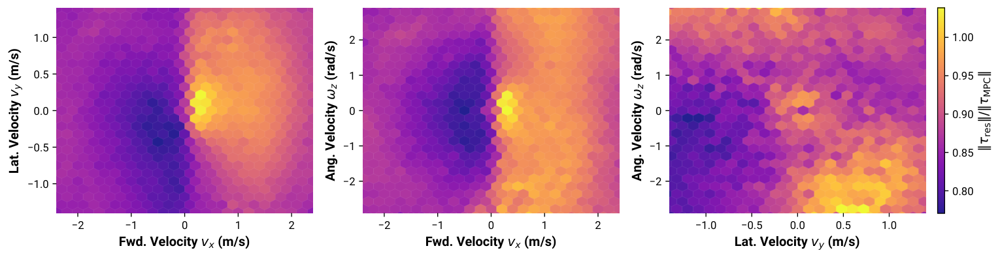
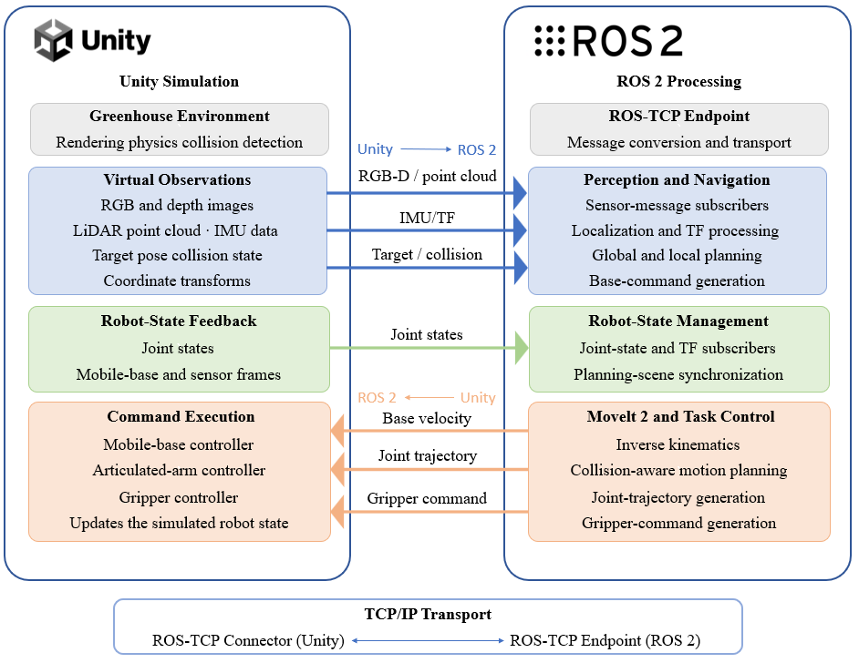

로봇 학습에서 <abbr title="로봇이 한 번 과제를 수행하며 모은 관측과 행동 기록">에피소드</abbr>는 흔히 관측과 행동의 묶음으로 취급돼요. 하지만 이번 주 글들을 함께 읽으면, 다음 실험을 바꾸는 데 필요한 것은 행동 자체만이 아니라 그 행동이 어떤 조건에서 선택됐고 어떻게 끝났는지를 남기는 <abbr title="실행마다 입력 조건·판단·결과를 같은 형식으로 연결해 남기는 약속">결과 계약</abbr>이라는 점이 드러납니다. 결과 계약이 없으면 성공률은 남아도 실패를 다시 나눌 수 없고, 학습된 보정은 성능 숫자로만 남아 기본 제어기의 빈자리를 가리키지 못해요.

## 데이터는 수집 뒤가 아니라 판정 가능한 상태로 들어와야 해요

[[2026-08-25_저장_포맷에서_매니페스트로_옮겨간_Dyna-2_데이터_병목|저장 포맷에서 매니페스트로 옮겨간 Dyna-2 데이터 병목]]는 대규모 수집의 병목을 저장 공간보다 실행을 다시 고를 수 있는 경로에서 찾았어요. 카메라·상태·행동이 서로 다른 주기로 흐르는 로봇 에피소드는 공통 시각에 맞춰 조립돼야 하고, 그래서 품질 검사와 성능 라벨, 데이터 항목 구조·수집 파이프라인·로봇 소프트웨어 버전이 에피소드와 함께 남아야 합니다. 이 표식이 있어야 "성공한 실행", "카메라가 빠지지 않은 실행", "특정 규약 이후에 기록된 실행"을 다음 학습의 입력 조건으로 다시 만들 수 있어요.

여기서 중요한 것은 데이터 설명 정보가 사후 설명용 장식이 아니라는 점이에요. Dyna-2는 품질 검사를 변환 앞뒤의 독립 게이트로 두고, 그 결과를 조건별 선별 과정이 읽게 했습니다. 주당 처리량이 14,000 에피소드시간에서 440,000 에피소드시간으로 늘어난 것은 이 게이트만의 효과가 아니라, 단계별 자원 분리·실행 시각 분산·입력 배치 균등화까지 묶은 파이프라인 개선의 결과예요. 더 작은 수집에서도 결과 계약이 있으면 실패한 에피소드를 버릴지, 별도 평가셋으로 둘지, 같은 조건만 다시 모을지를 나중에 결정할 수 있어요.

## 제어 보정도 크기와 위치를 함께 남겨야 해요

[[2026-08-25_잔차_토크의_방향으로_학습이_무엇을_고치는지_읽은_Residual_MPC|잔차 토크의 방향으로 학습이 무엇을 고치는지 읽은 Residual MPC]]는 결과 계약을 제어 루프 안으로 가져옵니다. <abbr title="물리 모델로 기본 제어를 계산하고 학습된 출력이 필요한 부분만 더하는 제어 구조">잔차 제어</abbr>에서 학습 정책은 성능을 올리는 보정값을 내지만, 그 값의 크기와 방향을 명령과 <abbr title="발이 지면에 닿거나 떨어지는 동작 주기상의 시점">접촉 위상</abbr>에 맞춰 기록하면 어느 조건에서 기본 제어가 보정을 많이 받는지가 보입니다. 저자들은 잔차 토크가 접촉 전환 직전에 커지고, 그 방향이 기본 <abbr title="미래 상태를 예측해 현재 제어 입력을 반복 계산하는 방법">MPC</abbr> 토크와 거의 반대가 된다는 패턴으로 접촉 전환에서 MPC 출력을 크게 수정한 구간을 읽었어요.

<figure class="fig"><figcaption>학습 보정의 크기를 명령 공간에 다시 놓으면, 평균 성능만으로는 보이지 않는 개입 지점이 드러난다</figcaption></figure>
<em>Residual MPC의 명령별 잔차 토크 비율(출처: Jeon 외, Residual MPC · CC BY 4.0)</em>

이때 넓어진 작동 범위만으로는 충분하지 않아요. 같은 연구에서 <abbr title="입력부터 최종 제어 출력까지 하나의 학습 모델이 직접 만드는 방식">종단간 정책</abbr>은 더 넓은 속도 영역을 보였지만, 저자들은 <abbr title="발과 지면이 닿을 때 힘과 움직임이 변하는 물리 과정">접촉 동역학</abbr>의 수치적 불규칙성을 이용한 결과일 수 있다고 경계합니다. 결과 계약은 "성공했는가"에 멈추지 않고 입력 명령, 기본 출력, 학습 보정, 접촉 상태, 종료 사유를 같은 실행 식별자로 묶어야 해요. 그래야 더 높은 점수가 모델의 개선인지, 시뮬레이터의 빈틈인지 다시 판단할 수 있습니다.

## 집계 성공률은 기능 연결의 범위를 넘어서 말할 수 없어요

[[2026-09-01_Agri-Sim_Unity_ROS2_폐루프_평가|Agri-Sim의 ROS2 기능 루프 검증과 지연·실기체 전이의 경계]]는 결과 계약이 빠졌을 때 남는 한계를 선명하게 보여줘요. <abbr title="실시간 3차원 장면과 물리 동작을 만드는 게임 엔진">Unity</abbr>와 <abbr title="로봇 프로그램을 메시지로 연결하는 공개 소프트웨어 기반">ROS2</abbr> 사이의 좌표·시각·명령 경로를 묶어 50회 반복에서 내비게이션 45회, 전체 수확 43회를 성공으로 기록했습니다. 다만 내비게이션의 시행별 궤적과 실패 기록은 남지 않았고, 수확의 실패 분류도 실행별 조건과 함께 다시 분석할 수 있는 수준으로는 제시되지 않았습니다. 따라서 이 결과는 기능 루프가 동작했다는 근거이지, 지연·인식·실제 파지력·과실 손상·실기체 전이까지 보증하는 근거는 아니에요.

<figure class="fig"><figcaption>관측·계획·명령이 한 루프를 이뤄도, 각 실행의 시각과 종료 사유가 없으면 실패 층을 다시 가를 수 없다</figcaption></figure>
<em>Agri-Sim의 양방향 Unity와 ROS2 통신 구조(출처: Shi 외, Agri-Sim)</em>

이 구분은 시뮬레이터의 약점이 아니라 측정 단위의 경계입니다. 입력 센서 시각, 좌표 변환 버전, 계획 요청과 응답, 충돌·접촉 상태, 정책 보정, 종료 사유를 한 실행에 묶어 두면 같은 조건에서 반복되는 실패는 로직·좌표·연결 규약 쪽으로, 조건에 따라 갈리는 실패는 데이터 분포·평가 조건 쪽으로 분리할 수 있어요. 반대로 집계 성공률만 남기면 다음 실험은 원인을 모른 채 전체 설정을 다시 조정하게 됩니다.

## 다음 실행은 결과를 다시 물을 수 있게 설계해야 해요

이번 주 재료를 한 문장으로 줄이면, 로봇 데이터의 최소 단위는 관측-행동 쌍이 아니라 관측-판단-결과를 다시 조회할 수 있는 실행이라는 쪽입니다. 저는 앞으로 수집·시뮬레이션·정책 평가에서 실행 식별자마다 수집 조건, 시간·좌표 규약, 포함·제외 판정, 종료 사유를 함께 남기려 합니다. 이는 새 모델을 붙이는 일이 아니라, 현재의 성공과 실패를 다음 평가셋과 다음 제어 수정의 근거로 바꾸는 기록 방식이에요.

그 기록을 먼저 고정하면 실험의 질문도 달라집니다. 성공률이 떨어졌을 때 "모델이 약한가"부터 묻는 대신, 어느 입력 조건·전환 위상·메시지 경로·데이터 버전에서 보정이 커졌는지를 먼저 확인할 수 있어요. 이 순서가 있어야 데이터는 양을 늘리는 재료가 아니라 실패를 구분하고 다음 설계를 선택하는 증거가 됩니다.

---

<!-- src-block -->

출처 — https://www.dyna.co/research/dyna-2-infrastructure · https://arxiv.org/abs/2510.12717 · https://arxiv.org/abs/2608.29100
