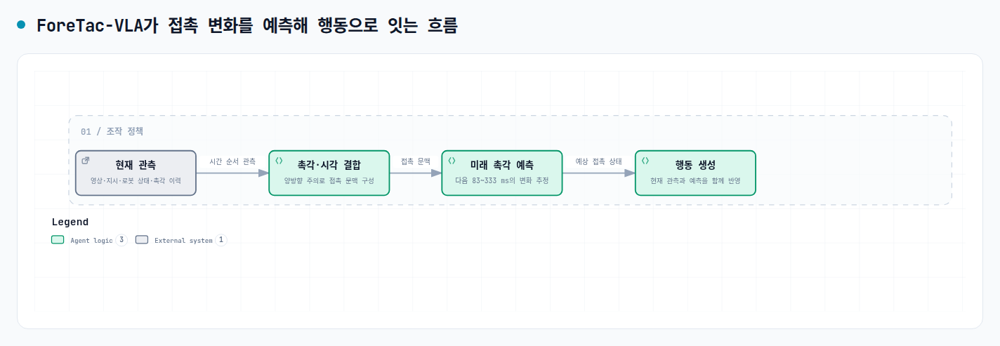
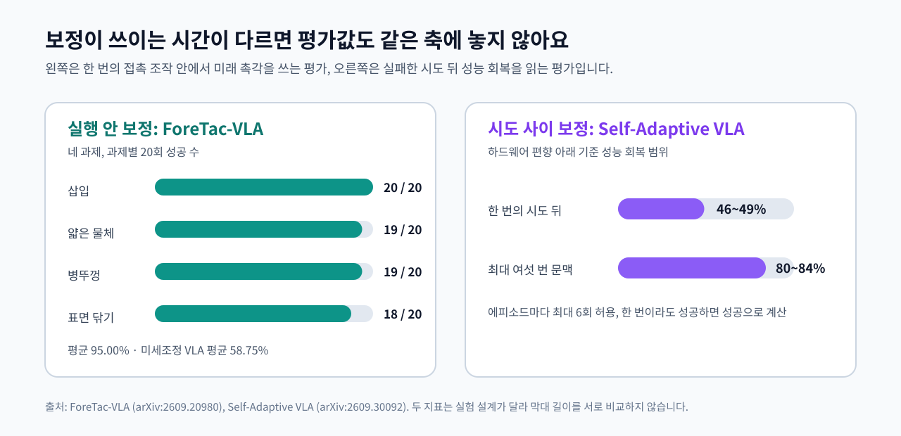

로봇 조작에서 보정은 오차를 발견한 다음 수치를 고치는 일로만 보이기 쉽습니다. 이번 주에 정리한 세 연구는 보정에 쓰는 기록이 시간과 좌표 관계에 따라 달라진다는 점을 보여 줍니다. <abbr title="최근 촉각 변화에서 앞으로의 접촉 상태를 예측해 로봇 행동을 고르는 모델">ForeTac-VLA</abbr>는 한 번의 접촉 동작 안에서 몇 단계 뒤 상태를 미리 읽고, <abbr title="실패한 실행 기록을 다음 판단에 쓰도록 학습한 로봇 행동 정책">Self-Adaptive VLA</abbr>는 실패한 시도를 다음 시도의 조건으로 남깁니다. <abbr title="물체의 모양과 위치, 카메라 경로를 함께 맞춰 지도에 남기는 방식">NodeSLAM</abbr>은 물체와 카메라의 관계를 함께 추정합니다. 세 접근을 나란히 놓으면 조작 기록은 단순한 시간순 저장물이 아니라, 실행 안 보정·시도 사이 보정·좌표 관계 추정을 가르는 증거가 되어야 합니다.

<figure class="fig"><figcaption>ForeTac-VLA는 현재 촉각에 반응하는 데서 멈추지 않고, 가까운 미래의 접촉 변화를 행동 입력으로 만듭니다.</figcaption></figure>

## 실행 안에서는 다음 접촉을 기다리지 않아요

접촉 조작은 화면 한 장만으로 상태를 가리기 어렵습니다. 핀이 구멍 앞에 있어도 한쪽이 걸렸는지, 물체를 잡은 힘이 곧 풀릴지는 접촉의 변화가 더 잘 알려 줄 수 있습니다. ForeTac-VLA는 최근 촉각 이력을 시간 순서의 표현으로 바꾸고, 영상·지시·로봇 상태와 결합한 뒤 여러 단계 뒤의 촉각 상태를 예측합니다. 행동 생성기는 현재 관측뿐 아니라 이 예측을 같이 받아, 접촉이 이미 틀어진 뒤에만 반응하는 흐름을 줄이려 합니다.

원문은 60 <abbr title="1초에 같은 신호를 읽거나 명령을 갱신하는 횟수 단위">Hz</abbr> 기록에서 5·10·15·20단계 뒤, 약 83·167·250·333 <abbr title="1,000분의 1초를 뜻하는 매우 짧은 시간 단위">ms</abbr>의 촉각을 예측 대상으로 둡니다. 이 숫자는 어떤 그리퍼에도 맞는 고정 지연이 아닙니다. 기록 주기와 모터가 명령을 따라 움직이는 속도가 달라지면 같은 20단계가 다른 물리 시간이 되므로, 먼저 현재 기록이 접촉 상태가 바뀌는 순간보다 촘촘한지 확인해야 합니다.

네 실제 로봇 접촉 조작 과제의 과제별 20회 평가에서 ForeTac-VLA 전체 구성은 평균 95%를 기록했고, 촉각 없이 미세조정한 기준 정책은 58.75%였습니다. 삽입에서는 20회 모두 성공했지만 표면 닦기에서는 18회 성공으로 두 번의 실패가 남았습니다. 이 결과는 미래 촉각 예측과 영상·언어·촉각의 양방향 결합을 포함한 전체 구성이 네 과제와 해당 센서·제어 조건에서 기준들보다 높았다는 범위의 증거입니다. 미래 예측만의 효과로 읽거나, 다른 로봇과 센서에도 같은 성공률을 기대할 수는 없습니다.

## 시도 사이는 실패의 방향을 남겨야 해요

하드웨어 편향은 한 시도 안에서 곧바로 고칠 수 없는 경우가 있습니다. 모터가 명령보다 조금 덜 움직이는 작동 편향과 관절 위치 기준점이 밀리는 인코더 오프셋은, 현재 프레임 하나만으로 어느 쪽이 원인인지 정하기 어렵습니다. Self-Adaptive VLA는 실패한 실행의 시각 관측·로봇 상태·행동을 짧은 문맥으로 압축하고, 다음 시도에서 그 문맥으로 행동 정책을 조절합니다.

이 경로는 현재 동작의 미래를 맞히는 방식과 다릅니다. 한 번의 시도 뒤 기준 성능의 46%에서 49% 사이를 회복했고, 최대 여섯 번의 시도 문맥을 합치면 80%에서 84% 사이를 회복했다고 원문은 보고합니다. 이는 여섯 번을 모두 실행한 평균이 아니라, 에피소드마다 최대 여섯 번을 허용하고 한 번이라도 성공하면 성공으로 계산한 결과입니다. 따라서 같은 수치를 실행 안의 333 ms 예측 효과나 다른 논문의 성공률과 나란히 비교할 수는 없습니다.

<figure class="fig"><figcaption>두 평가의 단위와 성공 정의가 다르므로, 차트는 각각의 패널 안에서만 읽어야 합니다. 수치는 두 원문 표와 초록에서 옮겼습니다.</figcaption></figure>

이 방식의 전제도 분명합니다. 평가의 하드웨어 오차는 작동 편향과 관절 인코더 오프셋처럼 로봇 구성에서 모델링할 수 있는 종류였고, 한 시도 안에서는 문맥을 새로 갱신하지 않습니다. 첫 실패가 장비 손상이나 되돌릴 수 없는 과제 실패로 이어질 수 있다면, 실패 기록을 새로 모아 보정하는 절차부터 안전하지 않을 수 있습니다. 그래서 시도 사이 보정은 실패를 허용할 수 있는 범위와 재설정 조건까지 기록에 포함해야 합니다.

## 같은 로그에 섞으면 보정 경로가 흐려져요

세 연구가 공통으로 요구하는 것은 관측을 많이 모으는 일보다, 어느 시간 규모와 좌표 관계에서 다시 쓸지 정해 두는 일입니다. 실행 안 보정에는 접촉 상태가 바뀌기 전후의 촘촘한 시간축과 동기화된 관측·명령이 필요합니다. 시도 사이 보정에는 각 시도의 시작 조건, 실패 양상, 하드웨어 상태, 재설정 여부가 남아 있어야 합니다. 이를 구분하지 않고 긴 로그 하나로 묶으면, 미래 예측의 정답도 다음 시도의 실패 문맥도 만들기 어렵습니다.

여기에 물체와 카메라의 관계까지 어긋날 수 있는 작업이라면, 시간축만으로는 부족합니다. NodeSLAM은 물체 형상과 카메라 궤적을 같은 최적화 문제에서 풀어, 물체 모양의 오차가 카메라 위치 보정으로 새는 순환을 끊으려 했습니다. 따라서 조작 기록에는 시점 순서뿐 아니라 물체 기준의 형상·포즈와 카메라 기준의 관측을 구분할 좌표계 정보도 남아야 합니다. 이 글의 두 시간 보정 경로가 쓸 수 있는 기록은, 어느 센서의 값이 어느 물체와 어느 카메라 관계에서 나온 것인지까지 보존할 때 비로소 재사용할 수 있습니다.

기록 형식을 정할 때는 먼저 세 질문을 분리하는 편이 좋습니다. 지금 접촉이 곧 어디로 갈지를 읽으려면, 접촉 상태가 바뀌는 순간마다 현재 관측 창과 그 뒤의 짧은 구간이 빠짐없이 이어져 있는가를 봅니다. 실패 뒤 무엇을 고칠지 읽으려면, 시도별 목표 명령·관절 위치·카메라 프레임·팔 끝과 물체가 놓인 상태·재설정 조건이 같은 식별자로 묶여 있는가를 봅니다. 물체와 카메라의 관계를 다시 풀려면, 물체 기준과 카메라 기준의 좌표계가 구분되어 있는가를 봅니다. 앞 질문은 한 동작 안의 예측 표본을, 둘째 질문은 안전하게 다시 시도할 수 있는 복구 표본을, 셋째 질문은 물체와 카메라 관계를 추정할 표본을 만듭니다.

[[2026-09-22_객체_단위_SLAM_NodeSLAM이_물체_형상만으로_카메라를_추적한_구조|객체 단위 SLAM NodeSLAM이 물체 형상만으로 카메라를 추적한 구조]]은 물체 기준으로 형상과 카메라 경로를 함께 맞추는 방법을 다뤘습니다. 이번 세 연구를 함께 읽으면, 같은 기록이라도 실행 안에서 미래 상태를 예측할 재료인지, 실패 뒤 다음 시도를 보정할 재료인지, 물체와 카메라의 관계를 다시 풀 재료인지가 먼저 정해져야 행동 정책과 추정기가 그 시간을 다시 쓸 수 있습니다.

---

<!-- src-block -->

출처 — https://arxiv.org/abs/2609.20980

출처 — https://arxiv.org/abs/2609.30092

출처 — https://arxiv.org/abs/2004.04485v2
