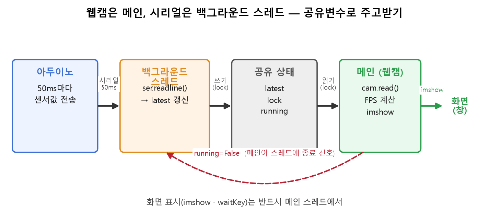

PC와 아두이노를 전선 몇 가닥으로 잇고 숫자를 주고받았어요. 만들면서 배운 건 통신하는 법 자체보다, **안 보이는 걸 보이게 만드는 법**이었어요.

## 보낸 값이 도착했는지 LED로 확인해요

컴퓨터끼리 대화할 땐 양쪽 로그를 다 볼 수 있어요. 그런데 아두이노 같은 작은 보드는 안이 안 보여요. 코드를 어디까지 실행했는지 들여다볼 디버거가 없거든요.

확인 채널을 하나 만들어요

숫자를 하나 보내서 제대로 받으면 그 횟수만큼 LED를 깜빡이게 했어요.

<svg viewBox="0 0 880 242" width="100%" style="max-width:880px" role="img" aria-label="보드 안이 안 보이니 LED로 수신 상태를 밖으로 꺼내는 확인 채널"><rect x="40" y="70" width="180" height="90" fill="none" stroke="var(--lightgray)"/><text x="130" y="120" text-anchor="middle" font-size="11.5" fill="var(--dark)">PC</text><text x="130" y="138" text-anchor="middle" font-size="9.5" fill="var(--gray)">로그를 볼 수 있어요</text><rect x="420" y="70" width="180" height="90" fill="none" stroke="var(--sv-bad)"/><text x="510" y="112" text-anchor="middle" font-size="11.5" fill="var(--dark)">아두이노</text><text x="510" y="130" text-anchor="middle" font-size="9.5" fill="var(--sv-bad)">안이 안 보여요</text><text x="510" y="146" text-anchor="middle" font-size="9.5" fill="var(--gray)">들여다볼 디버거가 없어요</text><line x1="224" y1="102" x2="416" y2="102" stroke="var(--darkgray)" stroke-width="2"/><path d="M 416,102 l -7,-4 l 0,8 z" fill="var(--darkgray)"/><text x="320" y="94" text-anchor="middle" font-size="10.5" fill="var(--darkgray)">숫자 하나를 보내요</text><line x1="224" y1="132" x2="416" y2="132" stroke="var(--sv-bad)" stroke-dasharray="5 4"/><text x="320" y="150" text-anchor="middle" font-size="10.5" fill="var(--sv-bad)">받았는지 확인할 길이 없어요</text><circle cx="700" cy="115" r="22" fill="var(--sv-ok)" opacity="0.25"/><circle cx="700" cy="115" r="11" fill="var(--sv-ok)"/><text x="700" y="160" text-anchor="middle" font-size="11.5" fill="var(--sv-ok)">LED</text><line x1="604" y1="115" x2="672" y2="115" stroke="var(--sv-ok)" stroke-width="2"/><path d="M 672,115 l -7,-4 l 0,8 z" fill="var(--sv-ok)"/><text x="700" y="182" text-anchor="middle" font-size="10.5" fill="var(--darkgray)">받은 숫자만큼 깜빡여요</text><text x="40" y="34" font-size="11.5" fill="var(--darkgray)">해법은 아두이노한테 <tspan fill="var(--sv-ok)">눈에 보이는 신호</tspan>를 시키는 거였어요.</text><text x="40" y="210" font-size="11" fill="var(--darkgray)">깜빡이면 잘 받은 거고 안 깜빡이면 통신이 끊긴 거예요. LED 하나가 보드 안의 상태를 밖으로 꺼내주는 창문이 된 셈이에요.</text><text x="40" y="230" font-size="10.5" fill="var(--gray)">물리 세계를 다루는 코드는 전압·접촉·타이밍처럼 소프트웨어엔 없던 변수가 끼어들어요. 안 보이는 곳마다 확인점을 하나씩 심어둬요.</text></svg>

## 화면을 그리면서 값을 받으려고 손을 나눠요

다음 과제는 웹캠 화면을 띄운 채로 아두이노가 보내는 값을 계속 받는 거였어요. 그런데 이 둘을 한 흐름에서 하면 **시리얼 값을 기다리는 동안 화면이 얼어붙어요.** 값이 안 오면 코드가 그 줄에서 멈춰 서서 다음 프레임을 못 그리거든요.

그래서 시리얼을 받는 일을 백그라운드 스레드로 뺐어요. 스레드는 값이 올 때까지 기다려도 되는 **별개의 손**이라, 메인은 그동안 쉬지 않고 웹캠을 그려요.

<figure class="fig"><figcaption>웹캠은 메인 스레드, 시리얼은 백그라운드 스레드가 맡아요. 최신값(<code>latest</code>)을 <code>lock</code>으로 안전하게 주고받고, 메인이 <code>running</code>으로 종료를 알려요.</figcaption></figure>

| 일 | 맡는 쪽 | 이유 |
|---|---|---|
| 시리얼 수신 | 백그라운드 스레드 | 값이 올 때까지 기다려도 됨 |
| 최신값 보관 | 공유 변수 + `lock` | 두 손이 동시에 만지면 깨짐 |
| **화면 그리기** | **반드시 메인** | 창을 띄우고 갱신하는 건 메인의 몫 |

이건 앞서 배운 생산자·소비자 구조랑 똑같았어요. 한쪽은 넣기만 하고 다른 쪽은 꺼내기만 하는 거예요.

두 과제 다 결국 **채널을 하나 더 만드는 이야기**였어요. 보내는 쪽이 안 보이니까 LED라는 확인 채널을 만들고, 보면서 듣기 힘드니까 스레드라는 별개의 손을 만들었어요. 다음 주엔 이 전선 대신 ROS라는 더 큰 통로로 로봇 여러 부분이 대화하게 된다는데, 안 보이는 걸 보이게 심어두는 습관은 그대로 가져갈 것 같아요.
