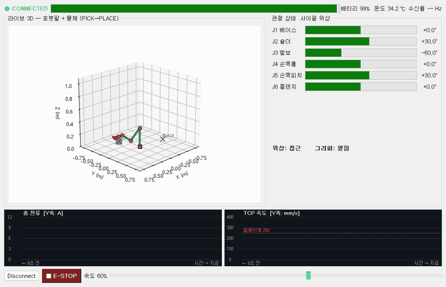
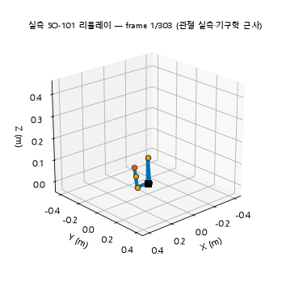

로봇의 관절 각도와 전류를 실시간으로 보여주는 화면을 만들었어요. 만들면서 배운 건 화면을 예쁘게 그리는 법이 아니라, **화면과 일하는 스레드를 갈라놓는 법**이었어요.

## 센서를 읽는 스레드와 화면을 그리는 스레드를 나눠요

로봇 상태 화면에는 두 종류의 일이 동시에 돌아가요. 하나는 센서 값을 쉬지 않고 읽어오는 일이고, 다른 하나는 그 값을 화면에 그리는 일이에요. 이 둘을 한 스레드에서 하면 센서를 읽는 동안 화면이 얼어붙어요.

경계를 시그널로 끊어요

백그라운드가 값을 시그널로 쏘면 Qt가 메인 스레드로 안전하게 배달해요.

<svg viewBox="0 0 880 268" width="100%" style="max-width:880px" role="img" aria-label="워커 스레드가 시그널로 값만 넘기고 화면 갱신은 메인 스레드에서만 일어난다"><rect x="24" y="60" width="300" height="150" fill="none" stroke="var(--sv-mid)" stroke-dasharray="5 4"/><text x="36" y="80" font-size="10.5" fill="var(--sv-mid)">워커 스레드</text><rect x="40" y="94" width="268" height="42" fill="none" stroke="var(--lightgray)"/><text x="174" y="112" text-anchor="middle" font-size="11" fill="var(--dark)">사인·코사인 더미</text><text x="174" y="128" text-anchor="middle" font-size="9.5" fill="var(--gray)">여덟 단계 픽앤플레이스</text><rect x="40" y="148" width="268" height="42" fill="none" stroke="var(--lightgray)"/><text x="174" y="166" text-anchor="middle" font-size="11" fill="var(--dark)">SO-101 실측 기록</text><text x="174" y="182" text-anchor="middle" font-size="9.5" fill="var(--gray)">50 에피소드 · 30 fps</text><text x="174" y="228" text-anchor="middle" font-size="10.5" fill="var(--sv-mid)">소스만 갈아끼워요</text><rect x="556" y="60" width="300" height="150" fill="none" stroke="var(--sv-ok)" stroke-dasharray="5 4"/><text x="568" y="80" font-size="10.5" fill="var(--sv-ok)">메인 스레드</text><rect x="572" y="94" width="268" height="96" fill="none" stroke="var(--lightgray)"/><text x="706" y="128" text-anchor="middle" font-size="11.5" fill="var(--dark)">게이지 · 그래프 · 3D 팔</text><text x="706" y="150" text-anchor="middle" font-size="10" fill="var(--gray)">화면 갱신은 여기서만</text><text x="706" y="228" text-anchor="middle" font-size="10.5" fill="var(--sv-ok)">한 줄도 안 건드렸어요</text><line x1="326" y1="135" x2="552" y2="135" stroke="var(--dark)" stroke-width="2"/><path d="M 552,135 l -7,-4 l 0,8 z" fill="var(--dark)"/><text x="439" y="122" text-anchor="middle" font-size="11.5" fill="var(--dark)">시그널 · 슬롯</text><text x="439" y="154" text-anchor="middle" font-size="9.5" fill="var(--gray)">Qt가 스레드 경계에</text><text x="439" y="170" text-anchor="middle" font-size="9.5" fill="var(--gray)">큐를 알아서 깔아줘요</text><text x="24" y="32" font-size="11.5" fill="var(--sv-bad)">백그라운드 스레드가 화면을 직접 건드리면 프로그램이 무작위로 죽어요 — 화면은 메인 스레드의 소유물이에요.</text><text x="24" y="258" font-size="10.5" fill="var(--gray)">지어낸 값이든 실제 로봇 값이든 화면 입장에서는 그냥 시그널로 들어온 데이터일 뿐이라 구분할 필요가 없어요.</text></svg>

이건 앞서 배운 생산자·소비자 큐와 똑같은 구조였어요. 생산자가 큐에 넣고 소비자가 꺼내는 것처럼, **시그널과 슬롯이 스레드 경계에 큐를 알아서 깔아주는** 거예요.

## 소스를 갈아끼워도 화면 코드는 그대로예요

데이터를 만드는 쪽과 보여주는 쪽이 시그널로 끊겨 있으니, 데이터를 만드는 방식을 통째로 바꿔도 화면 코드는 손댈 필요가 없었어요.

처음엔 사인·코사인으로 값을 지어냈어요. 6축 팔이 물체를 집어 옆으로 옮기는 동작을 여덟 단계(접근·하강·그립·상승·이송·하강·릴리스·복귀)로 만들어 재생했어요.

<figure class="fig"><figcaption>지어낸 데이터로 만든 픽앤플레이스 — 물체를 집어 PLACE 자리로 옮겨요.</figcaption></figure>

그다음 데이터 소스만 진짜 로봇 기록으로 갈아끼웠어요. 공개된 SO-101 팔의 실제 기록(물체를 집어 옮긴 50개 에피소드, 초당 30프레임)을 받아서, 기록된 관절 각도를 프레임 단위로 그대로 재생했어요.

<figure class="fig"><figcaption>실측 SO-101 데이터 리플레이 — 같은 화면, 소스만 진짜 데이터로 바꿨어요.</figcaption></figure>

게이지와 그래프에 찍히는 값이 전부 실제 로봇이 낸 값으로 바뀌었는데, **화면을 그리는 코드는 한 줄도 안 건드렸어요.**

## 눈대중 대신 실제 로봇 도면으로

| 단계 | 기구학 | 화면에 적은 것 |
|---|---|---|
| 처음 | 링크 길이를 눈대중 | "기구학은 근사" |
| 나중 | 실제 SO-101 URDF | 단서를 지움 |

URDF에는 관절마다 어디에 붙어서 어느 축으로 도는지가 다 적혀 있어요. 그 값을 그대로 읽어 팔을 그리니 관절 각도뿐 아니라 **팔의 생김새까지 실제 로봇과 같아졌어요.**

여기서 배운 건 **진짜와 근사를 섞을 땐 어디까지가 진짜인지 밝혀둬야 한다**는 거예요. 눈대중이던 동안엔 근사라고 적었고, 실제 도면으로 바꾼 뒤엔 그 단서를 지웠어요. 밝혀두지 않으면 나중에 이게 실제 로봇이 맞느냐는 질문에 답할 수가 없어요.

화면을 잘 그리는 것보다 화면과 일을 갈라놓는 설계가 먼저였어요. 지어낸 데이터로 뼈대를 세우고 진짜 데이터로 갈아끼우는 이 순서는, 앞으로 로봇 여러 대를 한 화면에서 지켜보는 걸 만들 때도 그대로 쓸 수 있을 것 같아요.
