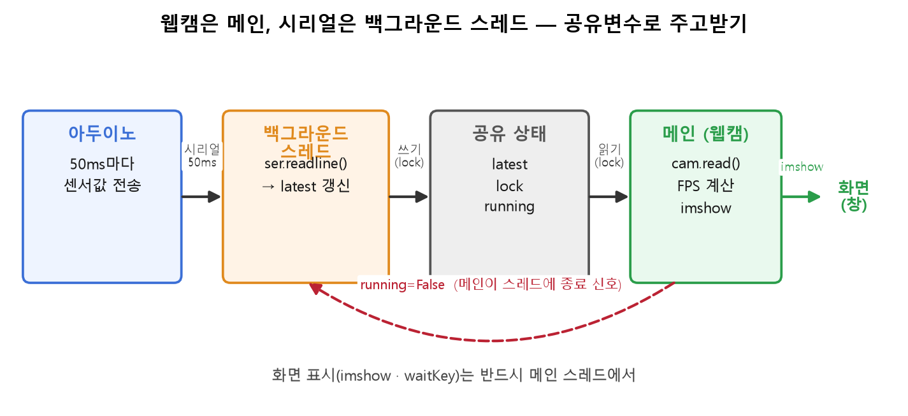

PC와 아두이노를 전선 몇 가닥으로 잇고 숫자를 주고받았어요. 만들면서 배운 건 통신하는 법 자체보다, 안 보이는 걸 보이게 만드는 법이었어요.

## 보낸 값이 도착했는지 LED로 확인해요

컴퓨터끼리 대화할 땐 양쪽 로그를 다 볼 수 있어요. 그런데 아두이노 같은 작은 보드는 안이 안 보여요. 코드를 어디까지 실행했는지 들여다볼 디버거가 없거든요. 그래서 PC가 보낸 값을 아두이노가 제대로 받았는지 확인할 방법이 없어요.

해법은 아두이노한테 눈에 보이는 신호를 시키는 거였어요. 숫자를 하나 보내서 제대로 받으면 그 횟수만큼 LED를 깜빡이게 했어요. LED가 깜빡이면 잘 받은 거고, 안 깜빡이면 통신이 끊긴 거예요. LED 하나가 보드 안의 상태를 밖으로 꺼내주는 창문이 된 셈이에요.

물리 세계를 다루는 코드는 원래 이래요. 잘 되던 게 갑자기 안 되고, 같은 조건인데 다르게 나와요. 전압이나 접촉이나 타이밍 같은, 소프트웨어엔 없던 변수가 끼어들거든요. 그래서 안 보이는 곳마다 이렇게 눈에 보이는 확인점을 하나씩 심어두는 게 먼저였어요.

## 화면을 그리면서 값을 받으려고 스레드를 나눠요

다음 과제는 웹캠 화면을 띄운 채로 아두이노가 보내는 값을 계속 받는 거였어요. 그런데 이 둘을 한 흐름에서 하면 문제가 생겨요. 시리얼 값을 기다리는 동안 화면이 얼어붙어요. 값이 안 오면 코드가 그 줄에서 멈춰 서서 다음 프레임을 못 그리거든요.

그래서 시리얼을 받는 일을 백그라운드 스레드로 뺐어요. 스레드는 값이 올 때까지 기다려도 되는 별개의 손이라, 메인은 그동안 쉬지 않고 웹캠을 그려요. 스레드가 받은 최신 값을 공유 변수에 적어두면, 메인이 화면에 그걸 겹쳐 써요.

여기서 규칙이 하나 있어요. 화면에 그리는 일은 반드시 메인에서 해야 해요. 창을 띄우고 갱신하는 건 메인 스레드의 몫이라, 백그라운드가 화면을 직접 건드리면 안 돼요. 그래서 스레드는 값만 받아 적고, 그리는 건 메인이 맡는 걸로 손을 갈랐어요. 이건 어제 배운 생산자·소비자 구조랑 똑같았어요. 한쪽은 넣기만 하고 다른 쪽은 꺼내기만 하는 거예요.

두 과제 다 결국 채널을 하나 더 만드는 이야기였어요. 보내는 쪽이 안 보이니까 LED라는 확인 채널을 만들고, 보면서 듣기 힘드니까 스레드라는 별개의 손을 만들었어요. 다음 주엔 이 전선 대신 ROS라는 더 큰 통로로 로봇 여러 부분이 대화하게 된다는데, 안 보이는 걸 보이게 심어두는 습관은 그대로 가져갈 것 같아요.
