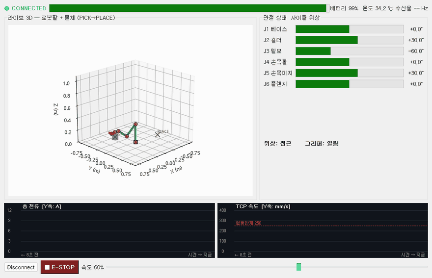
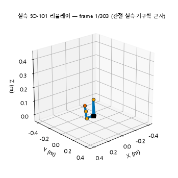

로봇의 관절 각도와 전류를 실시간으로 보여주는 화면을 만들었어요. 만들면서 배운 건 화면을 예쁘게 그리는 법이 아니라, 화면과 일하는 스레드를 갈라놓는 법이었어요.

## 센서를 읽는 스레드와 화면을 그리는 스레드를 나눠요

로봇 상태 화면에는 두 종류의 일이 동시에 돌아가요. 하나는 센서 값을 쉬지 않고 읽어오는 일이고, 다른 하나는 그 값을 화면에 그리는 일이에요. 이 둘을 한 스레드에서 하면 센서를 읽는 동안 화면이 얼어붙어요. 그래서 센서 읽기는 백그라운드 스레드에 맡겨요.

여기서 함정이 하나 있어요. 백그라운드 스레드가 화면(위젯)을 직접 건드리면 프로그램이 무작위로 죽어요. 화면은 메인 스레드의 소유물이라, 두 스레드가 동시에 만지면 내부 상태가 깨지거든요.

해법은 백그라운드 스레드가 화면을 만지지 않고 데이터만 넘기는 거예요. Qt에서는 이걸 시그널(signal)과 슬롯(slot)이라고 불러요. 백그라운드가 값을 시그널로 쏘면, Qt가 그 값을 메인 스레드로 안전하게 배달하고, 화면 갱신은 메인 스레드에서만 일어나요. 이건 어제 배운 생산자·소비자 큐와 똑같은 구조였어요. 생산자가 큐에 넣고 소비자가 꺼내는 것처럼, 시그널과 슬롯이 스레드 경계에 큐를 알아서 깔아주는 거예요.

## 소스를 갈아끼워도 화면 코드는 그대로예요

데이터를 만드는 쪽과 보여주는 쪽이 시그널로 끊겨 있으니, 데이터를 만드는 방식을 통째로 바꿔도 화면 코드는 손댈 필요가 없었어요.

처음엔 사인·코사인으로 값을 지어냈어요. 6축 팔이 물체를 집어 옆으로 옮기는 동작을 여덟 단계(접근, 하강, 그립, 상승, 이송, 하강, 릴리스, 복귀)로 만들어 재생했어요.

그다음 데이터 소스만 진짜 로봇 기록으로 갈아끼웠어요. 허깅페이스에 공개된 SO-101 팔의 실제 기록(물체를 집어 옮긴 50개 에피소드, 초당 30프레임)을 받아서, 기록된 관절 각도를 프레임 단위로 그대로 재생했어요. 게이지와 그래프에 찍히는 값이 전부 실제 로봇이 낸 값으로 바뀌었는데, 화면을 그리는 코드는 한 줄도 안 건드렸어요.

지어낸 값이든 실제 로봇 값이든, 화면 입장에서는 그냥 시그널로 들어온 데이터일 뿐이라 구분할 필요가 없었어요. 만드는 쪽과 보여주는 쪽을 미리 갈라놓은 덕분이었어요.

## 진짜와 근사를 섞을 땐 무엇이 진짜인지 밝혀요

한 가지 정직하게 짚을 게 있어요. 위 실측 영상에서 관절 각도는 실제 로봇 값이지만, 3D 팔의 생김새는 근사예요. SO-101의 정확한 치수 파일(URDF)이 없어서 링크 길이를 눈대중했거든요.

그래서 화면 제목에 관절값은 실측이고 기구학은 근사라고 적어뒀어요. 진짜 데이터와 근사 모델을 섞을 때는 어디까지가 진짜이고 어디부터가 근사인지 밝혀두는 게 중요해요. 이걸 안 밝히면 나중에 이게 실제 로봇 값이 맞느냐는 질문에 답할 수가 없어요.

화면을 잘 그리는 것보다 화면과 일을 갈라놓는 설계가 먼저였어요. 센서를 읽는 스레드와 화면을 그리는 스레드를 시그널로 끊어놓으니 스레드가 서로 죽이지 않았고, 데이터 소스도 나중에 자유롭게 갈아끼울 수 있었어요. 지어낸 데이터로 뼈대를 세우고 진짜 데이터로 갈아끼우는 이 순서는, 앞으로 로봇 여러 대를 한 화면에서 지켜보는 걸 만들 때도 그대로 쓸 수 있을 것 같아요.
