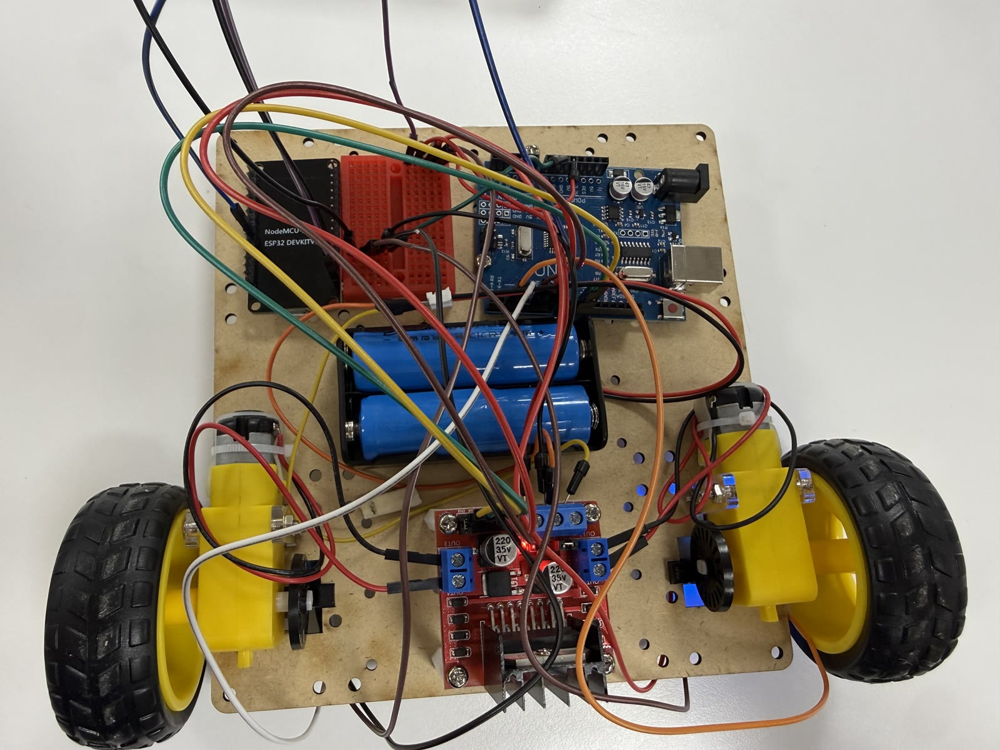
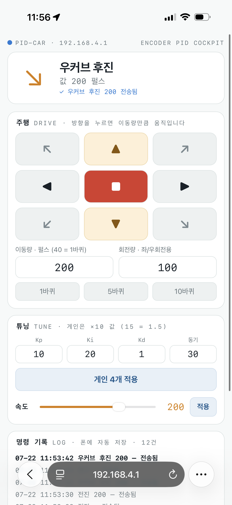

AI 사용이 허용된 실기 평가를 치렀어요. 문제는 두 개였습니다. 파이썬 스레딩으로 OpenCV 카메라와 아두이노 시리얼 통신을 동시에 돌리는 것, 그리고 C++ 클래스로 모터 두 개를 제어하고 파이썬 UI로 조종하는 것. 구현 코드는 AI와 협업해 작성했고, 배선·업로드·시연·촬영은 직접 진행하면서 매 단계를 실행 결과로 검증했어요.

하루를 관통한 교훈은 하나였습니다. 동시성 시스템의 버그는 대부분 로직이 아니라 **"이 자원의 주인이 누구인가"를 정하지 않아서** 생긴다는 것. 화면, 포트, 카메라, 전원 — 네 가지 자원에서 같은 패턴이 반복됐어요.

## 화면의 주인은 메인 스레드

문제 1의 요구는 "메인 while에서 카메라 스트림, 시리얼 통신은 별도 스레드"였어요. 처음엔 임의의 분담처럼 보이지만, 사실 이 구조가 유일한 정답에 가깝습니다. OpenCV의 `imshow`/`waitKey`는 Windows에서 메인 스레드 호출을 전제로 동작해요(GUI 이벤트 루프가 스레드에 묶여 있어서, 서브스레드에서 부르면 창이 멈추거나 안 뜹니다). 그래서 반대 변형(카메라를 스레드로)을 만들 때도 캡처만 스레드에 두고 표시는 메인에 남겨야 해요.

시리얼 수신 스레드는 세 가지로 요약됩니다. 최신값 하나를 담는 공유 변수, 그걸 지키는 `Lock`, 종료를 알리는 플래그. 수신 스레드는 밀린 값을 버리고 최신 하나만 덮어쓰고, 메인은 잠깐 잠그고 읽어서 화면에 얹어요.

```python
def serial_worker(ser):
    global latest
    while running:                       # 종료 플래그 — 메인이 내리면 탈출
        line = ser.readline().decode("utf-8", "replace").strip()
        if line:
            with lock:
                latest = line            # 밀린 값은 버리고 최신만
```

여기에 하드웨어 특유의 함정이 하나 있어요. PC가 시리얼 포트를 여는 순간 DTR 신호가 아두이노를 리셋시켜서, 처음 2초간은 부팅 중인 보드의 깨진 바이트가 들어옵니다. `time.sleep(2)` 후 `reset_input_buffer()`로 비우고 시작해야 하고, 그래도 남는 노이즈는 `decode(errors="replace")`와 범위 검증(0~1023 밖이면 버리고 카운트만)으로 걸러요. FPS는 프레임 간격의 역수를 지수이동평균으로 눌러서 표시했습니다(`fps = 0.9*fps + 0.1*(1/dt)`).

<video controls preload="metadata" style="max-width:100%" src="../assets/exam0722-p1-threading.mp4"></video>
*문제 1 시연 — 카메라 스트림 위에 FPS·수신값·그래프, 수신 주기 실측(dt≈50ms)까지 표시*

## 포트의 주인은 한 프로세스

시연 중 모터가 꿈쩍도 안 하는 순간이 있었어요. 코드 문제가 아니라, 보드에 어제 실습용 스케치(115200bps, 다른 명령 체계)가 올라가 있었던 게 원인이었습니다. UI는 9600으로 접속해 `a 150`을 보내는데 보드는 그 명령을 모르는 상태였던 거죠. 같은 계열의 사고가 두 번 더 있었어요. IDE 시리얼 모니터를 열어둔 채 파이썬을 실행하면 포트를 못 열고, 카메라를 쓰는 프로그램을 두 개 띄우면 두 번째가 노이즈 화면을 받습니다.

셋 다 원인은 같아요. 포트도 카메라도 **한 번에 한 주인**만 가질 수 있는 자원인데, 소유권이 넘어갔는지 확인하지 않고 접근한 것. 그래서 UI에 자동 진단을 넣었습니다. 수신 로그에 숫자만 계속 흐르면 "다른 송신 스케치가 올라가 있다", 깨진 문자가 오면 "보레이트가 다르다"를 즉시 알려주는 식이에요. 올바른 스케치인지 확인하는 신호도 부팅 메시지가 아니라 1초 주기 상태 로그(`A=0 B=0 [manual]`)로 잡았는데, 접속 직후 버퍼를 비우는 코드가 부팅 메시지를 지워버리기 때문입니다.

## 전원은 분리하고, 기준은 공유한다

문제 2의 하드웨어 요구는 "모터 전원과 아두이노 전원 분리"였어요. 모터는 18650 두 개 직렬(7.4V)을 L298N 전원 단자에 직결하고, 아두이노는 USB로 받습니다. 두 개를 쓰는 이유는 L298N의 내부 전압강하가 약 2V라서예요. 한 개(3.7V)면 모터에 1.7V밖에 안 가서 아예 돌지 않고, 7.4V면 5.4V 정도가 전달돼 TT 모터의 정상 범위에 들어옵니다. 분리하되 GND는 반드시 이어야 해요 — 신호의 높낮이를 판정할 공통 기준이 없으면 제어선이 무의미해집니다.


*18650×2 → L298N 직결, 아두이노는 USB — 두 전원은 GND만 공유*

C++ 쪽은 클래스를 `.h`(선언)와 `.cpp`(구현)로 분리하고 객체 두 개로 모터를 독립 제어하는 구조였어요. 아두이노 클래스에서 조심할 지점은 생성자입니다. 전역 객체의 생성자는 코어 초기화보다 먼저 실행되므로 `pinMode`를 생성자에서 부르면 안 되고, 값 저장만 한 뒤 `setup()`에서 `begin()`을 호출하는 관행을 따라요. 속도 제어에는 두 가지를 얹었습니다. 목표 속도까지 10ms에 5씩 접근하는 소프트스타트 램프(기동 전류 스파이크 방지), 그리고 데드밴드 보상 — 이 모터는 PWM 70 아래에서는 '웅' 소리만 나서, 1~255 요청을 실제로 도는 70~255 구간으로 사상해요.

<video controls preload="metadata" style="max-width:100%" src="../assets/exam0722-p2-ui.mp4"></video>
*문제 2 시연 — tkinter UI의 슬라이더·프리셋으로 모터 두 개를 제어, 우측 로그에 보드 응답*

파이썬 UI는 tkinter로 만들었는데, 수신 처리에 스레드를 쓰지 않았어요. `root.after(100, poll)`로 100ms마다 `in_waiting`을 확인하는 폴링이면 GUI가 멈추지 않으면서 충분했습니다. 화면의 주인이 메인 루프라는 원칙은 tkinter에서도 똑같이 적용돼요.

<video controls preload="metadata" style="max-width:100%" src="../assets/exam0722-p2-drive.mp4"></video>
*직진 주행 — 어제 조립한 로봇 섀시를 그대로 사용*

## 손가락 다섯 개로 속도 다섯 단계

제시된 것 이상을 구현하면 가점이 있다고 해서, 문제 1의 카메라 스트림에 MediaPipe 손 추적을 얹었어요. 프레임마다 손 관절 21개를 추정해 편 손가락 개수를 세고(끝 관절이 중간 관절보다 위인지 비교), 그 개수를 `L3` 같은 한 줄 명령으로 아두이노에 보냅니다. 보드는 같은 명령 하나로 내장 LED를 개수만큼 깜빡이고 모터 속도를 다섯 단계로 바꿔요. 손을 치우면 0으로 처리돼 모터가 서는데, 의도치 않게 데드맨 스위치까지 된 셈입니다. 인식이 튀는 프레임에 오작동하지 않도록 같은 값이 5프레임 연속일 때만 전송했어요.


*별도로 만들어 둔 ESP32 무선 조종 화면 — 같은 로봇을 폰 브라우저에서 조작하고 명령 로그를 CSV로 남긴다*

카메라 화면, 시리얼 포트, 전원 레일. 오늘 만진 자원마다 주인을 하나로 정하고 나머지는 접근 규칙을 따르게 했더니, 남는 버그가 거의 없었어요. 동시성 설계라는 말이 거창하게 들리지만, 시작은 자원마다 소유자를 한 명으로 정하는 일이었습니다.
