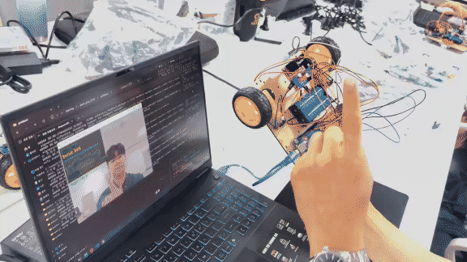
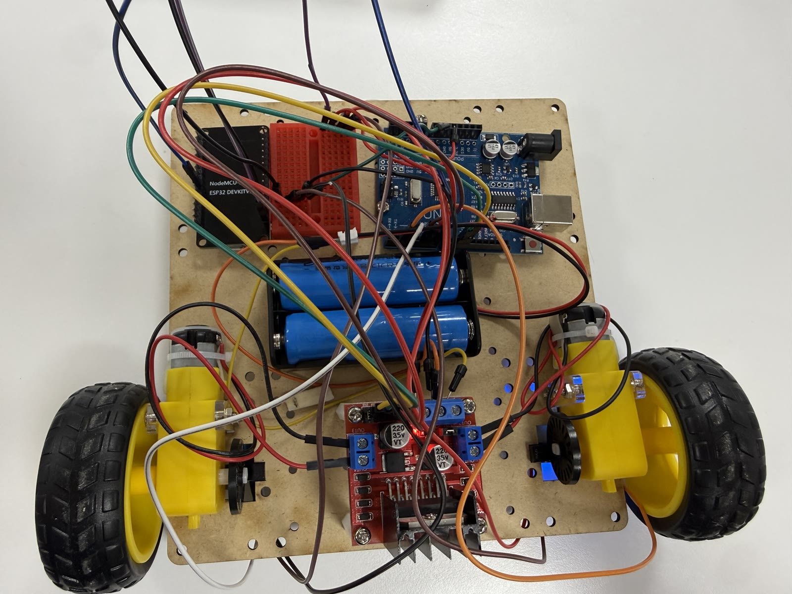
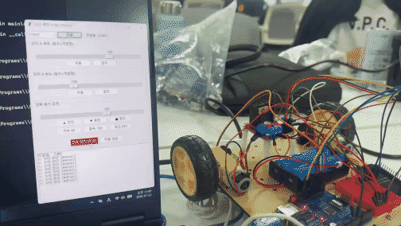
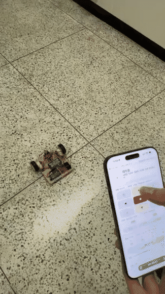
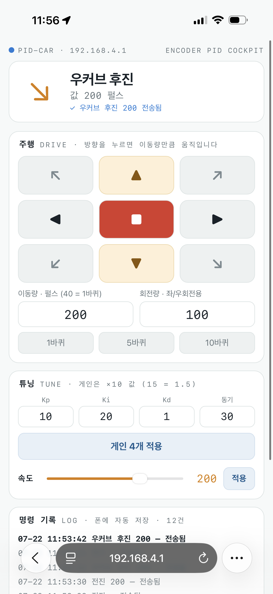

AI 사용이 허용된 실기 평가를 치렀어요. 문제는 두 개였어요. 파이썬 스레딩으로 OpenCV 카메라와 아두이노 시리얼 통신을 동시에 돌리는 것, 그리고 C++ 클래스로 모터 두 개를 제어하고 파이썬 UI로 조종하는 것이었어요. 구현 코드는 AI와 협업해 작성했고, 배선·업로드·시연·촬영은 직접 진행하면서 매 단계를 실행 결과로 검증했어요.

하루를 관통한 교훈은 하나였어요. 동시성 시스템의 버그는 대부분 로직이 아니라 **"이 자원의 주인이 누구인가"를 정하지 않아서** 생긴다는 것이에요. 화면·포트·카메라·전원 네 자원에서 같은 패턴이 반복됐어요.

<div class="specs">
<span><b>문제 1</b>OpenCV 카메라(메인) + 시리얼(스레드)</span>
<span><b>문제 2</b>C++ 모터 클래스 + tkinter UI</span>
<span><b>구동</b>L298N · TT 모터 · 18650 ×2</span>
<span><b>가점</b>MediaPipe 손 추적 제어</span>
</div>

<div class="scores">
  <div class="s bad"><div class="k">보레이트 불일치</div><div class="v">115200</div><div class="n">UI는 9600으로 접속</div></div>
  <div class="s mid"><div class="k">L298N 전압강하</div><div class="v">2 V</div><div class="n">7.4 V 넣어 5.4 V 전달</div></div>
  <div class="s mid"><div class="k">데드밴드</div><div class="v">70</div><div class="n">PWM · 아래는 소리만</div></div>
  <div class="s ok"><div class="k">수신 주기</div><div class="v">50 ms</div><div class="n">dt 실측</div></div>
  <div class="s ok"><div class="k">오작동 억제</div><div class="v">5</div><div class="n">프레임 연속일 때만 전송</div></div>
</div>

## 자원 넷, 주인 하나씩

| 자원 | 주인 | 나머지가 지킬 규칙 | 안 정하면 |
|---|---|---|---|
| 화면(GUI) | 메인 스레드 | 스레드는 캡처·수신만 | 창이 멈추거나 안 뜸 |
| 시리얼 포트 | 한 프로세스 | 접속 전 점유 확인 | 포트 열기 실패 |
| 카메라 | 한 프로세스 | 두 번째는 띄우지 않음 | 노이즈 화면 수신 |
| 전원 레일 | 각자 분리 | **GND는 반드시 공유** | 제어선이 무의미해짐 |

## 화면의 주인은 메인 스레드

문제 1의 요구는 "메인 while에서 카메라 스트림, 시리얼 통신은 별도 스레드"였어요. 처음엔 임의의 분담처럼 보이지만 사실 이 구조가 유일한 정답에 가까워요. OpenCV의 `imshow`/`waitKey`는 Windows에서 **메인 스레드 호출을 전제로** 동작해요. GUI 이벤트 루프가 스레드에 묶여 있어서 서브스레드에서 부르면 창이 멈추거나 안 떠요. 그래서 반대 변형(카메라를 스레드로)을 만들 때도 캡처만 스레드에 두고 표시는 메인에 남겨야 해요.

시리얼 수신 스레드는 세 가지로 요약돼요. 최신값 하나를 담는 공유 변수, 그걸 지키는 `Lock`, 종료를 알리는 플래그예요.

```python
def serial_worker(ser):
    global latest
    while running:                       # 종료 플래그 — 메인이 내리면 탈출
        line = ser.readline().decode("utf-8", "replace").strip()
        if line:
            with lock:
                latest = line            # 밀린 값은 버리고 최신만
```

<div class="note warn">
<div class="h">포트를 여는 순간 보드가 리셋돼요</div>
PC가 시리얼 포트를 여는 순간 DTR 신호가 아두이노를 리셋시켜서, 처음 2초간은 부팅 중인 보드의 깨진 바이트가 들어와요. <code>time.sleep(2)</code> 후 <code>reset_input_buffer()</code>로 비우고 시작해야 하고, 그래도 남는 노이즈는 <code>decode(errors="replace")</code>와 범위 검증(0~1023 밖이면 버리고 카운트만)으로 걸러요.
</div>

FPS는 프레임 간격의 역수를 지수이동평균으로 눌러서 표시했어요(`fps = 0.9*fps + 0.1*(1/dt)`). 매 프레임 값을 그대로 쓰면 숫자가 튀어서 읽을 수 없어요.

<figure class="fig"><figcaption>문제 1 시연 — 카메라 스트림 위에 FPS·수신값·그래프, 수신 주기 실측(dt≈50 ms)까지 표시해요.</figcaption></figure>

## 포트의 주인은 한 프로세스

<div class="gate crit"><div class="idx">1</div><div class="body">
<h4>시연 중 모터가 꿈쩍도 안 함</h4>
<div class="row"><span class="lab">원인</span><span class="val">보드에 어제 실습용 스케치(115200 bps, 다른 명령 체계)가 올라가 있었어요. UI는 <b>9600으로 접속해</b> <code>a 150</code>을 보내는데 보드는 그 명령을 몰라요</span></div>
<div class="row"><span class="lab">조치</span><span class="val">UI에 자동 진단 — 숫자만 계속 흐르면 "다른 송신 스케치", 깨진 문자면 "보레이트가 다르다"</span></div>
</div></div>

같은 계열의 사고가 두 번 더 있었어요. IDE 시리얼 모니터를 열어둔 채 파이썬을 실행하면 포트를 못 열고, 카메라를 쓰는 프로그램을 두 개 띄우면 두 번째가 노이즈 화면을 받아요. 셋 다 원인은 같아요. 포트도 카메라도 **한 번에 한 주인**만 가질 수 있는 자원인데, 소유권이 넘어갔는지 확인하지 않고 접근한 거예요.

올바른 스케치인지 확인하는 신호도 부팅 메시지가 아니라 1초 주기 상태 로그(`A=0 B=0 [manual]`)로 잡았어요. **접속 직후 버퍼를 비우는 코드가 부팅 메시지를 지워 버리기 때문**이에요. 위의 리셋 대응과 이 판정이 서로 부딪히는 자리라, 판정 신호를 주기 로그 쪽으로 옮겨야 둘 다 성립해요.

## 전원은 분리하고 기준은 공유해요

문제 2의 하드웨어 요구는 "모터 전원과 아두이노 전원 분리"였어요. 모터는 18650 두 개 직렬(7.4 V)을 L298N 전원 단자에 직결하고, 아두이노는 USB로 받아요.

| 전원 구성 | L298N 통과 후 | TT 모터 |
|---|---:|---|
| 18650 한 개 (3.7 V) | 1.7 V | <span class="tag no">안 돎</span> |
| 18650 두 개 (7.4 V) | 5.4 V | <span class="tag ok">정상 범위</span> |

두 개를 쓰는 이유는 **L298N의 내부 전압강하가 약 2 V**라서예요. 분리하되 GND는 반드시 이어야 해요. 신호의 높낮이를 판정할 공통 기준이 없으면 제어선이 무의미해져요.

<figure class="fig"><figcaption>18650×2 → L298N 직결, 아두이노는 USB — 두 전원은 GND만 공유해요.</figcaption></figure>

C++ 쪽은 클래스를 `.h`(선언)와 `.cpp`(구현)로 분리하고 객체 두 개로 모터를 독립 제어하는 구조였어요. 아두이노 클래스에서 조심할 지점은 생성자예요. **전역 객체의 생성자는 코어 초기화보다 먼저 실행**되므로 `pinMode`를 생성자에서 부르면 안 되고, 값 저장만 한 뒤 `setup()`에서 `begin()`을 호출하는 관행을 따라요.

속도 제어에는 두 가지를 얹었어요. 목표 속도까지 10밀리초에 5씩 접근하는 소프트스타트 램프로 기동 전류 스파이크를 막고, 데드밴드 보상으로 1~255 요청을 실제로 도는 70~255 구간에 사상해요. 이 모터는 PWM 70 아래에서는 '웅' 소리만 나거든요.

<figure class="fig"><figcaption>문제 2 시연 — tkinter UI의 슬라이더·프리셋으로 모터 두 개를 제어하고, 우측 로그에 보드 응답이 찍혀요. (앞 12초)</figcaption></figure>

파이썬 UI는 tkinter로 만들었는데 수신 처리에 스레드를 쓰지 않았어요. `root.after(100, poll)`로 100밀리초마다 `in_waiting`을 확인하는 폴링이면 GUI가 멈추지 않으면서 충분했어요. **화면의 주인이 메인 루프라는 원칙은 tkinter에서도 똑같이 적용돼요.**

<figure class="fig"><figcaption>직진 주행 — 어제 조립한 로봇 섀시를 그대로 사용했어요. (앞 8초)</figcaption></figure>

## 손가락 다섯 개로 속도 다섯 단계

제시된 것 이상을 구현하면 가점이 있다고 해서, 문제 1의 카메라 스트림에 MediaPipe 손 추적을 얹었어요. 프레임마다 손 관절 21개를 추정해 편 손가락 개수를 세고(끝 관절이 중간 관절보다 위인지 비교), 그 개수를 `L3` 같은 한 줄 명령으로 아두이노에 보내요. 보드는 같은 명령 하나로 내장 LED를 개수만큼 깜빡이고 모터 속도를 다섯 단계로 바꿔요.

손을 치우면 0으로 처리돼 모터가 서는데, 의도치 않게 데드맨 스위치까지 된 셈이에요. 인식이 튀는 프레임에 오작동하지 않도록 **같은 값이 5프레임 연속일 때만** 전송했어요.

<figure class="fig"><figcaption>별도로 만들어 둔 ESP32 무선 조종 화면 — 같은 로봇을 폰 브라우저에서 조작하고 명령 로그를 CSV로 남겨요.</figcaption></figure>

카메라 화면, 시리얼 포트, 전원 레일. 만진 자원마다 주인을 하나로 정하고 나머지는 접근 규칙을 따르게 했더니 남는 버그가 거의 없었어요. 동시성 설계라는 말이 거창하게 들리지만, 시작은 자원마다 소유자를 한 명으로 정하는 일이었어요.
