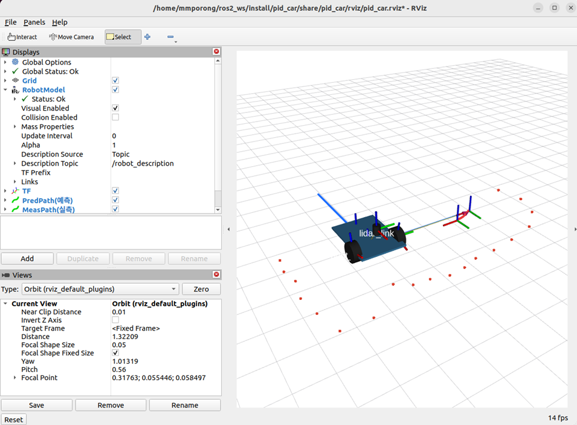
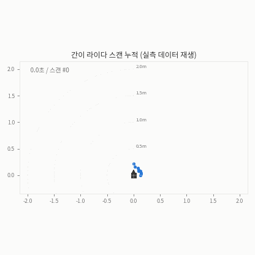
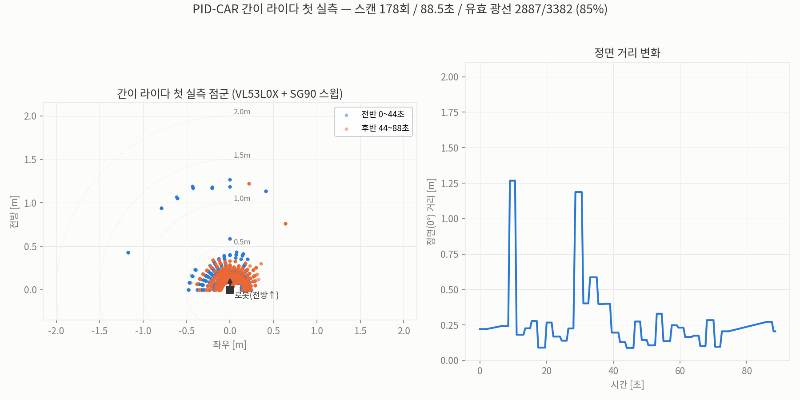

RViz 화면 속 로봇은 그냥 3D 모형이에요. 오늘은 이 모형이 실물 로봇과 같은 명령을 받아 같이 움직이게 만들고, 손수 만든 라이다의 첫 스캔 데이터도 받아봤어요. 방 단면 대신 센서 기울기가 먼저 찍혔지만, 그것까지가 실측의 수확이었어요.

## 화면에 로봇이 그려지기까지

URDF(Unified Robot Description Format)는 로봇의 구조를 적는 XML 텍스트 파일이에요. 링크(link, 강체 부품)와 조인트(joint, 부품 사이 관절)를 나열하면 로봇 한 대가 기술되고, 모양은 box·cylinder·sphere 같은 기본 도형이나 STL 메쉬 파일로 붙여요. 바퀴처럼 무한 회전하는 관절은 continuous 타입으로 선언하고 회전축(axis)을 지정해요.

이 파일이 화면에 뜨기까지는 역할 분담이 있어요. robot_state_publisher가 URDF를 읽어 robot_description 토픽과 좌표 변환(tf) 토픽을 발행하고, 움직이는 관절의 각도는 joint_states 토픽을 받아 tf에 반영해요. RViz는 robot_description에서 모양을, tf에서 자세를 가져와 결합 렌더링하고요. 모델을 처음 확인할 때는 joint_state_publisher_gui의 슬라이더로 관절을 움직여 조인트 축이 맞게 잡혔는지 눈으로 검증해요.



## 원격 조종 노드가 명령을 보내는 방식

teleop(teleoperation)는 키보드·조이스틱 입력을 로봇 속도 명령으로 바꾸는 노드예요. 동작 방식이 특이한데, 키를 누를 때만 메시지를 쏘는 게 아니라 설정된 주기(Hz)로 /cmd_vel 토픽에 Twist 메시지를 계속 발행하고, 키 입력이 들어오면 그 메시지 안의 속도값만 즉시 바꿔요. Twist는 linear x·y·z와 angular x·y·z 여섯 칸이지만 차동구동 로봇은 linear.x(전진 속도)와 angular.z(회전 속도) 두 칸만 써요.

## 디지털 트윈, 명령 하나에 로봇 둘

오늘 실기 시간의 중심은 2바퀴+볼캐스터 로봇의 디지털 트윈이었어요. 구조는 이래요. /car_cmd 토픽으로 "F400" 같은 명령이 오면 트윈 노드가 두 갈래로 처리해요. 한쪽은 실차로 전송하고(폰과 같은 HTTP API, 또는 우노 USB 시리얼 직결), 다른 쪽은 같은 명령을 차동구동 기구학으로 적분해 odom→base_link tf와 바퀴 joint_states를 발행해요. 그러면 실물 바퀴와 RViz 모델 바퀴가 같은 명령으로 함께 굴러가요.

이 방식은 명령 기반 추측항법(dead reckoning)이에요. 실차의 실제 상태를 보지 않고 "이 명령이면 이만큼 갔겠지"로 위치를 추정하는 거죠. 여기서 확인한 건 정확도가 아니라 배선이에요. 트윈 노드가 쓰는 변환 계수 2π×0.0325m ÷ 40카운트가 그대로 tf에 실려 나오는지 tf2_echo로 되읽어 400카운트 = 2.042m를 확인했어요. 같은 수식을 넣고 되읽은 값이라 일치 자체는 당연하고, 이 검사가 잡아주는 건 단위 착오나 계수 오타 같은 배선 실수예요. 실제로 2.042m를 갔는지는 줄자로 재야 알 수 있고, 그건 아직 못 했어요.

```
$ ros2 run tf2_ros tf2_echo odom base_link   # F400 → G90 후
- Translation: [2.042, 0.000, 0.000]
- Rotation: in RPY (degree) [0.000, 0.000, -90.000]
```

USB 연결의 장점은 양방향이라는 점이에요. 포트를 여는 순간 우노가 리셋되며 뿜는 부팅 배너부터 그대로 수신돼요.

```
[Dual Ready v11] 주행 F/B/L/R Q/E/Z/C + G/H(자이로 각도 회전) + S T O D W + P/I/K/Y/V
자이로 영점 잡는 중 - 2초 정지... MPU6050 OK (G/H=각도 회전, 직진 헤딩 유지 활성)
```

펌웨어가 100ms마다 찍는 주행 로그(엔코더 카운트, 자이로 각도)를 되받아 파싱하면 실측 기반 자세를 따로 적분할 수 있어요. RViz에 예측 궤적과 실측 궤적을 색을 나눠 겹쳐 그리도록 잡아 뒀는데, 이날은 두 궤적을 비교하지 못했어요. 예측 쪽은 명령대로 도는데 실측 쪽이 원점에 그대로 머물렀고, 그 이유가 다음 이야기예요.

주행 명령을 보냈는데 바퀴가 미동도 안 했고, 되받은 텔레메트리에 증거가 그대로 남아 있었어요.

```
F A:0/80 pwm=120  |  B:0/80 pwm=120  |  d=0.0  |  yaw=-0.0   ← 출력은 최대, 카운트는 0
!! TIMEOUT - 자이로 회전 15초 초과
!! STOP (TIMEOUT)
```

엔코더 카운트 0인 채로 PWM은 제한값까지 올라갔고 15초 뒤 타임아웃 정지. 이 로봇은 로직 전원(USB→우노)과 모터 전원(배터리→L298N)이 분리돼 있어서, "제어기는 멀쩡한데 근육에 전기가 없다"는 결론이 데이터만으로 나왔어요. 증거가 원인 후보를 좁혀주는 경험이었어요.

## 서보 하나로 만드는 2D 라이다

2D 라이다는 평면을 훑어 벽과 장애물의 거리를 재는 센서예요. 시판 라이다 대신 SG90 서보에 VL53L0X ToF(Time of Flight) 거리 센서를 얹어 만들었어요. 빛이 왕복하는 시간으로 거리를 재는 센서인데 사양상 유효 범위가 2m 정도예요. 서보가 0~180도를 10도 간격으로 훑으며 각도별 거리를 모으면 한 스캔이 되고, 이걸 sensor_msgs/LaserScan 규격(angle_min, angle_increment, ranges 배열, 측정 불가는 inf)으로 발행하면 RViz가 점군으로 그려줘요.

첫 실측에서 88.5초 동안 178스캔, 광선 3,382개 중 2,887개(85.4%)가 값을 냈어요. 기록해 둔 스캔을 시간 순서대로 재생하면 서보가 훑을 때마다 점이 쌓여요.



전체 데이터를 한 장으로 모으면 이렇게 돼요. 왼쪽은 점군 분포(전반·후반을 색으로 구분), 오른쪽은 정면 광선의 거리 변화예요. 정면 광선은 0.2m 근처를 기준선으로 두고 두 번만 1.2m대까지 튀어요. 손을 대 보는 수동 확인은 따로 했지만 이 기록에는 그 구간이 없어서, 여기서 읽히는 건 기준선이 손보다도 가깝다는 사실이에요.



그런데 값이 있다와 값이 맞다는 다른 얘기였어요. 유효 광선의 97%가 0.5m 안쪽이고 1.5m를 넘는 값은 하나도 없어요. 중앙값 0.21m가 19방향 전부에서 비슷하게 나오는데, 이건 방의 윤곽이 아니라 센서가 바닥을 보고 있다는 뜻이에요. 서보 팔이 살짝 아래로 기울어 있는 것으로 의심돼 수평 장착부터 다시 확인할 예정이에요.

## 같은 망에서 남의 로봇이 보일 때

ROS2는 중앙 서버 없이 노드끼리 서로를 찾는 P2P(DDS) 구조예요. 편리하지만 같은 네트워크에 여러 사람이 있으면 남의 노드와 토픽이 내 화면에 섞여 들어와요. 이럴 때는 ROS_DOMAIN_ID로 통신 영역을 나눠 분리하고, 반대로 한 시스템 안에서 로봇팔·이동로봇·비전 노드가 데이터를 공유해야 한다면 모두 같은 ID를 쓰면 돼요.

## 빌드 산출물이 사는 곳

colcon build를 돌리면 코드는 install 디렉토리에 파이썬 모듈로 설치돼 어디서든 import해 재사용할 수 있어요. 조심할 건 데이터 파일이에요. urdf·launch·rviz 설정처럼 코드가 아닌 파일은 setup.py의 data_files로 등록해야 install의 share 폴더로 복사되는데, 이때 소스 트리에서 통하던 상대 경로가 더는 안 통해요. 실행 시점에는 get_package_share_directory로 share 경로를 얻어 접근해야 launch가 파일을 찾아요. 수업에서 한 OpenCV 실습도 같은 틀 위에 있었어요. 컨투어 중심점을 뽑는 비전 노드가 좌표를 토픽으로 발행하면 다른 노드가 받아 출력하는 구조예요.

모형과 실물 사이에는 아직 간극이 있어요. 추측항법이 못 보는 미끄러짐, 기울어진 센서가 만드는 유령 점 같은 것들이요. 이 간극을 실측으로 좁히는 캘리브레이션이 다음 순서예요.
