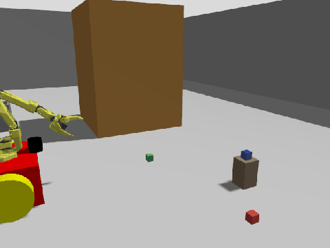

로봇이 물체를 집어 다른 곳에 놓는 동작을 만들 때, 중간에 꼭 물어야 하는 질문이 있어요. 지금 쥐고 있는가. 이 판정이 틀리면 로봇은 빈 그리퍼로 목적지까지 가서 아무것도 없는 손을 펴고 성공을 보고합니다. 실제로 그런 실행을 여러 번 봤고, 판정 방식을 세 번 갈아엎고 나서야 원인을 정확히 짚었어요.


<em><span>정상 동작. 물체를 찾아 접근하고 집어서 옮기는 전체 사이클</span><span class="cap-src">(Gazebo 시뮬레이션 녹화)</span></em>

## 판정이 틀리면 뒤가 전부 무의미해요

이 판정이 중요해진 건 동작이 길어지면서였어요. 물체를 집어서 옆에 내려놓는 것까지는 잘못 판정해도 티가 안 납니다. 그런데 집은 물체를 들고 쓰레기통을 찾아가 그 안에 넣는 동작으로 확장하니, 판정 하나가 그 뒤 전부를 좌우하게 됐어요.

빈 손으로 통까지 이동하는 데 30초 넘게 걸리고, 도착해서 그리퍼를 펴고, 성공 로그를 남기고 종료합니다. 사람이 화면을 보고 있지 않으면 무엇이 잘못됐는지 알 방법이 없어요. 실패를 실패로 보고하지 않는 것이 실패 자체보다 더 위험한 이유가 여기 있습니다.

## 힘 센서 없이 무엇을 볼 수 있나

이 그리퍼에는 힘이나 접촉을 재는 센서가 없어요. 쓸 수 있는 신호는 관절 각도 하나뿐입니다. 그래서 처음 세운 판정은 단순했어요. 허공에서 닫으면 완전 닫힘 각도(-0.17rad)까지 가지만 물체를 물면 중간에 멈추니까, 각도가 완전 닫힘보다 크면 쥔 것으로 봅니다.

```python
held = angle > GRIP_HOLD_THRESHOLD   # -0.05
```

이 판정이 새는 지점은 금방 드러났어요. 그리퍼가 아예 닫히지 않은 상태의 각도는 0.0인데, 이것도 임계를 넘습니다. 어떤 이유로 닫기 명령이 실행되지 않으면 로봇은 빈 손을 쥔 것으로 착각해요.

## 명령과 비교하면 될 줄 알았는데

두 번째 판정은 명령 대비 잔여각이었어요. 닫기를 명령했는데 그만큼 못 닫혔다면 무언가 막고 있다는 뜻이니까요.

```python
held = angle > cmd + 0.05
```

이 방식은 다른 곳에서 무너졌어요. 물체를 든 채로 이동하는 동안 미끄러짐을 막으려고 주기적으로 다시 조이는데, 이때 목표를 접촉 각도 바로 안쪽으로 잡습니다. 그러면 그리퍼가 목표에 도달하고, 잔여각이 0이 되면서 쥐고 있는데도 놓쳤다고 판정해요. 실제로 각도 0.339에 확실히 물린 상태가 DROPPED로 나왔습니다.

세 번째로 각도 구간 판정으로 바꿨어요. 3cm 큐브를 제대로 물면 각도가 항상 0.07–0.40에 머무는 것을 여러 실행에서 확인했으니, 그 구간 밖은 전부 실패로 봅니다. 아래로는 허공 닫힘과 모서리 헛집기, 위로는 열린 상태가 자동으로 걸러져요.

```python
GRIP_HOLD_MIN, GRIP_HOLD_MAX = 0.05, 0.45
held = MIN < angle < MAX
```

여덟 가지 경우를 넣어 검사하니 전부 통과했습니다. 그런데 실제 실행에서 가짜 성공이 또 나왔어요.

## 관찰로는 알 수 없는 것이었어요

로그를 다시 보고 나서야 구조적인 문제를 알았어요. 들어올리는 15단계 내내 각도가 0.331로 **완벽하게 일정**했습니다.

```
step lift=1.06: 그리퍼 각도=0.331
step lift=0.99: 그리퍼 각도=0.331
step lift=0.92: 그리퍼 각도=0.331
```

이 숫자는 물체가 버티는 힘이 아니라 **직전에 내린 재조임 명령의 목표값**이었어요. 위치 제어 그리퍼는 명령받은 각도를 유지합니다. 물체가 중간에 빠져도 각도는 그대로예요. 막고 있던 것이 사라졌으니 오히려 목표에 더 정확히 도달할 뿐입니다.

즉 각도를 아무리 잘 해석해도 물체 유무는 알 수 없어요. 어떤 임계나 구간을 써도 마찬가지입니다. 정보가 신호에 담겨 있지 않으니까요.

## 판정하려면 개입해야 해요

해결은 관찰을 그만두고 개입하는 것이었어요. 조금 더 조여 보고, 움직이는지 확인합니다. 물체가 있으면 막혀서 못 움직이고, 없으면 목표까지 그대로 닫혀요.

```python
before = self.gripper_angle
probe = max(GRIPPER_CLOSED, before - 0.06)   # 살짝만 더
self.move_gripper(probe, effort=3.0)
after = self.gripper_angle
held = self.gripped(after) and (after - probe) > 0.02
```

여기서 두 가지를 조심해야 해요. 완전히 닫히도록 시도하면 확인 동작이 물체를 밀어내 떨어뜨립니다. 실제로 그렇게 만들었다가, 확인할 때마다 물체를 잃는 역설을 겪었어요. 그래서 0.06rad만 조여 보고, 힘도 평소 파지력의 1/7 수준으로 낮췄습니다. 그리고 확인이 끝나면 원래 유지 목표로 즉시 되돌려요.

확인 빈도도 줄여야 했어요. 자세를 바꾸는 중간중간 매번 확인하면 그만큼 물체를 건드리게 되니, 한 동작이 끝난 뒤 한 번만 확인하도록 정리했습니다. 상태를 자주 확인할수록 정확해질 것 같지만, 개입으로 확인하는 경우에는 확인이 곧 교란이라 반대가 돼요.

이 방식으로 바꾸자 빈 손 상태가 정확히 잡혔어요.

```
물체 없음 확인 (조임 0.331→0.271, 목표 0.271)
```

목표까지 그대로 닫혔으니 막는 것이 없다는 뜻이고, 로봇은 여기서 멈춥니다. 빈 손으로 목적지까지 가는 일이 사라졌어요.

## 남은 문제와 다음 단계

판정은 정확해졌지만 파지 자체의 안정성은 아직이에요. 물림 깊이가 실행마다 달라서, 얕게 걸리면 물체가 바닥에서 떨어지는 첫 순간에 미끄러집니다. 시뮬레이션의 강체 접촉이 실물 고무 패드보다 훨씬 약한 것이 배경이고, 마찰 계수와 파지력을 올려도 부분적으로만 나아졌어요.

다음으로 확인할 것은 정렬 단계의 결합 오차예요. 손목 카메라로 좌우를 맞출 때 팔을 회전시키는데, 이 회전이 호를 그리기 때문에 앞뒤 거리도 함께 바뀝니다. 좌우를 맞추고 나서 앞뒤를 다시 재는 순서로 바꾸면 물림 깊이가 일정해질 것으로 보고 있어요.

이번에 얻은 원칙 하나는 다른 상태 추정에도 그대로 옮길 수 있어요. **위치 제어 액추에이터의 상태 값은 명령을 따라가므로, 외부 세계에 대한 정보를 담지 않는다.** 세계가 어떤지 알고 싶으면 그 세계를 한 번 건드려 보고 반응을 봐야 합니다.
