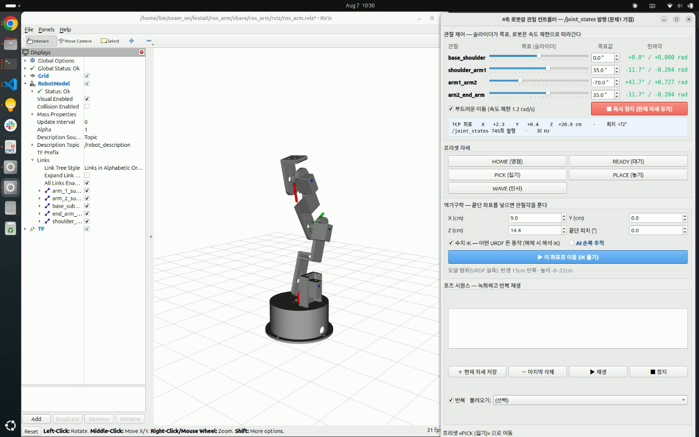

RViz에 로봇팔을 띄우고 관절을 움직이는 흔한 방법은 `joint_state_publisher`를 쓰는 거예요. 슬라이더 창이 뜨고 그걸 움직이면 모델이 따라와요. 이번에는 그 자리를 직접 만든 파이썬 UI로 대체해야 했어요.

만드는 방법은 두 가지가 있어요. 관절 이름과 가동범위를 코드에 적어 두고 슬라이더를 그리거나, URDF에서 읽어 화면을 구성하거나. 앞쪽이 훨씬 짧아요. 관절이 넷이면 리스트 하나면 끝나요.

## 관절 정보를 코드에 적지 않기

뒤쪽을 골랐어요. `robot_state_publisher`는 URDF를 `/robot_description` 토픽으로 내보내는데, 이걸 구독해서 XML을 파싱하면 관절 이름·타입·회전축·가동범위·링크 길이를 전부 얻을 수 있어요.

```python
qos = QoSProfile(depth=1)
qos.durability = QoSDurabilityPolicy.TRANSIENT_LOCAL   # 늦게 떠도 마지막 값을 받는다
self.create_subscription(String, 'robot_description', self._on_desc, qos)
```

`TRANSIENT_LOCAL`이 중요해요. URDF는 시작할 때 한 번만 발행되기 때문에, 일반 구독으로는 UI가 조금 늦게 뜨면 영영 못 받아요. 발행자와 구독자의 내구성(durability) 설정이 맞아야 마지막 값이 전달돼요.

이렇게 하면 UI가 로봇을 모르는 채로 만들어져요. 슬라이더 개수도, 각 슬라이더의 범위도 실행 시점에 결정돼요.

## 처음 보는 모델을 만났을 때

과제에서 지정한 URDF는 제가 만든 것이 아니라 깃허브에 공개된 4축 로봇암이었어요. 링크마다 STL 메시가 붙어 있고, 관절 이름은 `base_shoulder`, `shoulder_arm1`, `arm1_arm2`, `arn2_end_arm`이에요. 마지막 것은 오타가 그대로 남아 있는 이름이라, 코드에 적어 뒀다면 반드시 한 번은 틀렸을 거예요.

띄워 보니 UI가 코드 수정 없이 그대로 동작했어요.

```
URDF 수신 — 관절 4개: base_shoulder, shoulder_arm1, arm1_arm2, arn2_end_arm
```


*왼쪽 RViz의 링크 트리와 오른쪽 UI의 슬라이더가 모두 URDF에서 나왔어요*

여기까지는 설계가 통한 부분이에요. 문제는 그다음이었어요.

## 파일에 적힌 순서와 실제로 연결된 순서

끝단 좌표를 보여주려고 정기구학(forward kinematics)을 계산하고 있었어요. 관절각을 받아 링크를 차례로 이어 붙이면 끝점 위치가 나와요. 처음에는 URDF에 적힌 순서대로 변환을 누적했어요.

이 URDF에서는 그게 틀렸어요. 조인트가 파일 맨 아래에 몰려 있는데, 순서가 끝단에서 뿌리 방향이었어요. 파일 순서로 누적하면 팔이 거꾸로 이어져요.

URDF의 조인트는 `parent`와 `child` 링크를 명시하니까, 그 관계로 트리를 만들어 루트부터 따라가야 해요. 어떤 링크의 자식도 아닌 링크가 루트예요.

```python
children = {j['child'] for j in self.joints}
roots = [j['parent'] for j in self.joints if j['parent'] not in children]
```

정렬을 고치고 나서 RViz가 계산한 TF와 대조했어요. 관절이 전부 0일 때 뿌리에서 끝단까지가 `[0.000, 0.004, 0.219]`로 소수점 세 자리까지 같았어요. 같은 URDF를 읽는 두 구현이 같은 값을 내는지 보는 것이 이 계산의 자체 검산이 돼요.

## 구조를 안다는 가정을 버리기

역기구학(inverse kinematics)에서는 더 크게 걸렸어요. 목표 좌표를 넣으면 관절각을 돌려주는 계산인데, 처음에는 공식으로 풀고 있었어요. 요(yaw) 축 하나가 방향을 정하고 나머지 세 축이 한 평면 안에서 움직이는 구조라고 가정하면, 2링크 역기구학 공식으로 한 번에 나와요. 빠르고 정확해요.

그 대신 그 구조에서만 성립해요. 지정 URDF는 축 배치가 달라서 해가 나오지 않았어요.

그래서 구조를 가정하지 않는 수치해법으로 바꿨어요. CCD(Cyclic Coordinate Descent)는 끝단에서 뿌리 쪽으로 관절을 하나씩 보면서, 그 관절의 회전축 둘레로 "지금 끝단"이 "목표"에 가장 가까워지는 각도만큼 돌리는 일을 반복해요.

```python
v1 = tip - origin                      # 관절 → 현재 끝단
v2 = tgt - origin                      # 관절 → 목표
v1 = v1 - np.dot(v1, axis) * axis      # 축에 수직인 성분만 남긴다
v2 = v2 - np.dot(v2, axis) * axis
ang = math.atan2(float(np.dot(np.cross(v1, v2), axis)), float(np.dot(v1, v2)))
q[i] = max(j['lower'], min(j['upper'], q[i] + ang))   # 가동범위로 자른다
```

축에 수직인 성분만 남기는 게 핵심이에요. 회전으로 줄일 수 있는 오차는 그 성분뿐이고, 축 방향 성분은 이 관절로는 어떻게 해도 줄지 않아요. 각도를 구할 때 외적을 축에 투영해 부호를 얻으면 어느 쪽으로 돌아야 하는지가 나와요.

매 단계에서 가동범위로 자르기 때문에 한계를 넘는 해가 나오지 않고, 못 닿는 목표를 줘도 발산하지 않고 가장 가까운 자세로 수렴해요. 도달 가능한 지점을 무작위로 뽑아 되돌려 보니 12번 모두 3mm 안으로 들어왔어요.

대가는 있어요. 공식은 한 번에 답을 주는데 CCD는 반복이고, 해가 여럿인 경우 어느 자세로 갈지는 시작값이 정해요. 구조를 아는 로봇이라면 공식이 낫고, 모르는 로봇까지 받아야 한다면 수치해법이 필요해요. 두 구현을 다 두고 체크박스로 고르게 했어요.

## 도달 범위도 모델에서 잰다

마지막으로 걸린 건 사용성이었어요. 좌표 입력칸의 기본값을 제가 만든 로봇 기준으로 넣어 뒀는데, 지정 URDF는 팔이 더 짧아서 그 좌표가 닿지 않았어요. 버튼을 누르면 "못 닿아요"만 나왔어요.

기본값도 모델에서 재게 했어요. 관절 한계 안에서 자세를 격자로 훑어 끝점을 모으면 그 로봇이 실제로 닿는 범위가 나와요.

```python
grids = [np.linspace(lo, hi, 5) for lo, hi in lims]
pts = [self.chain.fk(list(combo))[:3, 3] for combo in itertools.product(*grids)]
```

이 로봇은 반경 15cm, 높이 −8~22cm였어요. 그 안쪽 지점을 기본값으로 넣고 안내 문구도 실측값으로 바꾸니, 버튼을 누르면 팔이 그 자리로 가요. 웹캠으로 사람 손목을 따라가게 붙였을 때도 화면 49개 지점이 전부 도달 범위 안에 들어왔어요.

## 일반화의 값

관절 이름을 코드에 적었다면 30분이면 끝났을 UI였어요. URDF를 읽게 만드느라 파싱·트리 정렬·수치 역기구학까지 붙었으니 훨씬 오래 걸렸어요.

그 대신 처음 보는 모델을 만났을 때 고칠 게 없었어요. 정확히 말하면 화면은 고칠 게 없었고, 기구학은 고쳐야 했어요. 파일 순서를 연결 순서로 착각한 것과 축 배치를 가정한 것은 둘 다 "내가 만든 로봇에서는 우연히 맞던" 코드였어요. 일반화는 인터페이스에서 시작하지만, 실제로 검증되는 건 다른 입력이 들어왔을 때예요.

같은 날 2륜 로봇 쪽에서 겪은 문제는 [[2026-08-07_회고_실물에서만_보이는_결함|로봇이 41미터를 날아갔어요]]에 적었어요. 앞서 서보암에 텔레옵을 붙이며 만난 함정은 [[2026-07-28_회고_명령이_반쯤_도착했을_때|명령이 반쯤 도착했을 때]]에 있어요.
