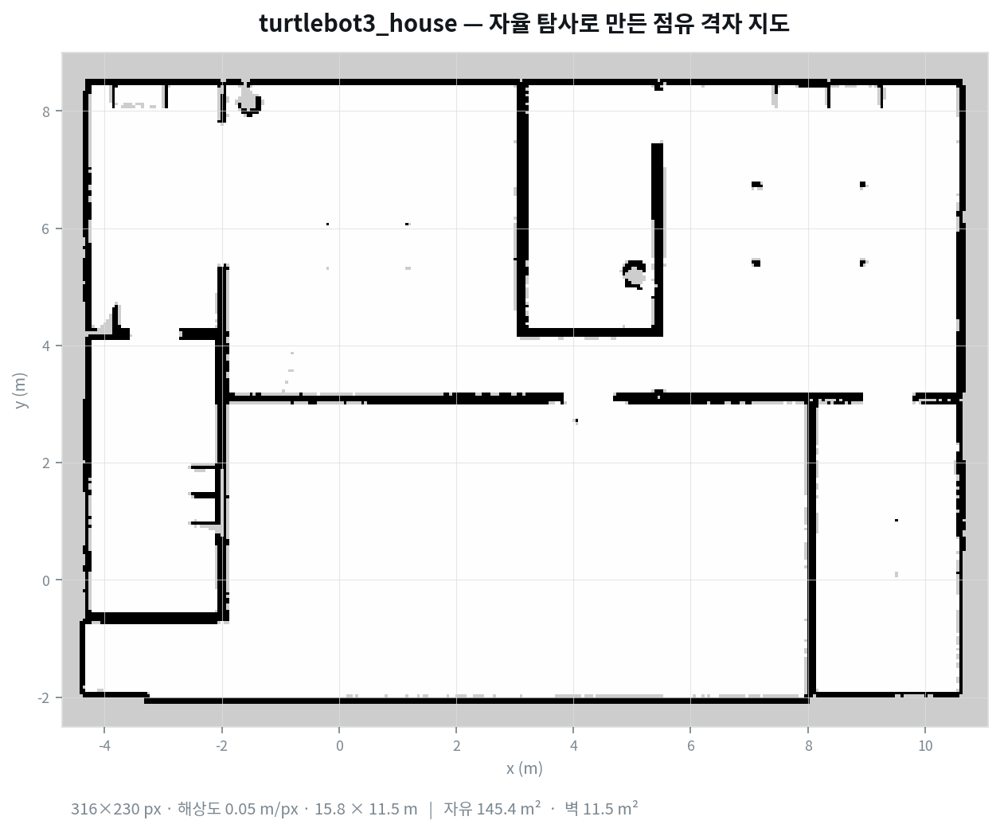
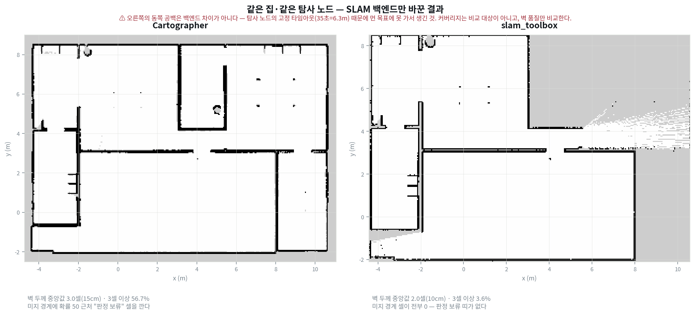

키보드로 로봇을 몰아 지도를 뜨는 대신 자율 탐사를 붙였어요. 그런데 로봇이 이미 그려 둔 벽 옆만 왕복하고, 지도에 회색으로 남은 영역은 그대로였어요.

원리가 단순해서 안 도는 이유도 단순할 줄 알았는데, 세 번 다 **지도를 읽는 기준** 쪽이 문제였어요. 파라미터를 아무리 돌려도 안 움직이는 종류였고요.

<div class="specs">
<span><b>시뮬</b>Gazebo · turtlebot3_house</span>
<span><b>SLAM</b>Cartographer (대조: slam_toolbox)</span>
<span><b>주행</b>Nav2</span>
<span><b>탐사</b>frontier 기반 · 자작 노드</span>
<span><b>격자</b>0.05 m/셀</span>
</div>

<div class="scores">
  <div class="s bad"><div class="k">경계 셀</div><div class="v">9</div><div class="n">같은 지도 · 기준 하나 때문에</div></div>
  <div class="s ok"><div class="k">기준 수정 후</div><div class="v">308</div><div class="n">부등호 하나를 바꿔서</div></div>
  <div class="s mid"><div class="k">유효 덩어리</div><div class="v">8 / 23</div><div class="n">8방향 · 4방향은 6/47</div></div>
  <div class="s ok"><div class="k">완성 지도</div><div class="v">15.8×11.5</div><div class="n">m · 자유 145.4 m²</div></div>
  <div class="s bad"><div class="k">종료 사유</div><div class="v">연속 실패</div><div class="n">지도는 완성인데</div></div>
</div>

<figure class="fig"><figcaption>기준을 고친 뒤 3배속으로 한 번에 완주한 결과예요. 방과 복도가 전부 닫혀 있고 벽이 단선으로 곧아요.</figcaption></figure>

## Nav2 위에 무엇을 얹었나

Nav2는 목표를 주면 거기까지 가는 스택이라 **어디로 갈지는 정해 주지 않아요.** 그 빠진 층을 채우는 게 frontier 기반 탐사예요. 점유 격자에서 장애물이 아니면서 미지 영역과 맞닿아 있는 칸이 frontier(경계)이고, 그리로 가면 지금 모르는 공간이 라이다에 들어와요. 경계를 찾고, 하나 고르고, 도착하면 다시 찾는 루프가 전부예요.

```text
SLAM (Cartographer)
  발행: /map  ·  nav_msgs/OccupancyGrid  ·  0.05 m/셀
        값 규약 = -1 미지 / 0~100 점유 확률
        |
        v
탐사 노드 (자작)
  1. 경계 셀 판정      자유 판정 기준 <-- 관문 1
  2. 연결 성분 묶기    4방향 대 8방향  <-- 관문 2
  3. 대표점 선정       Nav2가 받아 줄 좌표로
  4. 목표 전달 -> Nav2 NavigateToPose
  5. 실패 처리         블랙리스트 단위  <-- 관문 3
        |
        v
Nav2
  전역·지역 경로 계획과 복구를 맡음
  갈 수 없다고 판단한 목표는 거부 -> 4번으로 되돌아옴
```

세 관문이 전부 이 루프의 1~2단계, 그러니까 **Nav2에 넘기기 전에 지도를 읽는 자리**에 있었어요.

<div class="gate crit"><div class="idx">1</div><div class="body">
<h4>회색이 절반인데 경계가 9개만 잡힘</h4>
<div class="row"><span class="lab">증상</span><span class="val">화면에는 미지 영역이 절반인데 경계 셀이 <b>9개</b></span></div>
<div class="row"><span class="lab">근거</span><span class="val">미지에 인접한 셀 값 분포가 45~55에 몰려 있고 <b>최빈값 50</b></span></div>
<div class="row"><span class="lab">원인</span><span class="val">자유를 25 이하로 좁게 잡음. 확실한 자유(약 18)와 미지(-1) 사이에 <b>판정 보류 띠(50)</b>가 끼어 둘이 직접 맞닿지 않아요</span></div>
<div class="row"><span class="lab">조치</span><span class="val">탐지 기준을 장애물 문턱(65) 미만까지 확대 → 같은 지도에서 <b>308개</b></span></div>
</div></div>

<div class="gate"><div class="idx">2</div><div class="body">
<h4>경계가 계단 모양으로 조각남</h4>
<div class="row"><span class="lab">증상</span><span class="val">덩어리를 묶고 최소 크기로 거르면 후보가 거의 안 남음</span></div>
<div class="row"><span class="lab">원인</span><span class="val">벽이 격자에 비스듬하면 경계가 계단이 되는데, <b>4방향 연결</b>로는 계단의 칸들이 안 붙어 한 덩어리가 여럿으로 쪼개져요</span></div>
<div class="row"><span class="lab">조치</span><span class="val">연결 성분 라벨링을 <b>8방향</b>으로. 덩어리 수는 47 → 23으로 줄었는데 통과는 6 → 8로 늘었어요</span></div>
</div></div>

<div class="gate crit"><div class="idx">3</div><div class="body">
<h4>목표가 5 cm씩 옮겨 가며 같은 자리를 돎</h4>
<div class="row"><span class="lab">증상</span><span class="val">로그에는 매번 다른 목표라 <b>진행 중으로 읽힘</b></span></div>
<div class="row"><span class="lab">원인</span><span class="val">실패한 목표를 <b>좌표 하나</b>로 블랙리스트에 넣음. 그 덩어리의 옆 칸이 그대로 남아 다음 순번에 뽑혀요</span></div>
<div class="row"><span class="lab">조치</span><span class="val">실패 시 <b>덩어리 전체</b>를 세 칸 간격으로 차단. 직후 목표가 (0.03, −3.32)에서 (−5.77, 3.83)으로 건너뛰었어요</span></div>
</div></div>

## 자유와 미지는 직접 맞닿지 않아요

`nav_msgs/OccupancyGrid`의 값 규약은 −1이 미지이고 0부터 100까지가 점유 확률이에요. 그래서 경계를 찾을 때 자유를 좁게 잡기 쉬워요. 확실히 빈 공간은 값이 20 언저리니까 25 이하를 자유로 두는 식이에요.

값 분포를 직접 뽑아 보니 원인이 보였어요. Cartographer는 미지 영역의 가장자리에 **확률 50 근처의 셀을 깔아 둬요.** 라이다가 한두 번 스쳤지만 자유인지 점유인지 판정이 안 선 칸이에요.

| 자유 판정 기준 | 잡힌 경계 셀 | 판정 |
|---|---:|---|
| 값 ≤ 25 (확실한 자유만) | 9 | <span class="tag no">탐사 불가</span> |
| 값 < 65 (장애물 문턱 미만) | **308** | <span class="tag ok">정상</span> |

9개와 308개를 가른 건 알고리즘이 아니라 부등호 하나예요.

다만 **탐지는 넓게, 목적지는 좁게** 둬야 해요. 판정이 안 선 칸을 그대로 목표로 주면 Nav2가 그 칸을 갈 수 없는 곳으로 보고 거부하거든요. 그래서 덩어리의 대표점만 25 이하에서 먼저 고르게 갈랐어요. 한 기준을 두 용도에 같이 쓰던 것을 나눈 셈이에요.

## 이 띠는 백엔드가 만들어요

판정 보류 띠가 모든 격자에 있는 건 아니에요. 같은 집을 같은 탐사 노드로 돌리면서 SLAM 백엔드만 바꿔 봤어요. 둘 다 포즈 그래프 SLAM인데 격자를 갱신하는 규약이 달라요.

<figure class="fig"><figcaption>왼쪽 Cartographer, 오른쪽 slam_toolbox. 같은 월드·같은 탐사 노드고 백엔드만 달라요.</figcaption></figure>

| 항목 | Cartographer | slam_toolbox |
|---|---|---|
| 벽 두께 중앙값 | 3.0셀 (15 cm) | 2.0셀 (10 cm) |
| 3셀 이상인 구간 | 56.7% | 3.6% |
| 미지 경계 셀 값 | 45~55 (최빈 50) | **전부 0** |
| 이분법 코드로 탐사 | <span class="tag no">경계 소실</span> | <span class="tag ok">정상 동작</span> |

같은 이분법 코드가 한쪽에서는 경계를 통째로 놓치고 다른 쪽에서는 멀쩡히 돌아요. **그래서 이건 알고리즘의 버그가 아니라 입력 규약을 확인하지 않은 문제예요.** 백엔드를 바꾸는 것으로도 증상은 사라지지만, 그건 고친 게 아니라 규약이 맞는 입력을 골라 준 거예요.

## 대각선으로 조각난 경계

경계 셀을 낱개로 쓰면 노이즈 한 칸까지 목표가 되니까 연결된 것끼리 덩어리로 묶고 작은 것은 버려요. 이 묶는 단계가 연결 성분 라벨링이고, 이웃을 상하좌우 4방향으로 볼지 대각선까지 8방향으로 볼지가 결과를 크게 바꿔요.

경계는 벽을 따라 생기는데, 벽이 격자에 비스듬히 놓이면 경계가 계단 모양이 돼요. 4방향으로 묶으면 계단의 칸들이 서로 안 붙어서 한 덩어리가 여럿으로 쪼개지고, 쪼개진 조각이 전부 최소 크기 필터에 걸려 사라져요.

| 연결 방식 | 덩어리 수 | 최소 크기 통과 | 해석 |
|---|---:|---:|---|
| 4방향 | 47 | 6 | 계단이 쪼개져 조각이 필터에 걸림 |
| 8방향 | 23 | **8** | 계단이 한 덩어리로 붙음 |

덩어리 수는 절반으로 줄었는데 쓸 수 있는 후보는 늘었어요. 바뀐 코드는 이웃 목록 한 줄이에요.

```python
_NEIGHBORS = ((1, 0), (-1, 0), (0, 1), (0, -1),
              (1, 1), (1, -1), (-1, 1), (-1, -1))
```

## 실패한 곳을 점으로 막으면

도달에 실패한 목표는 다시 고르지 않게 막아 둬야 해요. 좌표 하나를 블랙리스트에 넣는 방식으로 짰는데, 그게 왕복의 직접 원인이었어요.

막은 건 점 하나인데 그 목표가 속한 덩어리에는 옆 칸이 그대로 남아 있어요. 다음 순번에 그게 뽑히고, 또 실패하고, 다시 옆 칸이 뽑혀요. 목표 좌표가 5센티미터씩 옮겨 가며 같은 자리를 도는 거라 **로그만 보면 매번 다른 목표로 보여요.** 실패가 반복되는 게 아니라 진행되고 있는 것처럼 읽혀요.

그래서 실패하면 그 목표가 속한 덩어리 전체를 세 칸 간격으로 훑어 막게 바꿨어요.

```python
for r, c in cluster[::3]:
    self.blacklist.append(self._cell_to_world(c, r))
```

검증 실행에서 덩어리 80셀을 제외한 직후 목표가 (0.03, −3.32)에서 (−5.77, 3.83)으로 건너뛰었어요. 좌표를 조금씩 옮기는 대신 구역 자체를 넘어가요.

<div class="note">
<div class="h">차단은 영구가 아니에요</div>
갈 곳이 없어졌을 때 복구 단계에서 블랙리스트를 비워 다시 열어 봐요. 그새 지도가 좋아져 갈 수 있게 됐을 수 있으니까요. 영구 차단으로 두면 탐사가 스스로 막다른 길을 만들어요.
</div>

## 진행도를 무엇으로 재나

지표에도 같은 종류의 착각이 있었어요. 진행도를 커버리지(미지가 아닌 칸의 비율)로 찍었는데, **탐사가 잘 되는 중에도 숫자가 떨어지는 구간**이 있었어요.

Cartographer는 새 공간을 발견하면 격자 배열 자체를 넓혀요. 그러면 미지 칸이 분모에 새로 들어와서, 분자보다 분모가 빨리 늘면 비율은 떨어져요. 진행이 멈춘 게 아니라 자가 늘어난 거예요.

| 지표 | 성질 | 탐사 중 거동 |
|---|---|---|
| 커버리지 (미지 아닌 칸 / 전체) | 분모가 같이 자람 | 진행 중에도 하락 <span class="tag no">오독</span> |
| 관측된 자유 공간 넓이 | 분모 없음 | 20.3 → 90.1 → 93.0 m² <span class="tag ok">단조 증가</span> |

비율 지표는 분모가 고정일 때만 진행도로 읽을 수 있어요. 자라는 지도에서는 절대량을 같이 찍어야 해요.

## 남는 기준

셋 다 같은 모양이에요. **격자에 값이 들어 있다는 것과 그 값이 무엇인지 판정됐다는 것은 다른 사건이에요.** 50은 빈 공간도 벽도 아니고 아직 모른다는 뜻인데, 코드가 그걸 이분법으로 읽으면 경계가 통째로 사라지거나 목표가 거부돼요. 이런 실패는 최소 덩어리 크기나 목표 거리 같은 파라미터를 아무리 돌려도 안 움직여요. 고칠 곳이 로직이 아니라 입력을 해석하는 규약에 있으니까요.

경로를 푸는 쪽에서 격자는 갈 수 있는 칸과 없는 칸의 배열이에요([[2026-08-05_경로계획_다익스트라와_Astar|경로 계획 — 다익스트라와 A*를 손으로]]). 그 배열을 만드는 쪽에는 세 번째 상태가 있고, 두 관점 사이에서 무엇을 어느 쪽으로 넘길지 정하는 게 이번에 한 일이에요.

종료 사유는 정상 완료가 아니라 연속 실패였어요. 남은 경계가 벽 너머라 라이다가 못 뚫는 자리였고, 그런 경계는 목표를 몇 번 보내도 안 사라져요. **지도는 완성인데 종료 로그는 실패인 상태**라, 다음으로 고칠 건 면적이 더 안 늘고 커버리지가 높으면 완료로 읽는 판정이에요. 지표를 잘못 읽는 문제가 종료 조건에도 한 번 더 남아 있는 셈이에요.

같은 스택을 실기체에 올리면 여기서 안 보이던 층이 하나 더 나와요. 사전 경로검사가 무엇이든 통과시켜 갈 수 없는 곳으로 출발하는 문제였어요([[2026-08-13_회고_자율탐사가_갈수없는곳으로_출발한_이유|allow_unknown이 무력화한 Nav2 사전 경로검사와 자율탐사 실패]]).
