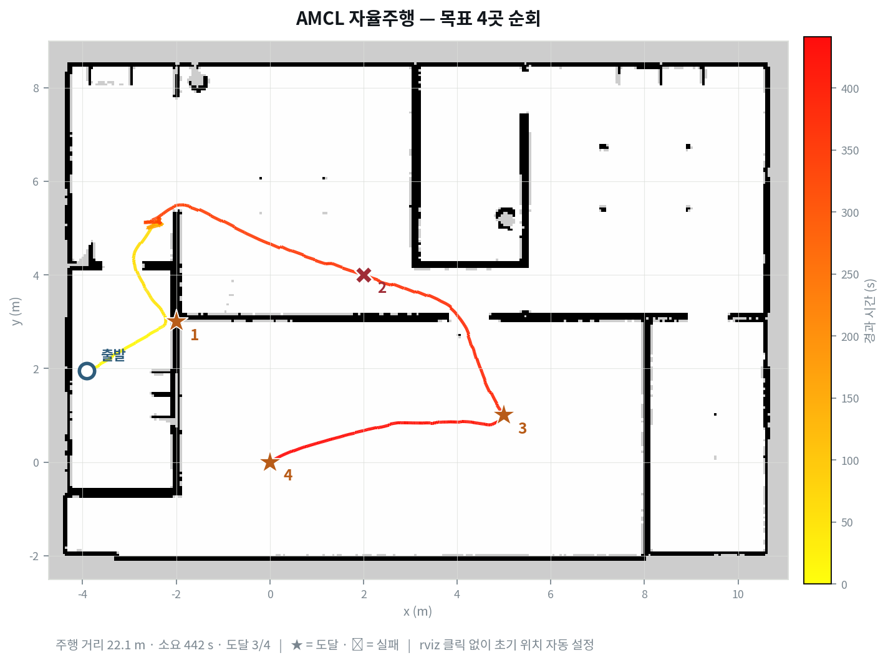

지도를 다 만들어서([[2026-08-10_회고_탐사가_벽옆만_맴돈_이유|점유 격자의 미지·자유 이분법이 만든 frontier 탐사 실패]]) 그 위를 다니는 단계로 넘어갔어요. 매핑에는 Cartographer가 지도와 위치를 함께 풀었는데, 지도가 고정되면 위치추정만 남으니 AMCL로 갈아타요. 둘 다 `map → odom` 변환을 발행해서 같이 띄우면 서로 다투거든요.

여기서 걸리는 게 하나 있어요. AMCL은 로봇이 지도 어디에 있는지 모르는 채로 시작해요. 원래는 사람이 rviz에서 [2D Pose Estimate]로 찍어 주는 절차인데, 실험을 자동으로 반복하려면 사람이 없어야 하고, 매번 같은 좌표에서 출발해야 두 설정을 비교할 수 있어요. 그래서 `/initialpose` 토픽에 자세를 발행하는 노드를 만들었어요.

검증도 붙였어요. 발행한 뒤 TF로 로봇 위치를 읽어서 준 값과 같은지 확인하는 방식이었어요. 통과했고요.

그런데 제가 준 좌표는 지도 밖이었어요.

## AMCL은 후보를 뿌리고 걸러내요

먼저 초기 위치가 왜 필요한지부터요. AMCL(Adaptive Monte Carlo Localization)은 완성된 지도 위에서 위치만 푸는 파티클 필터예요.

```
1. 로봇이 있을 만한 후보 위치를 2000개 뿌린다        ← 파티클
2. 로봇이 움직이면 후보들도 오도메트리만큼 옮긴다
3. 스캔이 오면 각 후보에게 "네가 거기면 이 스캔이 나왔겠니?"
   물어서 지도와 잘 맞는 후보에 높은 가중치를 준다
4. 가중치에 비례해 다시 뽑는다                        ← 리샘플링
```

집 안에 비슷하게 생긴 방이 여럿이면 이 구름이 두 군데로 갈라져요. 어느 쪽에 수렴할지는 운이고, 틀린 쪽에 모이면 경로가 벽을 통과해요. 대략의 시작점을 주면 그 주변에만 뿌려서 이 모호함이 사라져요.

## 발행한 값을 되읽으면 항상 통과해요

제 검증은 이랬어요.

```
1. AMCL에 초기 위치를 발행한다
2. TF로 로봇 위치를 읽는다
3. 둘이 같으면 통과
```

AMCL은 우리가 알려준 값을 그대로 TF에 실어요. 그러니 2번은 1번을 되읽는 것이고, 무엇을 넣든 3번은 참이에요. 이 검사가 증명하는 건 메시지가 전달됐다는 사실 하나뿐인데, 저는 그걸 "좌표가 맞다"로 읽고 있었어요.

실제로 틀린 값이 통과했어요. 초기 위치에 시뮬레이터의 스폰 좌표 (−3.12, −3.27)을 넣었는데, 그건 map 프레임 좌표가 아니에요.

| | 뜻 | 값 |
|---|---|---|
| 스폰 좌표 | 시뮬레이터 월드 절대 좌표 | (−3.12, −3.27) |
| AMCL 초기 위치 | map 프레임 좌표 | (0, 0) |

SLAM은 매핑을 시작한 자리를 map 원점으로 잡아요. 그래서 `map(0,0)`이 곧 매핑을 시작할 때 로봇이 서 있던 월드 좌표예요. 같은 지점인데 숫자가 다르고, 제가 넣은 값은 지도 y 범위(−2.51부터)의 바깥이었어요.

## 대상에게 묻는 검사로 바꿨어요

고친 방향은 하나예요. 우리가 준 값과 무관한 출처에 물어보는 것. 둘을 넣었어요.

첫째는 지도 검사예요. 그 좌표가 지도 범위 안이고 자유 공간인지 봐요. 이번 실수가 정확히 여기서 걸려요. 지도 밖이면 즉시 실패하면서 지도 범위를 함께 찍어 주니까, 좌표계를 섞었다는 것도 바로 보여요.

둘째는 스캔 정합이에요. 그 자세에서 라이다 끝점이 지도의 벽에 얼마나 얹히는지 세요. 위치가 맞으면 대부분의 끝점이 벽 셀에 떨어져요.

```python
lx, ly = r * cos(a), r * sin(a)              # 센서 좌표
wx = x + lx*cos(yaw) - ly*sin(yaw)           # 지도 좌표로 회전·평행이동
wy = y + lx*sin(yaw) + ly*cos(yaw)
적중률 = 벽 셀에 떨어진 끝점 / 유효 끝점
```

격자가 5cm 단위라 정확히 한 칸을 맞히기는 어려워서 이웃 한 칸까지 적중으로 봐요.

## 점수 하나만으로는 높은지 알 수 없어요

적중률 100%가 나왔어요. 그런데 이 숫자를 믿어도 되는지 판단할 근거가 없었어요. 어느 자세에서나 100%가 나오는 지표라면 아무것도 재지 않는 거니까요.

그래서 일부러 2m 어긋낸 자세의 점수를 같이 재요. 실험에서 말하는 음성 대조군이에요 — 틀린 입력을 넣어 지표가 반응하는지 보는 것.

```
스캔 정합 — 적중률 100% (357점) · 2m 어긋낸 비교값 62%
```

100과 62면 갈려요. 대조군과 비슷한 점수가 나왔다면 그 지표로는 위치를 못 가른다는 뜻이고, 판정을 신뢰하면 안 돼요. 실제로 로봇이 지도 가장자리에 있을 때는 50% 대 21%가 나왔는데, 절대값은 낮아도 간격이 유지돼서 판정은 성립했어요.

이 방식으로 다른 지표 두 개도 교정했어요. 지도 두 장을 비교하려고 만든 도구를 자기 자신과 비교해 봤더니, 벽 두께를 잰다고 만든 지표가 사실 벽의 길이를 재고 있었어요. 세로 벽을 세로로 훑으면 연속 구간의 길이가 벽 길이가 되거든요. 두께는 그 셀을 지나는 가로 구간과 세로 구간 중 짧은 쪽이에요. 지도 일치도도 자유 셀이 점유 셀의 12배라 0.5m 밀어 놔도 93.5%가 나왔어요. 벽에서 네 칸 이내로 좁히니 100%와 79.5%로 벌어졌어요.

## 확인은 실좌표로

고친 뒤 목표 네 곳을 순회시켰어요. 판정은 로그가 아니라 시뮬레이터의 실좌표를 map 프레임으로 환산해서 대조했어요.


<em><span>목표 4곳 순회 — 색이 진해질수록 나중에 지난 구간이에요. ★는 도달, ✕는 실패</span></em>

| 항목 | 오차 |
|---|---|
| 좌표로 목표 전송 | 7cm |
| 클릭 지점으로 이동 | 20cm |
| 네 곳 순회 후 최종 | 9cm |

마지막 줄이 중요해요. 네 곳을 돈 뒤에도 9cm면 위치추정이 누적 오차 없이 유지된다는 뜻이에요.

처음 순회에서는 이게 9.6m까지 벌어졌어요. 경로 기록을 뜯어보니 순간이동이 세 번 있었고 첫 점프가 정확히 (0.00, 0.00)이었어요. 목표를 보내는 데 쓴 헬퍼가 내부적으로 초기 위치를 다시 발행하고 있었는데, 그 값이 기본 생성된 빈 자세라 원점이었어요. AMCL이 이미 위치를 잡고 있어도 덮어써요. 위치추정이 끝났으면 그 단계를 건너뛰도록 고쳤어요.

## 남는 기준

세 실수가 같은 모양이에요. 순환하는 검사는 무엇을 넣어도 통과했고, 대조군 없는 점수는 높은지 낮은지 알 수 없었고, 이름이 "두께"인 지표는 길이를 재고 있었어요. **판정이 대상의 상태가 아니라 판정 도구의 상태를 반영하고 있으면, 초록불은 아무것도 보증하지 않아요.**

그래서 지표를 만들 때 두 가지를 같이 만들게 됐어요. 하나는 그 값이 우리가 넣은 것과 독립인지 확인하는 것이고, 다른 하나는 틀린 입력을 대조군으로 넣어 같은 점수가 나오는지 재 보는 것이에요. 둘 다 지표를 쓰기 전에 해야 하고, 나중에 하면 이미 그 지표로 내린 판단들을 되짚어야 해요.
