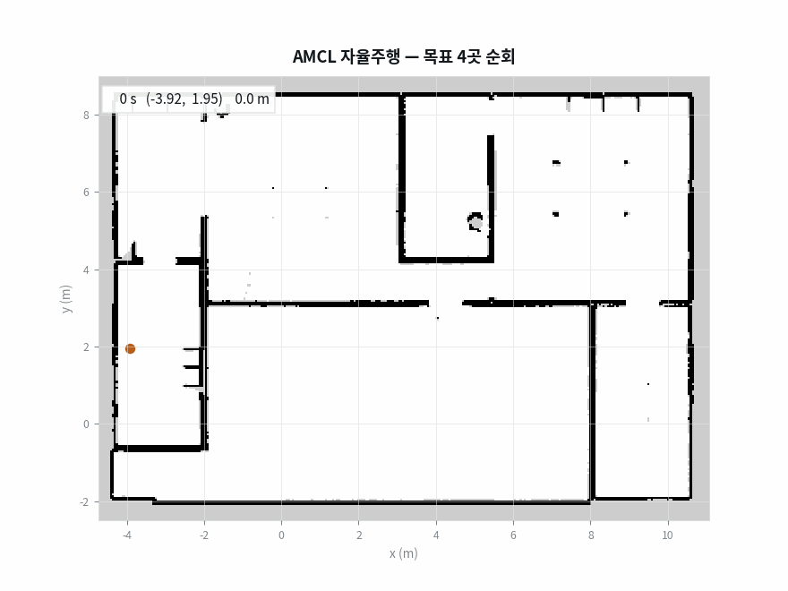

지도를 다 만들어서([[2026-08-10_회고_탐사가_벽옆만_맴돈_이유|점유 격자의 미지·자유 이분법이 만든 frontier 탐사 실패]]) 그 위를 다니는 단계로 넘어갔어요. 초기 위치를 자동으로 넣는 노드를 만들고 검증까지 붙였는데, 통과했어요.

그런데 제가 준 좌표는 **지도 밖**이었어요.

<div class="specs">
<span><b>위치추정</b>AMCL · 파티클 2000개</span>
<span><b>주행</b>Nav2</span>
<span><b>지도</b>0.05 m/셀 · Cartographer 산출</span>
<span><b>초기 위치</b><code>/initialpose</code> 발행 노드</span>
</div>

<div class="scores">
  <div class="s bad"><div class="k">통과한 좌표</div><div class="v">−3.12</div><div class="n">지도 y 범위는 −2.51부터</div></div>
  <div class="s ok"><div class="k">스캔 정합</div><div class="v">100%</div><div class="n">2 m 어긋낸 대조군은 62%</div></div>
  <div class="s ok"><div class="k">순회 후 오차</div><div class="v">9</div><div class="n">cm · 22.1 m 주행 뒤</div></div>
  <div class="s mid"><div class="k">목표 도달</div><div class="v">3 / 4</div><div class="n">실패 하나는 벽 안쪽 좌표</div></div>
  <div class="s bad"><div class="k">첫 순회 오차</div><div class="v">9.6</div><div class="n">m · 원점 순간이동 3회</div></div>
</div>

## 매핑이 끝나면 위치추정만 남아요

매핑에는 Cartographer가 지도와 위치를 함께 풀었는데, 지도가 고정되면 위치추정만 남으니 AMCL로 갈아타요. **둘 다 `map → odom` 변환을 발행해서 같이 띄우면 서로 다퉈요.** 하나는 내려야 해요.

AMCL(Adaptive Monte Carlo Localization)은 완성된 지도 위에서 위치만 푸는 파티클 필터예요. 매 주기에 이 넷을 돌아요.

```text
1. 로봇이 있을 만한 후보 위치를 2000개 뿌린다        <- 파티클
2. 로봇이 움직이면 후보들도 오도메트리만큼 옮긴다      <- 예측(모션 모델)
3. 스캔이 오면 각 후보에게 "네가 거기면 이 스캔이 나왔겠니?"
   물어서 지도와 잘 맞는 후보에 높은 가중치를 준다     <- 갱신(관측 모델)
4. 가중치에 비례해 다시 뽑는다                        <- 리샘플링
```

집 안에 비슷하게 생긴 방이 여럿이면 이 구름이 두 군데로 갈라져요. 어느 쪽에 수렴할지는 운이고, 틀린 쪽에 모이면 경로가 벽을 통과해요. 대략의 시작점을 주면 그 주변에만 뿌려서 이 모호함이 사라져요.

원래는 사람이 rviz에서 [2D Pose Estimate]로 찍어 주는 절차인데, 실험을 자동으로 반복하려면 사람이 없어야 하고 매번 같은 좌표에서 출발해야 두 설정을 비교할 수 있어요. 그래서 `/initialpose` 토픽에 자세를 발행하는 노드를 만들었어요.

## 세 개의 관문

<div class="gate crit"><div class="idx">1</div><div class="body">
<h4>검증이 통과했는데 좌표가 지도 밖</h4>
<div class="row"><span class="lab">검사</span><span class="val">초기 위치를 발행 → TF로 로봇 위치를 읽음 → 둘이 같으면 통과</span></div>
<div class="row"><span class="lab">원인</span><span class="val">AMCL은 준 값을 <b>그대로 TF에 실어요.</b> 2번은 1번을 되읽는 것이라 무엇을 넣든 참이에요</span></div>
<div class="row"><span class="lab">조치</span><span class="val">준 값과 <b>무관한 출처</b>에 묻는 검사 둘로 교체 — 지도 범위·자유 공간 확인, 스캔 정합</span></div>
</div></div>

<div class="gate crit"><div class="idx">2</div><div class="body">
<h4>적중률 100%가 높은 점수인지 알 수 없음</h4>
<div class="row"><span class="lab">문제</span><span class="val">어느 자세에서나 100%가 나오는 지표라면 아무것도 재지 않는 거예요</span></div>
<div class="row"><span class="lab">조치</span><span class="val">일부러 2 m 어긋낸 자세의 점수를 같이 재는 <b>음성 대조군</b>. 100% 대 62%로 갈렸어요</span></div>
<div class="row"><span class="lab">확장</span><span class="val">같은 방식으로 벽 두께·지도 일치도 지표 둘을 교정했어요</span></div>
</div></div>

<div class="gate"><div class="idx">3</div><div class="body">
<h4>순회 중 로봇이 원점으로 순간이동</h4>
<div class="row"><span class="lab">증상</span><span class="val">첫 순회에서 최종 오차가 <b>9.6 m</b>. 경로 기록에 점프 3회, 첫 점프가 정확히 (0.00, 0.00)</span></div>
<div class="row"><span class="lab">원인</span><span class="val">목표 전송 헬퍼가 내부적으로 초기 위치를 다시 발행. 그 값이 기본 생성된 빈 자세라 원점이었고, <b>AMCL이 이미 수렴했어도 덮어써요</b></span></div>
<div class="row"><span class="lab">조치</span><span class="val">위치추정이 끝났으면 그 단계를 건너뛰게 수정</span></div>
</div></div>

## 발행한 값을 되읽으면 항상 통과해요

이 검사가 증명하는 건 **메시지가 전달됐다는 사실 하나**뿐인데, 저는 그걸 "좌표가 맞다"로 읽고 있었어요.

실제로 틀린 값이 통과했어요. 초기 위치에 시뮬레이터의 스폰 좌표 (−3.12, −3.27)을 넣었는데, 그건 map 프레임 좌표가 아니에요.

| 무엇 | 뜻 | 값 |
|---|---|---|
| 스폰 좌표 | 시뮬레이터 월드 절대 좌표 | (−3.12, −3.27) |
| AMCL 초기 위치 | map 프레임 좌표 | (0, 0) |

SLAM은 **매핑을 시작한 자리를 map 원점으로 잡아요.** 그래서 `map(0,0)`이 곧 매핑을 시작할 때 로봇이 서 있던 월드 좌표예요. 같은 지점인데 숫자가 다르고, 제가 넣은 값은 지도 y 범위(−2.51부터)의 바깥이었어요.

## 대상에게 묻는 검사로 바꿨어요

고친 방향은 하나예요. 우리가 준 값과 무관한 출처에 물어보는 것.

**첫째는 지도 검사예요.** 그 좌표가 지도 범위 안이고 자유 공간인지 봐요. 이번 실수가 정확히 여기서 걸려요. 지도 밖이면 즉시 실패하면서 지도 범위를 함께 찍어 주니까 좌표계를 섞었다는 것도 바로 보여요.

**둘째는 스캔 정합이에요.** 그 자세에서 라이다 끝점이 지도의 벽에 얼마나 얹히는지 세요. 위치가 맞으면 대부분의 끝점이 벽 셀에 떨어져요.

```python
lx, ly = r * cos(a), r * sin(a)              # 센서 좌표
wx = x + lx*cos(yaw) - ly*sin(yaw)           # 지도 좌표로 회전·평행이동
wy = y + lx*sin(yaw) + ly*cos(yaw)
적중률 = 벽 셀에 떨어진 끝점 / 유효 끝점
```

격자가 5센티미터 단위라 정확히 한 칸을 맞히기는 어려워서 이웃 한 칸까지 적중으로 봐요.

## 점수 하나만으로는 높은지 알 수 없어요

적중률 100%가 나왔어요. 그런데 이 숫자를 믿어도 되는지 판단할 근거가 없었어요. 그래서 일부러 어긋낸 자세의 점수를 같이 재요. 실험에서 말하는 **음성 대조군**이에요. 틀린 입력을 넣어 지표가 반응하는지 보는 것이죠.

| 지표 | 정상 자세 | 어긋낸 대조군 | 판정 |
|---|---:|---:|---|
| 스캔 정합 (중앙) | 100% (357점) | 62% (2 m 이동) | <span class="tag ok">가름</span> |
| 스캔 정합 (지도 가장자리) | 50% | 21% | <span class="tag ok">가름</span> |
| 지도 일치도 (전체 셀) | 93.5% | 93.5% (0.5 m 이동) | <span class="tag no">못 가름</span> |
| 지도 일치도 (벽에서 4칸 이내) | 100% | 79.5% | <span class="tag ok">가름</span> |

가장자리에서는 절대값이 낮아도 **간격이 유지돼서** 판정은 성립했어요. 대조군과 비슷한 점수가 나왔다면 그 지표로는 위치를 못 가른다는 뜻이고, 판정을 신뢰하면 안 돼요.

<div class="note bad">
<div class="h">이름이 재는 것과 실제로 재는 것</div>
지도 두 장을 비교하려고 만든 도구를 자기 자신과 비교해 봤더니, <b>벽 두께를 잰다고 만든 지표가 사실 벽의 길이를 재고 있었어요.</b> 세로 벽을 세로로 훑으면 연속 구간의 길이가 벽 길이가 되거든요. 두께는 그 셀을 지나는 가로 구간과 세로 구간 중 <b>짧은 쪽</b>이에요. 지도 일치도도 자유 셀이 점유 셀의 12배라 0.5 m 밀어 놔도 93.5%가 나왔고요.
</div>

## 확인은 실좌표로

고친 뒤 목표 네 곳을 순회시켰어요. 판정은 로그가 아니라 **시뮬레이터의 실좌표를 map 프레임으로 환산해서** 대조했어요.

<figure class="fig"><figcaption>목표 4곳 순회 — 색이 진해질수록 나중에 지난 구간이에요. ★는 도달, ✕는 실패.</figcaption></figure>

주행 거리 22.1미터에 442초가 걸렸고 네 곳 중 세 곳에 도달했어요. 실패한 2번 목표는 벽 안쪽 좌표라 계획 자체가 서지 않는 자리였어요.

<figure class="fig"><figcaption>같은 주행의 재생이에요. 초기 위치를 좌표로 넣고 시작해 rviz 클릭 없이 순회해요.</figcaption></figure>

| 항목 | 오차 |
|---|---:|
| 좌표로 목표 전송 | 7 cm |
| 클릭 지점으로 이동 | 20 cm |
| **네 곳 순회 후 최종** | **9 cm** |

마지막 줄이 중요해요. 네 곳을 돈 뒤에도 9센티미터면 **위치추정이 누적 오차 없이 유지된다**는 뜻이에요. 파티클 필터가 매 스캔마다 지도에 다시 맞추니까, 오도메트리처럼 시간에 비례해 벌어지지 않아요.

## 남는 기준

세 실수가 같은 모양이에요. 순환하는 검사는 무엇을 넣어도 통과했고, 대조군 없는 점수는 높은지 낮은지 알 수 없었고, 이름이 "두께"인 지표는 길이를 재고 있었어요. **판정이 대상의 상태가 아니라 판정 도구의 상태를 반영하고 있으면, 초록불은 아무것도 보증하지 않아요.**

그래서 지표를 만들 때 두 가지를 같이 만들게 됐어요. 하나는 그 값이 우리가 넣은 것과 독립인지 확인하는 것이고, 다른 하나는 틀린 입력을 대조군으로 넣어 같은 점수가 나오는지 재 보는 것이에요. 둘 다 지표를 쓰기 전에 해야 하고, 나중에 하면 이미 그 지표로 내린 판단들을 되짚어야 해요.
