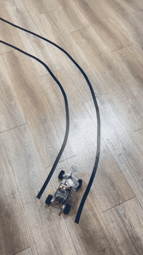

라즈베리파이 기반 RC카에 차선 추종 모델을 올려 S자 트랙을 돌렸어요. 첫 회전은 통과하는데 두 번째 회전에서 반복해서 이탈했어요. 차선 검출 마스크는 테이프 위에 정확히 얹혀 있었고, 주행 속도를 12%까지 낮춰도, 조향 명령 40도와 150도에 바퀴가 끝까지 꺾이는 것을 확인해도 증상이 같았어요.

검출도 되고 조향도 되는데 코스를 못 도는 상태였어요. **원인은 모델의 출력 분포에 있었어요.**

<div class="specs">
<span><b>과제</b>Behavior Cloning · 조향각 회귀</span>
<span><b>구조</b>PilotNet 계열 CNN</span>
<span><b>손실</b>MSE</span>
<span><b>표본</b>채점 1,162장 · 40~150도</span>
<span><b>기체</b>라즈베리파이 RC카</span>
</div>

<div class="scores">
  <div class="s mid"><div class="k">전체 평균 오차</div><div class="v">10.86</div><div class="n">도 · 상수 모델은 14.08</div></div>
  <div class="s bad"><div class="k">급우 구간 오차</div><div class="v">39.4</div><div class="n">도 · 110장에서만</div></div>
  <div class="s bad"><div class="k">예측 표준편차</div><div class="v">12.69</div><div class="n">정답 라벨은 19.14</div></div>
  <div class="s bad"><div class="k">직진 쏠림</div><div class="v">71%</div><div class="n">75~105도 구간</div></div>
  <div class="s ok"><div class="k">가중 샘플링 후</div><div class="v">16.17</div><div class="n">표준편차 · S자 완주</div></div>
</div>

## 평균 오차는 소수 구간의 실패를 감춰요

학습된 모델의 평균 절대 오차는 10.86도예요. 조향각을 항상 90도(직진)로만 출력하는 **상수 베이스라인**이 14.08도이니 학습이 무의미하지는 않다는 뜻이에요. 이 숫자만 보면 문제를 찾을 수 없어요.

각도 구간을 나눠 채점하니 다른 그림이 나왔어요.

| 구간 | 장수 | 정답 평균 | 예측 평균 | 부족분 | 판정 |
|---|---:|---:|---:|---:|---|
| 40~60도 (급좌) | 12 | 49.25도 | 75.6도 | 26.3도 | <span class="tag mid">표본 부족</span> |
| 85~95도 (직진) | 287 | 89.56도 | 93.1도 | 3.5도 | <span class="tag ok">정확</span> |
| 120~151도 (급우) | 110 | 138.18도 | 98.8도 | **39.4도** | <span class="tag no">못 꺾음</span> |

더 확실한 증거는 예측 분포 자체예요. 정답 라벨의 표준편차가 19.14도인데 모델 예측은 12.69도였고, 예측 범위는 60~134도에 갇혀 있었어요. **트랙이 요구하는 40도와 150도를 출력한 적이 아예 없어요.**

<div class="chart">
<div class="t">예측이 중앙으로 수축한 모양</div>
<div class="sub">위는 출력 범위, 아래는 구간별 평균이에요. 급우 구간에서 예측이 정답보다 39도 안쪽에 머물러요.</div>
<svg viewBox="0 0 880 366" width="100%" style="max-width:880px" role="img" aria-label="예측 조향각 범위와 구간별 평균 — 모델 예측이 중앙으로 수축했다가 가중 샘플링 뒤 넓어진다"><line x1="223.0" y1="30" x2="223.0" y2="286" stroke="var(--lightgray)"/><text x="223.0" y="304" text-anchor="middle" font-size="10.5" font-family="ui-monospace,monospace" fill="var(--gray)">40</text><line x1="328.0" y1="30" x2="328.0" y2="286" stroke="var(--lightgray)"/><text x="328.0" y="304" text-anchor="middle" font-size="10.5" font-family="ui-monospace,monospace" fill="var(--gray)">60</text><line x1="433.0" y1="30" x2="433.0" y2="286" stroke="var(--lightgray)"/><text x="433.0" y="304" text-anchor="middle" font-size="10.5" font-family="ui-monospace,monospace" fill="var(--gray)">80</text><line x1="538.0" y1="30" x2="538.0" y2="286" stroke="var(--lightgray)"/><text x="538.0" y="304" text-anchor="middle" font-size="10.5" font-family="ui-monospace,monospace" fill="var(--gray)">100</text><line x1="643.0" y1="30" x2="643.0" y2="286" stroke="var(--lightgray)"/><text x="643.0" y="304" text-anchor="middle" font-size="10.5" font-family="ui-monospace,monospace" fill="var(--gray)">120</text><line x1="748.0" y1="30" x2="748.0" y2="286" stroke="var(--lightgray)"/><text x="748.0" y="304" text-anchor="middle" font-size="10.5" font-family="ui-monospace,monospace" fill="var(--gray)">140</text><text x="496" y="322" text-anchor="middle" font-size="11.5" fill="var(--darkgray)">조향각 (도) — 90이 직진</text><text x="144" y="40" text-anchor="end" font-size="11" fill="var(--gray)">출력 범위</text><text x="144" y="60" text-anchor="end" font-size="11.5" fill="var(--darkgray)">정답 라벨</text><line x1="223.0" y1="56" x2="800.5" y2="56" stroke="var(--gray)" stroke-width="9" opacity="0.55" stroke-linecap="butt"/><text x="217.0" y="60" text-anchor="end" font-size="10" font-family="ui-monospace,monospace" fill="var(--gray)">40</text><text x="806.5" y="60" font-size="10" font-family="ui-monospace,monospace" fill="var(--gray)">150</text><text x="144" y="86" text-anchor="end" font-size="11.5" fill="var(--darkgray)">적용 전</text><line x1="328.0" y1="82" x2="716.5" y2="82" stroke="var(--sv-bad)" stroke-width="9" opacity="0.55" stroke-linecap="butt"/><text x="322.0" y="86" text-anchor="end" font-size="10" font-family="ui-monospace,monospace" fill="var(--gray)">60</text><text x="722.5" y="86" font-size="10" font-family="ui-monospace,monospace" fill="var(--gray)">134</text><text x="144" y="112" text-anchor="end" font-size="11.5" fill="var(--darkgray)">적용 후</text><line x1="181.0" y1="108" x2="758.5" y2="108" stroke="var(--sv-ok)" stroke-width="9" opacity="0.55" stroke-linecap="butt"/><text x="175.0" y="112" text-anchor="end" font-size="10" font-family="ui-monospace,monospace" fill="var(--gray)">32</text><text x="764.5" y="112" font-size="10" font-family="ui-monospace,monospace" fill="var(--gray)">142</text><line x1="10" y1="142" x2="832" y2="142" stroke="var(--lightgray)"/><text x="144" y="164" text-anchor="end" font-size="11" fill="var(--gray)">구간별 평균</text><text x="144" y="184" text-anchor="end" font-size="11.5" fill="var(--darkgray)">급좌 40~60도</text><text x="144" y="198" text-anchor="end" font-size="9.5" font-family="ui-monospace,monospace" fill="var(--gray)">12장</text><line x1="271.6" y1="182" x2="409.9" y2="182" stroke="var(--sv-bad)" stroke-width="2" stroke-dasharray="3 3" opacity="0.6"/><circle cx="271.6" cy="182" r="5.5" fill="var(--gray)"/><circle cx="409.9" cy="182" r="5.5" fill="var(--sv-bad)"/><text x="340.7" y="171" text-anchor="middle" font-size="10" font-family="ui-monospace,monospace" fill="var(--sv-bad)">26.3도 차</text><text x="144" y="218" text-anchor="end" font-size="11.5" fill="var(--darkgray)">직진 85~95도</text><text x="144" y="232" text-anchor="end" font-size="9.5" font-family="ui-monospace,monospace" fill="var(--gray)">287장</text><line x1="483.2" y1="216" x2="501.8" y2="216" stroke="var(--sv-bad)" stroke-width="2" stroke-dasharray="3 3" opacity="0.6"/><circle cx="483.2" cy="216" r="5.5" fill="var(--gray)"/><circle cx="501.8" cy="216" r="5.5" fill="var(--sv-bad)"/><text x="492.5" y="205" text-anchor="middle" font-size="10" font-family="ui-monospace,monospace" fill="var(--sv-bad)">3.5도 차</text><text x="144" y="252" text-anchor="end" font-size="11.5" fill="var(--darkgray)">급우 120~151도</text><text x="144" y="266" text-anchor="end" font-size="9.5" font-family="ui-monospace,monospace" fill="var(--gray)">110장</text><line x1="531.7" y1="250" x2="738.4" y2="250" stroke="var(--sv-bad)" stroke-width="2" stroke-dasharray="3 3" opacity="0.6"/><circle cx="738.4" cy="250" r="5.5" fill="var(--gray)"/><circle cx="531.7" cy="250" r="5.5" fill="var(--sv-bad)"/><circle cx="574.8" cy="250" r="5.5" fill="var(--sv-ok)"/><text x="635.1" y="239" text-anchor="middle" font-size="10" font-family="ui-monospace,monospace" fill="var(--sv-bad)">39.4도 차</text><circle cx="166" cy="352" r="5" fill="var(--gray)"/><text x="178" y="356" font-size="11" fill="var(--darkgray)">정답 평균</text><circle cx="334" cy="352" r="5" fill="var(--sv-bad)"/><text x="346" y="356" font-size="11" fill="var(--darkgray)">적용 전 예측</text><circle cx="502" cy="352" r="5" fill="var(--sv-ok)"/><text x="514" y="356" font-size="11" fill="var(--darkgray)">적용 후 예측</text></svg>
</div>

전체 평균이 이 실패를 감춘 이유는 표본 수예요. 급커브 122장이 30도 넘게 틀려도 직진 근처 800여 장이 정확하면 전체 평균은 크게 움직이지 않아요. 급좌 구간은 12장뿐이라 이 구간만으로는 판단을 세울 수 없지만, 방향은 같아요.

## 회귀 손실이 소수 구간을 평균으로 뭉개요

원인은 데이터의 각도 분포예요. 채점에 쓴 1,162장 가운데 51%가 80~100도, 즉 직진에서 10도 안쪽에 들어 있고 75~105도로 넓히면 71%예요. 트랙을 도는 시간의 대부분이 직진이므로 자연스러운 분포예요.

이 분포에 평균제곱오차(MSE)를 쓰면 모델에 특정한 압력이 걸려요. 개별 표본의 가중치는 1/N로 모두 같지만, **한 구간이 손실 전체에서 차지하는 몫은 그 구간의 표본 개수에 비례해요.** 소수인 급커브를 정확히 맞히려 애쓰는 것보다, 다수인 직진에 맞춰두고 급커브는 평균값 근처로 뭉개는 편이 전체 손실이 작아요.

조건부 평균을 추정하는 것이 제곱 손실의 최적해라는 성질이 여기서 불리하게 작동해요. 데이터가 직진에 몰려 있으면 모델이 학습하는 조건부 평균 자체가 90도 쪽으로 당겨져요. 결과적으로 중앙만 출력하는 모델로 수렴해요.

<div class="note warn">
<div class="h">파라미터 튜닝과 결이 달라요</div>
[[2026-07-29_회고_앞을_얼마나_멀리_볼까요|Pure Pursuit 전방 주시 거리의 U자 최적점과 이탈 오차 72% 감소]]에서 다룬 전방 주시 거리는 파라미터를 조정해 이탈 오차를 줄이는 문제였어요. 이번은 <b>학습 목표 자체가 급커브를 포기하는 방향으로 정렬</b>돼 있어서, 검출이나 제어 쪽을 아무리 만져도 바뀌지 않았어요.
</div>

## 예측 표준편차가 조기 신호예요

예측이 중앙으로 수축하는 이 현상은 구간별 표를 그리기 전에도 한 숫자로 잡아낼 수 있어요. 예측 분포의 표준편차를 정답 라벨의 표준편차와 비교하면 돼요.

| 정답 std | 예측 std | 비 | 상태 |
|---:|---:|---:|---|
| 19.1 | 12.7 | 0.66 | <span class="tag no">조향 범위를 못 냄</span> |
| 19.1 | 16.2 | 0.85 | <span class="tag ok">정상</span> |
| 19.1 | 1.92 | 0.10 | <span class="tag no">학습 붕괴</span> |

예측이 정답의 3분의 2 아래로 좁아지면 모델이 평균값으로 수축하는 중이에요. **검증 손실은 이때도 개선되는 것처럼 보이므로 손실 곡선만으로는 알아채기 어려워요.** 마지막 줄은 데이터를 1,200장 아래로 줄여 시드만 바꿔 세 번 학습했을 때 나온 건데, 예측이 86~97도 안에서만 움직였어요. 정답이 40~150도인데 11도 폭으로 대답한 셈이라 어떤 커브도 돌 수 없어요.

베이스라인 비교도 함께 봐요. 이 모델은 직진 구간(85~95도)에서 상수 베이스라인보다 5.71도 **나빴어요.** 표본의 4분의 1이 이 구간에 있으니 전체 평균에서 그만큼을 잃고 시작하는 셈이에요. 그런데도 전체가 베이스라인보다 나은 것은 급커브에서 크게 벌기 때문이고, 뒤집어 말하면 급커브 개선이 사라지는 순간 학습 전체가 상수 모델과 다를 바 없어져요.

## 역빈도 가중 샘플링으로 압력을 상쇄해요

분포가 원인이므로 배치를 뽑는 단계에서 보정했어요. 각도를 10도 폭 구간으로 나눠 개수를 세고, 개수가 적은 구간이 자주 뽑히도록 표본별 가중치를 줬어요.

```python
counts = np.bincount(구간_인덱스, minlength=구간_수).astype(float)
w = (1.0 / np.maximum(counts[구간_인덱스], 1.0)) ** 0.7
sampler = WeightedRandomSampler(w, num_samples=len(학습_표본), replacement=True)
```

지수 0.7은 보정 강도예요. 1.0이면 모든 구간이 같은 빈도로 뽑히는 완전 균등이고, 0이면 보정이 없어요. 같은 데이터와 같은 구조로 학습해 같은 표본으로 채점했어요.

| 지표 | 적용 전 | 적용 후 (0.7) | 과보정 (1.0) |
|---|---:|---:|---:|
| 급우 오차 | 39.41도 | **31.16도** | 47.75도 |
| 급우 예측 평균 | 98.8도 | 107.0도 | — |
| 예측 표준편차 | 12.69 | **16.17** | 12.10 |
| 예측 범위 | 60~134도 | **32~142도** | — |
| 전체 평균 오차 | 10.86도 | 11.09도 | 13.55도 |

예측 분포가 정답의 19.14도에 가까워지고 범위가 실제 조향 범위를 덮게 됐어요. 전체 평균 오차는 오히려 0.23도 나빠졌는데, **직진 구간의 정밀도를 급커브와 맞바꾼 결과**예요. 채점으로는 조금 나빠졌지만 코스를 벗어나게 만드는 것은 급커브 쪽이라 교환이 이득이었어요.

<figure class="fig"><figcaption>가중 샘플링을 적용한 모델의 주행이에요. 두 번째 굽이가 그동안 이탈하던 구간인데, 예측 범위가 60~134도에 갇혀 있던 모델은 여기서 필요한 만큼 꺾지 못하고 바깥으로 밀려났어요. <span class="cap-src">(출처: 직접 촬영)</span></figcaption></figure>

<div class="note bad">
<div class="h">강도를 1.0으로 올리면 과보정이에요</div>
급우 오차가 47.75도로 되돌아가는데, 상수 베이스라인의 48.18도와 사실상 같은 값이에요. 소수 구간을 과대 대표시키면 배치가 급커브로 채워지면서 직진의 정밀도를 잃는데, <b>급커브 표본 자체가 122장뿐이라 같은 프레임을 반복해 뽑게 되고</b> 그 구간도 일반화되지 않아요. 전체 오차 13.55도로 베이스라인 14.08도를 0.53도밖에 못 앞선 게 그 결과예요. 0.7 부근이 두 구간이 함께 개선되는 지점이었어요.
</div>

## 데이터를 늘리는 것으로는 해결되지 않았어요

균형 샘플링에 닿기 전에 먼저 해본 것은 수집이었어요. 900장을 추가로 모아 재학습했는데 결과가 같았어요. **새로 모은 데이터도 같은 트랙을 같은 방식으로 돈 것이라 각도 분포가 그대로였기 때문이에요.** 분포가 원인인 문제에서는 같은 분포의 표본을 늘려도 압력이 그대로예요.

수집을 늘릴 거라면 부족한 구간만 늘려야 해요. 급커브 구간만 왕복하며 프레임을 모으거나, 트랙을 역방향으로 돌아 좌우 균형을 맞추는 식이에요. 급좌 구간이 12장에 그친 것도 트랙을 한 방향으로만 돈 결과예요. 다만 그 전에 손실 쪽 보정으로 얼마나 회수되는지 먼저 보는 편이 비용이 적어요.

조향 회귀뿐 아니라 라벨이 연속값이고 그 분포가 한쪽에 몰리는 회귀 문제 전반에 같은 구조가 있어요. 평균 지표 하나로 판단하지 않고 구간별로 쪼개 보는 것, 그리고 예측 분포의 폭을 정답과 나란히 확인하는 것이 이 실패를 조기에 잡는 방법이에요.
