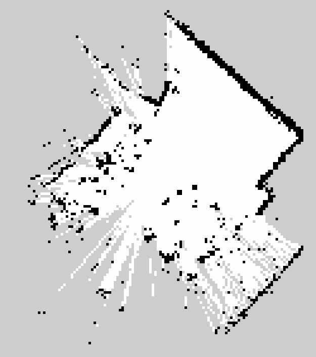
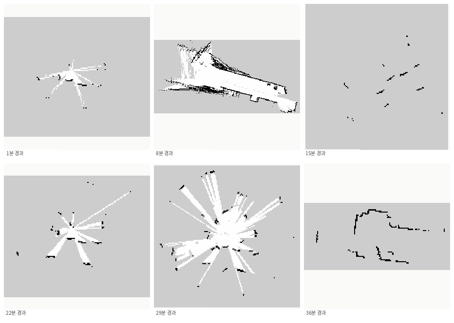
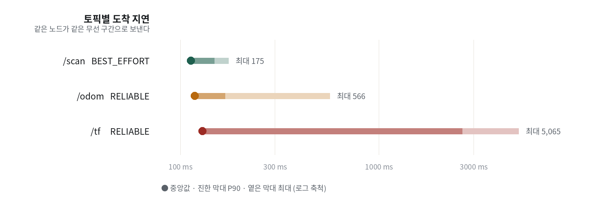
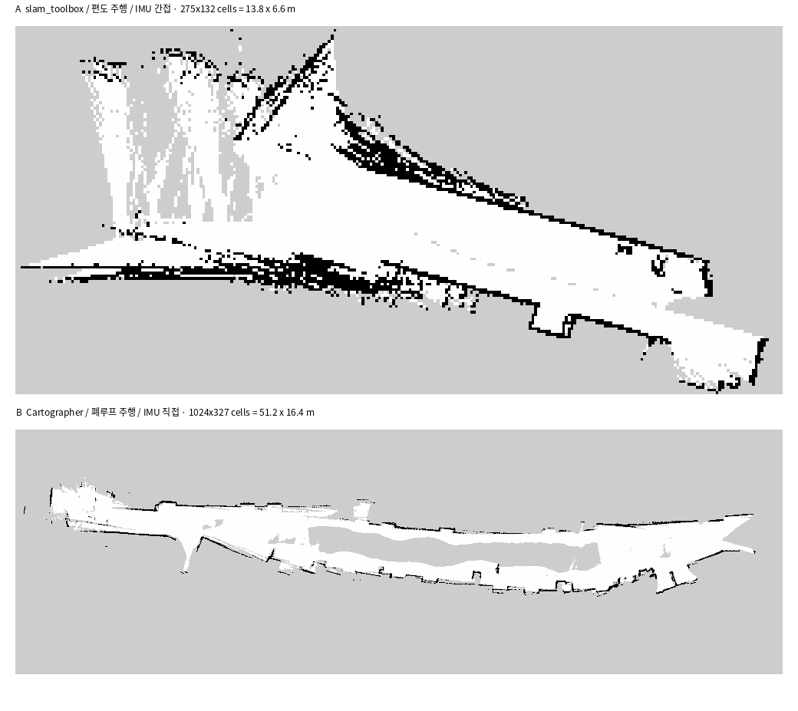

TurtleBot3 Burger로 50미터 복도를 매핑했어요. 지도는 매번 부채꼴로 벌어지거나 점 구름으로 뭉갰어요. 원인은 하나가 아니었고, 눈에 보이는 증상은 전부 진짜 원인의 두세 단계 뒤에 있었어요.

<div class="scores">
  <div class="s ok"><div class="k">최종 지도</div><div class="v">51.2×16.4</div><div class="n">m · 복도 전 구간</div></div>
  <div class="s bad"><div class="k">유효 빔</div><div class="v">38%</div><div class="n">복도에서 62%가 허공</div></div>
  <div class="s bad"><div class="k">TF 지연 P90</div><div class="v">2.6 s</div><div class="n">스캔은 148 ms</div></div>
  <div class="s mid"><div class="k">yaw 드리프트</div><div class="v">0.3~0.9</div><div class="n">°/분 · 정지 상태에서도</div></div>
  <div class="s ok"><div class="k">라이다 정체</div><div class="v">893</div><div class="n">프레임 시그니처 일치</div></div>
</div>

## 구성

로봇의 온보드 컴퓨터는 Jetson Nano예요. JetPack 4.6에 묶여 Ubuntu 18.04를 벗어날 수 없고, ROS 2 Humble은 22.04를 전제로 만들어졌어요. 그래서 ROS가 Docker 컨테이너로 올라가 있고 호스트에는 `/opt/ros`가 아예 없어요.

노트북은 Ubuntu 24.04에 Jazzy예요. Jazzy와 Humble은 통신하지 못하니 노트북에도 Humble 컨테이너를 띄워 배포판을 맞췄어요. 로봇은 드라이버만, 노트북이 SLAM과 RViz를 맡는 구성이에요.

```text
로봇 · Jetson Nano (Ubuntu 18.04)          노트북 · Ubuntu 24.04
┌────────────────────────────────┐        ┌──────────────────────┐
│ OpenCR ──/dev/ttyACM0──┐       │        │ Docker: ROS 2 Humble │
│ LDS-01 ──/dev/ttyUSB0──┤       │  무선  │                      │
│                        ▼       │ ─────► │   Cartographer       │
│  Docker: ROS 2 Humble          │  /scan │   RViz2              │
│   robot_state_publisher        │  /odom │   Nav2               │
│   turtlebot3_node              │  /tf   │                      │
│   hls_lfcd_lds_driver          │ ◄───── │                      │
└────────────────────────────────┘ /cmd_vel└─────────────────────┘
```

<div class="note warn">
<div class="h">여기서 첫 함정</div>
두 기기 모두 Docker가 깔려 있어 양쪽 다 <code>docker0 = 172.17.0.1</code>을 가져요. DDS는 디스커버리 때 자기 인터페이스를 전부 광고하니, 상대가 그 주소를 고르면 패킷이 자기 자신의 docker0으로 가서 사라져요. 토픽 목록은 멀쩡히 보이는데 데이터만 안 오는 증상이 돼요.
</div>

## 아홉 개의 관문

각 관문은 앞의 것을 풀어야 다음이 보이는 구조였어요. 순서가 곧 정보예요.

<div class="gate"><div class="idx">1</div><div class="body">
<h4>노트북에서 로봇이 아예 안 보임</h4>
<div class="row"><span class="lab">증상</span><span class="val"><code>ros2 topic list</code>에 <code>/rosout</code>만</span></div>
<div class="row"><span class="lab">원인</span><span class="val"><code>ROS_AUTOMATIC_DISCOVERY_RANGE=LOCALHOST</code> — Jazzy에서 이 값은 DDS 탐색이 기기 밖으로 나가지 않는다는 뜻</span></div>
<div class="row"><span class="lab">조치</span><span class="val"><code>SUBNET</code> 전환 + <code>ROS_DOMAIN_ID</code> 일치</span></div>
</div></div>

<div class="gate"><div class="idx">2</div><div class="body">
<h4>SSH가 먹통인데 커서는 깜빡임</h4>
<div class="row"><span class="lab">근거</span><span class="val"><code>ip neigh</code>가 <code>FAILED</code>. ARP는 L2라서 IP나 방화벽 문제가 아니라 기기가 응답하지 않는다는 뜻이에요</span></div>
<div class="row"><span class="lab">원인</span><span class="val">TCP 소켓만 남은 좀비 세션. keepalive 만료 전까지 <code>ESTAB</code>으로 보여요</span></div>
</div></div>

<div class="gate crit"><div class="idx">3</div><div class="body">
<h4>토픽은 보이는데 데이터가 한 건도 안 옴</h4>
<div class="row"><span class="lab">기각</span><span class="val">배포판 불일치(Humble로 맞춰도 동일) · QoS(발행자가 RELIABLE) · 방화벽(허용 후 무변화) · 디스커버리 캐시(<code>--no-daemon</code>으로도 보임)</span></div>
<div class="row"><span class="lab">원인</span><span class="val">양쪽 <code>docker0</code> 주소 충돌. 멀티캐스트 디스커버리는 무선으로 나가 성공하고 유니캐스트 데이터만 사라져요</span></div>
<div class="row"><span class="lab">조치</span><span class="val">FastDDS <code>interfaceWhiteList</code>로 무선 인터페이스 고정 → <code>/scan</code> 9.99 Hz 즉시 수신</span></div>
</div></div>

<div class="gate crit"><div class="idx">4</div><div class="body">
<h4><code>base_scan</code> 프레임이 존재하지 않음</h4>
<div class="row"><span class="lab">근거</span><span class="val"><code>/tf_static</code>을 열어보니 프레임 이름이 <code>${namespace}base_scan</code> — 자리표시자가 문자열 그대로 박혀 있었어요</span></div>
<div class="row"><span class="lab">원인</span><span class="val">URDF의 다중로봇용 토큰을 치환하지 않고 <code>robot_state_publisher</code>에 넘김</span></div>
</div></div>

<div class="gate crit"><div class="idx">5</div><div class="body">
<h4>라이다가 어떤 드라이버로도 안 붙음</h4>
<div class="row"><span class="lab">시도</span><span class="val">RPLIDAR C1(460800 → 타임아웃) · LDROBOT LD14/LD14P(115200·230400 → <code>communication is abnormal</code>)</span></div>
<div class="row"><span class="lab">전환</span><span class="val">라벨과 상자를 믿는 대신 포트에서 원시 바이트를 직접 읽었어요</span></div>
</div></div>

<div class="gate"><div class="idx">6</div><div class="body">
<h4>드라이버 빌드 실패</h4>
<div class="row"><span class="lab">증상</span><span class="val"><code>Could NOT find Boost (missing: system)</code></span></div>
<div class="row"><span class="lab">함정</span><span class="val"><code>apt-get update &amp;&amp; apt-get install</code>이 ROS 저장소 GPG 키 만료로 앞에서 멈춰 설치가 아예 실행되지 않았어요</span></div>
</div></div>

<div class="gate"><div class="idx">7</div><div class="body">
<h4>명령은 가는데 로봇이 안 움직임</h4>
<div class="row"><span class="lab">근거</span><span class="val"><code>/cmd_vel</code> 10 Hz 발행 중 · <code>/sensor_state</code>의 <code>torque: false</code></span></div>
<div class="row"><span class="lab">조치</span><span class="val"><code>/motor_power</code> 서비스로 토크 활성화</span></div>
</div></div>

<div class="gate crit"><div class="idx">8</div><div class="body">
<h4>라이다가 90도 돌아간 채 장착됨</h4>
<div class="row"><span class="lab">증상</span><span class="val">주행 방향과 RViz의 로봇 방향이 90도 어긋나 로봇이 옆으로 게걸음</span></div>
<div class="row"><span class="lab">영향</span><span class="val">전진하는데 지도상 벽은 옆으로 흘러요. 오도메트리와 스캔이 매 순간 충돌해 정합이 성립할 수 없어요</span></div>
<div class="row"><span class="lab">조치</span><span class="val">URDF <code>scan_joint</code>에 <code>rpy="0 0 1.5708"</code>. 직후 방 지도가 처음으로 한 겹으로 나왔어요</span></div>
</div></div>

<div class="gate crit"><div class="idx">9</div><div class="body">
<h4>복도에서만 지도가 부채꼴로 벌어짐</h4>
<div class="row"><span class="lab">원인</span><span class="val">복도의 축 방향 구속 부재 + 자이로 드리프트. 벽 조각 두 개는 살짝 돌려도 맞아떨어져 정합기가 회전 오차를 구분하지 못해요</span></div>
<div class="row"><span class="lab">조치</span><span class="val">폐루프 주행. 공식 문서에 "오직 폐루프만 이 드리프트를 고친다"고 적혀 있어요</span></div>
</div></div>

## 라이다 정체는 라벨이 아니라 프로토콜로

세 정보가 서로 달랐어요. 기억은 RPLIDAR C1, 상자는 LDROBOT D200, QR 코드는 `lfcd211220212rs`. 그리고 어떤 드라이버로도 데이터가 안 나왔어요.

`/dev/ttyUSB0`은 존재했어요. USB-시리얼 변환칩이 인식됐다는 뜻이에요. 그런데 포트를 열어 명령을 보내면 응답이 없었어요. 변환기 너머의 장치가 다른 언어를 쓰고 있었던 거예요.

그래서 드라이버를 그만 시도하고 포트에서 나오는 바이트를 그대로 읽었어요. 보레이트를 바꿔가며 3초씩 받아 프레임 시그니처를 셌어요.

| 보레이트 | 수신량 | LDROBOT `54 2C` | LDS-01 `FA A0~DB` | 판정 |
|---|---:|---:|---:|---|
| 115200 | 12,158 B | 0 | — | <span class="tag no">불일치</span> |
| 230400 | 37,529 B | 0 | **893** | <span class="tag ok">일치</span> |
| 460800 | 34,525 B | 0 | — | <span class="tag no">불일치</span> |
| 921600 | 43,329 B | 0 | — | <span class="tag no">불일치</span> |

`0x54 0x2C`는 LDROBOT 계열의 47바이트 프레임 헤더인데 어느 보레이트에서도 0회였어요. 반면 `0xFA` 뒤에 `0xA0~0xDB` 범위가 오는 패턴 — HLS-LFCD2의 42바이트 패킷 시그니처 — 이 230400에서 893회 나왔어요.

<div class="note">
<div class="h">교차 검증</div>
3초에 893패킷이면 초당 298개예요. LDS-01 규격은 5 Hz 회전에 60패킷이니 초당 300개고, 대역폭도 12,510 B/s로 규격값 12,600 B/s와 맞아요. 드라이버를 붙인 뒤 확인한 <code>range_min 0.12 / range_max 3.5 / 5 Hz</code>도 규격 그대로였어요.
</div>

앞선 두 번의 오판은 전부 사람이 말해준 모델명을 믿은 결과였어요. 하드웨어 식별은 포트에서 나오는 바이트로 해야 해요.

## 네 가지를 재서 셋을 버렸어요

복도에서 지도가 무너지는 원인으로 네 가지를 세웠고 셋을 측정으로 기각했어요.

| 가설 | 검증 방법 | 측정값 | 판정 |
|---|---|---|---|
| 무선 대역폭 부족 | 주행 내내 `/scan` 수신율 기록 | 4.75~5.72 Hz (규격 5.0) | <span class="tag no">기각</span> |
| SLAM 알고리즘 선택 | 원인이 지연·드리프트로 특정됨 | — | <span class="tag no">기각</span> |
| IMU를 안 쓰고 있다 | 147° 회전 중 `odom yaw − imu yaw` 추적 | 표준편차 0.305° | <span class="tag no">오진</span> |
| 전송 지연 | 토픽별 도착 지연 분포 측정 | TF P90 2,623 ms | <span class="tag mid">부분 유효</span> |
| 관측 퇴화 + 자이로 드리프트 | 유효빔 분포 + 공개 자료 대조 | 유효빔 38%, 0.3~0.9 °/분 | <span class="tag ok">확정</span> |

세 번째가 제 오진이었어요. IMU를 안 쓰는 줄 알고 백엔드를 바꾸려 했는데 반대였어요. OpenCR 펌웨어는 바퀴 기반 yaw 계산을 주석 처리하고 IMU 쿼터니언에서 yaw를 뽑아 `/odom`에 넣어요. IMU는 처음부터 오도메트리 안에 있었어요.

<div class="note bad">
<div class="h">시험 설계가 결론을 만들어요</div>
처음엔 로봇을 정지시킨 채 두 값의 차이를 쟀고 표준편차 0.008도가 나왔어요. 이건 아무것도 증명하지 못해요. 가만히 있으면 두 값 다 상수라 차이도 당연히 상수예요. 147도를 회전시키면서 다시 재자 0.305도로 두 값이 함께 움직인다는 게 드러났어요.
</div>

그러면 문제는 IMU의 부재가 아니라 IMU 자체의 바이어스예요. 정지 상태에서도 yaw가 분당 0.3~0.9도 드리프트한다는 보고가 있어요. 10분 주행이면 3~9도가 쌓이고, 지도가 벌어진 각도와 맞아떨어져요.

## 왜 복도인가

같은 로봇·같은 설정으로 방(6.2×7.1미터)은 깨끗하게 찍혔어요. 복도만 무너졌어요. 두 가지가 겹친 결과예요.



### 빔의 62%가 허공을 쏴요

LDS-01의 사거리는 3.5미터예요. 복도에서 정지시킨 채 10초간 360빔을 수집해 방향별로 갈랐어요.

| 방향 | 평균거리 | 표준편차 | 유효율 | 해석 |
|---|---:|---:|---:|---|
| +150°, +165° | 0.46 m | 0.4 mm | 100% | 가까운 벽, 매우 정밀 |
| +180° | 0.74 m | 2.7 mm | 95% | 정상 |
| +120° | 1.28 m | 20.2 mm | 93% | 정상 |
| +60°, +75° | — | — | **0%** | 3.5 m 안에 아무것도 없음 |
| +285°~+315° | — | — | **0~2%** | 사거리 밖 |

잡히는 것은 표준편차 0.4~20밀리미터로 매우 정밀해요. 센서는 훌륭하고 노이즈 중앙값도 11.6밀리미터로 규격 안이에요. 문제는 잡히는 방향이 3분의 1뿐이라는 거예요. 방에서는 유효율이 97~100%였어요.

### 복도는 축 방향을 알려주지 않아요

복도에서 라이다가 보는 것은 양쪽 벽 두 줄이에요. 그 두 줄은 좌우 위치와 벽 대비 각도를 알려주지만, 복도를 따라 얼마나 갔는지는 알려주지 않아요. 벽이 어디까지나 똑같이 생겼으니까요. 관측이 특정 자유도에 정보를 주지 못하는 상태를 관측 퇴화라고 해요.

더 나쁜 것은 짧은 벽 조각 두 개가 살짝 회전시켜도 여전히 맞아떨어진다는 점이에요. 그래서 자이로가 분당 0.9도씩 흘러가도 스캔 정합기가 잡아내지 못해요. 드리프트하는 센서와 교정할 수 없는 지형의 조합이에요.

## 지도가 무너지는 과정

1분 간격으로 지도를 저장해 두었어요. 실패가 어느 순간 일어나는지가 보여요.



| 시각 | 지도 면적 | 상태 |
|---|---:|---|
| 17:49 | 28.6 m² | 정상 성장 |
| 17:54 | 66.3 m² | 정상 성장 |
| 17:58 | 94.8 m² | 정상 성장 |
| 18:00 | **95.9 m²** | 주행 중인데 성장 정지 |
| 18:02 | **95.9 m²** | 6분째 변화 없음 |

정합이 실패해 새 노드를 못 만든 거예요. 다른 주행에서는 면적이 150.5에서 140.1제곱미터로 줄기도 했어요. 지도가 줄어든다는 것은 포즈 그래프가 재최적화됐다는 뜻이고, 그 순간 가짜 폐루프로 접혔어요. 복도는 모든 구간이 똑같이 생겨서 이 위험이 특히 커요.

## 전송 지연은 부분적 진범

같은 노드가 같은 무선 구간으로 보내는데 토픽마다 지연이 달랐어요. 이 대조가 원인을 짚어줬어요.



`/scan`은 BEST_EFFORT라 패킷이 유실되면 버리고 다음 것을 보내요. `/tf`와 `/odom`은 RELIABLE이라 유실되면 재전송하고 그동안 뒤 메시지가 줄을 서요. 게다가 `/tf`는 발행자 넷이 한 토픽에 몰아써서 초당 80건이 흘러요. `/odom`의 네 배라 대기열도 네 배 빨리 쌓여요.

<div class="note bad">
<div class="h">이것이 만든 실패</div>
스캔은 제때 오는데 그 순간의 로봇 자세가 최대 5초 뒤에 도착해요. slam_toolbox는 자세를 못 찾으면 0.5초 기다렸다 스캔을 버려요. 그러다 TF가 뭉텅이로 도착하면 엉뚱한 자세로 정합해요. 복도를 따라 공유기에서 멀어질수록 심해지니 "처음엔 잘 되다 중간부터 무너진다"가 돼요.
</div>

대응은 `transform_timeout`을 0.5초에서 3.0초로 올려 늦게 오는 TF를 버리지 않고 기다리게 한 거예요. 지도 갱신이 그만큼 늦어지지만 매핑에서는 정확도가 우선이에요. 자율주행 단계에서는 반대로 낮춰야 해요. 거기서는 지연이 곧 충돌 위험이니까요.

## 폐루프만 이 오차를 펴요

Cartographer 문서는 Local SLAM이 드리프트하고 오직 폐루프만 이를 고칠 수 있다고 적어요. 서브맵은 그 안에서의 드리프트가 해상도 이하가 되도록 충분히 작아야 한다는 조건도 함께 나와요.

그때까지의 주행은 전부 편도였어요. 폐루프가 걸릴 기회 자체가 없었어요. 끝까지 갔다가 출발점으로 정확히 되돌아오고, 도착 지점에서 10초 정지해 제약이 생길 시간을 줬어요.



| 항목 | 편도 주행 | 폐루프 주행 |
|---|---|---|
| 지도 크기 | 13.8 × 6.6 m | **51.2 × 16.4 m** |
| 벽 형태 | 부채꼴로 벌어짐 | 연속된 직선 |
| 구조물 식별 | 불가 | 출입문 홈 식별 가능 |
| 폐루프 | 기회 없음 | 성립 |

아래쪽 벽을 따라 난 사각형 홈이 실제 출입문 자리예요. 이 정도 특징이 찍혔다는 것은 국소 정합도 성립했다는 뜻이에요.

<div class="note warn">
<div class="h">통제된 비교가 아니에요</div>
이 결과를 Cartographer가 slam_toolbox보다 낫다고 읽으면 안 돼요. 바뀐 변수가 SLAM 패키지 하나가 아니라 주행 방식과 파라미터가 함께 바뀌었어요. 지배적인 변수는 폐루프 주행이었을 가능성이 높고, 공정한 비교를 하려면 slam_toolbox로도 같은 폐루프 주행을 해야 해요.
</div>

## 확정된 설정

값보다 왜 그 값인지가 다음에 필요해요.

```lua
-- 라이다 실측 사거리 (규격 그대로)
TRAJECTORY_BUILDER_2D.min_range = 0.12
TRAJECTORY_BUILDER_2D.max_range = 3.5

-- 무선 TF 지연이 P90 2.6초. 기본 0.2초로는 스캔이 통째로 버려진다
lookup_transform_timeout_sec = 3.0

-- rotation_weight 는 '사전정보에서 벗어나는 비용'이다. 기본 40 은
-- 자이로를 강하게 신뢰한다는 뜻인데, 그 자이로가 분당 0.3~0.9도 흘러간다
TRAJECTORY_BUILDER_2D.ceres_scan_matcher.rotation_weight = 10.

-- 공식 지침: 서브맵은 그 안의 드리프트가 해상도 이하가 되도록 작게
TRAJECTORY_BUILDER_2D.submaps.num_range_data = 40
POSE_GRAPH.optimize_every_n_nodes = 30

-- 폐루프가 아예 안 걸리면 드리프트를 펼 방법이 없다.
-- 다만 복도는 구간이 다 똑같이 생겨 가짜 폐루프 위험도 크다. 중간값
POSE_GRAPH.constraint_builder.min_score = 0.65
```

<div class="note">
<div class="h">RViz에서 놓치기 쉬운 것</div>
드라이버가 <code>/scan</code>을 BEST_EFFORT로 발행하는데 RViz 기본값은 RELIABLE이에요. QoS가 안 맞으면 한 장도 안 받아요. SLAM은 센서용 QoS를 쓰니 정상 동작하는데 화면에만 안 나와서 "라이다가 죽었나" 하고 엉뚱한 곳을 파게 돼요. 로그에 <code>offering incompatible QoS</code> 경고가 찍혀요.
</div>

## 주행 규칙

이 장비 구성에서 지도가 나오려면 지켜야 하는 것들이에요. 전부 측정에서 나왔어요.

| 항목 | 기준 | 근거 |
|---|---|---|
| 회전 속도 | 10 °/s 이하 | 5 Hz 라이다라 한 스캔에 0.2초. 빠르면 스캔 자체가 뭉개져요 |
| 벽과의 거리 | 1~2 m | 유효율 97~100% 구간. 3 m를 넘으면 급격히 떨어져요 |
| 주행 경로 | 벽을 따라 | 사거리 3.5 m라 넓은 곳 가운데는 사방이 범위 밖 |
| 폐루프 | 출발점 복귀 필수 | 드리프트를 펼 유일한 수단 |
| 배터리 | 11.5 V 이상 | 11.16 V에서 벽이 두 겹으로 찍혔고 12.26 V에서 한 겹이 됐어요 |
| 이동 방식 | 들어 옮기면 재시작 | 바퀴는 안 돌았는데 풍경이 바뀌면 지도가 어긋난 채 굳어요 |

## 남는 기준

아홉 관문 중 여섯이 "장비는 멀쩡한데 결과만 틀리는" 종류였어요. 포트는 열리는데 응답이 없고, 토픽은 보이는데 데이터가 없고, 라이다는 도는데 프레임이 없었어요. 이런 것들은 로그를 아무리 봐도 안 나와요. 증상을 계층으로 쪼개고 각 계층을 따로 측정해야 갈려요. ARP로 L2를, 원시 바이트로 프로토콜을, 회전 시험으로 센서 결합을 확인한 것처럼요.

매핑 실패를 만나면 센서 품질과 알고리즘 설정을 보기 전에 그 환경이 요구 자유도를 전부 관측시켜 주는지를 먼저 봐야 해요. 유효빔 38%와 회전에 대해 평평한 매칭 점수는 파라미터로 못 고쳐요.

점유 격자에서 미지와 자유를 구분하지 못해 탐사가 실패했던 것([[2026-08-10_회고_탐사가_벽옆만_맴돈_이유|점유 격자의 미지·자유 이분법이 만든 frontier 탐사 실패]])과 같은 계열이에요. 그때는 격자 값의 세 번째 상태를 놓쳤고, 이번에는 관측이 어느 자유도를 구속하는지를 놓쳤어요.

이 지도로 자율주행을 붙이면 같은 함정이 위치추정 쪽에서 한 번 더 나와요. 지도가 실제 공간과 맞는지, 초기 위치가 맞는지를 같은 파이프라인 안에서 확인하면 틀린 값이 그대로 통과해요([[2026-08-11_회고_amcl_초기위치_순환검증과_대조군|AMCL 초기 위치 자동화 — 순환 검증이 틀린 좌표를 통과시킨 사례]]).

측정값과 주행 기록 전체 — https://claude.ai/code/artifact/71070b0d-104b-46ad-8663-5e856a07cc8e

출처 — https://google-cartographer-ros.readthedocs.io/en/latest/algo_walkthrough.html
출처 — https://github.com/ROBOTIS-GIT/turtlebot3/issues/655
