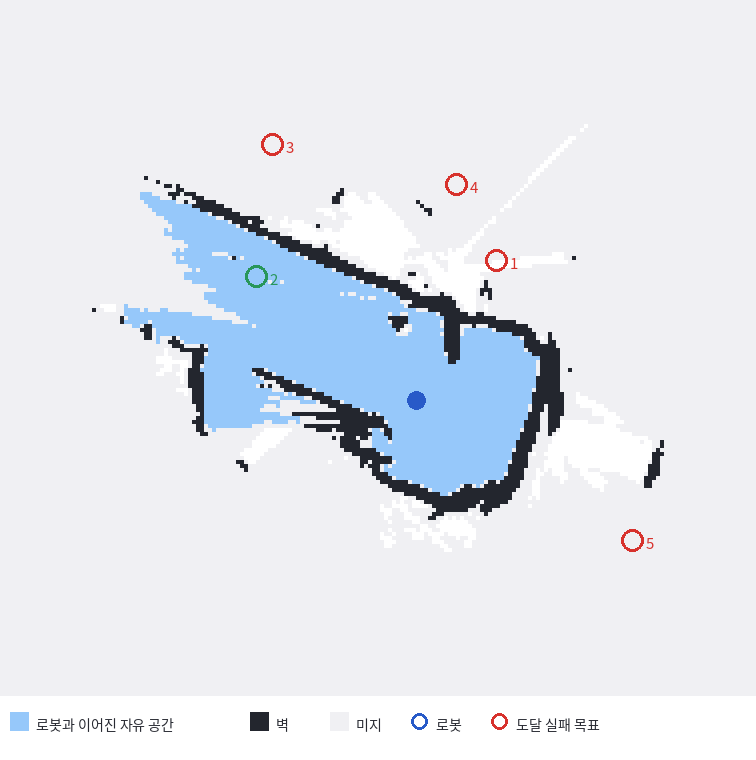
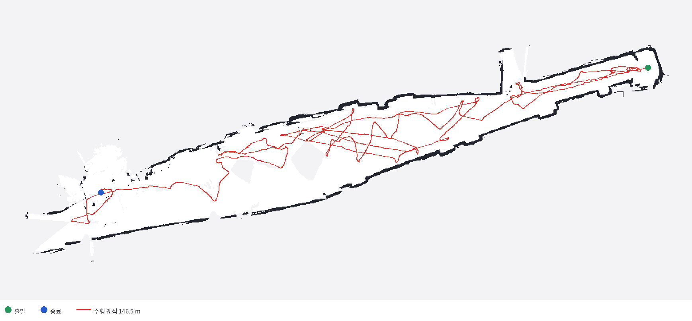
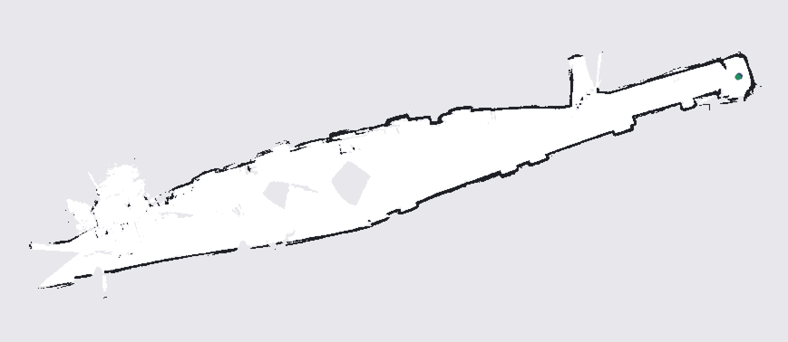

키보드로 몰지 않고 로봇이 스스로 복도 지도를 만들게 하는 게 오늘 목표였어요. 실기는 TurtleBot3 Burger, SLAM은 Cartographer, 주행은 Nav2, 어디로 갈지는 frontier 탐사 노드가 정해요.

탐사 노드에는 안전장치가 있어요. 목표를 보내기 전에 `ComputePathToPose`로 **거기까지 경로가 나오는지 먼저 물어봐요.** 못 가는 곳에 35초씩 쓰는 대신 0.1초에 걸러내려고 넣은 것이에요.

그 검사가 다섯 번 다 통과했고, 로봇은 다섯 번 다 못 갔어요.

<figure class="fig"><figcaption>하늘색이 로봇과 이어진 자유 공간이에요. 빨간 원 넷은 그 밖에 있어요.</figcaption></figure>

오늘 막힌 자리가 전부 같은 모양이었어요. **검사가 통과했다는 것과 검사가 의미 있었다는 것은 다른 사건이에요.** 통과 기준이 무엇이든 통과시키게 되어 있으면, 검사는 돌아가는데 아무것도 안 걸러요.

## 관문 1 — 상태 점검이 항상 "실행중"을 반환했어요

<div class="gate">
<div class="idx">1</div>
<div class="body">
<div class="row"><span class="lab">증상</span><span class="val">SLAM이 안 떠 있는데도 <code>slam_toolbox : 실행중</code></span></div>
<div class="row"><span class="lab">원인</span><span class="val"><code>pgrep -f</code>가 자기를 감싼 <code>bash -lc</code> 명령줄을 매칭</span></div>
<div class="row"><span class="lab">조치</span><span class="val">래퍼 줄을 걸러낸 뒤 판정 <span class="tag ok">고침</span></span></div>
</div>
</div>

`pgrep -f`는 명령줄 전체를 대상으로 찾아요. 그런데 이 명령이 `bash -lc 'pgrep -af async_slam_toolbox_node ...'` 안에서 도니까, 그 래퍼 프로세스의 명령줄에 찾는 문자열이 그대로 들어 있어요. 프로세스가 하나도 없어도 자기 자신이 잡혀서 항상 참이 돼요.

```bash
alive() { pgrep -af "$1" | grep -qv "bash -lc"; }
```

같은 함정이 정지 쪽에도 있었어요. `pkill -f cartographer`가 자기 명령줄을 먼저 죽여서 진짜 대상은 살아남았고, 그렇게 남은 Cartographer가 넷까지 늘었어요. 결국 PID를 먼저 뽑고 죽이는 방식으로 바꿨어요.

```bash
ps -eo pid,args --no-headers \
  | grep -E "^ *[0-9]+ /opt/ros/humble/lib/(nav2|cartographer)" \
  | awk '{print $1}' | xargs -r kill -9
```

## 관문 2 — TF 지연 2.6초는 무선 한계가 아니었어요

<div class="gate crit">
<div class="idx">2</div>
<div class="body">
<div class="row"><span class="lab">전날 판단</span><span class="val">무선 구간의 한계로 보고 <code>transform_timeout: 3.0</code>으로 덮음</span></div>
<div class="row"><span class="lab">재측정</span><span class="val">P90 <b>2,623 ms → 92 ms</b></span></div>
<div class="row"><span class="lab">실제 원인</span><span class="val">중복 실행된 Cartographer 4개가 같은 링크를 점유 <span class="tag no">자해</span></span></div>
</div>
</div>

전날 TF 도착 지연 P90이 2,623 ms였어요. 무선 대역이 부족한 것으로 보고 Nav2의 허용 시간을 3초로 올려 두었어요. 그런데 오늘 프로세스를 정리하고 다시 재니 92 ms가 나왔어요.

<div class="scores">
<div class="s ok"><b>92</b><span>ms · /tf P90</span></div>
<div class="s ok"><b>92</b><span>ms · /scan P90</span></div>
<div class="s mid"><b>0.3</b><span>s · 필요 tolerance</span></div>
<div class="s ok"><b>28×</b><span>개선</span></div>
</div>

`transform_timeout`을 3초로 두는 건 "3초 지난 좌표도 받아들이겠다"는 선언이에요. 자율주행에서 그 값은 곧 충돌 여유라 그대로 둘 수 없었는데, 원인이 사라지니 값도 필요 없어졌어요. 덮어쓴 파라미터가 원인을 가려서, 고쳐야 할 항목으로 하루를 넘어갔던 거예요.

부수적으로 하나 보였어요. `/tf` 1,119건 중 622건(56%)이 바퀴 관절(`wheel_left_link`, `wheel_right_link`)이에요. 주행에 안 쓰는 프레임이 대역의 절반을 먹고 있어요.

## 관문 3 — 설정 파일이 배포판을 잘못 타고 있었어요

<div class="gate">
<div class="idx">3</div>
<div class="body">
<div class="row"><span class="lab">증상</span><span class="val"><code>planner_server</code> 로드 실패로 주행 스택 전체 중단</span></div>
<div class="row"><span class="lab">원인</span><span class="val">Jazzy 표기 <code>::</code>를 Humble에 사용 — 21곳</span></div>
<div class="row"><span class="lab">조치</span><span class="val">설치본의 기준 파일을 바탕으로 재작성 <span class="tag ok">고침</span></span></div>
</div>
</div>

```
FATAL [planner_server]: Failed to create global planner.
  the class nav2_navfn_planner::NavfnPlanner does not exist.
  Declared types are  nav2_navfn_planner/NavfnPlanner ...
```

Nav2는 Iron부터 플러그인 이름 구분자를 `/`에서 `::`로 바꿨어요. 제가 만든 설정이 Jazzy 기본값에서 온 것이라 로봇의 Humble과 어긋났어요. 주석에까지 "In Iron and older versions, `/` was used instead of `::`"가 그대로 남아 있었어요.

한 줄씩 고치는 대신 설치본이 이미 갖고 있던 기준 파일을 바탕으로 다시 얹었어요. `turtlebot3_navigation2/param/humble/burger.yaml` — 이 배포판, 이 로봇 전용이에요.

| 항목 | 내 설정 (Jazzy) | Humble 실제 |
| --- | --- | --- |
| planner | `nav2_navfn_planner::NavfnPlanner` | `nav2_navfn_planner/NavfnPlanner` |
| 복구 동작 | `nav2_behaviors::Spin` | `nav2_recoveries/Spin` |
| costmap · controller | `::` | `::` (일치) |
| bt_navigator navigators | 있음 | Humble에 없는 섹션 |
| docking server | 있음 | Humble에 없는 기능 |

구분자만 다른 게 아니라 패키지 이름 자체가 다르고(`nav2_behaviors` ↔ `nav2_recoveries`), 통째로 없는 섹션도 있었어요. 배포판 기본값을 옮겨 쓸 때 위험한 건 문법 오류가 아니라 **문법은 맞는데 그 배포판에 없는 이름**이에요.

## 관문 4 — 인플레이션은 복도 폭을 재고 정했어요

기준 파일의 `inflation_radius`는 로컬 1.0 m, 전역 0.55 m예요. 좁은 복도에서 1.0은 양쪽 벽에서 2.0 m를 부풀리는 셈이라, 통로가 그보다 좁으면 전면이 고비용 지대가 돼요. 짐작 대신 전날 만든 지도에서 실제 폭을 재고 정했어요.

<div class="scores">
<div class="s bad"><b>0.55</b><span>m · P25</span></div>
<div class="s mid"><b>0.95</b><span>m · 중앙값</span></div>
<div class="s ok"><b>1.55</b><span>m · P75</span></div>
<div class="s mid"><b>0.5</b><span>m · 채택값</span></div>
</div>

중앙에 저비용 능선이 남으려면 반폭(약 0.48 m) 언저리여야 해요. 0.5로 두었어요. 이걸 재고 나니 로컬 코스트맵의 자유 공간이 13%뿐인 것도 이상한 값이 아니라 좁은 복도의 당연한 결과로 읽혔어요.

측정 중에 판정 기준을 한 번 틀렸어요. 코스트맵에 치명 셀이 0개로 나와서 장애물을 못 보는 줄 알았는데, Nav2는 코스트맵을 발행할 때 0–254를 0–100으로 환산해요. 치명값은 253이 아니라 **100**이고, 99는 내접(로봇 반경 안), −1은 미지예요. 기준을 고쳐 다시 세니 치명 257셀이 정상적으로 잡혔어요.

## 관문 5 — 탐사를 붙이기 전에 주행만 따로 채점했어요

<div class="gate">
<div class="idx">5</div>
<div class="body">
<div class="row"><span class="lab">왜</span><span class="val">둘을 같이 켜면 안 움직일 때 원인을 못 가름</span></div>
<div class="row"><span class="lab">방법</span><span class="val">코스트맵에서 갈 수 있는 셀을 직접 골라 목표로 전송</span></div>
<div class="row"><span class="lab">결과</span><span class="val">1.5 m 주행 성공 <span class="tag ok">통과</span></span></div>
</div>
</div>

탐사 노드가 하는 일은 프런티어를 찾아 Nav2에 목표를 던지는 것뿐이에요. 그래서 로봇이 안 움직일 때 원인이 두 군데예요 — 프런티어를 못 찾았거나, 찾았는데 Nav2가 못 가거나. 한꺼번에 켜면 어느 쪽인지 못 가려요.

목표를 사람이 찍지 않고 코스트맵에서 골랐어요. **갈 수 있는 곳으로 골라야 "못 갔다"가 Nav2의 실패라고 말할 수 있어요.** 그리고 액션이 `SUCCEEDED`를 반환해도 그것만 믿지 않고 TF로 실제 이동 거리를 따로 쟀어요. Nav2는 허용오차 0.25 m 안에 들면 성공을 반환하니까, 로그만 보면 거의 안 움직인 것도 성공으로 읽혀요.

이 한 번으로 아래 절반이 확정됐어요. Nav2는 이 로봇을 목표까지 몰 수 있어요.

## 관문 6 — 사전 경로검사가 무엇이든 통과시키고 있었어요

<div class="gate crit">
<div class="idx">6</div>
<div class="body">
<div class="row"><span class="lab">증상</span><span class="val">목표 5회 연속 실패, 도달 0개, 4분간 이동 1.6 m</span></div>
<div class="row"><span class="lab">원인</span><span class="val"><code>allow_unknown: true</code> — 플래너가 미지 영역을 뚫고 경로 생성</span></div>
<div class="row"><span class="lab">조치</span><span class="val"><code>allow_unknown: false</code> <span class="tag ok">고침</span></span></div>
</div>
</div>

탐사를 켜니 로봇이 같은 자리를 맴돌다 멈췄어요. 로그는 이랬어요.

| 목표 | 결과 | 걸린 시간 |
| --- | --- | --- |
| (+0.68, +0.13) | 시간 초과 | 36초 |
| (−2.32, −0.07) | 시간 초과 | 48초 |
| (−2.13, +1.58) | ABORTED | 27초 |
| (+0.17, +1.10) | ABORTED | 11초 |
| (+2.38, −3.36) | ABORTED | 3.5초 |

컨트롤러가 낸 오류는 `Failed to make progress`예요. `SimpleProgressChecker`가 10초에 0.5 m를 못 채우면 스스로 포기하는데, 최고 속도 0.15 m/s의 3분의 1도 못 넘긴 거예요.

목표 다섯 개가 실제로 어떤 자리였는지 지도에서 확인했어요. 로봇 위치에서 자유 공간을 4방향으로 flood-fill 해서 연결 성분을 구하고, 각 목표가 그 안에 드는지 봤어요.

| # | 목표 | 셀 실체 | 로봇과 연결 |
| --- | --- | --- | --- |
| 1 | (+0.68, +0.13) | 자유 | <span class="tag no">끊김</span> |
| 2 | (−2.32, −0.07) | 자유 | <span class="tag ok">연결</span> |
| 3 | (−2.13, +1.58) | 미지 | <span class="tag no">끊김</span> |
| 4 | (+0.17, +1.10) | 미지 | <span class="tag no">끊김</span> |
| 5 | (+2.38, −3.36) | 미지 | <span class="tag no">끊김</span> |

**다섯 중 넷이 갈 수 없는 곳이었고 셋은 미지 영역 한복판이었어요.** 사전 경로검사가 있는데도 전부 통과했어요.

원인은 플래너 설정 한 줄이에요. `allow_unknown: true`면 NavFn이 미지 셀을 자유롭게 가로질러 경로를 그려요. 그래서 `ComputePathToPose`는 항상 성공을 반환하고, 로봇은 출발한 뒤에야 진짜 벽을 만나 돌고, 복구하고, 시간 초과돼요. 안전장치가 켜져 있는데 통과 기준이 "미지 영역도 갈 수 있다"였으니 아무것도 못 걸러낸 거예요.

<div class="note warn">
관문 5에서 준 목표가 잘 갔던 것도 이제 설명돼요. 그건 코스트맵의 <b>여유 있는 자유 셀</b>에서 고른 목표라 미지 영역과 무관했어요. 같은 설정에서 하나는 되고 하나는 안 됐으니, 설정만 보고는 원인을 못 찾았을 거예요.
</div>

`allow_unknown: false`로 바꾸면 못 가는 프런티어가 0.1초 만에 기각되고 다음 후보로 넘어가요. 프런티어 대표점은 확실한 자유 셀에서 고르니까 갈 수 있는 목표는 그대로 통과해요.

## 관문 7 — 2D 라이다는 계단을 원리상 못 봐요

<div class="gate crit">
<div class="idx">7</div>
<div class="body">
<div class="row"><span class="lab">증상</span><span class="val">로봇이 계단 쪽으로 반복해서 출발</span></div>
<div class="row"><span class="lab">원인</span><span class="val">스캔면이 지면 18.2 cm의 수평면 하나 — 아래로 꺼진 지형은 반사가 없음</span></div>
<div class="row"><span class="lab">성질</span><span class="val">센서의 원리적 한계 <span class="tag no">파라미터로 해결 불가</span></span></div>
</div>
</div>

로봇이 계속 한 곳으로 가려 해서 사람이 몸으로 막고 있었어요. 그 자리에 계단이 있었어요.

라이다는 `base_scan` 프레임 기준으로 지면에서 18.2 cm 높이에 있고, 스캔은 그 높이의 수평면 하나예요. 아래로 꺼진 곳에는 그 평면에 아무것도 없으니 반사가 안 돌아와요.

| 지형 | 라이다가 보는 것 | 코스트맵 판정 |
| --- | --- | --- |
| 벽 | 18 cm 지점에서 반사 | 장애물 |
| 계단 (내려감) | 반사 없음, 또는 건너편 먼 벽 | **자유 공간** |

그래서 계단은 코스트맵에 뚫린 자유 공간으로 찍히고, 그 너머가 미지 영역이라 **프런티어 점수가 가장 높게 나와요.** 로봇이 거기를 우선 노리는 게 알고리즘상 정상 동작이에요.

<div class="note bad">
사람이 서서 막는 것은 반쯤만 들어요. 다리는 18 cm 높이에서 잡히지만 가늘고 사이가 비어서 스캔이 틈으로 빠져나가고, 조금만 움직이면 코스트맵에서 지워져요. 라이다가 볼 수 있는 것은 <b>18 cm보다 높고 틈이 없는 면</b>이에요.
</div>

앞서 "왼쪽을 우선 탐사하라"는 방향 가중치를 넣어 봤지만 안 들었어요. 점수에 방위각 항을 곱해 왼쪽이 최대 1.6배, 오른쪽이 0.4배가 되게 했는데, 계단 너머 미지 영역이 워낙 커서 **덩어리 크기 점수가 그 차이를 덮었어요.** 가중치를 더 올려도 마찬가지고, 애초에 못 가는 곳을 후보에서 빼는 게 맞는 처방이에요. 그래서 좌표로 금지 구역을 잡는 파라미터를 따로 넣었어요.

```python
def _in_keepout(self, x, y):
    return any(x0 <= x <= x1 and y0 <= y <= y1
               for x0, x1, y0, y1 in self.keepout)
```

다만 이건 탐사가 그쪽을 목표로 삼지 않게 할 뿐이고, Nav2가 다른 목표로 가다 근처를 지나는 것까지는 막지 못해요. 계단은 떨어지면 끝이라 소프트웨어 한 겹으로 둘 수 없어서, 물리적 차단을 우선으로 두고 금지 구역을 그 위에 얹는 순서로 갔어요. 물리적으로 막으면 SLAM이 거기를 벽으로 그려서 코스트맵·플래너·탐사 세 층이 한꺼번에 막혀요.

## 관문 8 — 중단이 로봇을 세우지 않았어요

탐사 노드는 시뮬레이터에서 만든 것이라 종료 처리에 실기 조건이 빠져 있었어요. `Ctrl+C`를 누르면 노드는 내려가는데 **Nav2는 마지막 목표를 계속 추종해요.** 시뮬에서는 Gazebo를 같이 죽여서 드러나지 않았던 차이예요.

```python
h = getattr(self, '_goal_handle', None)
if h is not None:
    h.cancel_goal_async()
z = Twist()
for _ in range(20):
    self.stop_pub.publish(z)
```

목표를 먼저 취소하고 속도를 0으로 덮어요. 순서가 중요해요 — 취소 없이 0만 실으면 Nav2의 `velocity_smoother`와 같은 토픽에서 서로 밀어내요.

## 시뮬레이터에서 실기로 — 어디가 갈렸나

탐사 노드는 사흘 전 Gazebo의 `turtlebot3_house`에서 완성한 것이에요([[2026-08-10_회고_탐사가_벽옆만_맴돈_이유|점유 격자의 미지·자유 이분법이 만든 frontier 탐사 실패]]). 거기서는 집 전체를 자율로 완주했어요. 오늘 한 일은 그 코드를 실기로 옮긴 것이고, **코드는 한 줄도 안 고쳐도 되는 줄 알았는데 여덟 군데가 갈렸어요.**

| 항목 | 시뮬레이션 | 실기 | 왜 갈렸나 |
| --- | --- | --- | --- |
| `nav_speed` | 0.18 m/s | 0.15 m/s | 좁은 복도용으로 낮춘 `max_vel_x`와 맞춰야 타임아웃 계산이 맞음 |
| `startup_grace_sec` | 20초 | 35초 | 실기는 지도가 늦게 자람 (`/map` 1 Hz, 라이다 5 Hz) |
| `max_failures` | 5 | 40 | 시뮬에선 실패가 드물어 안 걸림. 실기는 4분 만에 자동 종료 |
| `empty_streak` | 6 | 60 | 사람이 멈출 때까지 돌아야 하므로 자가 종료를 사실상 끔 |
| `allow_unknown` | true로 무해 | **false 필수** | 시뮬 집은 닫힌 공간이라 미지 영역도 결국 갈 수 있었음 |
| 종료 처리 | Gazebo가 같이 죽음 | **목표 취소 + 속도 0 필요** | 노드만 내리면 Nav2가 계속 몲 |
| 계단 | 월드에 없음 | **센서가 원리적으로 못 봄** | 아래로 꺼진 지형은 시뮬 월드에서 거의 안 씀 |
| 벽 두께 3셀 이상 | 56.7% | 63.8% | 실제 센서 노이즈와 자세 불일치 |

갈린 것들이 성격이 둘로 나뉘어요.

앞쪽 넷(`nav_speed`부터 `empty_streak`까지)은 **숫자를 다시 재면 되는 것**이에요. 실기의 발행 주기와 속도 한계를 측정해 넣으면 끝나요. 옮기기 전에 예상할 수 있는 종류예요.

뒤쪽 넷은 달라요. `allow_unknown: true`는 시뮬에서 **버그가 아니라 옳은 설정처럼 보였어요.** 집 월드는 완전히 닫혀 있고 미지 영역도 결국 도달 가능해서, 미지를 뚫는 경로가 실제로 유효했거든요. 같은 값이 실기에서는 사전 검사를 통째로 무력화했어요. 종료 처리도 마찬가지예요 — Gazebo를 함께 죽이는 습관이 "노드를 내리면 로봇이 선다"는 착각을 덮고 있었어요.

<div class="note warn">
시뮬레이션은 <b>틀린 값을 알려주는</b> 게 아니라 <b>틀렸다는 것을 안 알려줘요.</b> 앞쪽 넷은 시뮬에서도 값이 이상하면 티가 나지만, 뒤쪽 넷은 시뮬에서 전부 정상으로 보였어요. 그래서 이식할 때 "시뮬에서 잘 됐으니 검증된 코드"로 두면 안 되고, <b>월드가 우연히 만족시켜 준 전제</b>가 무엇이었는지를 따로 물어야 해요.
</div>

계단이 그 전형이에요. 시뮬 월드는 대개 평면 위에 벽을 세워 만들기 때문에 **아래로 꺼진 지형이 없어요.** 2D 라이다가 음의 장애물을 못 본다는 사실은 시뮬에서 한 번도 문제가 되지 않고, 그래서 탐사 노드에는 그걸 다루는 코드가 아예 없었어요. 없는 게 아니라 **필요할 일이 없었던** 거예요.

## 주행 결과

고친 뒤 자율 주행으로 복도 지도를 수집했어요.

<figure class="fig"><figcaption>Cartographer 궤적 5,786노드를 지도에 겹친 것이에요.</figcaption></figure>

<div class="scores">
<div class="s ok"><b>43.5×18.9</b><span>m · 지도 범위</span></div>
<div class="s ok"><b>146.5</b><span>m · 누적 주행</span></div>
<div class="s mid"><b>131.4</b><span>m² · 자유 공간</span></div>
<div class="s mid"><b>5,786</b><span>궤적 노드</span></div>
</div>

<figure class="fig"><figcaption>출발부터 종료까지 궤적이 그려지는 순서예요.</figcaption></figure>

지도 품질은 아직 판정을 미뤄 두었어요. 벽 두께 중앙값이 3.0셀(15 cm)이고 3셀 이상인 구간이 63.8%인데, 시뮬레이션에서 같은 백엔드로 잰 값(3.0셀, 56.7%)보다 두꺼워요. 궤적을 직선으로 적합하면 잔차 표준편차가 0.75 m, 최대 2.26 m예요.

<div class="note">
이 숫자만 보고 누적 오차라고 단정하면 안 돼요. 실제 복도가 직선이 아니고, 경로를 따라 잰 폭도 2.5 m 구간과 5.5 m 구간이 섞여 있어요. 넓어진 구간이 실제 지형인지 벌어진 것인지는 <b>도면과 맞춰야</b> 갈려요. 대조 없이 지표만으로 품질을 말하면, 오늘 고친 것과 같은 종류의 오판이 돼요.
</div>

## 남는 기준

여덟 개 관문 중 넷이 같은 모양이었어요.

| 검사 | 무엇을 통과시켰나 |
| --- | --- |
| `pgrep -f` 프로세스 확인 | 자기 명령줄을 잡아 **항상** 실행중 |
| `ComputePathToPose` 사전 검사 | 미지 영역을 뚫은 경로라 **항상** 성공 |
| 2D 라이다 장애물 감지 | 아래로 꺼진 지형을 **항상** 자유 공간 |
| Nav2 액션 `SUCCEEDED` | 허용오차 안이면 안 움직여도 성공 |

넷 다 검사는 정상적으로 돌고 있었어요. 문제는 통과 기준이 실패할 수 없게 되어 있었다는 것이에요. 이런 검사는 붙여 두면 오히려 해로워요 — 통과 로그가 쌓이는 만큼 그 항목을 확인했다고 믿게 되니까요.

그래서 검사를 붙일 때 같이 물어야 할 게 하나 생겼어요. **이 검사가 실패하는 경우가 실제로 있나.** 없다면 그건 검사가 아니라 통과 도장이에요.

시뮬레이션에서 실기로 옮길 때도 같은 물음이 돼요. 시뮬 월드에서 그 검사가 실패한 적이 없다면, 검사가 튼튼해서가 아니라 **월드가 실패 조건을 안 만들어 줬기 때문**일 수 있어요. `allow_unknown: true`는 닫힌 집에서 한 번도 안 틀렸고, 계단은 평면 월드에 존재하지 않았어요. 이식할 때 볼 것은 코드가 아니라 월드가 대신 만족시켜 주던 전제예요. 새 판정 기준을 만들 때 아무 의미 없는 입력을 먼저 통과시켜 보는 것([[2026-08-11_회고_amcl_초기위치_순환검증과_대조군|AMCL 초기 위치와 순환 검증]])과 같은 물음이에요. 그때는 대조군이 없어서 틀린 값이 통과했고, 오늘은 통과 기준이 느슨해서 못 가는 목표가 통과했어요.

전날 남긴 `transform_timeout: 3.0`도 여기 걸려요. 지연이 큰 원인을 찾는 대신 허용치를 올려 오류 메시지를 없앤 건데, 그러면 로그는 깨끗해지고 원인은 그대로 남아요. 오늘 프로세스를 정리하니 92 ms가 나왔어요. 덮어쓴 값이 하루 동안 그 사실을 가리고 있었어요.
