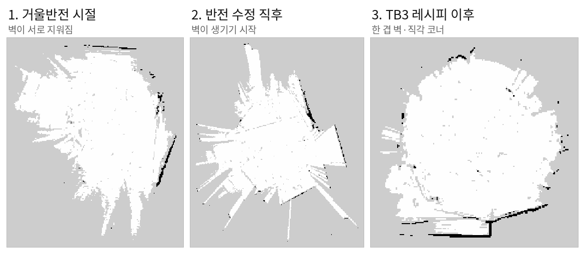
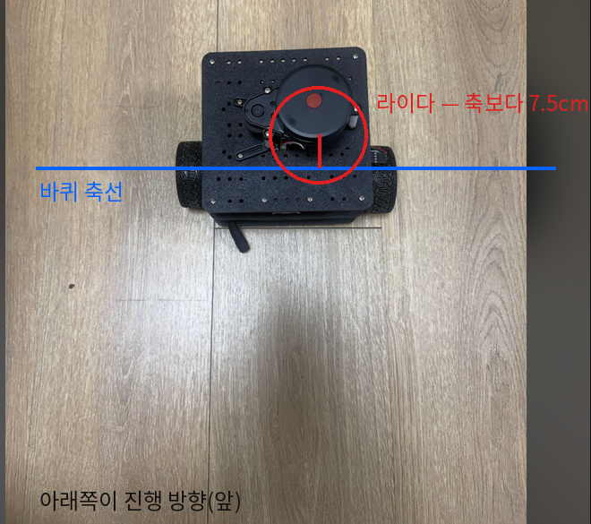

라즈베리파이와 ESP32 제어보드, LD14P 라이다로 조립한 차동구동 로봇을 자율주행 스택에 올리는 날이었어요. 아침에 SD 카드가 인식조차 안 되는 상태에서 시작해, 저녁에는 텔레옵 사방향 주행과 바퀴 캘리브레이션, 강의실 지도 생성까지 갔어요. 그 사이에서 지도가 다섯 번 무너졌고, 무너질 때마다 원인이 달랐어요. 그 다섯 원인을 실측으로 하나씩 가려낸 기록이에요.

<figure class="fig"><figcaption>같은 강의실을 세 번 그린 결과예요. 거울반전 시절에는 벽이 서로 지워졌고, 반전을 고치자 벽이 생기기 시작했고, 검증된 파라미터 세트를 이식하자 한 겹 벽과 직각 코너가 나왔어요.</figcaption></figure>

## 관문 1 — 서보 ID와 부호는 코드가 아니라 구동 시험이 정했어요

펌웨어는 좌측 서보를 ID 1로 가정하고 있었어요. 텔레옵을 붙여 보니 전진과 후진은 맞는데 좌회전과 우회전이 반대였고, ID를 맞바꾸자 이번에는 전진과 후진까지 반대가 됐어요.

<div class="gate">
<div class="idx">1</div>
<div class="body">
<div class="row"><span class="lab">증상</span><span class="val">원판은 회전만 반대, ID 교환판은 전 방향 반대</span></div>
<div class="row"><span class="lab">판정 시험</span><span class="val">한쪽 채널에만 전진 지령 → 차체가 좌회전 = 돌아간 바퀴는 오른쪽</span></div>
<div class="row"><span class="lab">확정</span><span class="val">ID 1 = 실물 오른쪽(+가 전진), ID 2 = 실물 왼쪽(−가 전진) <span class="tag ok">확정</span></span></div>
</div>
</div>

관측 세 건(원판의 방향 조합, 교환판의 방향 조합, 단일 바퀴 시험)을 다 만족하는 배치는 하나뿐이라 여기서 끝났어요. 시리얼 버스 서보는 배선이 아니라 ID가 주소라서, 이 확인을 건너뛰면 배선을 아무리 들여다봐도 답이 없어요. 미러 반전이 어느 쪽 바퀴에 붙는지도 기체마다 달라서, 규약을 코드 주석이 아니라 구동 시험으로 확정해 두는 편이 맞아요.

<div class="scores">
<div class="item"><span class="k">텔레옵 사방향</span><span class="v">전부 정합</span></div>
<div class="item"><span class="k">지령 두절 정지</span><span class="v">400ms 워치독</span></div>
<div class="item"><span class="k">직진 0.26m</span><span class="v">y 편차 0.07mm</span></div>
</div>

## 관문 2 — 바퀴 제원은 URDF가 아니라 줄자가 정했어요

URDF에 적힌 바퀴 지름은 150mm였는데, 오도메트리로 2m를 갔다고 보고했을 때 줄자 실측은 0.9m였어요. 직진 시험으로 반지름을, 제자리 회전 시험으로 트레드를 보정하는 UMBmark 축소판을 돌렸어요.

<div class="scores">
<div class="item"><span class="k">바퀴 반지름</span><span class="v">75 → 33.4 → <b>32.9mm</b></span></div>
<div class="item"><span class="k">직진 검산 배율</span><span class="v"><b>0.986</b></span></div>
<div class="item"><span class="k">회전 검산 배율</span><span class="v"><b>0.999</b></span></div>
<div class="item"><span class="k">자 실측 지름</span><span class="v">약 65mm (일치)</span></div>
</div>

트레드는 재미있는 갈림이 있었어요. 줄자로 잰 바퀴 중심 간 거리는 20cm인데, 주행 캘리브레이션은 18.4cm로 수렴했어요. 바퀴 접지면에 폭(25mm)이 있어서 회전할 때 접지 중심이 안쪽으로 쏠리기 때문이고, 오도메트리에 넣는 값은 기하 치수가 아니라 이 유효 트레드가 맞아요. 검산 라운드에서 회전 배율 0.999가 그 판단을 확정해 줬어요.

## 관문 3 — 스캔이 오도메트리와 반대로 돌고 있었어요

첫 지도는 벽이 거의 없이 자유공간 부채살만 남는 형태로 무너졌어요. 벽이 안 보이는 게 아니라, 매 스캔의 벽이 조금씩 다른 자리에 찍혀 점유 확률이 서로 지워지는 그림이에요.

<div class="gate crit">
<div class="idx">2</div>
<div class="body">
<div class="row"><span class="lab">시험</span><span class="val">제자리 +90° 회전 전후의 스캔을 원형 상관으로 정렬</span></div>
<div class="row"><span class="lab">결과</span><span class="val">odom Δyaw <b>+96.9°</b> · 스캔 이동 <b>−98.0°</b> — 크기 일치, 부호 반대 <span class="tag no">거울반전</span></span></div>
<div class="row"><span class="lab">조치</span><span class="val">드라이버 회전방향 설정 반전 → 재시험 +96.8° vs +99.2° <span class="tag ok">일치</span></span></div>
</div>
</div>

스캔 회전방향 설정이 실물과 반대면 로봇이 왼쪽으로 돌 때 스캔은 오른쪽으로 돈 것처럼 들어와요. 정합기는 그 모순을 벽을 문질러 없애는 쪽으로 소화하고요. 이 프로브는 회전 방향의 정합만 검사할 수 있다는 한계가 있는데, 그 한계가 뒤의 관문 5를 오래 숨겨 줬어요.

## 관문 4 — 반복 패턴 환경에서 전역 매칭이 자리를 바꿔 앉았어요

거울반전을 고친 뒤에도 주행 중 로봇이 순간이동하고 지도가 겹치는 증상이 남았어요. 강의실은 같은 책상다리가 격자로 반복되는 환경이라, 전역 상관 매칭(online correlative scan matching)이 비슷하게 생긴 다른 자리로 정렬을 스냅해 버려요. 관측 퇴화가 아니라 지각 중의성(perceptual aliasing) 쪽 문제예요.

이 구간에는 운영 실수도 겹쳐 있었어요. 매핑이 도는 중에 드라이버를 재시작하면 오도메트리 원점이 (0,0)으로 돌아가는데, SLAM 입장에서는 로봇이 순간이동한 사건이라 그 뒤로 쌓이는 지도가 통째로 오염돼요. 이걸 두 번 겪고 나서 "매핑 중에는 어떤 노드도 재시작하지 않는다, 리셋 전에는 지도를 먼저 저장한다"를 운영 규칙으로 박았어요.

정합 쪽은 같은 강의실에서 검증돼 있던 TurtleBot3 구성을 통째로 이식하는 것으로 답했어요. 시야를 8m에서 3.5m로 줄여 원거리 반복 패턴을 아예 안 보게 하는 게 핵심이었고, 이식 직후 지도에 처음으로 한 겹 벽과 직각 코너가 나왔어요. 위 그림의 세 번째 판이 그 결과예요.

<div class="note warn">
<span class="h">판정 눈의 오염</span>
이 구간에서 진단을 어렵게 만든 별개 요인이 있었어요. 노트북과 로봇의 시계가 3.6초 어긋나 있어서, RViz가 로봇·스캔·지도를 서로 다른 시점으로 그리고 있었어요. SLAM은 로봇 안에서 자기 시계로만 돌아 지도 생성과는 무관했지만, 지도를 판정하는 화면이 오염돼 있으면 멀쩡한 수리도 실패로 보여요. NTP 재동기 전까지의 육안 판정은 절반쯤 무효였던 셈이에요.
</div>

## 관문 5 — 복도에서 로봇이 제자리에 멈춰 보였어요

복도로 나가자 새 증상이 나왔어요. 실제로는 직진 중인데 화면의 로봇은 제자리에 서 있고, 회전 한 번을 넣자 순간이동하며 지도가 무너졌어요. 복도는 진행 방향으로 스캔이 어디서나 똑같아 보이는 관측 퇴화 지형이라, 정합기가 오도메트리의 전진을 기각하고 "안 움직였다"를 답으로 골라요. 특징이 다시 나타나는 코너에서 몰아서 정산하니 점프가 되고요.

처방은 두 겹이었어요. 하나는 시야 복원 — 복도에 캐비닛이 구간구간 있다는 관측이 들어와서, 3.5m 크롭이 캐비닛 사이 구간을 인위로 무특징하게 만들고 있었다는 걸 알았어요. 시야를 6m로 되돌려 캐비닛을 앵커로 쓰게 했어요. 다른 하나는 정합 우선순위 — 전역 상관 매칭을 끄고, ceres 정합기의 사전추정 가중치를 올려 캘리브레이션된 오도메트리가 무특징 구간을 끌고 가게 했어요. 가중치는 ceres 단계에만 걸리기 때문에 상관 매칭이 켜져 있는 한 어떤 가중치도 점프를 못 막는다는 게 이 구간의 핵심이었어요.

## 관문 6 — 라이다는 사진이 말한 자리에 있었어요

측정 좌표를 URDF에 넣을 때 라이다가 바퀴 축의 앞에 있다고 가정했는데, 기체를 위에서 찍은 사진을 판독하니 축의 뒤였어요. 부호 하나가 뒤집혀 세로 방향 15cm 오차가 하루 종일 모든 지도에 들어가 있던 거예요.

<figure class="fig"><figcaption>위에서 내려다본 기체예요. 라이다 회전 중심이 바퀴 축선보다 7.5cm 뒤에 있어요. 진행 방향은 사진 아래쪽이에요.</figcaption></figure>

<div class="gate crit">
<div class="idx">3</div>
<div class="body">
<div class="row"><span class="lab">오류</span><span class="val">TF에 전방 +7.5cm로 입력 — 실물은 후방 <span class="tag no">부호 반전</span></span></div>
<div class="row"><span class="lab">영향</span><span class="val">회전마다 15cm 지렛대로 벽이 흔들려 번짐에 기여</span></div>
<div class="row"><span class="lab">조치</span><span class="val">x = −0.075m 로 교정, TF 재검증 <span class="tag ok">반영</span></span></div>
</div>
</div>

이 오프셋은 직진에서는 얌전해서 병진 위주 시험을 다 통과해요. 회전에서만 스캔 전체를 원호로 흔들기 때문에, 회전 직후 벽이 두꺼워지는 증상으로만 드러나요.

## 관문 7 — 마지막 용의자는 시간축이었어요

기하를 전부 교정하고도 주행 중 번짐이 남아서, 정지 상태 검증이 전부 통과하는데 움직이면 깨진다는 패턴 자체를 단서로 삼았어요. 그 패턴에 맞는 마지막 후보는 타임스탬프예요. 라이다 드라이버 소스를 열어 보니 이렇게 되어 있었어요.

```cpp
start_scan_time = node->now();   // 한 바퀴를 다 받은 뒤에 찍는다
output.header.stamp = start_scan_time;
```

LaserScan의 stamp는 규약상 첫 광선의 시각이어야 해요. 이 드라이버는 한 바퀴(167ms)를 모두 수신한 뒤의 시각을 시작 시각이라며 찍고 있어서, 모든 점이 실제보다 한 바퀴 미래의 자세로 지도에 놓여요. 회전 0.6rad/s 기준으로 스캔마다 약 6°의 계통 왜곡이에요.

<div class="note bad">
<span class="h">정지 프로브가 전부 통과한 이유</span>
거울반전 프로브도, 정면 방향 판정도 전부 "움직이고, 멈추고, 비교"하는 구조였어요. 시간축의 상수 편향은 정지한 순간 사라지기 때문에 이 계열의 검증을 전부 무사 통과해요. 움직이는 동안에만 깨지는 증상 앞에서는 정적 검증의 합격 목록이 면죄부가 되지 않아요.
</div>

stamp를 한 바퀴만큼 되돌리는 패치를 넣었어요. 다만 이 수정판과 관문 5의 정합 설정은 기체가 무선 사각으로 나가면서 실지도 재검증을 남겨 둔 상태예요. 통과한 것과 대기 중인 것을 갈라 적으면 이래요.

<div class="scores">
<div class="item"><span class="k">구동·워치독·오도메트리</span><span class="v">검증 완료</span></div>
<div class="item"><span class="k">거울반전·장착 오프셋</span><span class="v">프로브·사진으로 확정</span></div>
<div class="item"><span class="k">강의실 지도</span><span class="v">직각 코너 확인</span></div>
<div class="item"><span class="k">타임스탬프 패치·복도 재시험</span><span class="v"><b>재가동 시 검증 대기</b></span></div>
</div>

## 다섯 원인을 관통한 기준 하나

거울반전, 매핑 중 오도메트리 원점 리셋, 반복 패턴 스냅, 장착 오프셋 부호, 타임스탬프 지연 — 다섯 원인의 공통점은 전부 "정지 상태에서는 안 보인다"는 거예요. 그리고 다섯 개 모두 가정 하나를 실측 하나로 바꾸는 순간 잡혔어요. ID는 단일 바퀴 구동으로, 제원은 줄자로, 회전방향은 프로브로, 장착 위치는 사진으로, 시간축은 소스 판독으로요.

[[2026-08-12_회고_복도에서_지도가_벌어지는_이유|복도 관측 퇴화]]를 시뮬레이션에서 정리했을 때는 원리로 알았고, 오늘은 같은 현상이 제 기체에서 제 오도메트리를 기각하는 걸 봤어요. 다음 가동에서는 타임스탬프 수정판으로 복도 왕복을 다시 재고, 폐루프 복귀 오차를 숫자로 남기는 것부터 시작해요.
