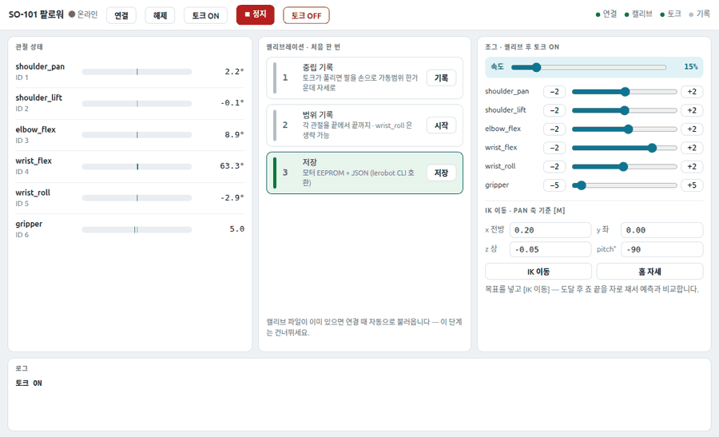

공식 STL을 출력해 조립한 SO-101 팔로워 팔을 처음 살렸어요. 역기구학은 시뮬레이션에서 이미 검증돼 있었는데, 실물로 오는 길을 막은 것은 수식이 아니라 전부 하드웨어 계층의 사실들이었어요. 막힌 순서대로, 각 층을 어떻게 갈랐는지 적어요.

## 커널이 침묵하면 소프트웨어 문제가 아니에요

USB를 꽂았는데 `/dev/ttyACM*` 장치가 안 떴어요. 이때 드라이버나 권한을 뒤지기 전에 볼 것이 하나 있어요. `journalctl -kf`를 켜 두고 케이블을 다시 꽂았을 때 커널 로그에 아무 줄도 안 찍히면, 전기적으로 아무 일도 일어나지 않은 거예요. 원인은 충전 전용 케이블이었어요. USB 케이블에는 데이터선이 있는 것과 전원 두 가닥뿐인 것이 섞여 있고 겉으로는 구분되지 않아요. 케이블을 바꾸자 CH343 USB-시리얼 칩이 바로 잡혔고, `cdc_acm` 드라이버가 자동으로 붙었어요.

## 서보가 많을수록 "하나도 없음"으로 보여요

포트는 열리는데 서보 스캔이 모든 통신 속도에서 0개였어요. 전원 LED는 전부 켜져 있었고요. 전원도 배선도 아니었어요. 원인은 ID 충돌이었어요.

Feetech STS3215 같은 버스 서보는 반이중(half-duplex) 1선 버스에 여러 개가 병렬로 붙고, 각자 EEPROM에 적힌 ID로 자기 몫의 패킷만 골라 들어요. 그런데 공장 출하 ID는 전부 1번이에요. 조립하며 데이지체인으로 미리 이어 두면 브로드캐스트 핑에 여러 서보가 같은 순간 응답하고, 신호가 버스 위에서 겹쳐 깨져요. 호스트에는 유효한 패킷이 하나도 도착하지 않아요. 서보가 많이 붙어 있을수록 "하나도 없음"으로 보이는 역설이 여기서 나와요. Dynamixel 계열도 같은 규약이라 이 함정은 버스 서보 일반의 것이에요.

체인을 풀어 하나만 남기니 즉시 `{1: 777}`이 잡혔어요. 777은 STS3215의 모델 번호이고, 통신 속도는 공장 기본 1,000,000bps 그대로였어요.

ID 부여 절차도 다시 읽으면 수고를 줄일 수 있어요. 교과서 절차는 "하나 꽂고 부여하고, 뽑고, 다음"인데, 충돌 조건은 "ID 1이 버스에 둘 이상"뿐이에요. 그래서 이미 부여한 서보는 그대로 두고 새 서보를 체인 끝에 추가하며 도착 즉시 다른 번호로 바꾸면, 케이블을 뽑을 일이 없어요. 첫 서보가 목표 ID도 1이라면 임시 번호로 비켜 뒀다가 마지막에 되돌려요. 베이스에서 그리퍼 방향으로 순서대로 더하면 부여가 끝나는 순간 최종 배선도 같이 완성돼요.

## 영점은 코드가 아니라 모터 안에 있어요

`FK(IK(p))=p`가 마이크로미터 단위까지 맞아도, 실물에서 성립하려면 전제가 하나 필요해요. URDF의 관절각 0과 서보가 생각하는 0이 같은 자세여야 해요. 그 대응을 만드는 절차가 캘리브레이션이고, 값이 앉는 자리는 서보 EEPROM의 Position Offset 레지스터예요.

중간 자세를 감으로 잡지 않고 URDF의 순기구학으로 계산했어요. 관절각이 전부 0일 때 위팔은 수평 대비 76도로 거의 수직이고, 아래팔부터 그리퍼 끝까지는 수평으로 정면을 향해요. 이 ㄱ자 자세를 손으로 잡고 기록하면 그 순간의 각 서보 위치가 중앙값 2048틱으로 읽히도록 오프셋이 계산돼 EEPROM에 들어가요. 위치가 12비트 0에서 4095까지로 한 바퀴를 나누니 한 눈금이 약 0.088도예요. 이어서 각 관절을 손으로 끝에서 끝까지 움직여 가동 범위를 재면, 이 최소·최대 틱이 정규화의 분모가 돼요.

여기서 도구 설계 실수를 두 번 했어요. 처음엔 범위 기록을 "시작 버튼을 누른 동안"만 쌓게 만들었는데, 버튼 없이 관절을 다 움직인 뒤 저장을 눌러 기록이 비어 있었어요. 가동 범위는 관절이 어디까지 가봤는지의 최소·최대라서 더 쌓여도 손해 볼 일이 없는 값이에요. 캘리브레이션 전에는 항상 쌓도록 바꿨어요. 두 번째로, 영점 기록이 원클릭이라 검증 중에 실수로 눌려 모터 쪽 영점이 덮였어요. 다행히 LeRobot이 캘리브레이션을 모터 EEPROM과 호스트 JSON 파일에 이원 저장하고 연결할 때마다 파일을 모터에 다시 써 넣어서, 재연결만으로 원상복구됐어요. 비휘발성 메모리를 덮는 조작은 두 번 확인을 거치도록 고쳤고요.

## 속도의 기본값은 "느림"이 아니라 "무제한"이에요

캘리브레이션 뒤 첫 조그에서 5도 명령에 팔이 튀듯 움직였어요. STS3215의 이동 속도를 제한하는 Goal Velocity 레지스터의 기본값이 0인데, 0은 최저 속도가 아니라 무제한이라서예요. 위치 명령만 보내면 서보가 낼 수 있는 최고 속도로 점프해요.

그래서 토크를 켜기 전에 서보 레지스터 셋을 먼저 묶는 순서로 바꿨어요. Goal Velocity로 이동 속도를 제한하고, Acceleration으로 출발과 정지에 램프를 주고, Torque Limit을 60%로 낮춰 어딘가 막혔을 때 밀어붙이지 않고 멈추게요. 셋 다 서보 쪽에 걸리는 값이라 상위에서 어떤 경로로 명령해도 똑같이 적용돼요. 토크 인가 자체도 여섯 개 동시가 아니라 한 개씩 간격을 두고 걸어요. 팔이 축 늘어진 자세에서 여섯 서보가 동시에 걸린 직후 제어 보드가 USB에서 떨어진 일이 실제로 있었는데, 돌입 전류가 겹치며 전원이 순간 주저앉은 것으로 보고 있어요.

정지 동작도 층이 하나 더 필요했어요. 시리얼을 전담하는 워커가 단일 스레드라, 보간 이동 중에 정지 명령을 큐에 넣으면 이동이 끝난 뒤에야 처리돼요. 정지는 큐를 우회하는 플래그로 만들고 보간 루프가 매 스텝 확인해 즉시 끊게 했어요. 그리고 정지는 토크를 끄는 게 아니라 현재 위치를 목표로 다시 써서 그 자리에 힘을 유지한 채 멈춰요. 토크를 끄면 팔이 중력에 처지니까, 두 동작은 용도가 달라요.

<figure class="fig"><figcaption>브라우저 제어 패널. 왼쪽이 관절별 실시간 각도, 가운데가 캘리브레이션 3단계, 오른쪽이 속도 제한 슬라이더와 조그·IK 조작이에요.</figcaption></figure>

조작 화면은 처음 tkinter로 만들었다가 브라우저로 옮겼어요. 시리얼 전담 워커 앞에 상태 폴링과 명령 두 개의 HTTP 엔드포인트만 얹으면, 화면은 기존 대시보드와 같은 디자인 언어로 만들 수 있어요. 캘리브레이션 세 단계, 관절별 조그와 슬라이더, 역기구학 목표 이동, 그리고 항상 살아 있는 정지 버튼이 한 화면에 있어요.

오늘 관문들의 공통점은 코드가 아니라 상태와 기본값이었어요. ID도 영점도 가동 범위도 전원을 빼도 남는 모터 안 비휘발성 메모리에 있고, 속도의 기본값은 안전한 쪽이 아니라 빠른 쪽으로 열려 있어요. 시뮬레이션에서 검증한 수학을 실물로 옮길 때 갈라지는 지점이 정확히 여기라서, 다음은 같은 역기구학으로 목표 좌표를 보내고 그리퍼 끝 실측 위치와 대조해 출력물 공차와 조립 오차, 영점 오차를 분해하는 일이에요.
