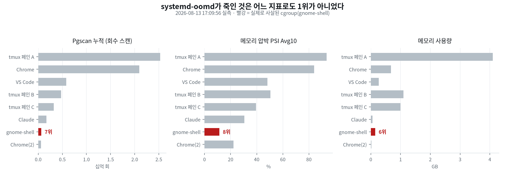

작업하던 노트북이 이틀에 걸쳐 두 번 흰 화면이 됐어요. 원인을 로그로 끝까지 쫓았는데, 처음 세운 설명이 발행 직전 수치를 다시 맞춰 보다 반증됐어요. 원인을 좁히는 것과 그 원인이 어떤 규칙으로 작동하는지를 설명하는 것은 각각 따로 검증해야 하는 항목이었어요.

## 흰 화면의 정체는 로그에 이름으로 적혀 있어요

"기계가 뻗었다"는 증상은 `journalctl` 한 줄로 실체가 잡혀요.

```
systemd[1899]: Started gnome-session-failed.service
                 - GNOME Session Failed lockdown screen (user).
```

GNOME은 셸(gnome-shell — 창과 패널을 그리는 주체)이 죽으면 데스크톱을 복구하는 대신 밝은 배경에 문구와 로그아웃 버튼만 있는 잠금 화면으로 갈아타요. 그게 흰 화면의 정체예요. 한 번은 26분, 한 번은 9시간 49분 떠 있었어요.

"뻗어서 꺼졌다"도 사실이 아니었어요. 로그 끝에 `Power key pressed short` → `Finished systemd-poweroff.service`가 남아 있어요. 커널 패닉이 아니라 사람이 전원 버튼을 눌러 정상 종료된 거예요. 이 두 줄로 하드웨어 고장 가설이 폐기돼요.

## 죽은 것은 메모리를 가장 많이 쓴 쪽이 아니었어요

gnome-shell을 죽인 것은 `systemd-oomd`예요. 커널 OOM 킬러와 달리 사용자 공간에서 PSI(Pressure Stall Information — 태스크가 메모리를 기다리며 멈춘 시간의 비율)를 폴링해 cgroup 단위로 SIGKILL을 보내요.

개입 시점에 로그가 후보 80개와 각각의 지표를 남겨 뒀어요. 상위권을 세 축으로 정렬하면 이렇게 나와요.

<figure class="fig"><figcaption>2026-08-13 17:09:56 실측. 빨강이 실제로 강제 종료된 cgroup이에요.</figcaption></figure>

종료된 gnome-shell은 회수 스캔 7위, 압박 8위, 메모리 6위예요. 어느 축으로도 1위가 아니에요. 압박 93.45에 4.1GB를 쥔 cgroup은 그대로 살아남았고, 같은 시각 25.6GB까지 자란 파이썬 프로세스는 후보 목록에 이름조차 없었어요. 그 프로세스는 4시간 37분을 더 살다 두 번째 사고 때 죽었어요.

## PSI는 발동 조건이지 선정 기준이 아니에요

처음엔 "oomd가 압박이 가장 높은 cgroup을 고른다"고 정리했는데, 위 표가 그 설명을 반증해요. 로그 문구를 다시 읽으면 구분이 보여요.

```
Killed .../org.gnome.Shell@x11.service due to memory pressure for
/user.slice/user-1000.slice/user@1000.service being 91.00% > 50.00%
for > 20s with reclaim activity
```

91%는 개별 cgroup이 아니라 **감시 대상 슬라이스 전체**(`user@1000.service`)의 압박이에요. 즉 PSI는 "지금 개입할 때인가"를 정하는 방아쇠이고, 그 안에서 누구를 죽일지는 다른 값이 정해요.

후보 자격은 `systemd.resource-control(5)`에 명시돼 있어요. 잎(leaf) cgroup이거나 `memory.oom.group=1`인 것만 대상이 되고, 감시 대상 유닛 자신은 후보가 아니에요. 반면 정렬 키는 문서에 없어요. systemd는 누적 Pgscan이 아니라 폴링 사이의 증가율, 그러니까 "그 순간 얼마나 빠르게 페이지를 회수당하고 있는가"로 골라요. 로그가 찍어 주는 값은 누적뿐이라, **사후에 로그만으로는 선정을 재구성할 수 없어요.** 위 표가 세 축 모두에서 설명에 실패하는 이유예요.

두 번째 사고에서는 결과가 달랐어요. 그때는 Pgscan 1위이자 24.3GB를 쥔 cgroup이 죽었어요. 두 사고에서 공통된 것은 gnome-shell이 매번 함께 죽었다는 사실 하나뿐이고, 그래서 사용자가 보는 증상은 두 번 다 흰 화면이었어요.

## 진범은 타임아웃 없이 띄운 리더였어요

죽은 파이썬 프로세스의 정체는 cgroup 경로에 박힌 tmux 스코프 ID로 역추적했어요. 33시간 전에 띄운 ROS 기록(MCAP) 리더였고, 명령에 `timeout`이 빠져 있었어요. 바로 앞뒤 명령에는 전부 붙어 있었는데 그 줄만 없었어요.

메모리가 25.6GB까지 간 이유는 리더가 디코드된 메시지 객체를 리스트에 그대로 쌓고 있었기 때문이에요. `mcap_ros2`가 돌려주는 메시지는 필드마다 파이썬 인스턴스가 달린 중첩 구조라, 실제로 쓰는 값이 좌표와 쿼터니언 몇 개뿐이어도 원본의 100배로 부풀어요.

| | 수정 전 | 수정 후 |
|---|---|---|
| 26.6MB 파일 처리 시 최대 RSS | 2.64 GB | 0.12 GB |
| 판정 결과 | 기준 | 바이트 단위 동일 |
| 392MB 전체 처리 | 25.6GB에서 사망 | 0.95 GB · 2분 23초 완주 |

고친 방식은 표본을 버리는 게 아니라 한 건의 크기를 줄이는 거였어요. 이 리더는 `/tf`를 시간 기준으로 솎으면 판정이 깨지는(ATE 8mm가 240mm로) 도구라 개수는 손댈 수 없었고, 대신 나중에 실제로 읽는 값만 튜플로 접었어요. `/tf`가 82,042건에 1045Hz까지 올라간 건 `robot_state_publisher`가 관절 상태를 받을 때마다 전 링크를 재발행하기 때문이에요. 판정에는 그 밀도가 필요하지만 저장에는 필요 없어요.

## 오진은 두 겹이었어요

첫 번째 흰 화면 때 저는 화면 옆에서 CPU를 92.7% 쓰던 시뮬레이터 뷰어를 범인으로 지목했어요. 나중에 시각을 맞춰 보니 그 뷰어와 학습은 사고 시점에 아직 시작도 안 한 상태였어요(학습 시작 기록 17:11:02, 사고 17:09:57). 눈앞에서 자원을 쓰는 프로세스를 범인으로 짚은 거예요.

둘째 겹은 그 뒤였어요. 범인을 바로잡은 다음 세운 "압박이 높은 쪽이 죽는다"는 메커니즘 설명이 틀렸고, 그건 이 글을 쓰며 수치를 다시 맞춰 보다 잡혔어요. 원인을 좁히는 것과 그 원인이 어떤 규칙으로 작동하는지를 설명하는 것은 각각 따로 검증해야 하는 항목이에요.

## 상한은 명령에 걸어요

이후 오래 도는 작업은 전부 이 형태로 띄워요.

```bash
systemd-run --user --scope -p MemoryMax=4G timeout 900 python3 heavy_job.py
```

`MemoryMax`를 걸면 넘칠 때 그 스코프만 죽고 데스크톱은 무사해요. `timeout`이 없다는 건 끝을 모르는 작업이라는 뜻이고, 그런 작업은 애초에 백그라운드로 띄우면 안 되는 작업이에요. 데이터를 통째로 메모리에 올리는 코드는 개수보다 한 건의 표현 크기를 먼저 보고요.

흰 화면이 또 뜨면 진단은 한 줄로 시작해요.

```bash
journalctl -b -1 | grep -iE "oomd|oom-kill|gnome-session-failed"
```

이 줄이 원인을 좁히는 데까지는 데려다줘요. 다만 누가 왜 그 순간 선택됐는지까지는 알려주지 않아요. 그 값은 폴링 사이에만 존재하고 기록에 남지 않거든요.
