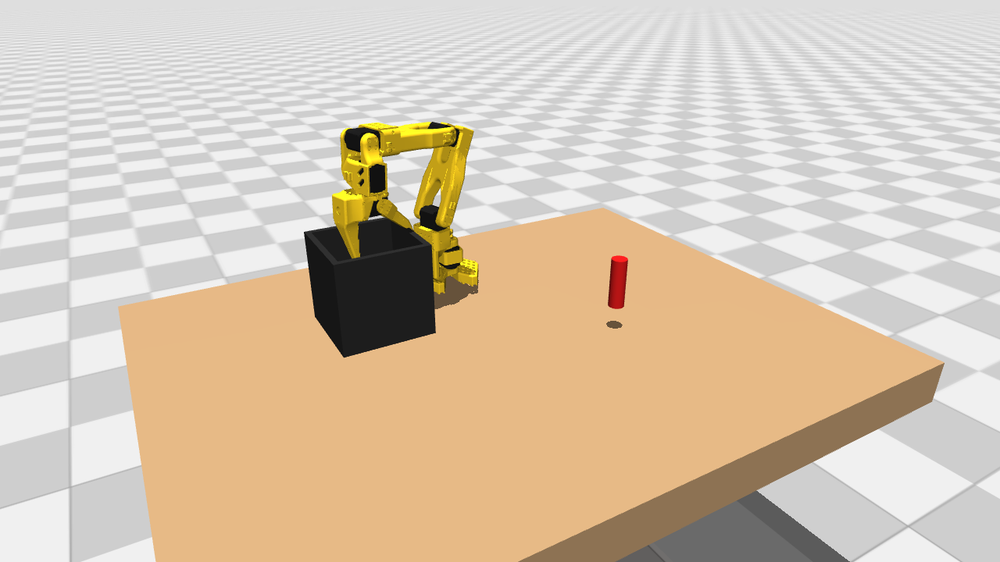
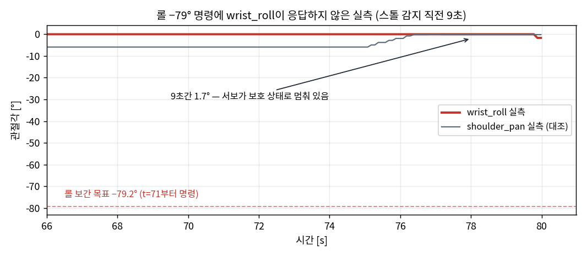

SO-101 로봇팔이 접힌 휴지 자세에서 스스로 펴져서, 뎁스 카메라로 빨간 물체를 찾아 잡고, 상자에 넣고, 다시 접히는 것까지가 오늘 목표였어요. 결과부터 보면 이렇게 끝났어요.

<figure class="fig"><figcaption>손목캠 시점의 최종 하강과 파지예요. 가로로 누운 체스말에 맞춰 손목 롤을 돌린 채 내려가요.</figcaption></figure>

여기까지 오는 동안 팔이 이유 없이 죽는 사건이 네 번 있었어요. 서보 여섯 개가 일제히 응답을 멈추고, 팔이 주저앉고, 전원을 뽑았다 꽂아야만 살아나요. USB 허브를 의심했고, 12V 어댑터 용량을 의심했고, 교체한 서보의 불량을 의심했는데 전부 아니었어요. **진범은 소손 사고를 막겠다고 서보 EEPROM에 제가 직접 써 넣은 과부하 보호 설정이었어요.** 그 결론까지의 관문들을 순서대로 적어요. 이 팔을 처음 세운 기록은 [[2026-08-14_회고_so101_브링업_서보버스와_영점|SO-101 브링업 — 버스 서보 ID 충돌과 EEPROM 영점 캘리브레이션]]에 있어요.

## 관문 1 — 온도 판독 77°C가 수 분간 1°C도 안 변했어요

1

증상펴기 중 shoulder_lift 온도가 35→<b>77°C</b>로 점프, 소프트 가드(62°C)가 즉시 토크 컷 → 팔 낙하

판별판독이 수 분간 고정(진짜 열은 식음) · 케이스는 미지근 · 팔은 수직에 가까워 부하 최소(전류 6) 오독

조치전원 리셋으로 31°C 복귀 확인, 과열 대응을 등급형으로 재설계 고침

토크 컷 자체가 문제였어요. 임의 자세에서 토크를 끊으면 팔이 떨어지는데, 오독 한 번에 그 대가를 치르는 구조였던 거예요. 그래서 대응을 사다리로 바꿨어요 — 감지하면 **이동 정지와 자세 유지**(토크는 켠 채 목표만 현재값으로), 다음 판독에서 실제로 2°C 이상 더 오를 때만 차단, 90°C를 넘는 판독은 물리적으로 불가능하므로 이상치로 폐기, 진입 판정은 같은 모터가 8초 간격 두 번 연속일 때만.

소프트웨어가 토크를 끊지 않아도 되는 근거가 있어요. STS3215 펌웨어에는 자체 과온 보호(65°C)가 있고, 그건 토크를 0으로 끊는 게 아니라 **유지력 20%를 남겨요.** 최후 방어선은 펌웨어가 서고, 소프트웨어는 그 앞에서 이동만 멈추는 분담이 낙하 없는 구성이에요.

이 등급형도 같은 날 한 번 더 다듬어졌어요. 첫 완주 시도의 방출 단계에서 그리퍼 온도가 **122°C**로 튀었는데(직전·직후 실측 36°C — 물리적으로 불가능한 값), 등급형 1단계가 정직하게 개입해서 목표를 현재값으로 고정했고, 하필 그 순간이 그리퍼를 여는 중이라 **개방이 55° 목표를 두고 25.6°에서 멈췄어요.** 물체를 문 채 다음 단계로 가는 건 개방 실측 확인 게이트가 막았지만, 단발 판독 하나가 데모를 끊은 거예요. 그래서 둘을 더했어요 — 90°C를 넘는 판독은 센서·버스 글리치로 보고 폐기, 1단계 진입은 같은 모터가 연속 2회 뜨거울 때만. 진짜 과열이어도 8초 지연은 펌웨어 65°C가 받쳐요.

## 관문 2 — 그리퍼는 상수가 아니라 규약이 필요했어요

2

증상덜 문 채 상승 · 이미 열린 상태에서 또 열어 아랫턱이 젖혀짐 · 파지 후 수 분 뒤 열기 거부

원인고정 sleep · 상대각(delta) 명령 · 목표 0을 남겨 둔 지속 압착 → 펌웨어 Overload 보호

조치절대각 + 정착 폴링 + 압력 해제 규약으로 교체 고침

전부 실물에서 실제로 난 사고들이고, 하나씩 규약이 됐어요. 명령은 **절대각으로만** 보내요. 상대각은 이미 열린 상태에서 또 열라는 명령이 되어 아랫턱이 180° 젖혀진 적이 있어요. 완료 대기는 고정 sleep이 아니라 **정착 폴링**으로 해요. 저속 프로파일에서 전개방이 20초 가까이 걸리는데, 고정 6초는 닫기가 끝나기 전에 팔을 들어올렸거든요. 열기 전에는 현재 위치를 한 번 재전송해요 — 위치 명령 재수신이 펌웨어 보호 플래그를 해제해요. 그리고 파지 직후에는 목표를 현재값으로 되써요. 목표 0을 남겨 두면 접촉 후에도 계속 쥐어짜서 몇 분 뒤 과부하 보호가 걸리고, 그때는 열기 명령이 거부돼요.

## 관문 3 — 도달 판정이 서버보다 엄격해 성공한 이동을 실패로 읽었어요

3

증상파지 후 들어올리기가 "도달 시간 초과"로 중단 — 그런데 서버 로그에는 "이동 완료"가 찍혀 있음

원인클라이언트 도달 기준 1.5° &lt; 서버 기준 3.0° — 1.5°와 3.0° 사이에서 정착한 이동은 영영 미도달

조치이 이동이 만든 <b>새</b> "이동 완료" 로그 + 잔차 3.5° 미만이면 도달로 판정 고침

리치 경계 근처에서는 중력 정착 잔차가 커져요 — 실측으로 어깨 관절이 1.2°에서 멈추는 게 정상이라 클라이언트 기준을 1.5°로 잡아 뒀는데, 경계 자세에서는 그보다 큰 잔차로 정착하는 이동이 나와요. 서버는 자기 기준(3.0°)으로 완료를 선언했는데 클라이언트는 계속 기다리다 타임아웃했고, 실패 사유에 진짜 상태(이미 도달)가 가려졌어요. 판정 기준이 두 군데면 둘 중 엄격한 쪽이 유령 실패를 만들어요. 완료의 근거를 "내 잔차 계산"에서 "실행 주체의 완료 선언"으로 옮기되, 이전 이동의 완료 로그를 오인하지 않도록 이 이동이 만든 새 로그인지 확인하고 잔차 상한(3.5°)을 이중으로 걸었어요.

## 관문 4 — 방향 파지와 시뮬 미러까지 얹어 완주했어요

4

구성뎁스캠 RGB에서 빨강 블롭 검출 → 광선∩평면으로 (x, y) → 해석적 IK → 파지

방향누운 물체의 장축을 로봇 좌표로 투영, 죠 닫힘축이 직교하도록 손목 롤 역산

결과가로로 누운 물체 파지 → 상자 투하 → 휴지 복귀 완주 성공

위치 추정은 깊이값 없이 돌아가요. 고무 물체는 구조광 깊이가 안 잡혀서, 블롭 중심 픽셀이 정의하는 시선 광선을 hand-eye 변환(13점 자동 순회로 캘리브레이션한 카메라→로봇 R·t)으로 로봇 좌표에 옮기고, "물체 중심 높이의 수평면"과 교차시켜 (x, y)를 얻어요. IK는 학습이나 수치 최적화가 아니라 **닫힌형 기하**예요 — 베이스 회전은 atan2에 어깨 오프셋 보정, 어깨·팔꿈치는 평면 2링크를 코사인 법칙으로, 손목 롤은 위치와 독립인 자유 축이라 방향 정렬에 그대로 써요.

방향 파지에서 상수 하나가 실측으로 나왔어요. 손목 롤과 죠가 닫히는 방향의 관계를 시뮬 모델의 두 손끝 좌표로 재니 **닫힘축 = pan − 94.3° + roll**로 전 자세에서 선형이었고, 물체 장축에 직교하도록 롤을 역산하면 돼요. 롤 0에 숨어 있던 잔여 비틀림 4.3°도 이 식이 같이 보정해요.

정합 자체도 교차 검증을 거쳤어요. hand-eye는 두 솔버를 같이 돌려요 — 깊이가 잡히는 관측은 대응점 3차원 정합(Kabsch), 깊이가 없어도 되는 방위각+책상평면 방식은 항상. 두 해가 어긋나면 저장을 거부해요. 책상 높이도 두 경로로 쟀어요 — 뎁스 점군 평면 적합의 비접촉 측정과, 팔을 내리며 부하가 꺾이는 지점을 읽는 접촉 측정이 **4.6mm 차이**로 만났고, 그 값이 광선∩평면의 기준면이 돼요. 파지 정밀도가 결국 이 정합 사슬의 끝단이라, 사슬의 각 고리를 독립 측정 두 개로 조이는 구성이에요.

<figure class="fig"><figcaption>MuJoCo 미러예요. 실팔 관절각을 10Hz로 읽어 그대로 넣는 읽기 전용 디지털 트윈이고, 물체와 상자도 실측 좌표로 배치돼요.</figcaption></figure>

시뮬은 계획용이 아니라 **실팔을 비추는 거울**로 붙였어요. 실팔과 시뮬 모델이 같은 URDF 출신이라 관절각을 그대로 넣으면 되는지 28개 자세로 대조했더니 TCP 오차가 0.00mm로 떨어졌어요 — sim-to-real이 아니라 real-to-sim이에요. 부수적으로 확인된 것도 있어요 — 실물 그리퍼가 모델 대비 롤이 90° 돌아 조립돼 있다는 사실을 미러 화면과 실물을 대조하다 발견했어요. 위치 캘리브레이션으로는 절대 안 드러나는 차이예요(TCP가 롤 축 위에 있어서요).

## 관문 5 — 롤 명령에 서보가 응답하지 않고, 버스가 죽었어요

5

증상롤 −79° 명령에 wrist_roll이 9초간 1.7° 이동 → 스톨 감지 → 토크 컷 → 낙하. 직후 서보 여섯 개 전부 무응답

무죄 입증급사 순간 커널 로그(journalctl -k)에 USB 이벤트 0건 — 링크는 살아 있었음. 어댑터도 12V 5A

진범제가 EEPROM에 쓴 <b>Overload_Torque 60% + Protection_Time 0.5초</b> — 정상 이동이 보호에 걸림 자해

<figure class="fig"><figcaption>10Hz 관절각 로그예요. 같은 시간에 shoulder_pan은 정상 주행하는데 wrist_roll은 목표 −79.2°를 두고 0° 부근에 멈춰 있어요.</figcaption></figure>

계층을 하나씩 벗겼어요. USB가 죽었다면 커널에 장치 분리 기록이 반드시 남는데, 급사 시각에 아무것도 없었어요 — 시리얼 링크는 살아 있고 **서보 쪽이 침묵**한 거예요. 그런데 서보가 리부트된 것도 아니에요. 답은 소손 사고 뒤에 "서보가 스스로를 지키게 하자"며 넣었던 보호 설정에 있었어요. 최대 토크의 60%를 0.5초만 내면 보호 진입이라는 조건은, 중력을 이기며 천천히 움직이는 **정상 이동이 정확히 밟는 조건**이에요. 보호에 걸린 서보는 두 가지를 해요 — 출력이 20%로 무너져 팔이 주저앉고(토크가 꺼진 것처럼 보여요), 상태 패킷에 에러 비트를 실어 응답해요. lerobot의 일괄 읽기는 에러 응답 하나에 전체가 실패하니, 한 서보의 보호 진입이 "여섯 개 전부 무응답"으로 보이는 거예요. 전원 리셋으로만 풀리는 것까지 전부 설명이 맞아떨어졌어요.

과부하 계열만 공장값(80%·2초)으로 되돌리고, **과전류 320(약 2.1A)과 과온 65°C는 유지**했어요 — 공장 출하 상태는 과전류 보호가 아예 꺼져 있어서(Protection_Current=0) 그대로 두면 소손이 재발해요. 완화 직후 같은 롤 72° 회전이 아무 문제 없이 돌았고, 관문 4의 완주도 그 뒤에 나온 결과예요.

<b>60% · 0.5s</b>오발한 과부하 임계 (제가 설정)

<b>80% · 2s</b>공장값 복원 — 정상 포락선 밖

<b>320 · 65°C</b>과전류·과온은 유지 (소손 방어)

## 관문 6 — 스톨 대응도 토크 컷이면 안 됐어요

6

증상스톨 감지가 옳게 발화해도 대응이 토크 컷이라 팔이 떨어짐

원인스톨의 위험은 "미는 힘"인데, 토크 컷은 미는 힘과 함께 자세 유지력까지 없앰

조치목표를 현재 위치로 재기록 + 토크 유지 — 미는 힘만 제거 고침

서보가 타는 경로는 "목표가 장애물 너머에 남아 계속 미는 것"이에요. 목표를 현재 위치로 되쓰면 미는 힘은 그 순간 사라지고, 나머지 관절은 자세를 유지해요. 토크를 끊어야 하는 경우는 통신이 죽어 그 재기록조차 못 보낼 때뿐이라, 그 분기만 차단으로 남겼어요.

## 관문 7 — 큐브의 방향과 중심은 이미지가 아니라 3D에서 나왔어요

7

증상4cm 큐브를 대각으로 놓으면 엉뚱한 각도·엉뚱한 위치(좌로 약 24mm)를 잡음

원인이미지 주축은 원근이 가짜 장축을 만들고(실측 −67° vs 실제 약 5°), 블롭 무게중심은 옆면 화소가 카메라 쪽으로 당김

조치깊이 화소를 3D로 올려 "책상 위 높이 2.8~5.5cm" 밴드로 윗면만 선별 → 회전 사각형 적합 고침

세 번 실패하고 얻은 방식이라 실패도 같이 적어요. 이미지에서 바로 주축(PCA)을 재면 윗면과 옆면이 합쳐진 블롭의 원근 때문에 가짜 장축이 나와요. 껍질(convex hull)을 윗면 높이 평면에 투영하는 절충안은 옆면 화소가 카메라 방향으로 번져서 실물 40×40mm가 68×37mm로 늘었고, 적합된 각도는 물체가 아니라 번짐 방향이었어요. 결국 깊이 화소 하나하나를 3D 점으로 로봇 좌표에 올리고 **책상 위 높이로 윗면만 걸러내는** 방식이 정답이었어요 — 회전 사각형의 중심이 파지 목표, 기울기가 면 방향이 돼요. 대각으로 놓인 실물 큐브에서 면 방향 50.4°가 나왔고 육안과 일치했어요. 깊이가 안 잡히는 고무 물체는 이 경로 대신 방향 미제공으로 빠져요 — 틀린 방향으로 도는 것보다 기본 자세로 잡는 쪽이 안전해요.

## 부드러움은 속도가 아니라 가속과 시간 배분에서 나왔어요

속도를 올렸더니 팔이 구간마다 삐걱거렸어요. 원인은 둘이었어요. 서보 가속 레지스터가 높아 구간마다 급출발·급정지를 반복했고(15→8로 낮춰 램프를 두 배 완만하게), 관절 보간 시간이 이동량과 무관하게 3초 고정이라 짧은 구간은 굼뜨고 긴 구간은 속도 상한에 눌려 계획된 프로파일과 실제 속도가 어긋났어요. 보간 시간을 "최대 관절 이동량 ÷ 속도 상한"의 거리 비례(0.8초에서 5초 사이)로 바꾸니 구간 연결이 일정한 흐름이 됐어요. 궤적을 부드럽게 만드는 변수는 최고 속도가 아니라 **가속 램프와 구간별 시간 배분**이라는 게 오늘의 실감이에요.

녹화 파이프라인에서도 함정이 둘 나왔어요. MJPEG 스트림을 그대로 mp4로 받으면 ffmpeg이 25fps로 가정해 **실제 10fps 영상이 2.5배속으로 기록돼요** — 벽시계 타임스탬프 옵션으로 잡았어요. 그리고 기록 중인 mp4를 중간에 끊으면 인덱스(moov)가 없어 통째로 깨지는데, fragmented mp4로 기록하면 어느 시점에 끊겨도 그 앞까지는 유효한 파일로 남아요.

## 임계는 정상 포락선 밖에, 판정은 실측으로

오늘 고장의 절반은 제가 만든 안전장치였어요. 62°C 온도 컷은 오독 한 번에 팔을 떨어뜨렸고, 60%·0.5초 과부하 보호는 정상 이동을 급사로 만들었고, 스톨 토크 컷은 감지가 맞아도 낙하를 냈어요. 공통 구조는 하나예요 — **보호 임계가 정상 작업 포락선 안에 들어와 있으면, 그 보호는 위험을 줄이는 게 아니라 새 고장 모드가 돼요.** 임계는 정상 동작의 실측 분포를 먼저 재고 그 밖에 걸어야 하고, 걸린 뒤의 대응도 "가장 강한 차단"이 아니라 "위험 성분만 제거"(미는 힘 제거, 이동만 정지)가 기본이어야 해요.

이 관문들을 실물에서 밟는 비용을 줄여 준 건 모의 리허설이에요. 팔을 움직이는 스크립트는 전부 가짜 패널 서버로 main()을 끝까지 밟는 리허설(현재 20여 사례 — 정상 완주, 개방 거부, 이동 중 거부, 도달 잔차, 대각 물체)을 통과해야 실물에 가요. 오늘 잡힌 결함 중 절반은 실물에 가기 전 리허설 단계에서 걸렸고, 리허설이 없던 초기에 키 이름 오타 하나가 실물 크래시로 이어졌던 것과 대비돼요.

그리고 판정이 갈릴 때마다 결론을 낸 건 프로브가 아니라 실측이었어요. 온도 오독은 판독 추이와 손끝 촉감이, USB 무죄는 커널 로그가, 큐브 방향은 육안 대조가, 파지 성공은 손목캠 사진이 갈랐어요. 추정기와 안전장치는 틀릴 수 있는 구성 요소로 두고, 최종 판정 권한은 항상 독립된 실측에 두는 것 — 오늘 하루를 관통한 기준이에요.
