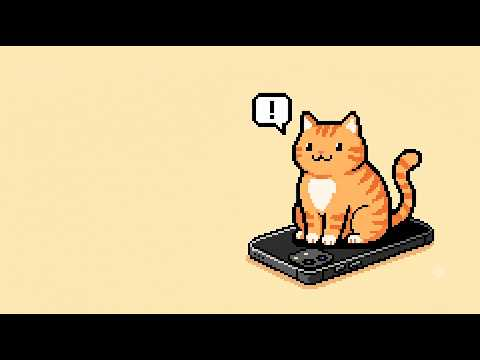
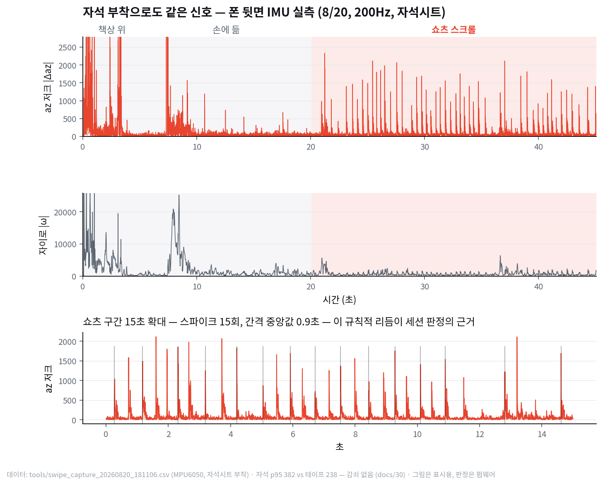
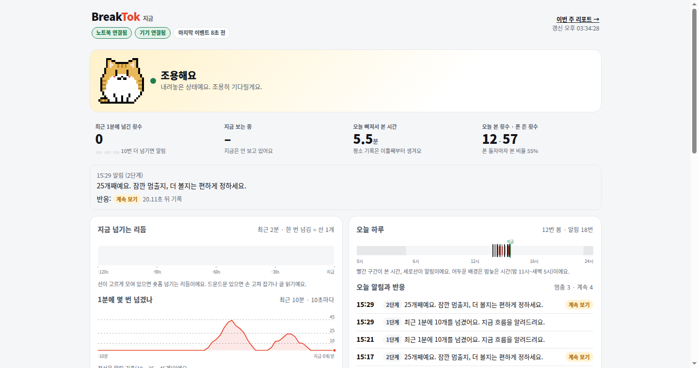
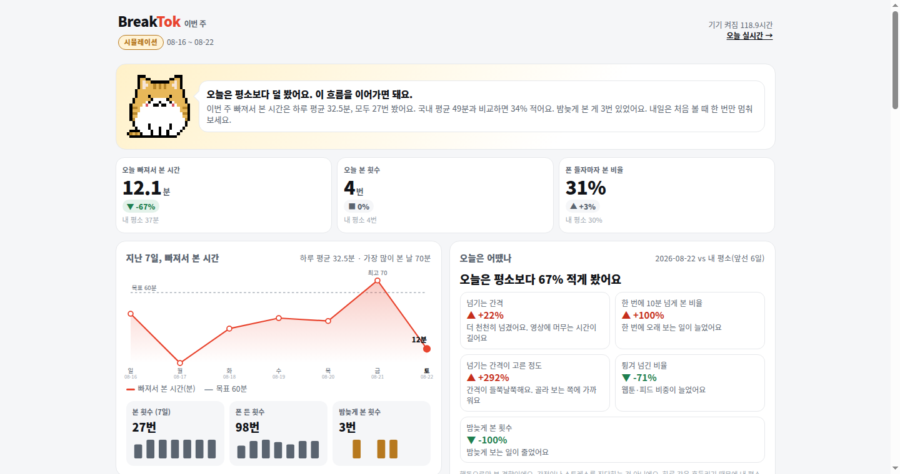

브레이크톡은 숏폼을 줄이고 싶은 사람을 위해 만든, 스마트폰 뒷면에 자석으로 붙이는 작은 기기예요. 앱을 깔거나 화면 권한을 주지 않아도 되고, 기기 안의 움직임 센서(6축 IMU)가 폰에 전해지는 손의 리듬만 읽어서 숏폼을 빠르게 계속 넘기고 있는 순간을 알아차려요. 그 순간 짧은 메시지를 한 번 보내고, 메시지 뒤 20초 안에 멈췄는지 계속 넘겼는지를 그 메시지에 대한 답으로 기록해요. 기록은 텔레그램 푸시와 라이브 화면, 주간 리포트로 돌아오고, 리포트는 총 사용 시간이 아니라 빠져 있던 시간만 따로 보여줘요. 57초짜리 [데모 영상](https://youtu.be/JNRhMsXxMYg)에 붙이기부터 알림·반응 기록·리포트까지 한 흐름으로 담겨 있어요.

<figure class="fig"><figcaption>데모 영상 57초예요. 누르면 유튜브에서 열려요. 폰 뒷면에 붙이고 쇼츠를 넘기면 라이브 화면에 카운트가 오르고, 25개에서 메시지가 오고, 내려놓으면 20초 뒤 "지금 멈춤"으로 기록돼요.</figcaption></figure>

이 기기를 Toython 2026(서울 AI 허브, NUCODE NU-40 DK 필수)에 개인으로 나가 하루 만에 만들어 냈어요. 48팀 중 1차 심사 3위로 본선 20팀에 올라갔고 최종 수상은 아니었어요.

작업 방식부터 적어 둘게요. 펌웨어·게이트웨이·리포트의 코드는 Claude 세션 둘과 Codex 하나가 같은 리포에서 병렬로 썼고, 저는 무엇을 만들지와 어떤 결정을 내릴지를 정하고 현장에서 보드와 폰을 들고 실측했어요. 그래서 아래 관문의 "조치"는 제가 판단한 것이고, 코드 한 줄 한 줄을 제가 친 건 아니에요. 사전 실측은 8월 20일 집에서 ESP32+MPU6050으로, 현장 실기는 22일 NU-40+LSM6DS3TR-C로 했어요.

<figure class="fig"><figcaption>8월 20일 자석시트로 붙인 상태의 실측이에요. 위가 가속도 z축 저크, 가운데가 자이로 크기, 아래가 쇼츠 구간 15초 확대예요. 쇼츠 구간에서만 스파이크가 일정한 간격으로 반복돼요.</figcaption></figure>

## 관문 1 — 단발 임계로는 손에 든 폰과 구분이 안 됐어요

1

증상책상 위 오탐은 0인데 손에 든 상태에서 분당 10개가 스와이프로 잡힘

원인그립 조정·미세 동작이 단발 저크 임계를 넘음 — 손에 든 폰은 원래 조용하지 않음

조치15초 창에 4회 이상 + 간격 변동계수 CV&lt;0.9인 반복 리듬만 세션으로 판정 오탐 0

주채널은 가속도 z축(화면 수직) 저크 |Δaz|예요. 엄지가 화면을 튕길 때 폰 몸체에 전해지는 순간 충격이라, 적응 임계(이동 평균+6σ)와 0.3초 불응기로 이벤트를 뽑았어요. 책상 위에서는 한 건도 안 나왔지만 손에 들고만 있어도 분당 10개가 나왔어요. 임계를 올리면 쇼츠도 같이 빠지고, 내리면 손이 같이 잡혀서 단발 기준으로는 갈림길이 없었어요.

그래서 판정 단위를 이벤트에서 리듬으로 올렸어요. 15초 창 안에 4개 이상이 들어오고 그 간격의 변동계수(표준편차/평균)가 0.9 미만이면 세션이 시작된 걸로 봐요. 쇼츠를 넘기는 간격은 1.3–1.9초로 거의 일정하고 손 조정은 불규칙해서, 같은 데이터에서 쇼츠 구간은 네 창 중 둘이 발화하고 손·책상 구간은 0이었어요. 자이로는 보조로 썼어요. 플릭(짧게 튕김)은 손목이 살짝 돌아 자이로 스파이크가 따라오고 드래그는 병진뿐이라, 세션 안의 동반율이 쇼츠 22%, 웹툰 0%로 갈렸어요. 자석 부착이 신호를 먹을까 봐 테이프와 비교했는데 p95가 382 대 238로 오히려 자석 쪽이 컸어요.

<b>0</b>건 · 손·책상 오탐

<b>1.3–1.9</b>초 · 쇼츠 간격

<b>22 / 0</b>% · 플릭 동반율 쇼츠/웹툰

<b>382 / 238</b>az 저크 p95 자석/테이프

보드는 원시 IMU를 보내지 않아요. 판정을 nRF52840 안에서 끝내고 BLE NUS로 `EVT,swipe|pickup|knock|drop|toss`, `ST,<state>,<플릭%>`, `HB,<state>,<누적>`만 내보내요. 화면 데이터는 물론이고 센서 값도 기기 밖으로 안 나가는 구조라, 심사 질문에 "원리는 TapLogger·TouchLogger 같은 보안 연구가 먼저 증명했고 저희는 그걸 셀프케어에 뒤집어 쓴다"고 답할 수 있었어요.

## 관문 2 — 현장 센서가 바뀌어 있었어요

2

증상사전 실측은 MPU6050(0x68), 현장 지급품은 LSM6DS3TR-C(0x6A) — 레지스터 맵이 전혀 다름

원인공지의 "6축 IMU"만 보고 모델을 확정했던 것

조치드라이버만 교체하고 감지 상수 4종은 그대로 이식, 불응기 0.3→0.5초 통과

펌웨어에서 센서에 닿는 층은 초기화와 14바이트 읽기뿐이라 이식 자체는 한 시간 안에 끝났어요. 대신 빠른 스크롤(1초에 1개)에서 한 동작이 0.31초 간격의 두 건으로 잡히는 중복이 보여서 불응기를 0.5초로 올렸고, 재측정에서 0.5초 미만 간격은 0건, 최소 간격은 0.63초였어요. 정확도는 느린 속도에서 27/25, 빠른 속도에서 31/30으로, 과소가 아니라 약간의 과대였어요. 축 정렬은 부착 방향이 달라질 수 있어 중력 벡터로 세로 파지를 판정하고, 그 전환을 픽업으로 쓰는 쪽으로 뒀어요.

현장 운영에서 나온 함정

배터리 없이 USB만 꽂은 상태로 폰을 만지면 케이블이 흔들려 보드가 리부팅돼요. 이날 BLE 끊김·재연결이 11번 났는데 전부 USB·배터리 탈착이나 낙하 충격이었고, 게이트웨이에 자동 재연결 루프를 넣고서야 데모가 이어졌어요. 부착 테스트와 촬영은 배터리 장착 상태로 해야 해요.

## 관문 3 — 내려놓으면 세션 종료 신호가 없었어요

3

증상로그에 <code>sess_start</code> 뒤 <code>sess_end</code> 없이 또 <code>sess_start</code>

원인세션 종료는 60초 무활동에만 걸려 있었고, 자세가 풀리면 조용히 IDLE로 떨어짐

조치내려놓기 전이에서도 같은 종료 함수로 <code>ST,idle,&lt;플릭%&gt;</code> 송신, 리포트는 고아 3종을 별도 처리 고침

이건 리포트 지표를 설계하다가 계획 리뷰 단계에서 잡혔어요. 사람이 스크롤을 끝내는 가장 흔한 방식이 "폰을 내려놓는 것"인데, 펌웨어는 그 경로에서 종료 요약을 안 보내서 유형 판정(쇼츠형/일반)이 통째로 빠졌어요. 펌웨어에 공통 종료 경로를 넣었고, 그래도 연결 도중에 붙거나 끊기면 고아가 생기니 지표 엔진은 세 경우를 따로 셌어요. 시작 뒤 종료 없이 또 시작이면 앞 세션을 마지막 스와이프에서 닫고 유형 미상으로, 파일 끝 전에 안 닫힌 시작과 첫 시작 전의 종료는 제외하고 개수를 화면에 적어요.

세션 길이 자체도 보정이 필요했어요. 펌웨어는 4개가 쌓인 뒤에야 시작을 쏘고 60초를 쉰 뒤에야 종료를 쏘니, 원시 Δt는 머리가 잘리고 꼬리가 붙어요. 리포트는 "시작 직전 15초 안의 첫 스와이프부터 마지막 스와이프까지"를 길이로 써요. 이 정의 문장은 화면 맨 아래에 그대로 노출했어요. 조사에서 말하는 "한 번 앉으면 21분"과 센서 세션은 같은 단위가 아니라서, 비교 블록에는 참고 비교라고 적었어요.

## 관문 4 — 하트비트가 세션 종료로 오독됐어요

4

증상idle 상태에서 5초마다 "세션 종료·쇼츠형" 헛경보

원인<code>ST,idle</code>의 3번째 필드에 종료 시엔 플릭%, 주기 브로드캐스트 땐 누적 개수를 실어 의미가 둘

조치주기 메시지를 <code>HB</code>로 분리, 펌웨어·게이트웨이·대시보드·문서를 한 커밋에 고침

이 버그를 찾은 건 사람이 아니라 검사 스크립트였어요. 세션 셋이 같은 워킹트리를 동시에 만지니 펌웨어와 게이트웨이의 프로토콜 문자열이 갈라질 위험이 컸고, 통보에 기대는 대신 `check_protocol.py`가 펌웨어가 내보내는 토큰과 게이트웨이가 분기하는 토큰, 하달 명령, 감지 상수 4종을 대조하게 했어요. 만들자마자 "ST,idle의 3번째 필드가 두 의미로 전송됨"이 걸렸고, 그대로 두면 누적 스와이프가 15개를 넘는 순간부터 데모 내내 헛메시지가 떴을 거예요. 이 검사는 `pre-commit` 훅으로 내려서 규칙 파일을 안 읽는 Codex 세션도 못 피하게 했어요.

같은 워킹트리 병렬 세션에서 실제로 난 사고

파일 단위로만 스테이징해도 상대가 미커밋 수정 중인 파일이면 그 변경까지 흡수돼요. 게이트웨이의 재연결 루프가 제 멘트 수정 커밋에 딸려 들어갔어요. 공유 파일은 스테이징 전에 <code>git diff &lt;파일&gt;</code>로 상대 덩어리가 섞였는지 보고, 섞였으면 <code>git add -p</code>로 제 것만 올려야 해요. 리허설용 mock 로그가 실측 집계에 섞인 것도 같은 종류의 문제라 첫 줄에 <code>kind=mock</code>을 찍어 자동 제외했어요.

## 관문 5 — 버튼과 집중 모드를 제품에서 뺐어요

5

증상들기·붙이기·케이블 꽂기 충격이 노크로 오인돼 집중 모드가 몰래 켜지고 알림이 사라짐(실기 3회)

원인2연타 노크와 취급 충격이 같은 저크 대역 — 가드를 넣어도 데모를 조용히 죽이는 실패 모드

조치집중 모드·보드 버튼 제거, 협상은 메시지 뒤 20초의 행동으로 판정 판정 4/4

개입 설계는 처음부터 "차단하지 않는다"였어요. 폰 안의 도구는 끄면 그만이고, 강제 차단은 스트레스를 올린다는 RCT가 있어요. 원안은 보드 버튼 두 개로 "5분 더 / 지금 멈춤"을 고르게 하는 거였는데, 현장에서 버튼과 노크 둘 다 취급 충격 오발이 잦았고, 생각해 보면 누를 버튼이 있으면 거짓 답도 있어요. 그래서 메시지 뒤 20초 창(앞 5초는 읽는 시간으로 제외) 안에 스와이프가 이어지면 "계속 보기"(5분 유예), 멈추면 "지금 멈춤"(60초 쿨다운)으로 그 메시지에 대한 답을 기록하게 바꿨어요. 이 choice·level·latency 로그가 JITAI(취약성과 수용성의 타이밍) 개인화의 재료이고, Time2Stop(CHI 2024)이 적응형 개입으로 정확도 +32.8%를 보인 지점이에요. 현장 판정 4건은 20.05–20.38초 지연으로 전부 기록됐어요.

멘트 톤도 여기서 바뀌었어요. 초기 코치는 "슬슬 10개째예요. 알고는 계시라고요" 같은 문장이었는데, 디톡스 제품이라도 그렇게 건방지게 말하면 안 된다는 지적을 받고 전부 바꿨어요. "25개째예요. 잠깐 멈출지, 더 볼지는 편하게 정하세요"처럼 상태를 알리고 선택은 맡기는 문장으로, OpenAI 멘트 프롬프트에도 비꼬거나 훈계하지 않는다는 줄을 넣었어요.

## 관문 6 — 푸시 헬퍼 import가 데모를 죽일 수 있었어요

6

증상텔레그램 헬퍼가 자격증명이 없으면 <code>SystemExit</code>, 전송은 15초 블로킹

원인BLE notify 콜백(hot path)에서 import 호출 — <code>except Exception</code>으로는 <code>SystemExit</code>이 안 잡히고 이벤트 루프가 멈춤

조치<code>subprocess.Popen</code>으로 자식 프로세스 격리, 로그에는 전송 성공이 아니라 <code>spawned</code>만 기록 푸시 12

이건 계획 리뷰에서 아키텍트 역할이 잡아 준 항목이에요. 가장 극적인 컷(2단계 알림)에서 정확히 게이트웨이가 죽는 시나리오였고, 고치는 방법은 import가 아니라 격리였어요. 부모는 자식이 어떻게 죽든 무사하고 블로킹도 0이에요. 대신 "띄웠다"와 "보냈다"는 다른 사실이라 로그 필드 이름을 `spawned`로 바꿔 정직하게 적었어요. 메시지 끝에는 라이브 화면 링크를 붙여서 폰에서 누르면 지금 상태가 열리게 했어요.

<figure class="fig"><figcaption>현장 실기 데이터로 채워진 라이브 화면이에요. 최근 2분의 넘김이 선으로, 오늘 하루가 타임라인으로, 알림마다 반응(지금 멈춤/계속 보기)이 칩으로 보여요.</figcaption></figure>

## 관문 7 — 리포트는 지표 구현을 하나로 묶었어요

7

원안폰 PWA가 IndexedDB에서 직접 지표 계산 + 게이트웨이도 계산 — 구현 둘

문제"파이썬이 단일 진실"이라는 원칙이 JS 엔진이 생기는 순간 자기모순, PWA는 HTTPS 없이는 검증도 안 됨

조치<code>weekly_metrics.py</code>만 계산해 <code>report.json</code>을 만들고 화면은 그리기만, 헤드리스 Chrome으로 DOM 수치를 JSON과 대조 통과

리포트는 총 사용 시간이 아니라 빠져서 본 시간만 보여줘요. 쇼츠형 세션 길이의 합, 오늘 대 내 평소(앞선 날들 중앙값), 폰 들자마자 본 비율(5분 디바운스 분모, 60초 분자), 밤늦게 본 횟수, 기기가 켜져 있던 시간, 그리고 넘기는 간격·오래 본 비율·간격이 고른 정도를 평소와 비교한 행동 경향 한 줄이에요. 경향은 감정이나 스트레스 진단이 아니라는 문장을 같이 띄워요. 실측 7일이 없어서 화면은 시뮬 7일 픽스처로 채우고 배지를 박았고, 실측 빌드와 시뮬 빌드는 파일을 분리해 한 화면에 섞이지 않게 했어요.

국내 기준선은 원문을 직접 대조한 수치만 썼어요. kt 나스미디어 2026 NPR(n=2,000)의 매일 시청 82.5%와 3회 이상 60.5%, 컨슈머인사이트 2025 상반기(14세 이상 n=3,151)의 1회 연속 시청 21분, CJ메조미디어 2026(만 15–59세 n=1,000)의 하루 42분과 연령별 58·49·41·34·38분은 PDF 차트를 눈으로 재확인했고, 2024년 연도별 수치는 미검증이라 뺐어요. 화면 용어는 마지막에 전부 일상어로 바꿨어요. 세션은 "본 횟수", 스와이프는 "넘김", 기준선은 "내 평소", 쇼츠형은 "숏폼", 심야는 "밤늦게"로요.

<figure class="fig"><figcaption>주간 리포트예요(7일 시뮬레이션 배지). 고양이 코치는 상태마다 포즈가 바뀌고, 비교 블록은 연령대를 바꾸면 바와 문장이 함께 바뀌어요.</figcaption></figure>

## 하루의 숫자

<b>258</b>스와이프 (13:48–15:22)

<b>11 / 10</b>세션 시작/종료

<b>16</b>개입 (L1 10 · L2 6)

<b>3 / 3</b>계속 보기 / 지금 멈춤

<b>4</b>낙하 toss (14–23cm) · drop 0

<b>12</b>텔레그램 푸시

낙하는 자유낙하(|a|&lt;0.3g 150ms 이상) 뒤 충격의 접촉 지속시간으로 소파 연착지와 경질면을 가르는데, 현장에선 가방·손바닥으로 네 번 떨어뜨려 전부 toss로 잡혔고 경질면은 시험하지 않았어요. 높이 추정(½gt²)은 실제와 맞았어요.

## 단위를 먼저 정하고 모든 층이 그 단위를 쓰게 해요

관문 일곱 개를 관통하는 기준은 하나였어요. 무엇을 셀지를 먼저 정하고, 센서·펌웨어·리포트·화면이 같은 단위를 쓰게 하는 거예요. 이벤트가 아니라 리듬을 세니 오탐이 사라졌고, 총량이 아니라 세션을 세니 "한 번 앉으면 21분"이라는 조사와 같은 줄에 놓을 수 있었고, 버튼이 아니라 행동을 세니 거짓 답이 없어졌어요. 지표 구현을 한 곳에 두자 화면이 몇 개로 늘어도 숫자가 갈라지지 않았고, 프로토콜 문자열을 기계가 대조하자 세션 셋이 같은 파일을 만져도 데모가 살아남았어요.

하드웨어는 보드 하나, 센서 하나예요. 부품이 적은 건 약점이 아니라 원가와 인증 리스크가 적고 소프트웨어로 계속 바꿀 수 있다는 뜻이라고 심사에서 말했고, 그 말이 맞으려면 소프트웨어 쪽의 단위가 흔들리면 안 돼요. 다음은 오늘 쌓인 로그로 검출 정확도를 재고, 노트북 게이트웨이를 폰 앱으로 옮기고, 줄이고 싶은 사람 열 명이 2주를 써 보는 거예요.

---

<!-- src-block -->
출처 — https://blog.nasmedia.co.kr/entry/2026NPRusersurveyinsight-1shortform · https://www.consumerinsight.co.kr/up_files/숏폼%20한번%20보면%20평균%2021분%204명%20중%203명%20유튜브로%20본다.pdf · https://cdn.cjmezzomedia.com/attach-file/insight-m/01_MezzoMedia_2026_Digital_Lifestyle_Report_Shortform_20260528134817.pdf · https://dl.acm.org/doi/10.1145/3613904.3642747 · https://www.cse.psu.edu/~sxz16/papers/taplogger.pdf · 데모 영상 https://youtu.be/JNRhMsXxMYg
