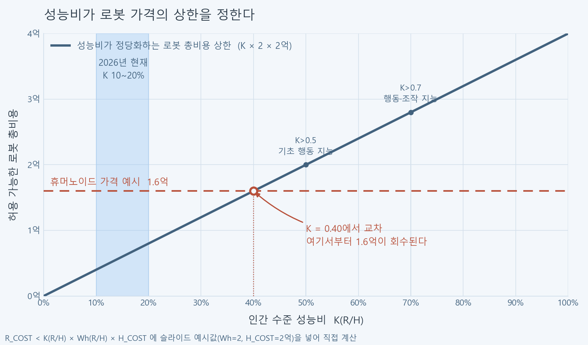
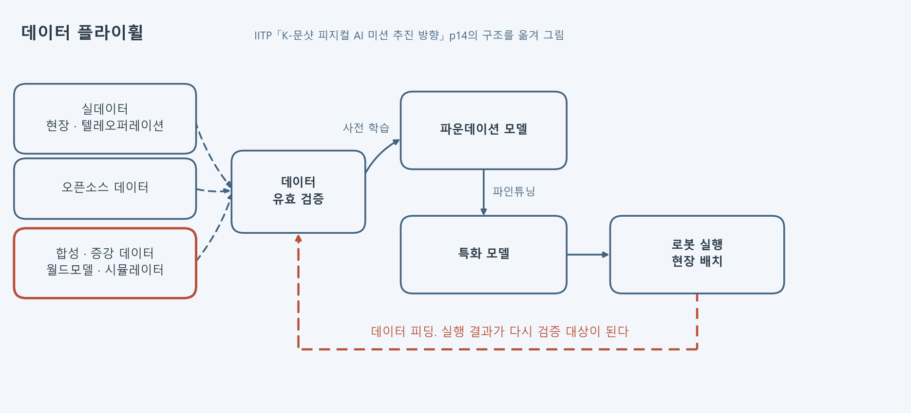
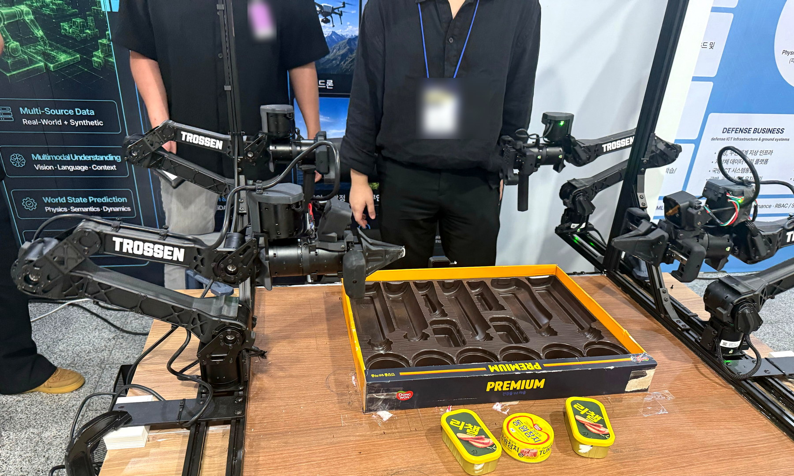

8월 25일 국회의원회관에서 열린 K-피지컬AI 세미나를 참관했어요. 정보통신기획평가원이 발표한 K-문샷 로드맵에서 걸린 대목은 1단계(2026~2029)의 첫 항목이 로봇도 모델도 아닌 데이터였다는 점이에요. 왜 데이터가 먼저인지는 같은 발표의 앞 장에 있는 부등식 하나가 설명해요.

## 성능비가 로봇 가격의 천장을 정한다

발표는 피지컬AI 경제학의 기준으로 부등식 하나를 제시했어요.

```
R_COST < K(R/H) × Wh(R/H) × H_COST
```

`R_COST`는 로봇의 총 비용(OPEX와 CAPEX)이고, `H_COST`는 그 일을 하던 작업자에게 나가는 총 지불 비용(인건비와 부대비용)이에요. `Wh(R/H)`는 로봇과 사람의 근무시간 비율이라 로봇이 16시간 돌면 2가 돼요. `K(R/H)`는 사람의 작업 성능 대비 로봇의 성능비고요.

식을 읽는 방향을 뒤집으면 **성능비가 로봇 값의 천장을 정한다**는 뜻이 돼요. 발표에 붙은 예시값(Wh 2, H_COST 2억)을 그대로 넣어 계산해 봤어요. K가 10%면 회수되는 로봇 값이 4천만 원, 20%면 8천만 원이에요. 1.6억짜리 휴머노이드가 팔리려면 K가 0.4를 넘어야 하고, 발표가 잡은 2026년 현재 값은 10~20%예요. 지금은 두 배에서 네 배가 모자란 자리에 있어요.

<figure class="fig"><figcaption>부등식에 발표 예시값을 넣어 직접 계산한 값이에요. 파란 띠가 2026년 현재 구간이고, 붉은 선이 예시로 든 휴머노이드 값 1.6억이에요.</figcaption></figure>

로드맵의 시간표가 이 계산 위에 얹혀 있어요. 2단계를 2030년으로 잡고 3단계를 2033년으로 잡은 건 기술 난이도만의 문제가 아니라, 그 사이에 K가 손익이 맞는 구간을 통과해야 한다는 계산이에요.

## 성능비는 성공률 하나가 아니다

K(R/H)의 정의 박스에는 항목이 일곱 개 들어가요. 작업 성공율, 작업 속도, 일반화, 고정밀, 장기 작업, 오류 복구, 안정성과 안전성이에요. 데모에서 잘 되는 것과는 다른 종류의 지표예요. 성공률만 올려서는 한 칸도 못 올라가고, 처음 보는 물건에서도 되고 실패한 뒤 스스로 복구하고 몇 시간 이어져도 무너지지 않아야 움직여요.

임계도 두 곳에 끊어 놨어요. 0.5를 넘으면 인간 수준 기초 행동 지능, 0.7을 넘으면 행동·조작 지능으로 부르고 그 위를 AGI급으로 표기해요. 앞의 계산과 붙여 보면 0.5는 2억짜리, 0.7은 2.8억짜리 로봇까지 회수되는 지점이에요.

지난달 그리퍼로 집기를 붙일 때 성공 판정이 무엇을 세는지에 걸렸던 것과 같은 문제가 여기서도 나와요. 성공률은 정의하기 쉬워서 먼저 재게 되는데, 실제로 도입 여부를 가르는 항목은 오류 복구나 장기 작업처럼 재기 번거로운 쪽에 몰려 있어요.

## 그래서 1단계 첫 항목이 데이터다

로드맵 1단계의 플라이휠 축에서 별표가 붙은 항목은 둘이에요. 피지컬AI 인프라 구축, 그리고 피지컬 AI-Ready 골든 데이터셋 구축이에요.

데이터의 정의도 같은 장에 나와요. **관찰 + 상호작용 + 상태 + 문맥**이에요. 관찰은 비디오와 LiDAR와 소리, 상호작용은 힘·토크·접촉 피드백, 상태는 로봇 자신의 관절값, 문맥은 지시와 환경과 전문기술 설명이에요. 영상만 쌓아서는 안 되는 이유가 이 정의 안에 있어요. 힘과 토크는 로봇이 실제로 물건에 닿아 봐야 생기는 값이라 인터넷에서 긁어올 데가 없어요.

<figure class="fig"><figcaption>발표 자료 p14의 플라이휠 구조를 옮겨 그렸어요. 붉은 점선이 현장 실행 결과가 되돌아오는 경로예요.</figcaption></figure>

순환은 이렇게 돌아요. 실데이터와 오픈소스 데이터와 합성 데이터가 유효 검증을 거쳐 사전 학습으로 들어가 파운데이션 모델이 되고, 프로젝트 데이터로 파인튜닝해 특화 모델이 되고, 로봇에 올려 현장에서 돌린 결과가 다시 검증 대상으로 돌아와요. 2026년 착수 과제 넷 중 첫째가 `AI모델(RFM+WFM) 피지컬 AI 선도기술개발`인 것도 같은 그림 위에 있어요. 행동을 내는 로봇 파운데이션 모델과 다음 장면을 예측하는 월드 파운데이션 모델을 한 축으로 묶어 개발한다는 구성이에요.

## 실물 궤적 하나의 값

로비 부스에 놓인 리그가 이 그림의 왼쪽 위 칸이었어요. 알루미늄 프레임 위에 로봇팔 네 대가 리더 둘과 팔로워 둘로 마주 보고, 팔로워 손목에 카메라가 달려 있어요. 조작자가 리더암을 손으로 움직이면 팔로워가 같은 자세를 따라가고, 그 관절값과 영상이 한 궤적으로 기록되는 구조예요.

<figure class="fig"><figcaption>부스 배경 패널의 문구가 Multi-Source Data (Real-World + Synthetic)예요. 실물 수집 리그 뒤에 합성 데이터를 나란히 적어 둔 배치가 그대로 플라이휠 그림이에요.</figcaption></figure>

작업물은 통조림 캔 세 개와 캔을 눕혀 담는 트레이 하나였어요. 캔 하나를 홈에 넣는 궤적을 사람이 팔을 잡고 한 번 만들어야 한 개가 쌓이는 셈이에요. 이 대목이 실감으로 붙는 건 지난주에 5축 팔로 집기를 돌리면서 구간 보간 시간을 이동량에 비례하도록 고쳐 잡았기 때문이에요. 궤적 하나를 쓸 만하게 만드는 데 캘리브레이션과 속도 프로파일 조정이 앞에 붙어야 했고, 그것도 로봇 한 대의 이야기였어요. 골든 데이터셋을 국가 과제로 세우는 이유가 여기서 읽혀요.

## 비용을 낮추는 쪽이 합성 데이터

그래서 플라이휠의 입력 세 갈래 중 합성·증강 데이터가 붙어 있어요. 월드 모델과 시뮬레이터가 그 자리를 맡고, 범용 핵심 기술 목록에도 월드모델과 시뮬레이터가 나란히 들어가요. 세미나 발표 중 한 꼭지도 월드 파운데이션 모델이었고, 인재 양성 발표에서는 한 기업의 데이터 팩토리가 Isaac Sim 기반이라는 줄이 형광으로 강조돼 있었어요.

시뮬레이터로 데이터를 만들면 수집 비용은 내려가지만 대신 실물과 벌어진 틈을 메우는 문제가 붙어요. 어제 사족보행 강화학습 진입을 설계하면서 표준 커리큘럼을 정리했는데, 평지 속도 추종 다음이 험지 커리큘럼이고 그다음이 마찰·질량·지연·노이즈를 흔드는 도메인 랜덤화였어요. 시뮬레이터의 파라미터에 정책이 과적합되는 걸 깨는 단계가 커리큘럼 안에 고정 항목으로 들어 있다는 뜻이에요. 로드맵이 데이터 유효 검증을 플라이휠의 첫 관문으로 그려 둔 것도 같은 이유로 읽혀요. 합성 데이터를 늘리는 순간 "이 데이터가 실물에서도 성립하는가"가 병목이 되니까요.

## 플라이휠을 누가 돌리나

마지막 발표는 이 순환을 돌릴 조직 이야기였어요. 대학 한 곳과 협동로봇 기업, 피지컬AI 기업이 연구협력센터를 세우고 그 센터의 이름을 피지컬AI 데이터팩토리로 붙였어요. 데이터가 과제 이름이 아니라 조직 이름이 된 사례예요.

같은 발표의 인재 정의 세 유형 중 둘째가 문제 해결형이었어요. 산업 현장의 미해결 난제를 로봇 기술과 AI 알고리즘으로 돌파하는 능력으로 정의해 놨어요. 앞의 K(R/H) 항목표와 겹쳐 놓으면 왜 그 정의가 나왔는지가 보여요. 오류 복구와 장기 작업과 안전성은 논문 한 편으로 끊어지는 항목이 아니라 현장에서 실패를 만나고 원인을 좁히는 일을 반복해야 올라가는 값이에요.

지표를 알고 나니 다음에 잴 것이 정해졌어요. 사족보행 학습에서 보상 항목을 하나씩 빼 보는 실험을 돌릴 참인데, 거기서 나올 수치를 속도 추종 성공률 하나로 적지 않고 외란을 준 뒤의 회복률까지 같이 남기려 해요. K(R/H)가 성공률 하나로 안 세지는 지표라면, 내 기록도 같은 모양이어야 대조가 되니까요.

앞선 기록은 [[2026-08-22_회고_브레이크톡_IMU_리듬판정과_행동협상|IMU 스와이프 리듬 판정과 행동 기반 협상으로 만든 숏폼 감지 기기]]에 있어요. 그때 스와이프 258개를 직접 쌓아 임계를 잡았던 게 이번에 본 그림의 맨 왼쪽 칸이었어요.

출처 — https://physicalaikorea.kr/
