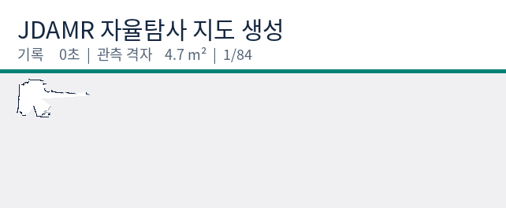
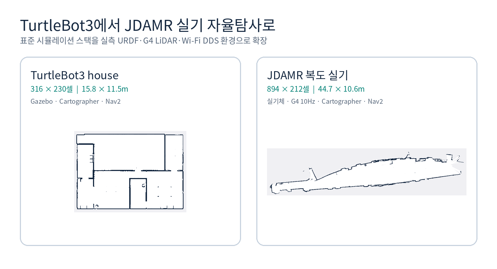

장애물이 충분히 멀리 있는 복도 중앙에서도 JDAMR이 반복해서 멈췄어요. RViz 화면만 보면 stop zone이 넓어 보였지만, 안전 여유를 줄이는 것만으로는 해결되지 않았어요. 같은 증상을 차체 좌표, 라이다 관측, 경로 판정, Wi-Fi DDS 지연이 각각 만들 수 있었기 때문이에요.

한 원인을 성급하게 고르지 않았어요. 하드웨어·연결, URDF·TF·LaserScan, frontier·costmap, DDS freshness로 확인 범위를 나눴어요. 각 계층의 입력과 최종 판단 주체를 대조한 뒤, 같은 안전 여유와 경로를 여러 곳에서 다시 판단하던 부분을 정리했어요.

SO101 팔을 연결하기 전, JDAMR 차체만으로 Cartographer SLAM과 Nav2 자율탐사를 다시 실행했어요. 최종 상태는 `FINISHED`, 지도 저장은 `succeeded`였고 894×212셀 지도를 남겼어요.

JDAMR은 강사님이 제작한 차동구동 기체예요. 이번 기록은 기체를 평가하는 내용이 아니라, 센서 구성을 G4로 바꾸고 실제 장착과 네트워크 조건이 정해진 뒤 소프트웨어 모델을 실물에 맞춘 통합 과정이에요.

<b>기체</b>JDAMR · 팔 미장착
<b>SLAM</b>Cartographer · 0.05m/셀
<b>주행</b>Nav2 · Regulated Pure Pursuit
<b>탐사</b>frontier · 목표 1개씩
<b>라이다</b>YDLIDAR G4 · 10Hz

  

최종 상태

FINISHED

저장 succeeded

  

최종 지도

894×212

44.7×10.6m

  

누적 경로

45.018m

odom 적분

  

최대 속도

0.174m/s

기록 구간

  

회귀 테스트

95

전부 통과

<figure class="fig"><figcaption>전체 bag의 /map 1,529개 가운데 84개를 시간 순서로 뽑았어요. 마지막 정적 지도는 이후 저장된 894×212셀 파일을 별도로 검증했어요.</figcaption></figure>

## TurtleBot3 기준선과 실기에서 달라진 문제

앞선 TurtleBot3 house 실험에서는 Gazebo, Cartographer, Nav2, frontier 노드를 한 컴퓨터에서 돌렸어요. 지도는 316×230셀이고 범위는 15.8×11.5m였어요. 표준 패키지의 URDF와 센서 프레임이 이미 맞아 있어 [점유 격자 해석과 frontier 선택](https://mmporong.github.io/robotics-garden/physical-ai/2026-08-10_회고_탐사가_벽옆만_맴돈_이유)에 집중할 수 있었어요.

실물에서는 한 시점의 관측만 맞는 것으로 끝나지 않았어요. 스캔 시간축과 이동 중 갱신되는 지도를 함께 다뤄야 한다는 점은 [[2026-08-19_첫_프레임을_버렸어요|첫 프레임 앵커를 버리고 17km를 재구성한 SLAMFormer-∞]]에서 살펴본 긴 시간축의 일관성과도 맞닿아 있어요.

JDAMR에서는 같은 frontier 알고리즘보다 알고리즘 바깥의 계약이 먼저 문제였어요. 차체 외곽은 URDF에서 읽어야 했고, 교체한 G4의 스캔 시간축과 `laser_link`를 일치시켜야 했어요. 로봇과 노트북 사이 DDS 지연도 안전 고장과 회복 가능한 지연으로 나눠야 했어요.

<figure class="fig"><figcaption>TurtleBot3는 알고리즘 기준선이고 JDAMR은 실물 기구·센서·통신을 포함한 통합 검증이에요. 환경이 다르므로 지도 크기를 성능 순위로 비교하지 않았어요.</figcaption></figure>

멈춤을 만든 경계를 네 개로 좁혔어요. 여기서 중요한 건 값을 한꺼번에 완화한 일이 아니라, 누가 후보를 만들고 누가 통과 가능성을 판단하며 누가 실제 속도를 막는지 책임을 한 번씩만 두는 일이었어요.

1

<h4>본체 박스와 실제 주행 외곽이 달랐어요</h4>

증상장애물이 멀리 있는데도 넓은 stop zone과 clearance가 겹쳐 후보와 통로를 함께 줄였어요

원인frontier 전처리와 Nav2 footprint가 각각 차체 반경을 크게 잡아 같은 여유를 두 번 계산했어요

조치URDF의 캐스터·바퀴 외곽으로 0.46×0.40m footprint를 계산하고, 최종 충돌 판정은 costmap에 맡겼어요 URDF 일치

2

<h4>라이다 부품과 장착이 바뀌면 센서 계약도 바뀌어요</h4>

증상LD14P 기준의 형상·드라이버·장착 좌표를 G4 구성에 그대로 쓸 수 없었어요

원인센서 모델, 광학 중심, 0도 방향, 스캔 주기가 TF와 LaserScan 메시지에 함께 들어가기 때문이에요

조치G4를 바퀴축 중앙 z=0.1m에 두고 yaw=π를 반영했어요. 10Hz·9kHz 전용 드라이버와 URDF 단일 고정 TF를 사용했어요 G4 적용

3

<h4>planner가 만든 경로를 원본 지도로 다시 거부했어요</h4>

증상Nav2가 경로를 만들었는데 frontier 노드가 다른 시점의 /map을 읽고 같은 목표를 취소했어요

원인Cartographer의 rolling map과 Nav2 global costmap은 갱신 시점과 원점이 같지 않아요

조치<code>allow_unknown=false</code>인 동기화 costmap과 planner의 비어 있지 않은 경로를 최종 판정으로 삼았어요 책임 단일화

4

<h4>통신 지연과 안전 고장이 같은 PAUSED로 모였어요</h4>

증상이동 중 map·scan·TF·odom 중 하나가 잠깐 늦어도 목표가 취소되고 수동 재개를 기다렸어요

원인시작 전 freshness gate와 이동 중 fail-closed 조건을 같은 목록으로 검사했어요

조치이동 중 일시적 데이터 공백은 Nav2와 Collision Monitor가 회복하게 두고, 안전 노드 이탈·명령권 충돌·저전압·probe abort만 latch했어요 고장 분리

## URDF에서 footprint를 계산했어요

현재 URDF의 본체 상자는 0.18×0.18m지만 바닥과 간섭하는 외곽은 더 커요. 전후 캐스터 중심은 x=±0.20m이고 반지름은 0.03m예요. 좌우 바퀴 중심은 y=±0.175m이고 폭은 0.05m라서 최종 주행 외곽은 x=±0.23m, y=±0.20m가 돼요.

Nav2 local·global costmap의 footprint를 이 네 점으로 통일했어요. StopZone은 각 방향으로 0.05m, SlowdownZone은 0.15m만 더했어요. frontier의 clearance는 후보 전처리용 0.10m로 낮추고 차체 형상과 인플레이션은 costmap이 맡게 했어요. 안전 여유를 줄인 값이 아니라, 서로 다른 계층이 같은 여유를 중복 계산하지 않게 나눈 값이에요.

## G4 LiDAR를 URDF와 LaserScan에 함께 반영했어요

G4는 바퀴축 중앙에 장착했고 케이블 출구가 후면을 향해 `laser_joint`의 yaw를 π로 두었어요. URDF의 시각·충돌 원통도 G4 크기인 지름 72.3mm, 높이 41.2mm에 맞췄어요. `robot_state_publisher`가 고정 TF를 한 번만 발행하고 라이다 런치는 별도 static transform을 만들지 않아요.

전용 드라이버는 10Hz 회전과 9kHz 샘플 속도로 `/scan`을 만들어요. `LaserScan.header.stamp`는 스캔 시작 시각이고 `time_increment`에는 광선 간 시간이 들어가요. 배열은 측정된 시간 순서를 유지하며 range는 0.28m에서 16.0m로 제한했어요. 센서 교체를 launch 파일 한 줄로 끝내지 않고 형상, TF, 시간축을 같은 변경 단위로 묶었어요.

## frontier와 costmap의 책임을 갈랐어요

Cartographer의 관측 경계에는 미지값 -1 바로 안쪽에 49와 50 부근의 셀이 생겨요. frontier 자유 문턱을 50, 장애물 문턱을 65로 두고 경계 후보를 찾았어요. 장애물까지 최소 간격만 전처리하고, 실제 차체가 지나갈 수 있는지는 Nav2 costmap이 판단해요.

경로 검사도 같은 원칙으로 바꿨어요. frontier 노드는 후보를 만들고 Nav2 `ComputePathToPose`에 물어요. `allow_unknown=false`인 global costmap에서 비어 있지 않은 경로가 돌아오면 그 결과를 사용해요. 조금 늦게 도착한 원본 `/map`으로 같은 경로를 다시 검사하지 않으니 rolling map 갱신 사이의 경쟁이 사라졌어요.

## Wi-Fi 지연을 복구 가능한 상태로 남겼어요

시작과 재개에서는 map, scan, TF, odom, 배터리, planner, navigator, Collision Monitor, 명령 소유권이 모두 최신이어야 해요. 출발 전 검사는 그대로 엄격하게 유지했어요.

목표가 진행 중일 때는 역할이 달라져요. map·scan·TF·odom의 짧은 freshness 공백은 Nav2 controller가 costmap을 기다리고 Collision Monitor가 최종 속도를 제한해요. frontier 노드가 같은 한 표본으로 목표를 취소하면 통신이 회복돼도 사람이 다시 눌러야 하므로 이 네 항목은 이동 중 latch에서 뺐어요. Collision Monitor 비활성, action server 이탈, `/cmd_vel` 소유권 충돌, 저전압은 여전히 즉시 중단 조건이에요.

관측용 `/scan`과 `/odom` 구독은 BEST_EFFORT로 바꾸고 Nav2 lifecycle 노드는 별도 프로세스로 띄웠어요. controller는 10Hz, TF tolerance는 controller 0.5초와 costmap 0.7초, Collision Monitor source timeout은 2초로 두었어요. 위치 0.05m뿐 아니라 각도 0.05rad의 변화도 진행으로 인정해 제자리 정렬을 정지로 오인하지 않게 했어요.

## 두 rosbag으로 결과와 한계를 함께 남겼어요

전체 bag은 32분 12.8초 동안 253,334개 메시지를 기록했어요. `/scan` 13,658개, `/odom` 85,497개, `/tf` 74,031개와 지도·경로·속도·배터리를 함께 담았어요. 종료 시 recorder가 전송 계층 메시지 5,194개 손실을 보고했으므로 모든 센서 표본이 완전한 기록은 아니에요.

조정 후 bag은 Wi-Fi 부하를 줄이려고 고율 센서의 중복 원격 구독을 빼고 4분 54.4초 동안 Nav2 경로, local·global costmap, 세 단계 속도 명령, 탐색 상태를 기록했어요. 이 구간에는 `PAUSED`가 없었고 마지막 상태는 `FINISHED`, `save=succeeded`, `readiness_missing=none`이었어요. 최종 PGM과 YAML, 두 bag, 화면 녹화에는 SHA-256 값을 남겨 파일 변형도 확인할 수 있게 했어요.

[jdamr_cube_ros 저장소](https://github.com/mmporong/jdamr_cube_ros)는 강사님 제작 기체의 통합 소스를 다뤄 현재 비공개로 관리해요. 아래 링크는 접근 권한이 있는 계정에서 재현할 때 쓰는 고정 리비전이에요. 이번 연속 주행 변경은 [d15a3cf](https://github.com/mmporong/jdamr_cube_ros/commit/d15a3cf16fc68705b58fa3c6094aca730b38d999), 현재 운용 문서까지 포함한 리비전은 [c36f19e](https://github.com/mmporong/jdamr_cube_ros/commit/c36f19e8e291eadf41705ad6ece4a421a7fce811)예요. 구현 파일은 [frontier_core.py](https://github.com/mmporong/jdamr_cube_ros/blob/c36f19e8e291eadf41705ad6ece4a421a7fce811/jdamr_cube_navigation/jdamr_cube_navigation/frontier_core.py), [frontier_explorer.py](https://github.com/mmporong/jdamr_cube_ros/blob/c36f19e8e291eadf41705ad6ece4a421a7fce811/jdamr_cube_navigation/jdamr_cube_navigation/frontier_explorer.py), [nav2_params.yaml](https://github.com/mmporong/jdamr_cube_ros/blob/c36f19e8e291eadf41705ad6ece4a421a7fce811/jdamr_cube_navigation/config/nav2_params.yaml), [URDF](https://github.com/mmporong/jdamr_cube_ros/blob/c36f19e8e291eadf41705ad6ece4a421a7fce811/jdamr_cube_description/urdf/jdamr_cube.urdf), [G4 드라이버](https://github.com/mmporong/jdamr_cube_ros/tree/c36f19e8e291eadf41705ad6ece4a421a7fce811/ydlidar_g4_ros2)로 나뉘어요.

## 지도 완주 다음에는 localization 재현성을 확인해야 해요

TurtleBot3에서 만든 frontier 알고리즘은 JDAMR에서도 그대로 중심에 있었어요. 실기 완주를 가른 것은 알고리즘을 더 복잡하게 만든 일이 아니라, URDF·LaserScan·costmap·DDS가 각자 책임질 판정을 한 번씩만 하게 만든 일이었어요. 같은 안전 여유를 두 번 더하거나 같은 경로를 서로 다른 시점의 지도에서 두 번 검사하면 보수성이 안전으로 남지 않고 주행 불능으로 바뀌어요.

이번에 확인한 범위는 Cartographer 지도 생성과 frontier 자율탐사의 종료·저장이에요. 저장 지도를 다시 불러온 localization 재현성까지 확인한 결과는 아니에요.

### 다음 작업 체크리스트

- [ ] 저장한 `autonomous_20260826T161908.yaml`을 map server로 불러오고 AMCL 초기 자세가 수렴하는지 확인해요. 수렴 시간, 최종 위치 오차와 covariance를 기록하면 완료예요.
- [ ] 같은 Nav2 목표 묶음을 세 차례 이상 반복해 성공·취소·복구 횟수를 남겨요. 각 실행의 최종 action 상태와 이동 거리도 함께 기록해요.
- [ ] RViz에서 초기 자세를 일부러 어긋나게 준 뒤 재지역화를 확인해요. 다시 수렴하기까지 걸린 시간과 실패 조건을 남겨요.
- [ ] 같은 복도 순환 경로를 반복해 loop closure 전후의 벽 겹침과 pose jump를 비교해요. 비교 화면과 rosbag을 같은 실행 ID로 묶어요.
- [ ] 원본 센서가 필요한 bag은 로봇 쪽에서 기록하고, 노트북은 경로·상태·제어 토픽 위주로 나눠 기록해요. 종료할 때 transport loss와 토픽별 메시지 수를 함께 남겨요.
- [ ] SO101 팔을 장착한 뒤 새 URDF에서 footprint와 무게중심을 다시 계산해요. 저속 수동 주행, Collision Monitor, 반복 목표 순서로 차체 기준선을 다시 확인해요.

이번 지도는 팔을 달기 전 차체 기준선이에요. G4는 높이 약 0.1m의 한 평면만 보므로 투명체, 검거나 반사되는 재질, 센서 평면보다 낮거나 높은 장애물을 모두 검출하지는 못해요. Collision Monitor도 안전 인증 장치가 아니어서 작업자 감시와 물리 전원 차단을 대체하지 않아요. 팔을 장착한 뒤에는 합성 footprint와 무게중심이 바뀌므로 같은 계산을 새 URDF에서 다시 시작해야 해요.
