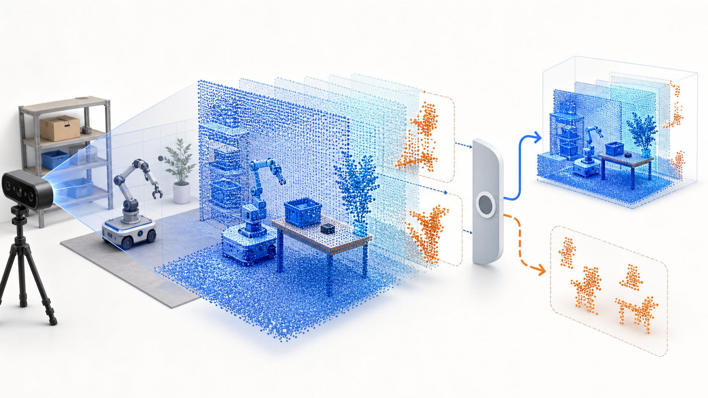
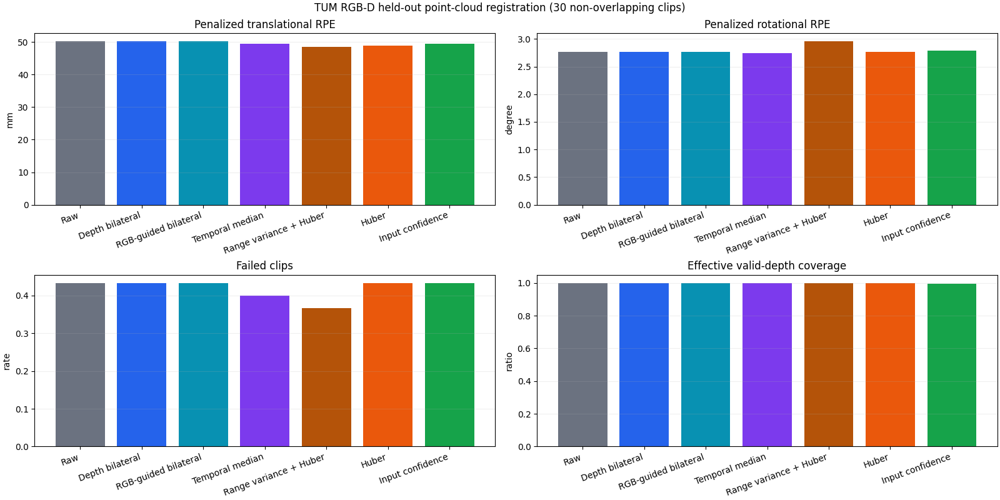
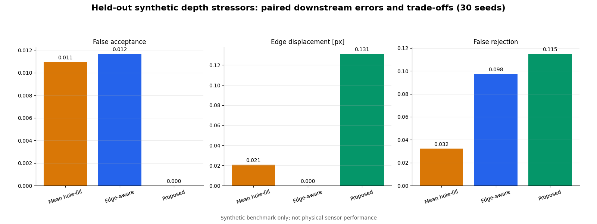
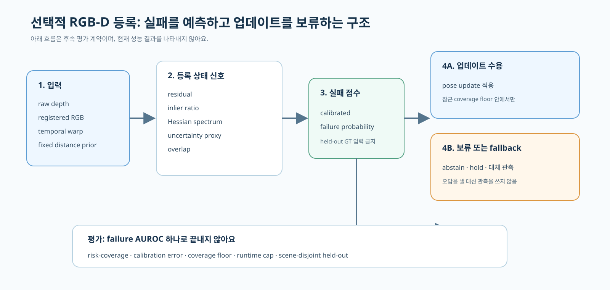

TUM RGB-D의 두 held-out sequence에서 input-confidence ICP는 Huber ICP보다 translation error를 줄이지 못했어요. confidence를 더 정교하게 만드는 일과 위험한 등록 업데이트를 미리 알아채는 일은 같은 문제가 아니었습니다.

<figure class="fig"><figcaption>점군 등록을 모두 통과시키지 않고, 신뢰할 업데이트와 보류할 입력을 나누는 선택적 registration 개념도예요. 실험 장면이나 성능 결과를 재현한 그림은 아니에요.</figcaption></figure>

## 평균 오차가 비슷해도 실패의 비용은 같지 않아요

Frame-to-frame registration은 두 깊이 프레임의 대응점을 맞춰 상대 회전과 이동을 구해요. 이 추정이 틀리면 한 프레임의 오차로 끝나지 않고 odometry와 지도에 누적됩니다. 그래서 평균 relative pose error(RPE)만 낮추는 방법은 드문 큰 실패를 놓칠 수 있어요.

공개 benchmark는 development의 `fr1/xyz`와 겹치지 않게 held-out 30개 clip을 만들었어요. Held-out은 `fr1/desk` 15개와 `fr3/structure_texture_near` 15개이며, clip 하나는 5개 frame으로 구성했어요. clip 안의 네 relative pose를 한 군집으로 묶어 bootstrap했지만, 두 sequence 자체를 독립 모집단으로 보지는 않았습니다.

Huber ICP의 평균 penalized translation RPE는 48.826mm, input-confidence ICP는 49.569mm였어요. 짝지은 차이를 `Huber - input-confidence`로 두면 -0.743mm이고 95% clip-bootstrap 구간은 [-2.514, 0.810]mm였습니다. 0을 가로지르므로 translation superiority 조건은 기각됐어요. 회전·실패율·유효 깊이 coverage의 비열등 조건이 통과했어도 주효과 하나가 실패하면 전체 우월성 주장을 살리지 않았습니다.

<figure class="fig"><figcaption>TUM RGB-D 두 held-out sequence의 30개 비중첩 clip에서 얻은 기술통계예요. Input confidence는 translation superiority gate를 통과하지 못했고 주가설은 기각됐어요. (데이터: Sturm et al., TUM RGB-D · CC BY 4.0; 도표: 직접 생성)</figcaption></figure>

Sequence별 방향도 달랐어요. `fr1/desk`에서 `Huber - input-confidence`는 -2.612mm였지만 `fr3/structure_texture_near`에서는 1.127mm였습니다. 사후 subgroup이라 새 가설 검정으로 쓰지는 않았지만, 하나의 평균이 장면 조건을 대표하지 못한다는 신호는 남았어요.

## Confidence 가중치와 실패 확률은 다른 출력이에요

Point-cloud registration에서 confidence는 보통 correspondence에 줄 가중치로 쓰여요. CVPR 2024의 Inlier Confidence Calibration도 부분 중첩 점군에서 대응점의 inlier confidence를 보정한 뒤 weighted SVD로 변환을 계산합니다. 이런 방법은 대응점 선택을 개선하지만, 최종 pose update가 catastrophic failure인지 확률로 알려 주는 장치와 같지는 않아요.

현재 benchmark에서도 이 경계가 보였어요. Confidence의 공간 위치만 섞은 대조군은 48.759mm로 input-confidence의 49.569mm보다 낮았어요. 현재 confidence map의 공간적 보정 이점이 확인되지 않았다는 뜻입니다. 반대로 confidence 크기를 뒤집자 translation RPE는 97.883mm, failed clip 비율은 0.867, coverage는 0.167이 됐어요. 잘못된 confidence가 등록을 망칠 수 있다는 민감도는 보였지만, 올바른 confidence가 실패를 예측한다는 근거는 아직 없어요.

Calibration은 예측한 확률과 실제 빈도가 맞는지를 묻습니다. 비슷한 실패 점수를 받은 등록들을 모았을 때 실제 실패 빈도도 그 점수에 가까워야 해요. Registration residual이 작거나 inlier ratio가 높다는 사실만으로 이 조건이 자동으로 성립하지 않습니다.

## 보류는 정확도와 coverage를 함께 바꿔요

Selective prediction은 불확실한 입력에서 답을 내지 않는 reject option을 둬요. 이 틀을 registration에 옮기면 risk는 수용한 pose update의 오류, coverage는 전체 후보 중 실제로 적용한 비율이 됩니다. 임계값을 높이면 위험한 update를 더 많이 막을 수 있지만 정상 update도 함께 버려 coverage가 줄어요.

여기서 기존 그림의 `effective valid-depth coverage`를 selective coverage로 바꾸어 부르면 안 돼요. 전자는 유효 깊이 화소의 비율이고, 후자는 등록 업데이트를 수용한 비율입니다. 이름이 비슷해도 분모와 결정 단위가 다릅니다.

앞선 합성 validity-gate 실험도 같은 비용을 보여 줬어요. 30개 seed의 dropout·flying-edge·multipath stressor에서 proposed gate의 false acceptance 기술통계는 0이었지만 edge displacement와 false rejection 비용이 남았어요. Seed-paired edge-displacement 차이의 95% 구간이 0을 가로질렀고, false-reject 증가 구간은 미리 정한 0.10 한계를 넘었습니다. 일부 지표가 좋아도 전체 가설은 기각했어요.

<figure class="fig"><figcaption>합성 stressor의 기술통계예요. Proposed gate는 false acceptance를 낮췄지만 edge displacement와 false rejection을 함께 통과하지 못해 사전 정의한 전체 가설이 기각됐어요. 실제 카메라 성능이나 안전 한계를 나타내지 않아요.</figcaption></figure>

## 후속 실험은 실패를 먼저 정의해야 해요

다음 질문은 residual, inlier ratio, Hessian spectrum, uncertainty proxy, overlap으로 catastrophic failure를 예측할 수 있는지예요. 단순 residual threshold, inlier-ratio threshold, Hessian condition number, logistic predictor를 최소 baseline으로 두고, 복잡한 모델은 그 뒤에 비교해야 해요. 가장 단순한 기준보다 좋아지지 않으면 독립 방법 논문으로 이어갈 이유가 없습니다.

Catastrophic label은 predictor 점수와 held-out 결과를 보기 전에 고정해야 해요. Scene과 sequence를 development·held-out에 나눠 같은 장면이 양쪽에 섞이지 않게 하고, 기존 결과를 이미 연 TUM sequence는 새 confirmatory 후보로 재사용하지 않습니다. 평가도 failure AUROC 하나로 닫지 않고 risk-coverage, calibration error, coverage floor, runtime cap을 함께 잠가야 해요.

<figure class="fig"><figcaption>선택적 registration의 후속 평가 계약이에요. 이 구조는 구현·검증할 항목을 정리한 것이며, risk-coverage나 failure AUROC가 개선됐다는 결과가 아니에요.</figcaption></figure>

## 로봇 파이프라인에는 결정 근거까지 남겨야 해요

실제 로봇에 적용하려면 pose만 발행해서는 실패 분석이 끊겨요. Registration 노드는 pose와 함께 residual, inlier ratio, spectrum 요약, overlap, 실패 점수, 수용 여부, 보류 사유를 같은 timestamp와 trial ID로 기록해야 합니다. 보류했을 때는 마지막 pose를 무기한 재사용하지 말고, 속도를 낮추거나 wheel odometry·IMU 예측으로 짧게 전환한 뒤 재관측하는 조건을 따로 정해야 해요.

관측을 어느 좌표계로 넘길지 먼저 고정하는 문제는 [[2026-07-20_관측을_로봇의_좌표로_옮기면|관측을 로봇 좌표계로 옮겨 VLA 시점 취약성을 줄인 로봇 중심 포인트맵]]에서도 다뤘어요. 여기서는 표현 좌표계보다 앞단에서, 등록 업데이트 자체를 적용할지 보류할지 판단하는 데 범위를 좁혔습니다.

포트폴리오 증거도 성공 궤적 한 장보다 이 결정 구조가 더 설명력이 있어요. 한 rosbag에서 입력 frame, 등록 결과, 실패 점수, accept/abstain, fallback 전환을 연결하고, 정상 사례와 잘못 수용한 사례, 불필요하게 거부한 사례를 같은 지표로 보여 주면 됩니다. 다만 이 구현은 아직 수행 결과가 아니라 다음 실험의 설계안이에요.

현재 확인된 결론은 input-confidence ICP의 translation 우월성이 기각됐다는 데까지예요. Selective registration은 그 실패에서 나온 새 연구 질문이며, 신규성 검토와 scene-disjoint held-out 평가를 통과하기 전에는 개선 방법이라고 부를 수 없습니다. **실패를 적게 만드는 것과 실패할 때 업데이트를 멈추는 것은 따로 검증해야 해요.**

출처 — https://cvg.cit.tum.de/data/datasets/rgbd-dataset

출처 — https://doi.org/10.1109/IROS.2012.6385773

출처 — https://proceedings.neurips.cc/paper_files/paper/2017/hash/4a8423d5e91fda00bb7e46540e2b0cf1-Abstract.html

출처 — https://proceedings.mlr.press/v70/guo17a.html

출처 — https://openaccess.thecvf.com/content/CVPR2024/html/Yuan_Inlier_Confidence_Calibration_for_Point_Cloud_Registration_CVPR_2024_paper.html
