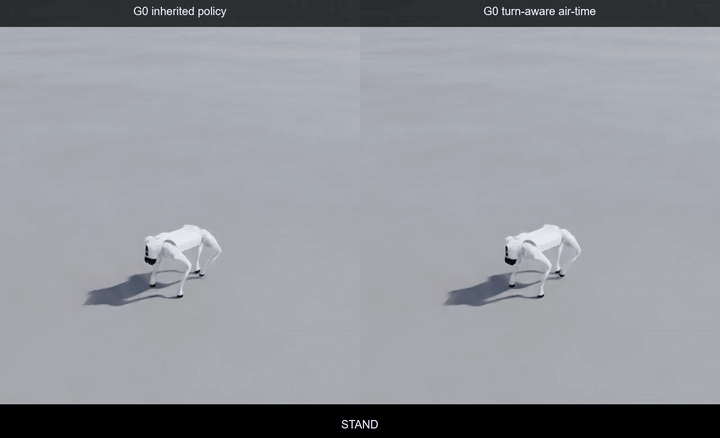
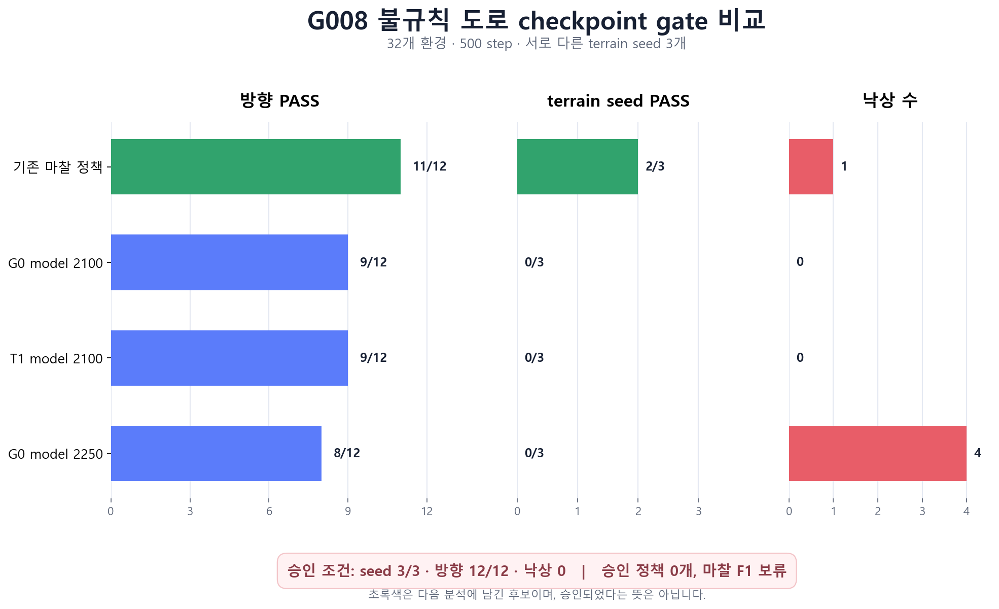

Unitree Go2가 높낮이 있는 도로에서 앞뒤 이동과 좌우 회전을 모두 수행하도록 PPO를 다시 학습했어요. 이번 단계에서는 도로 형상만 먼저 바꾸고 마찰은 고정했어요. 기존 정책, 도로 적응 정책 G0, 제자리 회전에도 발 체공 보상이 켜지는 정책 T1을 같은 조건으로 비교했어요.

결과부터 말하면 기존 정책이 12개 방향 평가 중 11개를 통과해 가장 나았어요. 하지만 세 번째 지형 seed의 우회전에서 넘어져 최종 승인은 받지 못했어요. 새로 학습한 G0와 T1도 모든 seed에서 우회전 기준을 넘지 못했어요. 화면에서는 걷고 회전했지만, 정량 gate를 통과한 정책은 0개였어요.

<figure class="fig"><figcaption>왼쪽은 도로 형상 적응 정책 G0, 오른쪽은 회전 명령에도 air-time 보상을 주는 T1이에요. 전진, 후진, 좌회전, 우회전을 같은 순서로 재생했어요. 관절을 각본대로 움직인 영상이 아니라 PPO가 매 step마다 12개 관절 action을 낸 결과예요.</figcaption></figure>

## 도로 형상과 마찰을 분리했어요

G0 도로는 평면이 아니에요. 높이 범위는 약 `8.1~8.2 cm`, 측정된 최대 국소 경사는 지형 seed에 따라 `2.48~3.90°`였어요. 다만 바닥의 정지 마찰과 동적 마찰은 모든 구역에서 각각 `0.8`, `0.6`으로 같게 뒀어요.

처음부터 높이와 마찰을 함께 섞으면 우회전 실패가 발 디딤 높이 때문인지 미끄러짐 때문인지 가르기 어려워요. 그래서 이번 비교는 형상 적응을 G0로 고정한 뒤, G0를 세 지형에서 통과한 정책만 마찰 F1으로 보내도록 만들었어요. G0를 통과한 정책이 없었기 때문에 불규칙 마찰 학습은 아직 열지 않았어요.

## 보상 함수에서 바꾼 것은 한 줄이에요

한 control step에서 PPO에 들어가는 총보상은 다음처럼 계산해요.

```text
r_t = 0.02 × Σ(weight_i × raw_term_i)
```

`0.02 s`는 policy timestep이에요. 속도 추적 항은 목표와 실제 속도의 오차가 작을수록 커지는 지수 함수이고, 불필요한 수직 속도, 몸통의 roll·pitch 각속도, torque, 관절 가속도, action 변화량에는 비용을 줬어요.

| 보상 항           |    가중치 | 의도                               |
| ----------------- | --------: | ---------------------------------- |
| x·y 속도 추적     |    `+1.5` | 앞뒤·좌우 속도 명령 추적           |
| yaw 속도 추적     |   `+0.75` | 좌우 회전 속도 추적                |
| 몸통 수직 속도    |    `-2.0` | 튀어 오르는 움직임 억제            |
| roll·pitch 각속도 |   `-0.05` | 몸통 흔들림 억제                   |
| torque            | `-0.0002` | 과도한 구동 억제                   |
| 관절 가속도       | `-2.5e-7` | 급격한 관절 운동 억제              |
| action 변화량     |   `-0.01` | 제어 입력의 급변 억제              |
| 발 체공 시간      |   `+0.01` | 이동 중 발을 교대로 드는 동작 유도 |

기존 `feet_air_time`은 평면 이동 명령의 크기가 `0.1 m/s`를 넘을 때만 켜졌어요. 제자리 회전 명령 `[0, 0, ±0.5 rad/s]`에서는 이 보상이 꺼지는 구조였어요. T1에서는 평면 이동 또는 yaw 명령 절댓값이 `0.1`을 넘으면 같은 항이 켜지도록 gate만 바꿨어요. 나머지 보상 가중치와 PPO 설정은 그대로 유지했어요.

## PPO 학습은 실제로 두 번 실행했어요

두 실험은 Isaac Sim `4.5.0`, Isaac Lab `2.1.1`, RSL-RL `2.3.3`에서 실행했어요. actor와 critic은 각각 `512-256-128` ELU MLP를 썼어요. 한 환경에서 24 step을 모은 뒤 5 epoch, 4 mini-batch로 갱신했고 `gamma=0.99`, `lambda=0.95`, PPO clip은 `0.2`였어요.

| 구분                        |              G0 |              T1 |
| --------------------------- | --------------: | --------------: |
| 병렬 환경                   |             128 |             128 |
| 학습 iteration              |             300 |             300 |
| 수집 transition             |         921,600 |         921,600 |
| optimizer mini-batch update |           6,000 |           6,000 |
| 벽시계 시간                 |       537.494초 |       586.972초 |
| 평균 처리량                 | 2,021.73 step/s | 1,847.79 step/s |
| 최대 VRAM                   |       5,463 MiB |       5,271 MiB |
| 마지막 평균 reward          |           33.64 |           24.06 |

학습 보고서의 `headless=true`는 Isaac Sim 창을 띄우지 않았다는 뜻이에요. 정책은 카메라 화면이 아니라 몸통 속도와 자세, 관절 상태, 목표 속도, 지면 높이 ray 같은 상태 벡터를 받았어요. GIF는 학습이 끝난 checkpoint를 환경 하나에서 다시 불러와 별도로 렌더링했어요.

## checkpoint는 마지막 파일만 고르지 않았어요

먼저 16개 환경과 300 step으로 여러 checkpoint를 선별했어요. 여기서 통과한 후보를 32개 환경, 500 step, 서로 다른 지형 seed 3개로 다시 평가했어요. 네 가지 명령을 세 번 반복한 12개 방향 구간에서 속도 오차, 자세, 낙상을 모두 확인했어요.

<figure class="fig"><figcaption>기존 마찰 정책이 방향과 지형 seed 통과 수는 가장 높았지만 3/3 seed, 12/12 방향, 낙상 0을 동시에 만족하지 못했어요. 초록색은 분석에 남긴 후보일 뿐 승인 정책은 아니에요.</figcaption></figure>

| 후보           | terrain seed PASS | 방향 PASS | 낙상 | 다음 단계 승인 |
| -------------- | ----------------: | --------: | ---: | -------------- |
| 기존 마찰 정책 |               2/3 |     11/12 |    1 | 실패           |
| G0 model 2100  |               0/3 |      9/12 |    0 | 실패           |
| T1 model 2100  |               0/3 |      9/12 |    0 | 실패           |
| G0 model 2250  |               0/3 |      8/12 |    4 | 실패           |

## 영상의 회전과 gate 통과는 다른 문제예요

<figure class="fig"><figcaption>위쪽은 전진과 후진, 아래쪽은 좌회전과 우회전 구간이에요. 한 프레임에서 자세가 유지돼도 전체 구간의 yaw 추적 오차와 낙상 여부까지 함께 봐야 해요.</figcaption></figure>

T1은 세 지형 seed의 우회전 yaw RMSE가 각각 `0.2609`, `0.2752`, `0.2599 rad/s`였어요. 기준 `0.25 rad/s`를 모두 넘었어요. 세 번째 seed에서는 roll과 pitch 최대값도 각각 `0.4311`, `0.3767 rad`까지 올라갔어요.

회전용 air-time gate를 켠 것만으로는 충분하지 않았어요. 현재 항은 발이 다시 닿을 때 `last_air_time - 0.5 s`를 계산해요. 회전 중 짧게 디딘 발은 보상을 받기는커녕 작은 음수가 될 수 있었어요. TensorBoard에서도 T1의 air-time 항이 작은 음수로 남았어요. 보상이 활성화됐다는 사실과 올바른 발 디딤을 강화했다는 사실은 같지 않았어요.

## 다음 학습은 G0 승인 조건부터 회복해요

다음 작업에서는 문제를 네 단계로 더 나눠요.

1. 좌회전과 우회전의 발별 접촉 시간, 체공 시간, 미끄럼 속도를 따로 기록해요.
2. air-time 기준을 `0.50 s`에서 `0.35 s`, `0.25 s`로 낮춘 두 정책을 같은 budget으로 비교해요.
3. 접촉 중인 발의 미끄럼 비용과 지지면 기준 몸통 자세 보상을 분리해 추가해요.
4. G0가 세 지형 seed와 12개 방향을 모두 통과하면 정지·동적 마찰 `0.8/0.6`과 `0.6/0.45`를 섞는 F1을 시작해요.

마찰 범위를 넓히거나 다리 링크 질량을 바꾸는 학습은 이 gate 뒤에 둬요. 형상만 있는 도로에서 우회전을 안정시키지 못한 상태로 변수를 더 섞으면 원인과 효과를 다시 분리하기 어려워져요. 다음 정책도 영상 한 번으로 채택하지 않고 같은 다중 seed 평가를 통과해야 해요.

## 참고한 구현과 연구

Isaac Lab locomotion reward 구현: https://github.com/isaac-sim/IsaacLab/blob/v2.1.1/source/isaaclab_tasks/isaaclab_tasks/manager_based/locomotion/velocity/mdp/rewards.py

Learning to Walk in Minutes Using Massively Parallel Deep Reinforcement Learning: https://proceedings.mlr.press/v164/rudin22a.html

Rapid Locomotion via Reinforcement Learning: https://proceedings.mlr.press/v205/margolis23a.html

Walk These Ways: https://arxiv.org/abs/2107.04034

Extreme Parkour with Legged Robots: https://arxiv.org/abs/2201.08117
