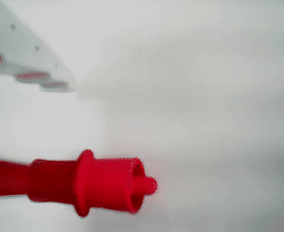

JDAMR은 팔을 달기 전 Cartographer 자율탐사와 지도 저장까지 마쳤고, SO-101에는 손목 카메라 기반 파지 경로가 있어요. 저장 지도를 다시 불러온 localization 주행은 아직 실측 전이고, 현재 차량 자세의 반복 파지 성공도 입증하지 못했어요. 두 기능을 차례로 호출한다고 모바일 매니퓰레이션이 완성되지는 않아요. 주행이 끝났다는 소프트웨어 응답과 차체가 실제로 멈춘 상태는 다르고, 팔이 물체를 들었다는 판정과 운반 가능한 자세도 별개의 증거이기 때문이에요.

현재 세 저장소의 실행 경로와 안전 제한을 대조해 통합 순서를 다시 잡았어요. 이번 범위는 아키텍처와 테스트 명세예요. 새로운 mission coordinator나 권한 노드는 아직 구현하지 않았고 실차 통합 주행도 실행하지 않았어요.

<b>베이스</b>JDAMR · Nav2 Jazzy
<b>팔</b>SO-101 · 손목 RGB
<b>경로 추종</b>Regulated Pure Pursuit
<b>속도 종단</b>Collision Monitor
<b>운용 범위</b>고정 작업대 · 작업자 감독

  

모바일 기준선

16

검사 묶음 통과

  

주행 회귀

95

로컬 테스트 통과

  

대시보드 회귀

26 + 27

unit · integration

  

최근 픽

0 / 4

교시 재확인 필요

<svg viewBox="0 0 920 380" width="100%" role="img" aria-label="대시보드, 미션 코디네이터, 베이스 모션 게이트와 팔 권한 데몬으로 나뉜 모바일 매니퓰레이션 권한 구조"><text x="460" y="24" text-anchor="middle" font-size="14" font-weight="650" fill="var(--dark)">구현할 목표 권한 구조(현재 미구현)</text><rect x="310" y="45" width="300" height="54" rx="5" fill="none" stroke="var(--lightgray)"/><text x="460" y="68" text-anchor="middle" font-size="12" fill="var(--dark)">Dashboard</text><text x="460" y="86" text-anchor="middle" font-size="10" fill="var(--gray)">관찰 · start · cancel, 물리 권한 없음</text><line x1="460" y1="99" x2="460" y2="126" stroke="var(--darkgray)"/><path d="M460 126 l-5 -8 h10 z" fill="var(--darkgray)"/><rect x="280" y="126" width="360" height="66" rx="5" fill="none" stroke="var(--sv-mid)" stroke-width="2"/><text x="460" y="150" text-anchor="middle" font-size="12" fill="var(--dark)">Mission Coordinator</text><text x="460" y="168" text-anchor="middle" font-size="10" fill="var(--gray)">FSM · write-ahead safety ledger · idempotency</text><text x="460" y="183" text-anchor="middle" font-size="10" fill="var(--sv-mid)">NONE ACK 두 개가 모인 뒤 새 epoch 발급</text><line x1="360" y1="192" x2="220" y2="230" stroke="var(--darkgray)"/><path d="M220 230 l4 -9 l7 7 z" fill="var(--darkgray)"/><line x1="560" y1="192" x2="700" y2="230" stroke="var(--darkgray)"/><path d="M700 230 l-11 -2 l7 -7 z" fill="var(--darkgray)"/><rect x="70" y="230" width="300" height="66" rx="5" fill="none" stroke="var(--sv-ok)" stroke-width="2"/><text x="220" y="254" text-anchor="middle" font-size="12" fill="var(--dark)">Base Motion Gate</text><text x="220" y="272" text-anchor="middle" font-size="10" fill="var(--gray)">NONE · ARM · stale epoch = zero</text><text x="220" y="287" text-anchor="middle" font-size="10" fill="var(--sv-ok)">safe_zero ACK</text><rect x="550" y="230" width="300" height="66" rx="5" fill="none" stroke="var(--sv-ok)" stroke-width="2"/><text x="700" y="254" text-anchor="middle" font-size="12" fill="var(--dark)">Arm Authority Daemon</text><text x="700" y="272" text-anchor="middle" font-size="10" fill="var(--gray)">ExecuteArmSkill · Worker · wrist camera</text><text x="700" y="287" text-anchor="middle" font-size="10" fill="var(--sv-ok)">quiescent / hold ACK</text><line x1="220" y1="296" x2="220" y2="323" stroke="var(--darkgray)"/><path d="M220 323 l-5 -8 h10 z" fill="var(--darkgray)"/><rect x="70" y="323" width="300" height="42" rx="5" fill="none" stroke="var(--sv-bad)"/><text x="220" y="341" text-anchor="middle" font-size="11" fill="var(--dark)">Collision Monitor → /cmd_vel → driver</text><text x="220" y="357" text-anchor="middle" font-size="9.5" fill="var(--sv-bad)">최종 속도 발행자는 하나</text><line x1="550" y1="344" x2="390" y2="344" stroke="var(--sv-bad)" stroke-dasharray="5 4"/><text x="700" y="339" text-anchor="middle" font-size="10" fill="var(--sv-bad)">BASE와 ARM의 비영점 동작</text><text x="700" y="355" text-anchor="middle" font-size="10" fill="var(--sv-bad)">동시 허용 금지</text></svg>

## 각자 성공한 기능 사이에 닫히지 않은 구간이 있어요

차체 쪽에는 실제 완주 증거가 있어요. Cartographer 자율탐사는 `FINISHED`와 지도 저장 성공을 남겼고 누적 경로는 45.018m였어요. 그 과정은 [[2026-08-26_회고_JDAMR_팔장착전_실기자율탐사|장애물이 멀어도 멈추던 JDAMR 자율탐사를 복구한 네 가지 경계]]에 기록했어요. 이 기록은 팔을 달기 전 기준선이라 현재 장착 상태의 주행 안전성을 증명한 수치는 아니에요. 현재 Nav2 설정은 Regulated Pure Pursuit를 사용하고 최대 선속도는 0.18m/s이며, velocity smoother 다음에 Collision Monitor가 최종 `/cmd_vel`을 발행해요.

팔도 이전 뎁스 카메라 구성에서는 물체를 집어 상자에 넣는 사이클을 완주했어요. [[2026-08-20_회고_서보급사_과부하보호_오발과_픽앤플레이스|과부하 보호 오발이 만든 서보 급사와 뎁스캠 픽앤플레이스 완주]]에 남긴 결과예요. 지금 차량 구성은 뎁스를 쓰지 않고 손목 RGB 카메라로 바뀌었고, 최근 픽은 4회 모두 실패했어요. 마지막 정렬은 목표에서 105px 벗어났고 케이블이 화면을 가린 상태의 YOLO `confidence=0.40` 검출은 100프레임 가운데 11프레임에 그쳤어요.

<figure class="fig"><figcaption>2026년 8월 20일 팔 단독 구성에서 기록한 손목 카메라 파지예요. 이전 뎁스 카메라 구성의 성공 기준선이며, 현재 차량 장착 상태의 반복 성공 증거로는 쓰지 않았어요.</figcaption></figure>

1

<h4>통합 코드보다 조작 기본기가 먼저예요</h4>

증상주행은 끝나지만 현재 손목 카메라 픽은 반복 성공하지 못해요

원인교시 오차와 케이블 가림이 mission orchestration보다 앞선 실패 원인이에요

조치케이블 정리와 재교시 뒤 고정 작업대에서 pick→held→stow→place를 먼저 반복해요 실측 대기

## Nav2 성공 허용치가 팔의 작업 범위보다 넓을 수 있어요

현재 Nav2 goal checker는 위치 0.15m와 자세 0.25rad 안에 들면 도착으로 판정해요. 반면 SO-101의 손목 탐색 범위와 팬 허용 범위는 더 좁을 수 있어요. Nav2가 성공을 반환해도 물체가 카메라에 없거나 IK가 닿지 않는 위치라면 팔 동작을 시작해서는 안 돼요.

이를 확인하려면 pickup과 drop 위치에서 차체 오차 `dx`, `dy`, `dyaw`를 격자로 바꾸며 표적 고정, IK, 팬 제한이 모두 성립하는 영역을 재야 해요. 이 영역이 capture basin이에요. 실제 Nav2 도착 오차가 basin 안에 있을 때만 팔에 권한을 넘기고, 밖이면 팔을 접은 채 차체 정렬을 한 번만 보정한 뒤 다시 판정해요.

2

<h4>도착과 조작 가능을 한 판정으로 쓰지 않아요</h4>

증상Nav2 성공 뒤에도 wrist target lock이나 IK가 실패할 수 있어요

원인navigation tolerance와 arm capture basin을 같은 작업대 좌표에서 대조하지 않았어요

조치도착 오차 분포가 basin 안에 있을 때만 ARM handoff를 허용해요 측정 설계

## BASE와 ARM 사이에 NONE을 두도록 설계했어요

상위 상태 머신에서 `owner=ARM`이라고 적었다고 두 실행기가 같은 상태가 되는 것은 아니에요. 베이스 gate는 아직 BASE heartbeat를 받고 팔 Worker는 새 명령을 시작한 짧은 구간이 생길 수 있어요. 그래서 목표 구조에서는 BASE와 ARM 사이의 직접 전환을 없애고, 둘 다 정지한 `NONE`을 매번 거치도록 정했어요.

전환 계약은 기존 권한 회수, base gate의 `safe_zero` ACK, arm daemon의 `quiescent/hold` ACK, 새 epoch 발급, 양쪽 새 권한 ACK 순서예요. 두 응답의 session·epoch·mode가 모두 같기 전에는 Nav2 goal도 arm Action도 보내지 않도록 했어요. TTL은 수신자의 monotonic clock으로 판정하며, TTL 만료·sequence rollback·session 변경이 생긴 epoch는 폐기하고 늦게 도착한 heartbeat로 되살리지 않아요.

새 BASE 권한은 관절 자세와 속도 정지, active command 부재, payload envelope, held evidence freshness가 모두 확인된 `STOWED_VERIFIED`에서만 발급하도록 했어요. 물체 상태가 `UNKNOWN`이면 주행·그리퍼 개폐·자동 재시도를 금지하고, active mission 중에는 수동·dashboard·legacy 명령도 Worker 쓰기 전에 차단하는 계약이에요.

3

<h4>논리 상태와 물리 실행기의 적용 상태를 분리해요</h4>

증상coordinator의 owner 값만 바뀌면 두 실행기의 적용 시점이 갈릴 수 있어요

원인단방향 lease에는 gate와 Worker가 같은 전이를 적용했다는 증거가 없어요

조치NONE 기반 두 enforcer ACK와 만료 epoch latch를 계약으로 고정했어요 설계 확정

ROS 2에서는 완료까지 시간이 걸리고 feedback·cancel이 필요한 작업을 Action으로 모델링해요. 목표 구조에서는 Nav2의 `NavigateToPose`와 팔의 `ExecuteArmSkill`을 Action으로 연결해요. 팔 Action server, wrist camera, serial Worker를 같은 프로세스에 두고 cancel callback이 HTTP나 dashboard를 거치지 않은 채 `Worker.stop_and_cancel()` 요청 경계로 직접 들어가게 해요.

## 취소는 응답을 기다린 뒤 시작하면 늦어요

팔이 움직이는 중 `quiescent ACK`부터 기다리면 순환 대기가 생겨요. 팔은 cancel을 받아야 멈추고, coordinator는 팔이 멈춰야 ACK를 받는 구조가 되기 때문이에요. 테스트 명세에서는 권한 회수와 Nav2·arm Action cancel을 동시에 시작하도록 정했어요. base gate는 zero를 출력한 뒤 ACK하고, arm daemon은 새 명령을 막고 STOP·hold를 수행한 뒤 ACK하도록 정의했어요.

프로세스가 그 사이 죽는 경우도 따로 다뤄야 해요. 설계에서는 명령 의도와 idempotency key를 fsync한 뒤 child를 보내고, accepted child ID와 terminal 결과를 차례로 기록하도록 했어요. 기록이 끊긴 mission은 재시작 뒤 자동으로 이어 가지 않고 `RECOVER_REQUIRED`에서 실제 로봇 상태를 확인하게 해요.

4

<h4>취소와 기록 실패를 같은 안전 상태로 모아요</h4>

증상ACK 대기나 half-commit 뒤 재시도가 같은 물리 명령을 두 번 만들 수 있어요

원인명령 전송과 기록의 선형화 지점, child idempotency가 없어요

조치revoke·cancel을 병행하고 kill injection에서 중복 물리 명령 0건을 통과 조건으로 뒀어요 검증 명세 완료

## 손목 RGB만으로 주장할 수 있는 배치 범위를 줄였어요

그리퍼가 열렸다는 readback만으로는 물체가 반납 상자에 들어갔다고 말할 수 없어요. 물체가 죠에 붙었거나, 상자 밖으로 떨어졌거나, 원래 같은 색 물체가 상자 안에 있었을 수 있어요. 손목 RGB 카메라는 깊이가 없어서 임의 작업대의 3차원 배치를 일반적으로 증명하지도 못해요.

V1은 고정 작업대, 단일 식별 물체, 사전에 비어 있는 drop ROI, 고정 fiducial로 범위를 묶었어요. 성공은 profile 일치, pre-empty, target continuity, gripper open readback, drop ROI 안의 물체, 카메라 이동을 보정한 non-coupling 신호가 모두 참일 때만 나와요. 한 관측에서 여섯 신호를 모두 확인하지 못하면 open/close 재명령 없이 한 번 더 관측하고, 그래도 모두 확인되지 않을 때 `RECOVER_REQUIRED`로 끝내요.

5

<h4>보이지 않은 물리 상태를 성공으로 채우지 않아요</h4>

증상open 명령 성공이 실제 배치 성공처럼 기록될 수 있어요

원인release, drop ROI 존재, 사전 빈 상태, 동일 물체 연속성이 따로 검증되지 않아요

조치고정 workcell의 여섯 신호가 모두 맞을 때만 success를 허용해요 범위 제한

## 구현은 정지 작업대에서 시작해요

계획은 Phase 0부터 Phase 6까지 일곱 단계이고, Phase 0은 0A와 0B 두 관문으로 나눴어요. 이 두 관문이 통과하기 전에는 coordinator와 dashboard를 확장하지 않아요.

| 단계 | 확인할 것                                  | 다음 단계로 가는 조건                                          |
| ---- | ------------------------------------------ | -------------------------------------------------------------- |
| 0A   | 케이블·교시·팬 범위·정지 픽앤플레이스      | 10회 중 8회 이상 성공(잠정 pilot), 안전 위반·false success 0건 |
| 0B   | Nav2 도착 오차와 pickup/drop capture basin | basin 밖 ARM dispatch 0건                                      |
| 1    | `ExecuteArmSkill`과 arm authority daemon   | cancel·deadline·manual fencing 통과                            |
| 2    | two-enforcer handoff와 base motion gate    | ACK 전 child dispatch 0건                                      |
| 3    | mission Action과 safety ledger             | kill injection에서 물리 부작용 중복 0건                        |
| 4    | Gazebo base pose와 MuJoCo arm pose 결합    | 같은 seed에서 terminal 재현                                    |
| 5    | dashboard mission timeline                 | UI가 물리 권한을 갖지 않음                                     |
| 6    | 감독 실차 HIL                              | 단계별 raw evidence와 별도 판정                                |

로컬 비접촉 기준선은 통과했지만, 현재 조작 성공률과 capture basin은 아직 실측 관문으로 남아 있어요. **소프트웨어 terminal과 물리 상태 증거가 함께 닫히기 전에는 다음 동작을 시작하지 않는 것**이 통합 설계의 기준이에요. 주행과 조작을 더 빨리 잇는 것보다, 어느 쪽도 움직여서는 안 되는 시간을 두 실행기가 같은 epoch로 확인하게 만드는 일이 먼저예요.

공식 계약은 [ROS 2의 Topic·Service·Action 구분](https://docs.ros.org/en/jazzy/Concepts/Basic/About-Interfaces.html)과 [Nav2 Collision Monitor의 velocity chain 구성](https://docs.nav2.org/rolling/tutorials/general_tutorials/using_collision_monitor/using_collision_monitor/)을 기준으로 삼았어요. Collision Monitor는 소프트웨어 방어층이며 작업자 감시나 물리 전원 차단을 대신하지 않아요.
