경사면에서 로봇이 계속 움직인다는 사실만으로 보행에 성공했다고 판정할 수는 없어요. <abbr title="경사 지형의 기하와 기존 정책의 실패를 확인하기 위해 붙인 기준 실험 이름">G009 S0</abbr>는 경사 지형의 기하와 물성을 먼저 검증한 뒤, 기존 정책을 재생해 자세와 미끄러짐이 어디서 무너지는지 확인한 기준 실험이에요. 25도 실행에서 로봇이 즉시 넘어지지는 않았지만 몸체 기울기와 하방 이동량이 크게 증가했어요. 이 결과를 다음 <abbr title="로봇이 시행착오와 보상을 반복하며 행동을 배우는 학습 방식">강화학습</abbr>의 평가 관문으로 사용하기로 했어요.

## 25도는 최대 성능이 아니라 실패를 드러내는 시험 조건이에요

<abbr title="새 학습 전에 기존 보행 정책의 실패를 확인하는 기준 시험 단계">S0</abbr> 지형은 경사각 `0, 5, 10, 15, 20, 25°`와 방위각 `0, 90, 180, 270°`를 조합한 24개 평면으로 구성했어요. 생성한 평면의 <abbr title="시뮬레이션 결과가 아니라 입력한 형상을 수식으로 바로 계산한 경사각">해석적 경사각</abbr>을 다시 계산한 결과 24개 조합이 모두 기하 검사를 통과했어요. 최대 경사각 오차는 `7.172749647565979e-07°`, <abbr title="3차원 표면을 작은 삼각형 조각으로 이어 만든 형상 데이터">삼각형 메시</abbr>에서 계산한 <abbr title="표면에서 곧게 바깥쪽을 향하는 방향">법선</abbr>의 최대 오차는 `2.181721622226445e-05°`였어요. 같은 <abbr title="같은 난수 흐름을 다시 만들기 위해 고정하는 시작 숫자">시드</abbr>로 만든 지형 형상과 재질 설정의 <abbr title="파일 내용이 바뀌면 값도 달라지는 짧은 확인용 지문">hash</abbr>도 모든 조합에서 일치했어요.

이 검사는 로봇이 경사를 잘 걷는지 보는 단계가 아니에요. 설정한 각도와 방위가 실제 충돌 지형에 정확히 반영됐는지를 확인하는 검사예요. 따라서 25도는 로봇이 도달한 최대 경사나 검증을 마친 운용 범위를 뜻하지 않아요. S0에서 의도적으로 넣은 가장 강한 시험 조건이며, 현재 정책의 자세 붕괴를 관찰한 실패 경계예요.

<figure class="fig"><figcaption>같은 정책을 5도, 15도, 25도 경사면에서 재생했어요. 25도에서는 몸체가 지면 법선에서 크게 벗어나고 아래쪽으로 밀려나요.</figcaption></figure>

## 넘어지지 않았다는 판정만으로는 자세 붕괴를 잡지 못해요

정지한 질점의 경사면 미끄러짐 조건은 다음처럼 정리할 수 있어요.

```text
mg sin(theta) <= mu_s mg cos(theta)
tan(theta) <= mu_s
```

S0의 지면 정지 마찰계수는 `0.8`, 동마찰계수는 `0.6`이에요. 발의 정지·동마찰계수는 모두 `1.0`이고 결합 방식은 곱셈이에요. 25도에서 <abbr title="25도 경사의 기울기를 마찰계수 0.8과 비교하는 계산식"><code>tan(25°) / 0.8</code></abbr>은 약 `0.5828846`이므로, 정적 관계만 보면 즉시 미끄러져야 하는 조건은 아니에요. 하지만 보행 중에는 발 착지 충격, 몸체 관성, 접촉 전환, 수직항력 재분배와 관절 토크가 함께 작용해요. 정지 마찰식은 물리적으로 불가능한 조건을 가르는 참고선이지, 동적 보행 성공을 보장하는 식이 아니에요.

| 경사 | 지면 법선 기준 최대 몸체 기울기 | 최종 하방 이동 | 최대 하방 이동 | 낙상 플래그                                                                                |
| ---: | ------------------------------: | -------------: | -------------: | :----------------------------------------------------------------------------------------- |
|   5° |                       3.685677° |   0.078005미터 |   0.078005미터 | <abbr title="로봇이 넘어졌다는 판정이 나오지 않았음을 뜻하는 값"><code>false</code></abbr> |
|  15° |                      13.577407° |   0.090928미터 |   0.227371미터 | `false`                                                                                    |
|  25° |                      84.783211° |   2.392536미터 |   2.392536미터 | `false`                                                                                    |

25도 실행의 낙상 플래그는 `false`였지만 최대 몸체 기울기는 `84.783211°`, 하방 이동은 `2.392536미터`까지 커졌어요. 접촉이 남아 있다는 이유로 성공 처리하면 옆으로 무너진 채 미끄러지는 상태도 보행으로 집계돼요. 이후 평가는 낙상 여부와 함께 지면 법선 기준 몸체 기울기, 하방 이동량, 접촉 상태와 목표 속도 추종을 별도 관문으로 검사해야 해요.

S0의 방향 조건은 등고선을 따라 좌우로 이동하는 경우만 담았어요. 오르막과 내리막 성능은 아직 검증하지 않았기 때문에 이번 수치로 종방향 등판 능력을 설명할 수 없어요.

## S0 공개 영상은 R0 학습 결과가 아니에요

재생은 <abbr title="로봇과 센서가 움직이는 가상 환경을 만들고 시험하는 시뮬레이터">Isaac Sim</abbr>의 <abbr title="조작 화면을 띄우지 않고 뒤에서 시뮬레이션을 실행하는 방식">headless</abbr> <abbr title="화면 창 없이 영상 파일에 쓸 장면만 그리는 방식">off-screen</abbr> 환경에서 수행했어요. headless는 물리를 생략한다는 뜻이 아니라 조작 화면과 실시간 화면을 띄우지 않는 실행 방식이에요. 이 상태에서도 <abbr title="Isaac Sim에서 충돌과 접촉 같은 물리 현상을 계산하는 엔진">PhysX</abbr> 접촉, 관측 생성과 정책 추론은 그대로 수행해요. off-screen 카메라는 화면에 창을 띄우지 않고 영상 프레임을 만들어요.

환경은 1개, 시드는 `20260828`, 실행 길이는 525단계이며 정책 주기는 초당 50회예요. 정지 75단계, 등고선 왼쪽 이동 200단계, 정지 50단계, 등고선 오른쪽 이동 200단계를 5도·15도·25도에서 같은 순서로 재생했어요. 사용한 <abbr title="학습 중간의 모델 상태를 저장해 나중에 이어서 쓰거나 평가할 수 있는 파일">checkpoint</abbr>는 <abbr title="경사면 대응 정책을 만들기 위해 붙인 실험 번호">G009</abbr>에서 새로 학습한 정책이 아니라 기존 <abbr title="마찰 조건에서 학습한 이전 정책을 구분하기 위해 붙인 이름">G008 마찰 S1 정책</abbr>이에요. checkpoint <abbr title="파일이 바뀌었는지 확인할 수 있도록 파일 내용에서 계산한 고유한 확인값">SHA-256</abbr>은 `40af0a0f80489d705e1e8fdeedd2f765177d3d67bf757709b9195cc2bbeaaee0`으로 고정했어요.

이 S0 실행에는 <abbr title="로봇이 보상을 더 많이 받는 행동을 반복해서 배우게 하는 방법">PPO</abbr> 학습 갱신, <abbr title="로봇의 행동 규칙을 실제로 실행해 모은 여러 경험 묶음">rollout batch</abbr>, <abbr title="모은 학습 자료를 한꺼번에 처리하지 않고 작게 나눈 묶음">mini-batch</abbr>, <abbr title="모든 학습 자료를 한 차례 사용해 모델을 갱신하는 단위">epoch</abbr>가 없어요. 경사 지형 구현, 실행 중 물성 확인값과 계측 코드가 동작한다는 증거예요. 이후 R0에서는 별도의 복구 정책을 scratch PPO로 실제 학습했지만, S0 재생 결과와 R0 학습 결과는 섞어 해석하지 않아요. 원본 영상은 로컬 검증 자료로만 보관하고 공개 문서에는 움직이는 이미지와 접촉 시트 이미지만 사용해요. 영상은 한 환경의 정성 증거이고, 최종 판정은 다중 환경 <abbr title="평가 결과를 항목별 값으로 저장하는 텍스트 파일 형식">JSON</abbr> 결과가 맡아요.

<figure class="fig">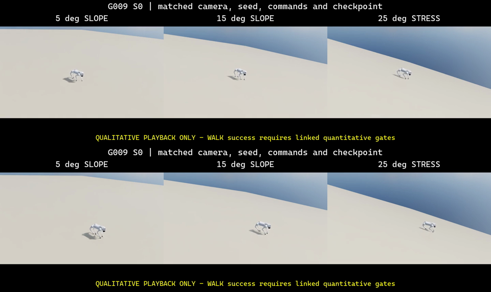<figcaption>세 경사 조건의 시작과 후반 자세를 한 화면에서 비교했어요. 25도에서 시간이 지날수록 몸체 자세와 위치가 함께 무너지는 흐름을 볼 수 있어요.</figcaption></figure>

## R0 PPO는 실제로 돌렸지만 Gate10에서 멈췄어요

첫 학습은 <abbr title="평지에서 넘어진 로봇이 다시 일어나는 법을 배우는 첫 복구 단계"><code>R0 flat RECOVER</code></abbr>로 잡았어요. 보행 정책을 미세조정하지 않고 엎드림·바로 누움·왼쪽 측면·오른쪽 측면의 네 전복 자세에서 복구하는 정책을 scratch에서 학습했어요. 몸통 접촉이 곧 실패인 보행과 달리 복구는 몸통이 바닥에 닿은 상태에서 시작하기 때문에 종료 조건과 보상을 분리했어요.

보상 함수는 <code>upright_progress + base_height_progress + stable_support</code>로 일어나는 과정에 값을 주고, 지면 법선 기준 자세를 일정 시간 유지하면 <code>upright_hold</code>와 한 번만 지급하는 <code>stable_success_once</code>를 더해요. 각속도, 관절 제한 접근, torque, 관절 가속도, action 변화, mechanical power proxy와 원하지 않은 링크 충돌에는 비용을 줘요. 보상 가중치와 활성 단계는 실행 전에 manifest로 고정했어요. 결과가 나온 뒤 식을 바꿔 점수를 맞추지 않기 위한 장치예요.

학습기는 <abbr title="여러 로봇을 동시에 실행해 강화학습 자료를 모으는 소프트웨어">RSL-RL</abbr> `2.3.3` PPO예요. 한 iteration에서 1,024개 환경이 각각 24 control step을 수집하고, 4개 mini-batch를 5 epoch 갱신해요. actor와 critic은 `512-256-128` ELU MLP이며 `gamma=0.99`, GAE `lambda=0.95`, clip `0.2`, learning rate `1e-3`을 사용해요. Isaac Sim은 GUI를 띄우지 않는 headless 모드로 실행했어요. Gate10은 `1,024 env × 24 step × 10 iterations`, 총 `245,760 transitions`이며 optimizer update는 `5 epochs × 4 mini-batches × 10 = 200회`예요. 기각한 checkpoint를 resume하지 않고 revision마다 scratch lineage를 새로 시작했어요.

안전 검사는 `Gate01 → Gate10 → Gate50` 순서로 열어요. rev12의 Gate01은 hard joint-limit과 numeric-invalid가 모두 0이라 통과했어요. 같은 물리 계약의 Gate10에서는 logging iteration `1`, `2`, `3`에 hard-limit 종료가 한 건씩 발생했어요. stable support, upright hold, strict success도 전 구간 0이었기 때문에 Gate50은 실행하지 않았어요. 현재 checkpoint는 `learned_policy_qualified=false`이고 전복 복구에 성공했다고 말할 수 없어요.

## Gate10의 세 사건을 reset 직전에 다시 기록했어요

처음에는 TensorBoard에 `0.0416666679`라는 aggregate만 남았어요. 이 값은 각도 초과량이 아니라 24-step rollout에서 hard-limit 종료 한 건을 뜻해요. 어떤 환경의 어느 관절이 얼마나 넘었는지 알려면 자동 reset 전에 terminal state를 잡아야 해요. `RecorderManager.record_pre_reset()`을 감싸 action, EMA target, 관절 위치·속도·torque, root state와 body contact를 사건 직전 16 control step까지 저장했어요. 관측기가 random stream을 바꾸지 않도록 hook 전후 CPU·CUDA RNG hash도 비교했어요.

같은 Gate10 경로를 별도 GPU 프로세스 세 번으로 실행했어요. 세 보고서는 서로 다른 execution ID를 가지면서도 PPO action stream, checkpoint hash, 사건 위치와 전체 event payload가 같았어요. 전체 `events` 배열은 canonical JSON SHA-256 `28fd03a57d50738cedff01af51ea5fb2f4f1a9ba9d81ee56d84103de9acb2df2`로 고정했고, 저장소의 검증 스크립트가 이 값을 다시 계산해요.

| 사건 | 위반 관절             | tolerance 밖 초과 | EMA target 최소 여유 |                      applied torque | 같은 다리 terminal 접촉력 |
| ---: | --------------------- | ----------------: | -------------------: | ----------------------------------: | ------------------------: |
|    1 | `FR_calf_joint` lower |     `0.001749rad` |        `0.744803rad` |   `2.797~23.5Nm`, 복원 방향 `16/16` |                `4.257 BW` |
|    2 | `RL_calf_joint` lower |     `0.003106rad` |        `0.592072rad` | `4.458~17.263Nm`, 복원 방향 `16/16` |                `3.023 BW` |
|    3 | `RL_calf_joint` lower |     `0.001625rad` |        `0.573438rad` | `0.461~22.378Nm`, 복원 방향 `16/16` |                `3.155 BW` |

EMA target은 48개 이력 step에서 모두 hard lower limit 안쪽에 있었고 calf torque도 관절을 범위 안으로 되돌리는 부호였어요. 세 사건에 한해서는 policy가 lower limit 밖을 직접 명령했다는 설명과 맞지 않아요. 반면 calf가 하한 방향으로 빠르게 움직인 뒤 같은 다리 foot 접촉력이 terminal step에서 `3.023~4.257 BW`로 뛰었어요. 현재 증거는 contact impact, 관성, joint/contact constraint 해석이 함께 만든 overshoot를 다음 가설로 지지해요.

<figure class="fig">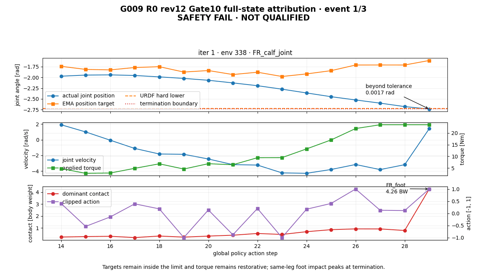<figcaption>파란 선은 실제 calf 각도, 보라색은 EMA target, 초록색은 applied torque, 빨간 선은 주요 접촉력이에요. 세 사건 모두 target과 torque는 복원 방향이지만 terminal contact가 급증했어요.</figcaption></figure>

<figure class="fig"><figcaption>세 사건을 한 장에 쌓은 정적 차트예요. 이 자료는 실패 귀속용이며 복구 성능의 qualification 자료가 아니에요.</figcaption></figure>

calf reset을 `-2.37rad`에서 `-2.34rad`로 바꾸는 안은 다음 revision으로 승인하지 않았어요. 사건은 episode step `26`, `71`, `381`에 발생했고 16-step 창에서 reset 직후 여유 부족과의 직접 연결을 찾지 못했어요. 짧은 창만으로 reset 영향을 배제할 수는 없지만 현재 자료로 초기 각도 변경을 우선할 근거도 없어요.

## rev13은 PPO 전에 CPU 안전 관문에서 기각됐어요

rev13은 articulation solver velocity iteration만 `0 → 1`로 바꿨어요. position iteration `8`, reset pose, timestep, action scale와 EMA, PPO noise, torque limit, hard-limit tolerance, reward, curriculum은 그대로 뒀어요. PhysX는 서로 파고든 body가 지나치게 빠르게 분리될 때 velocity iteration을 늘리는 방법을 제시해요. Gate10의 세 사건에서 복원 제어와 큰 접촉력이 함께 나타났기 때문에 이 값을 한 변수 A/B로 골랐어요.

clean source commit에서 seed `42`, headless, CPU, `8 env × 150 step` probe를 새 프로세스로 세 번 실행했어요. 여덟 articulation의 live readback은 매번 position `8`, velocity `1`이었고 numeric-invalid와 hard-joint-limit termination은 0이었어요. 그러나 오른쪽 옆면 자세를 그대로 유지하는 `reset_pose_hold`에서 base 접촉력이 세 실행 모두 같은 시각에 `15.971619 BW`까지 올랐어요. 고정한 상한 `15 BW`를 넘었기 때문에 rev13은 CPU 관문에서 기각했어요.

| 항목                         |         rev12 CPU |        rev13 CPU |         변화 |
| ---------------------------- | ----------------: | ---------------: | -----------: |
| solver velocity iteration    |               `0` |              `1` | 한 변수 변경 |
| 오른쪽 옆면 base 접촉 peak   |     `9.332861 BW` |   `15.971619 BW` |   `+71.133%` |
| root angular speed peak      |  `6.586226 rad/s` | `9.659444 rad/s` |   `+46.661%` |
| joint speed peak             | `10.620381 rad/s` | `7.199735 rad/s` |   `-32.208%` |
| total excess contact delta-v |    `1.111017 m/s` |   `1.034500 m/s` |    `-6.887%` |

delta-v가 줄었다고 접촉이 개선됐다고 볼 수는 없어요. force peak와 root angular speed가 함께 커졌기 때문이에요. 짧은 시간에 회전 성분이 큰 접촉 반응이 집중된 결과와 맞지만, 이 수치만으로 원인을 확정하지는 않아요.

<figure class="fig"><figcaption>세 번의 CPU 실행에서 반복된 접촉 상한 초과를 비교했어요. 카메라 영상이나 PPO 학습 영상이 아니라 실행 report를 그린 진단 텔레메트리예요.</figcaption></figure>

<figure class="fig">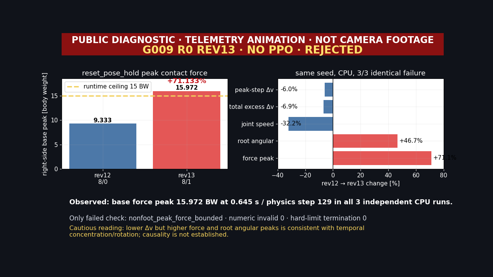<figcaption>rev13은 CPU 관문에서 멈췄어요. GPU runtime, Gate01, Gate10, PPO는 실행하지 않았고 qualification 상태는 <code>not_run</code>이에요.</figcaption></figure>

차트만으로는 로봇의 실제 움직임을 확인할 수 없어서 같은 `right_side / reset_pose_hold` 조건도 따로 촬영했어요. seed `42`, CPU, 8개 환경, physics/control timestep `0.005/0.02s`, solver live readback `8/1`을 다시 확인하고 7번 환경을 headless off-screen 카메라로 151 frame 기록했어요. 원 runtime과 조건·pose·action 경로가 같은 시각 재생이지만, 이 영상이 원 report의 force peak를 직접 재현했다는 뜻은 아니에요.

<figure class="fig"><figcaption>오른쪽 옆면에서 시작한 로봇이 reset pose hold action을 받는 실제 off-screen camera footage예요. <code>NO PPO</code>와 <code>REV13 REJECTED</code>를 영상 안에 표시했어요.</figcaption></figure>

<figure class="fig">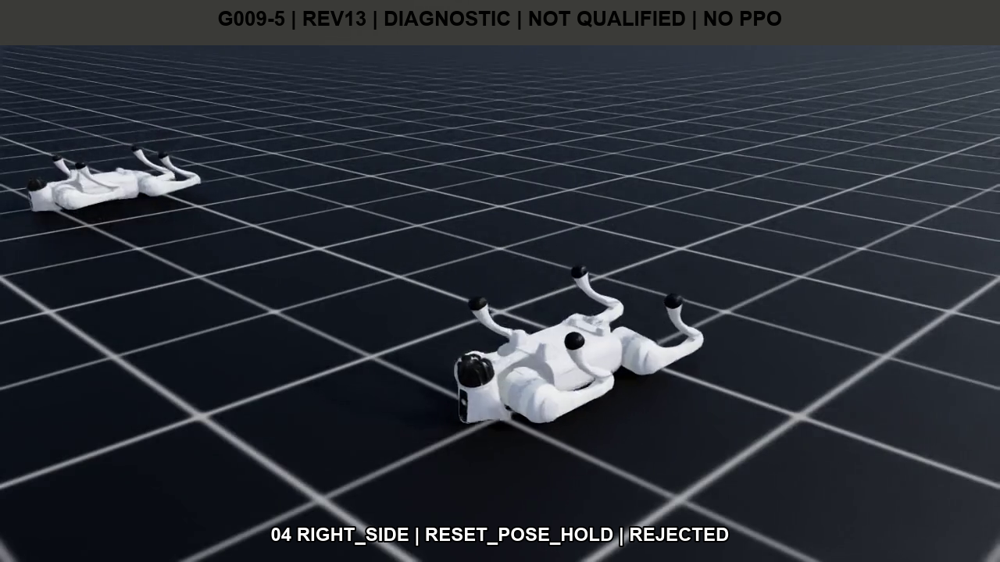<figcaption>번호 <code>04 right_side</code>의 대표 프레임이에요. 다른 자세의 로봇은 8환경 stratified 실행에서 인접한 환경이 함께 보이는 것이며, foreground camera target은 source env 7이에요.</figcaption></figure>

이 단계의 PPO batch, mini-batch, epoch, optimizer update는 모두 0이에요. `learned_policy_qualified=false`와 strict success `0`도 그대로예요. 텔레메트리 GIF·PNG에는 `NOT CAMERA FOOTAGE`, 실제 camera GIF·PNG에는 `RIGHT_SIDE`, `RESET_POSE_HOLD`, `REV13 REJECTED`를 표시했어요. 두 원본 H.264 MP4는 로컬 검증 자료로만 보관해요.

## rev14는 힘을 낮췄지만 침투 깊이에서 탈락했어요

rev14는 rev13의 articulation solver `8/1`을 유지하고 rigid body의 `max_depenetration_velocity`만 `1.0 → 0.75m/s`로 낮췄어요. 이 값은 solver가 겹친 물체를 분리하려고 넣을 수 있는 보정 속도의 상한이에요. 상한을 낮추면 짧은 접촉 반응이 완만해질 수 있지만, 같은 시간 안에 침투를 충분히 해소하지 못할 수도 있어요. force와 penetration을 따로 검사한 이유예요.

처음 계측에서는 Go2를 13개 rigid body로 가정했지만 실제 live stage에는 articulation당 19개가 있었어요. `Head_upper`, `Head_lower`와 네 foot link까지 포함한 값이에요. readback을 `root_physx_view.link_paths` 기준으로 고친 뒤 8개 articulation의 152개 rigid body가 모두 USD RigidBody API와 PhysX RigidBody API를 가지며 `0.75m/s`를 읽는지 확인했어요.

CPU와 GPU를 각각 새 프로세스로 세 번 실행했어요. 여섯 execution ID는 모두 달랐고 같은 장치의 세 결과는 수치까지 같았어요. numeric-invalid와 hard-joint-limit termination은 여섯 실행 모두 0이었고, 전체 non-foot force도 `15 BW` 이내였어요. 하지만 CPU가 권한을 가진 contact separation 검사는 기준을 넘었어요.

| 항목 | rev12 | rev14 | 판정 |
| --- | ---: | ---: | :--- |
| CPU 오른쪽 옆면 primary force | `9.332861 BW` | `8.502354 BW` | 감소, PASS |
| CPU 전체 pose/mode force peak | `9.408609 BW` | `13.943856 BW` | `15 BW` 이내 |
| GPU 전체 pose/mode force peak | `9.400354 BW` | `12.610371 BW` | `15 BW` 이내 |
| CPU 최소 contact separation | `-9.375498 mm` | `-10.990188 mm` | `-10 mm` 기준보다 `0.990188 mm` 깊음 |

primary force 하나만 보면 rev14가 좋아졌지만, 최종 판정은 모든 관문을 함께 봐요. CPU separation `-10.990188mm`가 허용 하한 `-10mm`보다 작아 strict synthesis가 rev14를 Gate01 전에 기각했어요. 낮춘 depenetration 속도가 force를 줄여도 접촉 형상을 자동으로 개선하지 않는다는 결과예요. GPU runtime은 3회 완료했지만 Gate01, Gate10, PPO는 실행하지 않았고 qualification은 `not_run`으로 남겼어요.

기존 실행 절차는 CPU의 force·root height·safety 검사를 먼저 통과하면 GPU를 열고, CPU separation은 마지막 strict synthesis에서 합쳤어요. 그래서 이번에는 GPU 3회까지 실행한 뒤 separation 실패가 확정됐어요. 다음 revision부터는 CPU separation을 progression gate에 포함해 이 검사가 실패하면 GPU를 시작하지 않도록 바꿔요.

<figure class="fig">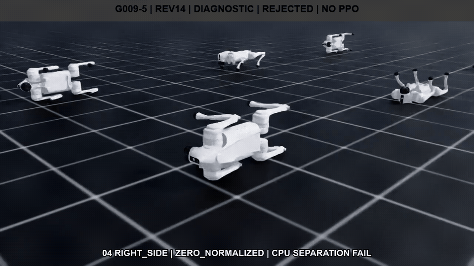<figcaption>번호 <code>04</code>는 <code>right_side / zero_normalized</code> 조건의 실제 headless off-screen camera footage예요. PPO checkpoint를 사용하지 않은 물리 진단 재생이며 separation을 영상에서 직접 측정한 자료는 아니에요.</figcaption></figure>

<figure class="fig">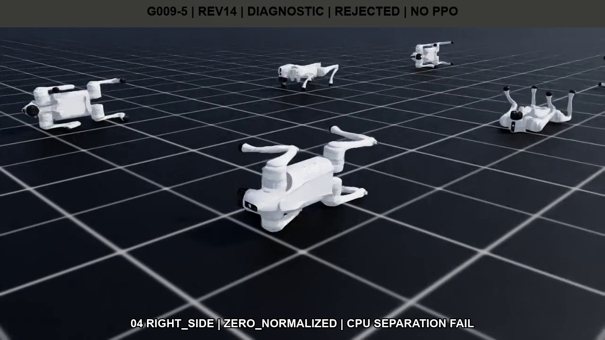<figcaption>촬영 세션에서도 physics/control timestep <code>0.005/0.02s</code>와 152개 rigid body의 <code>0.75m/s</code> readback을 다시 확인했어요. 인접한 자세가 함께 보이는 이유는 8환경 stratified 실행을 한 화면에서 촬영했기 때문이에요.</figcaption></figure>

<figure class="fig"><figcaption>번호 <code>05</code>는 카메라 영상이 아니라 CPU·GPU 여섯 report를 그린 텔레메트리예요. force PASS와 CPU separation FAIL을 같은 화면에 표시했어요.</figcaption></figure>

<figure class="fig">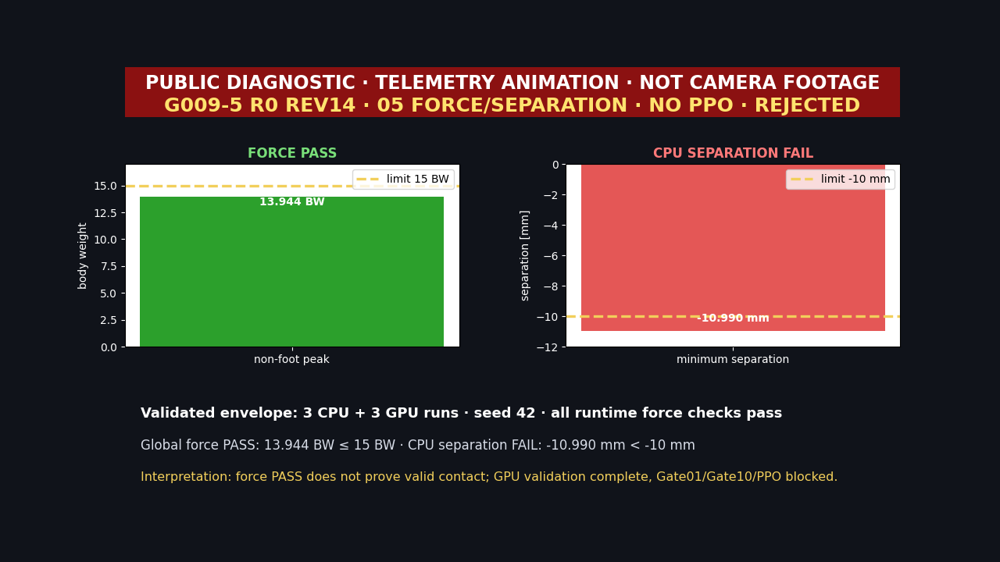<figcaption>CPU 전체 force peak는 <code>13.943856 BW</code>로 통과했지만 최소 separation은 <code>-10.990188mm</code>로 실패했어요. <code>NO PPO</code>와 <code>REJECTED</code>를 차트 안에 고정했어요.</figcaption></figure>

이 단계의 PPO batch, mini-batch, epoch와 optimizer update는 모두 0이에요. 최종 H.264 MP4는 `%USERPROFILE%\IsaacLab\logs\visual_evidence\g009\R0\diagnostic\g009_5_r0_diag_rev14_04_right_side_tradeoff_s42.mp4`에만 보관해요. 영상 SHA-256은 `0bebba8177d48357a743a9a00b93a6ed9ae403a1a53813dc71bff59c027cb865`이며 Git에는 GIF·PNG·JSON만 올렸어요.

## rev15는 CPU를 통과했지만 GPU에서 멈췄어요

rev15는 기각된 rev13·rev14 설정을 이어받지 않았어요. 마지막 runtime 승인본인 rev12의 solver `8/0`과 `max_depenetration_velocity=1.0m/s`로 돌아가 position iteration만 `8 → 16`으로 바꿨어요. position iteration은 한 physics step 안에서 관절과 접촉 constraint를 반복해 푸는 횟수예요. calf reset, timestep, action·motor·reward·curriculum, contact offset과 rest offset은 그대로 뒀어요. source commit은 `bc999d504e226011ff3d83e68a416b9049b406cb`, 계약 SHA-256은 `5f29ba19458404b5009d3734294c57e79294efecc7fe03bf8c71c71656129832`예요.

seed `42`, 8개 환경, 150 control step을 CPU와 `cuda:0`에서 각각 새 프로세스로 세 번 실행했어요. 여섯 실행에서 solver `16/0`과 8 articulation × 19 rigid body = `152`개 링크의 `max_depenetration_velocity=1.0m/s`를 live stage에서 다시 읽었어요. headless는 화면 창을 띄우지 않는 방식일 뿐이에요. PhysX와 observation/action control loop는 그대로 돌고, 필요할 때 off-screen camera가 프레임을 렌더링해요.

| 관문 | CPU 3회 | GPU 3회 | 판정 |
| --- | ---: | ---: | :--- |
| non-foot peak force | `13.248281 BW` | `16.788275 BW` | GPU가 `15 BW`보다 `11.92%` 높음 |
| CPU contact separation | `-9.353086 mm` | GPU 비권위 계측 | CPU는 `-10 mm` 기준 안쪽 |
| numeric-invalid termination | `0` | `0` | PASS |
| hard-joint-limit termination | `0` | `0` | PASS |
| runtime progression | `3/3` PASS | `0/3` PASS | 후보 기각 |

GPU의 blocking cell도 세 번 같았어요. 7번 환경의 `right_side / reset_pose_hold`, base, physics step 129, simulation time `0.645초`에서 peak가 나왔어요. 실행 자체는 정상이고 false인 검사는 `nonfoot_peak_force_bounded` 하나였어요. CPU separation이 좋아졌다는 사실만 보고 다음 단계로 갔다면 GPU에서 더 큰 접촉을 놓쳤을 거예요. 그래서 여섯 결과를 평균내지 않고 rev15를 `rejected_before_gate01`로 판정했어요.

<figure class="fig">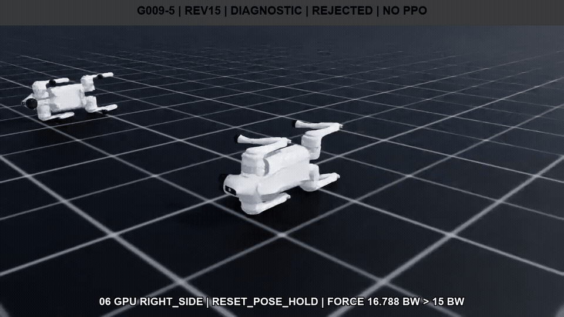<figcaption>번호 <code>06</code>은 <code>cuda:0</code>에서 실행한 <code>right_side / reset_pose_hold</code>의 실제 headless off-screen camera footage예요. PPO 정책의 복구 장면이 아니라 기각된 물리 후보의 시각 진단이에요.</figcaption></figure>

<figure class="fig">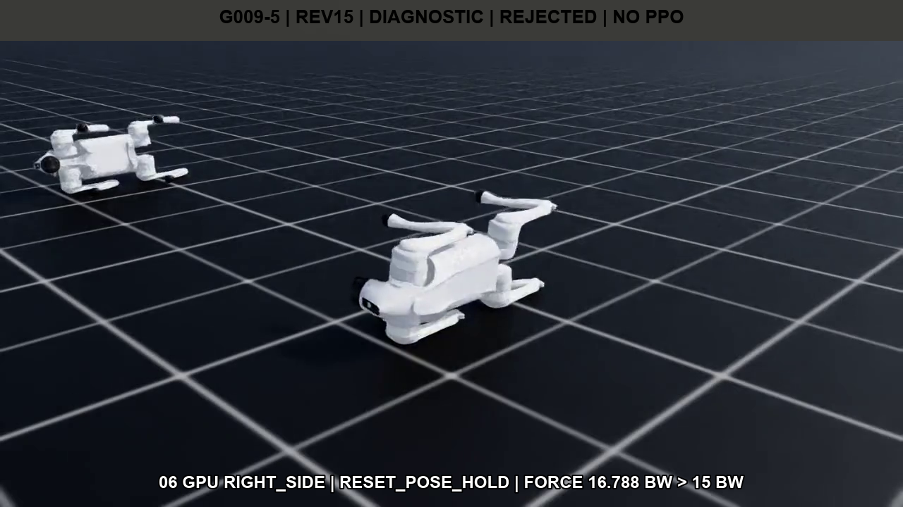<figcaption>앞쪽 로봇이 source env 7이에요. 화면의 <code>16.788 BW &gt; 15 BW</code>는 연결된 runtime report의 판정이며, 픽셀에서 힘을 측정한 값은 아니에요.</figcaption></figure>

<figure class="fig">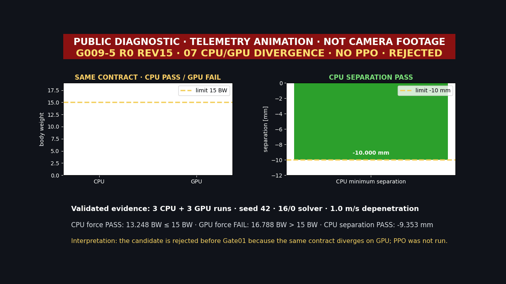<figcaption>번호 <code>07</code>은 여섯 report를 그린 텔레메트리 애니메이션이에요. 카메라 영상과 혼동하지 않도록 <code>TELEMETRY ANIMATION · NOT CAMERA FOOTAGE</code>를 화면에 넣었어요.</figcaption></figure>

<figure class="fig">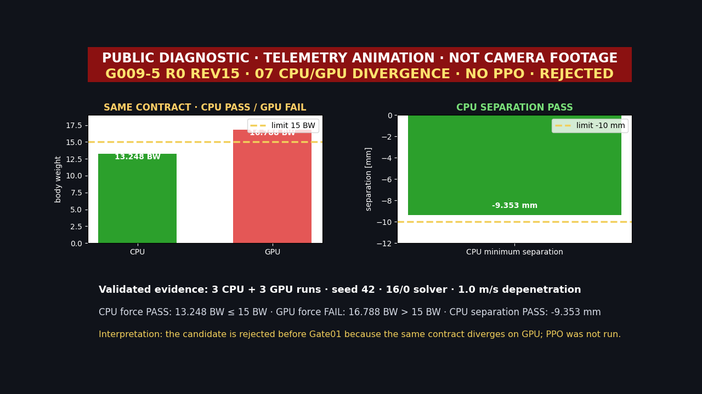<figcaption>CPU force와 separation은 통과했지만 GPU force가 막혔어요. 같은 solver readback이 같은 동역학 결과를 보장하지 않는다는 점이 이번 revision의 핵심이에요.</figcaption></figure>

rev15에서는 PPO rollout batch, mini-batch, epoch, optimizer update를 한 번도 만들지 않았어요. `learned=false`, qualification은 `not_run`이고 Gate01·Gate10도 열지 않았어요. 최종 H.264 MP4는 `%USERPROFILE%\IsaacLab\logs\visual_evidence\g009\R0\diagnostic\g009_5_r0_diag_rev15_06_gpu_right_side_force_fail_s42.mp4`에만 보관해요. `1280×720`, 50fps, 151프레임, 3.02초이며 SHA-256은 `5c3436ce16edc3ea904b609d5a2a975db0b1fef052a78e233cd03f958f129b86`예요. Git에는 GIF·PNG·JSON만 올렸어요.

## 다음은 학습보다 최초 divergence step을 찾는 일이 먼저예요

rev16은 새 PPO revision이 아니라 CPU/GPU backend divergence를 귀속하는 진단 protocol로 진행해요. 가설은 하나예요. position iteration 16이 GPU의 right-side base 접촉 impulse를 CPU와 rev12의 position iteration 8보다 더 이르고 좁게 집중시키는지 확인해요.

1. Arm A는 승인된 rev12 `8/0`, `1.0m/s`를 CPU 3회와 GPU 3회로 다시 재생해 새 계측기가 기준 동역학을 바꾸지 않았는지 확인해요.
2. Arm B는 position iteration만 `8 → 16`으로 바꿔 CPU 3회를 먼저 실행해요. CPU force·separation과 기존 rev15 사건 위치가 재현될 때만 GPU 3회를 열어요.
3. 매 physics substep에는 env 7의 19 body별 contact-force XYZ, base force, `force × 0.005s` impulse와 history slot을 남겨요. 매 control step에는 root·link·joint state, applied torque, raw action과 EMA target을 같은 키로 묶어요.
4. peak 전후 최소 8 physics step에서 접촉 지속 시간, 적분 impulse, `peak/window impulse` 집중도, root angular speed와 joint speed를 비교해요. CPU에서만 얻을 수 있는 contact point·pair·normal·separation은 권한 범위를 따로 표시해요.

Arm A가 역사적 rev12를 재현하지 못하거나 계측 필드가 하나라도 빠지면 그 자리에서 멈춰요. Arm B GPU가 세 번 모두 같은 cell에서 force를 넘고, CPU보다 peak가 최소 한 physics step 이르며, impulse 집중도가 20% 이상 높고, action·EMA trace 오차가 `1e-6` 이하여야 가설을 지지해요. 혼합 결과는 다수결로 통과시키지 않고 `inconclusive`로 남겨요. 가설이 맞아도 PPO로 넘어가는 것은 아니에요. position 16을 기각하고 승인된 rev12 의미론을 유지하는 근거가 하나 더 생기는 단계예요.

- [full-state 3회 synthesis](https://github.com/mmporong/isaac-walk-rl/blob/1b086fc/reports/runs/g009_r0_gate10_hard_limit_attribution_rev12_fullstate_synthesis_3x3_s42.json)
- [canonical event 재검증 스크립트](https://github.com/mmporong/isaac-walk-rl/blob/1b086fc/scripts/verify_g009_r0_gate10_fullstate_synthesis.py)
- [rev13 CPU 3회 기각 synthesis](https://github.com/mmporong/isaac-walk-rl/blob/9392f17dd29748bcf74af3ab4d341eb56f898ce6/reports/runs/g009_r0_runtime_probe_rev13_cpu_failure_synthesis_s42.json)
- [rev13 실제 카메라 capture sidecar](https://github.com/mmporong/isaac-walk-rl/blob/9392f17dd29748bcf74af3ab4d341eb56f898ce6/reports/runs/g009_5_r0_diag_rev13_04_right_side_runtime_capture_s42.json)
- [rev13 실제 카메라 공개 파생물 sidecar](https://github.com/mmporong/isaac-walk-rl/blob/9392f17dd29748bcf74af3ab4d341eb56f898ce6/reports/runs/g009_5_r0_diag_rev13_04_right_side_runtime_visual_evidence.json)
- [rev14 CPU·GPU 3회 strict trade-off synthesis](https://github.com/mmporong/isaac-walk-rl/blob/68fddd2/reports/runs/g009_r0_runtime_probe_rev14_tradeoff_synthesis_3x3_s42.json)
- [rev14 실제 카메라 capture sidecar](https://github.com/mmporong/isaac-walk-rl/blob/68fddd2/reports/runs/g009_5_r0_diag_rev14_04_right_side_tradeoff_capture_s42.json)
- [rev14 카메라 공개 파생물 sidecar](https://github.com/mmporong/isaac-walk-rl/blob/68fddd2/reports/runs/g009_5_r0_diag_rev14_04_right_side_tradeoff_visual_evidence.json)
- [rev14 텔레메트리 공개 파생물 sidecar](https://github.com/mmporong/isaac-walk-rl/blob/68fddd2/reports/runs/g009_5_r0_diag_rev14_05_cpu_tradeoff_visual_evidence.json)
- [rev15 CPU·GPU 3회 rejection synthesis](https://github.com/mmporong/isaac-walk-rl/blob/50ea4bd17ca906f4e699ea60230082ebce19e5e8/reports/runs/g009_r0_runtime_probe_rev15_rejection_synthesis_3x3_s42.json)
- [rev15 06 실제 CUDA 카메라 capture sidecar](https://github.com/mmporong/isaac-walk-rl/blob/50ea4bd17ca906f4e699ea60230082ebce19e5e8/reports/runs/g009_5_r0_diag_rev15_06_gpu_right_side_force_fail_capture_s42.json)
- [rev15 06 카메라 공개 파생물 sidecar](https://github.com/mmporong/isaac-walk-rl/blob/50ea4bd17ca906f4e699ea60230082ebce19e5e8/reports/runs/g009_5_r0_diag_rev15_06_gpu_right_side_force_fail_visual_evidence.json)
- [rev15 07 텔레메트리 공개 파생물 sidecar](https://github.com/mmporong/isaac-walk-rl/blob/50ea4bd17ca906f4e699ea60230082ebce19e5e8/reports/runs/g009_5_r0_diag_rev15_07_cpu_gpu_telemetry_visual_evidence.json)
- [G009 전체 기술 문서](https://github.com/mmporong/isaac-walk-rl/blob/main/docs/G009_MOUNTAIN_SLOPE_RECOVERY.md)

## 복구·경사·요철·마찰을 한 축씩 열어요

R0의 안전과 qualification을 통과한 뒤에는 <abbr title="기본 경사 보행, 울퉁불퉁한 지형, 위치마다 다른 마찰 순으로 여는 세 단계"><code>S1 → S2 → S3</code></abbr> 순서로 진행해요.

1. <abbr title="낮은 경사인 5도와 10도에서 보행을 확인하는 첫 경사 단계"><code>S1-low</code></abbr>에서 5도와 10도 등고선 보행을 검증하고, 통과한 정책만 <abbr title="더 높은 경사인 15도와 20도로 넓히는 경사 단계"><code>S1-high</code></abbr>의 15도와 20도로 확장해요. 25도는 계속 한계 시험 조건으로 유지해요. 외부 힘과 토크는 그 뒤 <abbr title="로봇을 밖에서 밀거나 비트는 힘을 따로 시험하는 단계"><code>D1</code></abbr>에서 약한 조건부터 강한 조건까지 따로 추가해요.
2. <abbr title="평균 경사 위에 굴곡·거칠기·함몰을 더해 시험하는 단계"><code>S2</code></abbr>에서는 평면 경사에 도로 중앙의 솟은 굴곡, 장주기 높이 변화, 거칠기와 함몰을 국소 높이 변화로 더해요. 평균 경사 때문에 생긴 하방 이동과 국소 요철 때문에 생긴 접촉 변화를 분리해 기록해요.
3. <abbr title="네 발의 마찰 조건을 정해 둔 조합으로 시험하는 단계"><code>S3-controlled</code></abbr>에서는 네 발의 마찰이 같거나 서로 다른 통제 조합을 먼저 시험해요. 그다음 <abbr title="위치에 따라 마찰이 달라지는 도로 모양을 시험하는 단계"><code>S3-spatial</code></abbr>에서 도로처럼 비주기적인 공간 마찰 무늬로 확장해요. 발별 유효 마찰계수, 가장 불리한 발과 패턴을 남기고, 한 조건이라도 막히면 평균 점수가 높아도 다음 단계로 넘기지 않아요.
4. 경사 보행이 만든 실제 낙상 자세를 모은 뒤, 사람이 고른 대표 자세와 실제 낙상 순간을 `50/50`으로 섞어 경사면에서 스스로 일어나기 학습으로 넘어가요. 최종적으로 밀림→낙상→복구→기립→명령 재개의 전 과정을 평가해요.

<abbr title="Isaac Sim 위에서 로봇 강화학습 환경을 만드는 도구 모음">Isaac Lab</abbr>은 지형 난도를 단계적으로 바꾸는 <abbr title="쉬운 조건부터 시작해 통과하면 점점 어려운 조건을 여는 학습 순서">curriculum</abbr> 구조를 제공하지만, 난도를 올리는 순서와 통과 조건은 실험자가 정해야 해요. 마찰·질량·경사·외란을 한 번에 무작위화하면 강건한 정책을 얻을 수도 있지만, 실패 원인을 설명하기 어려워져요. 이번에는 각 단계가 새 평가 결과와 움직이는 이미지·정지 이미지를 갖고, <abbr title="학습 저장 파일과 실행 설정, 결과물 파일의 짝이 맞는지 확인하도록 함께 기록한 묶음">checkpoint·설정·미디어 SHA-256</abbr>을 하나의 딸림 기록 파일에 묶도록 했어요. 링크 질량과 관성 변화는 경사·복구·마찰의 최종 <abbr title="방법을 고칠 때는 보지 않고 마지막 평가에만 쓰는 데이터">held-out</abbr>을 고정한 뒤 별도 <abbr title="질량과 관성 변화를 다른 조건과 분리해 시험하기 위해 붙인 단계 이름">M1 단계</abbr>에서 다룰 예정이에요.

25도에서 확인한 자세 붕괴는 로봇의 최대 경사를 확정한 결과가 아니에요. R0 Gate10의 세 hard-limit 사건도 전복 복구 성능이 생겼다는 결과가 아니에요. rev13과 rev14는 실제 설정 readback이 맞더라도 force와 separation을 함께 통과하지 못하면 학습을 시작하지 않는 절차를 남겼어요. rev15는 CPU를 통과해도 GPU가 같은 결과를 내지 않으면 멈추는 관문을 추가했어요. 다음에는 이 차이가 처음 생기는 physics step을 찾고, 원인이 분리된 뒤에만 한 변수를 바꿔요.

출처 — https://openstax.org/books/physics/pages/5-4-inclined-planes

출처 — https://isaac-sim.github.io/IsaacLab/v2.0.0/source/api/lab/isaaclab.app.html

출처 — https://isaac-sim.github.io/IsaacLab/v2.0.0/source/api/lab/isaaclab.terrains.html

출처 — https://isaac-sim.github.io/IsaacLab/main/source/how-to/record_video.html

출처 — https://arxiv.org/abs/2011.02404

출처 — https://nvidia-omniverse.github.io/PhysX/physx/5.3.0/_api_build/class_px_articulation_reduced_coordinate.html

출처 — https://isaac-sim.github.io/IsaacLab/v2.0.0/source/api/lab/isaaclab.sim.schemas.html

출처 — https://nvidia-omniverse.github.io/PhysX/physx/5.3.1/_api_build/class_px_rigid_body.html

출처 — https://nvidia-omniverse.github.io/PhysX/physx/5.4.1/_api_build/classPxRigidDynamic.html

출처 — https://nvidia-omniverse.github.io/PhysX/physx/5.7.0/docs/BestPractices.html
