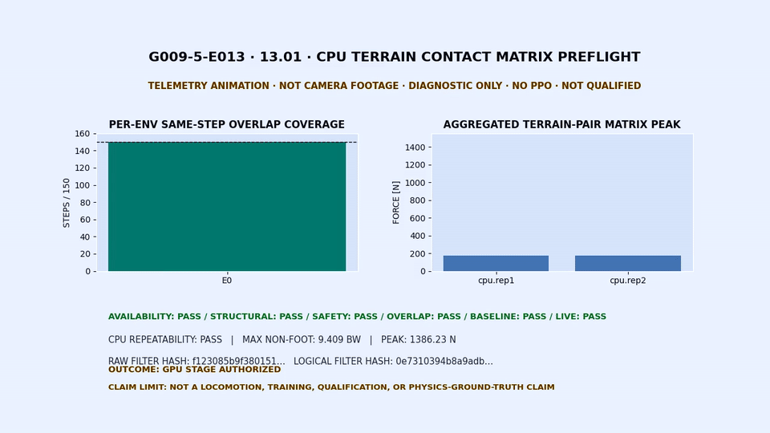
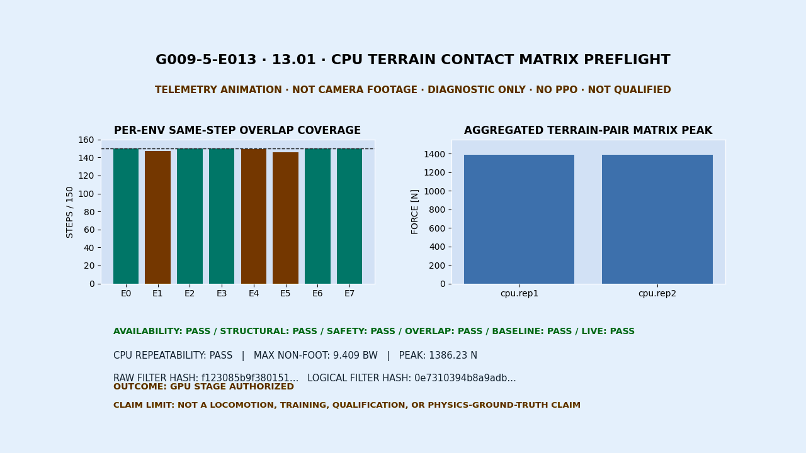
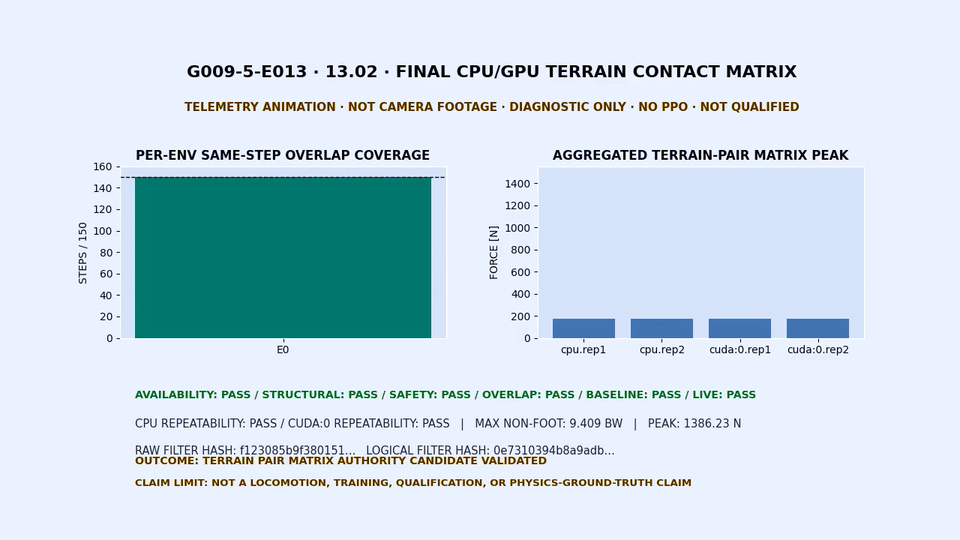
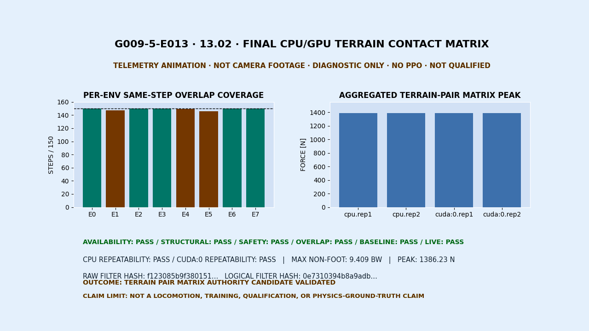

앞선 [[2026-08-28_회고_Unitree_Go2_경사면_S0의_25도_자세붕괴와_평가관문|Unitree Go2 R0의 CPU·GPU 접촉력이 갈린 물리 관문]]에서는 접촉값이 갈린 상태에서 학습을 멈춘 이유를 기록했어요. 이후 원시 접촉 이벤트는 <abbr title="중앙 처리 장치에서 물리를 계산한 실행">CPU</abbr>에서 수집됐지만 <abbr title="그래픽 처리 장치에서 물리를 병렬 계산한 실행">GPU</abbr>에서는 같은 방식으로 나오지 않았어요. 그렇다고 GPU에 접촉이 없었다고 결론낼 수는 없었어요. 힘 텐서는 양수였고, 비어 있던 것은 물리가 아니라 다음 판정에 쓸 공통 관측 경로였기 때문이에요.

<abbr title="같은 목표에서 계측 방법을 고친 20번째 수정판">rev20</abbr>에서는 접촉·휴지 오프셋, 마찰, 질량·관성, 모터와 시간 간격을 그대로 두고 지면과 각 링크 사이의 합산 수직 접촉력을 읽는 행렬만 추가했어요. 검증한 것은 보행 정책이 아니라, 이 행렬을 CPU와 GPU에서 다음 안전 관문의 <abbr title="판정을 내릴 때 기준값으로 믿고 사용할 수 있는 관측 범위">관측 권위 후보</abbr>로 사용할 수 있다는 점이에요.

<div class="scores">
  <div class="s ok"><div class="k">CPU 반복</div><div class="v">2 / 2</div><div class="n">정확 필드·수치 반복성 통과</div></div>
  <div class="s ok"><div class="k">GPU 반복</div><div class="v">2 / 2</div><div class="n">정확 필드·수치 반복성 통과</div></div>
  <div class="s ok"><div class="k">행렬 대조</div><div class="v">150 / 150</div><div class="n">직접값과 센서 버퍼가 매 시점 일치</div></div>
  <div class="s ok"><div class="k">환경별 겹침</div><div class="v">8 / 8</div><div class="n">합산 힘과 지면 쌍 힘을 함께 관측</div></div>
  <div class="s mid"><div class="k">학습 갱신</div><div class="v">0</div><div class="n">보상 계산과 <abbr title="시행착오 자료로 행동 정책을 갱신하는 강화학습 알고리즘">PPO</abbr>를 실행하지 않음</div></div>
</div>

## 접촉이 없었던 것이 아니라 판정 경로가 없었어요

<div class="gate crit"><div class="idx">1</div><div class="body">
<h4>GPU의 원시 접촉 이벤트 부재를 물리 실패로 해석하지 않았어요</h4>
<div class="row"><span class="lab">증상</span><span class="val">GPU에서는 힘 자극이 있는 동안에도 원시 접촉 이벤트가 같은 방식으로 수집되지 않았어요.</span></div>
<div class="row"><span class="lab">경계</span><span class="val">이벤트 횟수와 매 시점의 힘 텐서는 같은 관측 인터페이스가 아니므로 서로 대신할 수 없어요.</span></div>
<div class="row"><span class="lab">조치</span><span class="val">지면 충돌체를 지정한 접촉 행렬을 CPU와 GPU에서 같은 시점에 읽도록 경로를 바꿨어요. <span class="tag mid">관측 경로 변경</span></span></div>
</div></div>

원시 접촉 이벤트는 접촉점, 법선, 분리 거리와 충격량 같은 상세 정보를 다뤄요. rev20에서 사용한 접촉 행렬은 특정 링크와 지면 사이의 합산 수직 접촉력을 반환해요. 두 값을 같은 물리량이라고 보지 않았고, 원시 이벤트 수는 최종 판정에서도 제외했어요. [Isaac Lab 2.1.1의 ContactSensor 문서](https://isaac-sim.github.io/IsaacLab/v2.1.1/source/api/lab/isaaclab.sensors.html)도 필터를 적용한 `force_matrix_w`를 센서 몸체와 지정한 몸체 사이의 수직 접촉력 행렬로 정의해요.

## 관측기를 바꾸는 동안 물리 조건은 고정했어요

<div class="gate"><div class="idx">2</div><div class="body">
<h4>19번째 수정판의 첫 대조군 기준선에서 읽기 경로만 추가했어요</h4>
<div class="row"><span class="lab">고정</span><span class="val">접촉·휴지 오프셋, 마찰, 질량·관성, 모터, 초기 자세, 시간 간격과 GPU 버퍼를 바꾸지 않았어요.</span></div>
<div class="row"><span class="lab">추가</span><span class="val">지면 충돌체 하나를 필터로 지정한 접촉 행렬 읽기만 추가했어요.</span></div>
<div class="row"><span class="lab">판정</span><span class="val">구조, 반복성, 관절 범위와 접촉력 안전값을 함께 검사했어요. <span class="tag ok">기준선 유지</span></span></div>
</div></div>

실행은 <abbr title="Isaac Sim 위에서 로봇 강화학습 환경과 센서·물리 실험을 구성하는 도구 모음">Isaac Lab</abbr> `2.1.1`과 <abbr title="Isaac Sim에서 충돌·접촉·강체 운동을 계산하는 물리 엔진">PhysX</abbr>를 사용했어요. <abbr title="조작 화면을 띄우지 않고 시뮬레이션을 실행하는 방식">headless</abbr>를 켜고 렌더링을 끈 상태에서 실제 물리 계산만 진행했어요. [AppLauncher 문서](https://isaac-sim.github.io/IsaacLab/v2.1.1/source/api/lab/isaaclab.app.html)는 이 모드를 화면이 없는 실행으로 구분해요. 이번 실행은 카메라 센서를 사용하지 않았어요.

| 항목        | rev20 실행값                                                                                          |
| ----------- | ----------------------------------------------------------------------------------------------------- |
| 실행 순서   | CPU 1회차 → CPU 2회차 → CPU 사전검사 → GPU 1회차 → GPU 2회차 → 최종 합성                              |
| 프로세스    | 네 실행을 모두 서로 다른 새 프로세스와 실행 식별자로 분리                                             |
| 시드·환경   | 시드 `42`, 8개 환경                                                                                   |
| 실행 길이   | 실행당 물리 시점 150개, 시뮬레이션 시간 `0.75초`                                                      |
| 시간 간격   | 물리 `0.005초`, 제어 `0.02초`, 물리 계산 4회마다 제어 1회                                             |
| 초기 자세   | 엎드림·바로 누움·왼쪽 측면·오른쪽 측면을 각각 두 번 배치                                              |
| 진단 입력   | 네 환경은 12관절 정규화 입력 `0`, 네 환경은 초기 관절 자세 유지                                       |
| 지면        | 단일 평면, 지면 정지·동마찰 `0.8/0.6`                                                                 |
| 발 물성     | 정지·동마찰 `1.0/1.0`, 결합 방식 `multiply`, 유효값 `0.8/0.6`                                         |
| 물리 풀이기 | 위치·속도 풀이 반복 횟수 `8/0`, 최대 침투 해소 속도 `1.0m/s`                                          |
| 학습        | 보상 계산 `0`, 경험 수집 묶음 `0`, 작은 학습 묶음 `0`, 전체 자료 반복 `0`, 가중치 갱신과 PPO 갱신 `0` |

8개 환경의 자세 분류는 `[prone, supine, left_side, right_side]`를 두 번 배치한 `[0,1,2,3,0,1,2,3]`이에요. 앞 네 환경의 `zero_normalized`와 뒤 네 환경의 `reset_pose_hold`는 보행 명령이나 학습 정책의 행동이 아니에요. 초기 자세와 접촉 자극을 반복 가능하게 고정한 진단 입력이에요.

일반적인 `env.step()` 대신 `sim.step(render=false) → scene.update(0.005)` 순서의 수동 물리 루프를 사용했어요. 환경에는 복구 보상 관리자가 구성돼 있지만 이 루프는 보상 관리자의 사후 계산, 합산과 최적화를 호출하지 않았어요. 따라서 보상 스칼라, 에피소드 누적 보상, 행동 우수도와 정책 손실값도 만들지 않았어요.

<details>
<summary>환경에 구성돼 있었지만 rev20에서 계산하지 않은 복구 보상 13개</summary>

| 보상 항                      |    가중치 | rev20 상태    |
| ---------------------------- | --------: | ------------- |
| `upright_progress`           |    `+2.0` | 계산하지 않음 |
| `gated_base_height_progress` |    `+2.0` | 계산하지 않음 |
| `soft_stand_progress`        |    `+2.0` | 계산하지 않음 |
| `stable_support`             |    `+0.5` | 계산하지 않음 |
| `upright_hold`               |    `+5.0` | 계산하지 않음 |
| `stable_success_once`        |   `+10.0` | 계산하지 않음 |
| `gated_angvel_l2`            |   `-0.05` | 계산하지 않음 |
| `joint_limit`                |    `-2.0` | 계산하지 않음 |
| `torque_l2`                  | `-0.0002` | 계산하지 않음 |
| `joint_acc_l2`               | `-2.5e-7` | 계산하지 않음 |
| `gated_action_rate_l2`       |   `-0.01` | 계산하지 않음 |
| `mechanical_power_proxy`     | `-1.0e-5` | 계산하지 않음 |
| `undesired_collision`        |    `-1.0` | 계산하지 않음 |

</details>

## 152개 링크-지면 행의 모양과 값을 함께 확인했어요

<div class="gate"><div class="idx">3</div><div class="body">
<h4>직접 읽은 행렬과 접촉 센서 버퍼가 150개 시점에서 모두 같았어요</h4>
<div class="row"><span class="lab">구조</span><span class="val">8개 환경 × 19개 몸체인 152개 센서 행을 지면 필터 하나와 연결했어요.</span></div>
<div class="row"><span class="lab">대조</span><span class="val"><code>[152,1,3]</code>을 <code>[8,19,1,3]</code>으로 바꾼 값이 센서 버퍼와 150/150 시점에서 정확히 같았어요.</span></div>
<div class="row"><span class="lab">겹침</span><span class="val">8개 환경 모두에서 같은 몸체의 합산 힘과 지면 쌍 힘이 함께 양수인 시점을 확인했어요. <span class="tag ok">구조 통과</span></span></div>
</div></div>

```text
RigidContactView direct tensor  [152, 1, 3]
  └─ env-major/body-major       [8, 19, 1, 3]
       ├─ ContactSensor buffer   [8, 19, 1, 3]
       └─ filter 축 합산         [8, 19, 3]
```

직접 읽은 <abbr title="여러 수치를 일정한 차원으로 묶은 다차원 배열">텐서</abbr>와 센서 버퍼는 값만 같은 별도 저장 공간이어야 했어요. 네 실행 모두 별도 저장 공간이면서 `150/150` 시점 완전 일치를 통과했어요. 같은 환경·몸체·시점에서 합산 힘과 지면 쌍 힘이 함께 `1e-6N`을 넘은 횟수는 `[150,147,150,150,149,146,150,150]`이었고 CPU와 GPU 네 실행에서 같았어요.

필터 메타데이터도 두 의미로 나눴어요. 152개 센서 행에 같은 지면 경로가 반복된 원시 `[152,1]`의 <abbr title="파일 내용이 바뀌면 값도 달라지는 64자리 확인용 지문">SHA-256</abbr>은 `f123085b9f380151dd660c449197a0a7c19e64c1c41f104a4ba5607693f86a4c`이고, 중복을 제거한 논리 필터 한 행의 SHA-256은 `0e7310394b8a9adb8b4cd6fe66f00c662855733094e5252dcd70acf1f7fcf6c0`이에요. 첫 번째 해시는 지면이 152종이라는 뜻이 아니라 같은 필터가 센서 행마다 올바르게 반복됐는지를 확인하는 값이에요.

<figure class="fig"><figcaption>번호 <code>13.01</code>은 CPU 사전검사 결과를 움직이는 그래프로 재구성했어요. 로봇 카메라 영상이 아니며 화면에도 <code>TELEMETRY ANIMATION</code>, <code>NOT CAMERA FOOTAGE</code>, <code>NO PPO</code>를 표시했어요.</figcaption></figure>

<figure class="fig"><figcaption><code>13.01</code>의 대표 정지 화면이에요. 두 CPU 보고서의 반복성, 150/150 행렬 대조와 8/8 환경 겹침을 한 장에서 확인해요.</figcaption></figure>

## CPU 사전검사를 통과한 뒤 GPU를 열었어요

<div class="gate"><div class="idx">4</div><div class="body">
<h4>CPU 두 보고서를 변경 불가 사전검사로 묶은 뒤 GPU를 실행했어요</h4>
<div class="row"><span class="lab">선행 조건</span><span class="val">CPU 보고서 두 개의 경로, SHA-256과 실행 식별자를 정해 둔 순서로 묶었어요.</span></div>
<div class="row"><span class="lab">GPU 실행</span><span class="val">사전검사가 <code>gpu_stage_authorized</code>를 반환한 뒤에만 GPU 프로세스를 열었어요.</span></div>
<div class="row"><span class="lab">반복성</span><span class="val">CPU와 GPU 모두 두 실행의 정확 필드가 같았고 수치도 사전 허용오차 안에 들었어요. <span class="tag ok">2 / 2 + 2 / 2</span></span></div>
</div></div>

| 판정 항목                |              CPU |              GPU |             진단 기준 |
| ------------------------ | ---------------: | ---------------: | --------------------: |
| 최대 비발 링크 힘        | `9.408608784 BW` | `9.400355124 BW` |          `15 BW` 이하 |
| 직접값·버퍼 일치         |        `150/150` |        `150/150` |             모든 시점 |
| 같은 몸체 양의 겹침      |       `8/8 환경` |       `8/8 환경` |             모든 환경 |
| 장치 안 반복성           |            `2/2` |            `2/2` |     제3회 다수결 금지 |
| 수치 오류·관절 한계 위반 |              `0` |              `0` | 한 건도 허용하지 않음 |

<abbr title="힘을 로봇 한 대의 무게로 나눈 비율"><code>BW</code></abbr> `15`는 이번 진단에서 비발 링크 접촉력의 허용 기준으로 미리 고정한 값이에요. 이 값을 넘지 않았다는 사실만으로 학습 정책의 안전이 승인되지는 않아요. 관절 위치는 모든 환경과 시점에서 기계적 관절 한계의 `±0.01rad` 여유 계약을 통과했고, 질량 텐서 `[8,19]`도 유한·양수·불변이었어요.

<figure class="fig"><figcaption>번호 <code>13.02</code>는 CPU 사전검사 뒤 GPU 두 실행을 연 순서와 최종 판정을 보여줘요. 로봇의 자세나 보행을 촬영한 자료가 아니며 <code>DIAGNOSTIC ONLY</code>, <code>NO PPO</code>, <code>NOT QUALIFIED</code>를 화면에 고정했어요.</figcaption></figure>

<figure class="fig"><figcaption><code>13.02</code>의 대표 정지 화면이에요. 최종 결과는 관측 권위 후보 검증이며 정책 자격 승인이나 물리 진리값 승인이 아니에요.</figcaption></figure>

두 <abbr title="여러 정지 이미지를 이어 재생하는 공개용 이미지 형식">GIF</abbr>는 어두운 로컬 <abbr title="영상을 작은 용량으로 압축하는 규격">H.264</abbr> 원본을 공개 규격에 맞는 밝은 팔레트로 바꾸고 `960×540`, `12.5fps`, 약 `5.58초`, 최대 256색으로 변환했어요. `13.01`은 272,533바이트이고 SHA-256은 `7924106cdf8020ad8e74d70beb4b47a2196cbc1317a9e85132c2c7e5a6b21833`, `13.02`는 270,168바이트이고 SHA-256은 `872d95b8e7407e99483b565d36a9ecab2174abd6b538e4bce1cb1bac3f11d71a`예요. 대표 PNG의 SHA-256은 `13.01`이 `f14fd5c4e7082bdd8d6e0d8627196e7a588242c47dd9eac041bd6ca4023e0262`, `13.02`가 `97b946614a9e4533fd711659c10abaed822e3f46ae3bfb5cf946c35c033b5df1`예요. H.264 <abbr title="영상과 음성을 한 파일에 담는 컨테이너 형식">MP4</abbr>는 공개 저장소에 올리지 않고 로컬 검증용으로만 보관했어요.

## 통과한 것은 관측 권위 후보까지예요

<div class="note">
<div class="h">이번에 검증한 범위</div>
지면과 각 링크 사이의 합산 수직 접촉력을 읽는 행렬을 CPU와 GPU의 다음 안전 판정에 사용할 수 있는 관측 권위 후보로 검증했어요. 최종 결과 코드는 <code>terrain_pair_matrix_authority_candidate_validated</code>예요.
</div>

<div class="note warn">
<div class="h">아직 검증하지 않은 범위</div>
접촉점·분리 거리·충격량의 물리 진리값, 보행, 앞뒤 이동, 좌우 회전, 경사 주행, 전복 자가복구와 강화학습 정책은 검증하지 않았어요. <code>physics_ground_truth_authority=false</code>, <code>learned=false</code>이고 <abbr title="새 학습 실행의 첫 수치·관절·접촉 안전 검사"><code>Gate01</code></abbr>은 닫혀 있어요. <abbr title="학습한 정책을 다음 실험에 사용할 수 있는지 정해진 조건으로 승인하는 평가">qualification</abbr>은 <code>not_run</code>이에요.
</div>

후보라는 말을 남긴 이유는 접촉 행렬이 접촉점, 분리 거리와 충격량까지 설명하지 않기 때문이에요. rev20은 공통 관측 경로를 열었지만, 이 경로를 실제 안전 판정에 쓰는 계약은 아직 실행하지 않았어요. CPU 사전검사 SHA-256은 `2c4996f837d0c6003d653761c53ac399e98fb80db25c7d00ee647b871ac4968c`, 실행 식별자는 `e7c172f8bec647a28559f55be420929e`예요. 최종 합성 SHA-256은 `dcb8f446a212390f94f9ae5ccad97d9e770f9b8f5961f5ffb0c920f8d62580b3`, 실행 식별자는 `1c8d85a4c7db4f76aee1a55ed9413ddb`예요.

<details>
<summary>네 실행 보고서의 재현 식별자</summary>

| 슬롯          | 보고서 SHA-256                                                     | 실행 식별자                        |
| ------------- | ------------------------------------------------------------------ | ---------------------------------- |
| `cpu.rep1`    | `d4f8a371edd77c69fb74994c56d629c3e27dd122907ade90f931eeb546c41c29` | `713be4a4945f45428336177706945a31` |
| `cpu.rep2`    | `63d19f42e7c79cc77846f09b5245c2dc46e77630ce97020dfb29be0837375e6c` | `54ce2a52afad4f55a7b7d536579d48aa` |
| `cuda:0.rep1` | `363e3bfe3d3ed3b1c3bfe7c3ae0aecf6a1a4f6704cdb9c8533a73e6e3f75cd0a` | `a12591ace8f74343b8595d9ab6481af1` |
| `cuda:0.rep2` | `305914af13be60c869b6b3a6d103b37a616be7d1c4e6a7e99dceeb8ef53698ca` | `055f49e11d85410c8d35901407d5a9eb` |

</details>

## 마찰·경사·질량 강건성은 다음 단계예요

rev20의 바닥은 여러 지형이 섞인 도로가 아니라 단일 평면이에요. 지면의 정지·동마찰은 `0.8/0.6`, 발은 `1.0/1.0`, 곱셈 결합 뒤 실행 중 유효값은 `0.8/0.6`이었어요. 네 발의 마찰이 서로 다른 바닥, 위치마다 값이 바뀌는 비주기 마찰 무늬, 요철과 높낮이, 경사와 링크별 질량·관성 변화는 이번 결과에 넣지 않았어요. 따라서 rev20만으로 불규칙 도로나 산비탈 보행 성능을 설명할 수 없어요.

최종 합성이 지정한 다음 상태는 `preregister_matrix_authority_safety_gate`예요. 다음 실행은 아래 순서를 건너뛰지 않아요.

1. 접촉 행렬을 안전 판정에 쓰는 몸체·지면 범위, 결측과 불일치 시 중단 조건을 <abbr title="실행 결과를 보기 전에 성공·실패 기준을 문서와 JSON으로 고정하는 절차"><code>matrix authority safety gate</code></abbr>로 먼저 사전등록해요.
2. 기존 결과에 소급 적용하지 않고 새 프로세스에서 Gate01을 다시 실행해요.
3. Gate01을 통과한 뒤에만 <abbr title="평지에서 넘어진 로봇의 복구 정책을 검증하는 첫 단계">R0</abbr> 복구 정책의 PPO qualification을 열어요. 현재 학습 계약은 1,024개 병렬 환경이 각각 24개 제어 시점의 경험을 모으는 작업을 300회 반복하고, 매 반복에서 자료를 4개 작은 학습 묶음으로 나눠 전체 자료를 5회 학습하는 <abbr title="로봇 강화학습용 PPO 학습기를 제공하는 소프트웨어 라이브러리">RSL-RL</abbr> PPO예요. 계획 총량은 전이 7,372,800개와 최적화 갱신 6,000회예요. rev20에서는 경험 수집, 보상 계산과 이 학습 계약을 한 번도 실행하지 않았어요.
4. 복구 정책이 안전·성공 관문을 통과하면 등고선 보행을 `5/10°`에서 시작하고 `15/20°`로 넓혀요. `25°`는 최대 등판각으로 승격하지 않고 계속 한계 시험 조건으로 둬요.
5. 순간 외력과 기준 지형에 덧붙인 높이 변화를 따로 넣은 뒤, 네 발의 통제 마찰 조합을 먼저 시험해요. 이후 도로처럼 비주기적인 공간 마찰 무늬, 요철과 높낮이로 확장해 실패 원인을 분리해요.
6. 실제 보행 중 수집한 낙상 자세로 낮은 경사와 높은 경사의 전복 복구를 검증하고, `push → fall → recover → stand → command resume` 전 과정을 평가해요.
7. 링크 질량·관성은 다른 축의 최종 평가 조건을 먼저 고정한 다음 엉덩이, 허벅지, 종아리, 발 링크를 한 번에 한 그룹씩 바꾸는 <abbr title="링크 그룹별 질량과 관성을 다른 조건과 분리해 시험하는 단계">M1</abbr> 실험으로 진행해요.

비공개 프로젝트 저장소의 커밋 `0a9d6ab6622c9fd7a93a081291f8a60cc2f7dff0`에 실험 구현, 실행 계약, 네 원시 보고서, CPU 사전검사, 최종 합성 JSON과 전체 G009 기술 문서를 함께 고정했어요. 접근 권한이 있는 검토자는 같은 커밋으로 수치와 해시를 대조할 수 있어요.
