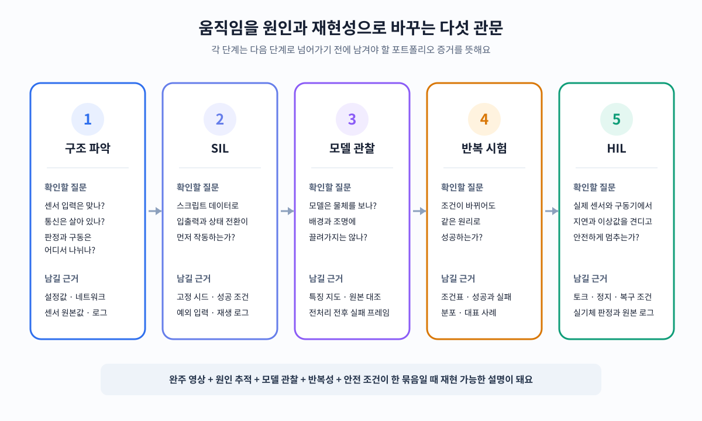

<link rel="stylesheet" href="../assets/2026-08-31_act_tooltip_mobile.css">

8월 31일 외부 강의에서 소셜로봇의 상황 판단과 움직임 로직을 개발한 사례를 들었어요. 동작을 완성한 뒤 결과 영상을 남기는 일보다, 기존 코드를 읽고 센서값과 통신 경로를 따라가며 실패 원인을 좁히는 일에 더 많은 시간이 들었다는 내용이었어요.

## 움직였다는 결과만으로는 원인을 설명할 수 없어요

기존 코드, 시뮬레이션 예제, 네트워크 상태, 낭떠러지 센서값을 함께 확인하지 않으면 같은 증상에 원인이 뒤섞여 보여요. 센서 입력이 틀린 것인지, 통신이 끊긴 것인지, 상황 판단이 잘못된 것인지, 움직임 명령이 구동부에 적용되지 않은 것인지 분리하지 못하면 문제 추적 시간이 길어져요.

포트폴리오에는 완주 영상과 함께 입력에서 출력까지의 판정 경로가 남아야 해요. 어떤 로그를 보고 어느 층을 제외했는지, 같은 조건을 몇 번 반복했는지, 환경을 바꿨을 때 실패가 어느 구간에서 시작됐는지를 표나 그래프로 묶으면 한 번의 성공과 반복 가능한 동작을 구분할 수 있어요.

<figure class="fig"><figcaption>강의 메모를 다섯 검증 관문으로 다시 구성했어요. 새 실험 결과를 나타낸 그림은 아니며, 각 단계에서 포트폴리오에 남길 근거를 정리한 도식이에요.</figcaption></figure>

## 스크립트 데이터로 학습 전 입출력 경로를 확인해요

<abbr class="tip-left" title="카메라 영상과 로봇 상태를 보고 앞으로 실행할 동작을 묶음으로 예측하는 모방학습 방법">ACT</abbr>는 매 시점의 동작 하나 대신 짧은 동작 묶음을 예측해요. 시간 앙상블은 서로 겹치는 시점별 예측을 한 동작으로 합쳐 궤적을 부드럽게 만들어요. 둘을 항상 켜는 것이 아니라, 긴 조작에서 오차가 누적되거나 동작이 끊기는 문제를 풀 때 쓸지 판단해야 해요.

강의에서는 사람이 모은 시연 데이터가 스크립트 데이터보다 성공이 고르지 않아도 행동 분포는 더 넓다는 점을 짚었어요. 그래서 스크립트 데이터는 사람 시연을 대신하는 최종 학습셋보다, 관측과 행동의 형태·보상·저장·재생 경로가 먼저 작동하는지 확인하는 시험 재료에 가까워요. 기능이 안 도는 상태에서 사람 데이터를 늘리면 데이터 문제와 구현 문제가 섞여요.

<abbr class="tip-left" title="두 로봇팔을 사람이 직접 움직여 시연 데이터를 모으고 모방학습을 시험하는 공개 로봇 시스템">ALOHA</abbr>의 <abbr class="tip-left" title="카메라 영상과 로봇 상태를 보고 앞으로 실행할 동작을 묶음으로 예측하는 모방학습 방법">ACT</abbr> 공식 구현도 설정에서 환경과 정책으로 읽으면 구조를 잡기 쉬워요. <abbr class="tip-right" title="작업 이름과 데이터 경로, 실행 간격처럼 전체 코드가 함께 쓰는 설정을 모은 파일"><code>constants.py</code></abbr>에서 작업 조건을 확인하고, <abbr class="tip-center" title="시뮬레이터의 관측값과 행동값, 성공 조건을 정의한 파일"><code>sim_env.py</code></abbr>에서 입력과 출력의 계약을 읽은 뒤, <abbr class="tip-right" title="정해진 규칙으로 시뮬레이션 시연 동작을 생성하는 파일"><code>scripted_policy.py</code></abbr>로 데이터가 만들어지는 경로를 따라가요. 모델부터 열면 설정 오류와 환경 오류가 학습 문제처럼 보일 수 있어요.

## 특징 지도는 모델이 실제로 본 영역을 보여 줘요

카메라 기반 정책이 한 번 동작했다고 해서 물체를 제대로 본 것은 아니에요. 배경의 색이나 조명처럼 우연히 함께 있던 단서를 보고 같은 행동을 냈을 수 있어요. 환경이 바뀌면 행동이 달라지는 이유도 이 지점에서 생겨요.

<abbr class="tip-left" title="영상에서 모양과 위치 정보를 단계별 숫자 배열로 바꾸는 대표적인 시각 신경망">ResNet-18</abbr>의 특징 지도를 시각화하면 어느 위치가 예측에 크게 반영됐는지 확인할 수 있어요. 모델이 봐야 할 영역을 강조하려고 이미지를 전처리할 때도 원본과 전처리본을 같은 조건에서 대조해야 해요. 강의 사례에서는 <abbr class="tip-center" title="원본 특징을 우회 경로로 보존하면서 필요한 영역의 가중치를 높이는 시각 모델">Residual Attention</abbr>을 시험해 원본 정보를 남긴 채 주목 영역을 조정했어요.

이 검사는 예쁜 열지도를 만드는 작업이 아니에요. 조명, 배경, 물체 위치를 바꾼 뒤 특징 지도의 집중 영역과 동작 성공 여부가 함께 움직이는지 확인해야 전처리가 원인을 바꿨다고 말할 수 있어요. 결과는 조건별 성공 횟수와 대표 실패 프레임을 나란히 두면 읽기 쉬워요.

## 소프트웨어 시험에서 실기체 안전 검증으로 넘어가요

<abbr class="tip-left" title="로봇 제어 소프트웨어와 가상 환경만 연결해 기능과 예외를 확인하는 시험">SIL</abbr>에서는 스크립트 데이터로 기능, 상태 전환, 예외 처리를 먼저 확인해요. 그다음 <abbr class="tip-center" title="실제 제어 장치나 센서를 시험 환경에 연결해 하드웨어 반응까지 확인하는 시험">HIL</abbr>에서 통신 지연, 센서 이상값, 토크 제한, 정지 조건을 확인해요. 시뮬레이션 통과는 실기체 투입의 시작 조건이고, 실기체 안전의 증거는 아니에요.

생성형 인공지능은 테스트 앱과 검증 구조의 초안을 만들고, 예외 상황과 경계 사례를 넓히는 데 쓸 수 있어요. 안전 조건은 실제 센서 범위와 구동기 반응으로 다시 잠가야 해요. <abbr class="tip-center" title="입력 처리, 화면 표시, 제어 로직을 나눠 변경 영향을 줄이는 소프트웨어 구조">MVC</abbr>처럼 역할을 나누고 <abbr class="tip-left" title="파이썬에서 신경망 모델을 만들고 실행하는 공개 소프트웨어 도구">PyTorch</abbr> 모델을 별도 시험 앱에서 호출하면, 화면 문제와 추론 문제와 제어 문제를 한꺼번에 고치지 않아도 돼요.

## 기존 프로젝트에는 선택 이유와 실패 경계를 보강해요

기존 기록을 이 기준으로 다시 보면 이미 가진 증거와 비어 있는 설명이 갈려요.

| 프로젝트·주제                                                                                                                          | 이미 남은 근거                                         | 보강할 설명                                                                                             |
| -------------------------------------------------------------------------------------------------------------------------------------- | ------------------------------------------------------ | ------------------------------------------------------------------------------------------------------- |
| <abbr class="tip-left" title="주변 지도를 만들면서 지도 속 로봇 위치도 함께 찾는 기술">SLAM</abbr> 자율탐사                            | 지도 생성, 탐사 종료, 장애물 경계의 원인 추적          | 왜 해당 알고리즘이 센서·환경·계산 조건에 맞았는지, 다른 후보와 무엇이 달랐는지                          |
| 로봇팔 파지                                                                                                                            | 서보 보호 오발, 통신 로그, 실물과 시뮬레이션 자세 대조 | 카메라 환경 변화에 따른 특징 지도와 실패 프레임, 조건별 반복 결과                                       |
| <abbr class="tip-left" title="카메라 영상과 로봇 상태를 보고 앞으로 실행할 동작을 묶음으로 예측하는 모방학습 방법">ACT</abbr> 모방학습 | 학습할 모델과 공개 구현의 코드 경로                    | 풀려는 실패가 동작 누적 오차인지, 시간 앙상블이 필요한지, 스크립트와 사람 시연의 역할을 어떻게 나눴는지 |
| 테스트 앱                                                                                                                              | 화면과 모델을 연결한 실행 화면                         | 상태 판단·추론·구동 명령의 경계, 예외 입력, 안전 정지 조건                                              |

완주 영상은 로봇이 한 번 움직였다는 결과를 보여 줘요. 설정과 센서 로그는 왜 움직였는지를, 특징 지도는 무엇을 보고 움직였는지를, 반복 시험은 조건이 바뀌어도 같은 판단을 하는지를 설명해요. <abbr class="tip-right" title="로봇 제어 소프트웨어와 가상 환경만 연결해 기능과 예외를 확인하는 시험">SIL</abbr>에서 <abbr class="tip-left" title="실제 제어 장치나 센서를 시험 환경에 연결해 하드웨어 반응까지 확인하는 시험">HIL</abbr>로 이어지는 관문까지 남기면 모델 이름보다 문제를 추적하고 안전하게 적용한 과정이 먼저 보여요.

출처 — https://arxiv.org/abs/2304.13705

출처 — https://github.com/tonyzhaozh/act
