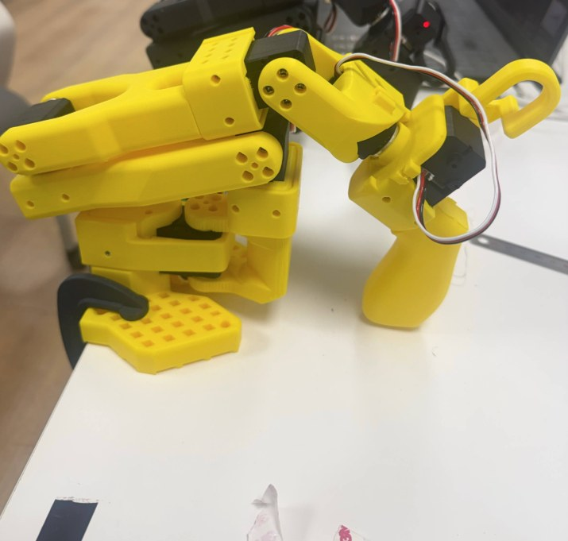
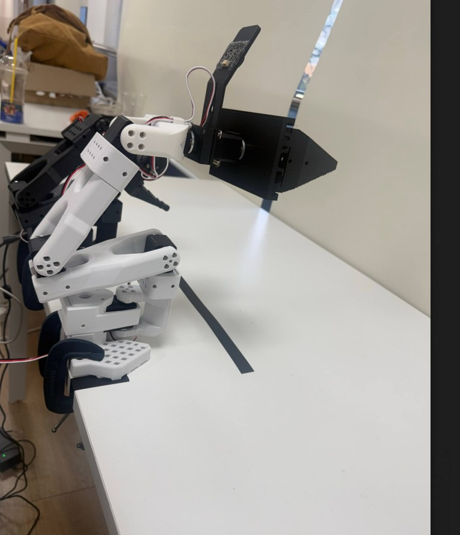

로봇팔 끝에 단 그리퍼가 닫으라고 하면 열리고, 열라고 해도 열려서 레일 밖으로 네 번 빠졌어요. 원인은 <abbr title="로봇팔 관절에 쓰는 작은 모터로, 각도 센서와 제어기가 한 몸에 들어 있어요">서보</abbr> 안에 저장된 설정 바이트 하나였고, 거기까지 가는 데 가설 여덟 개를 하나씩 데이터로 지워야 했어요. 해결한 뒤에는 제조사 메모리표를 대조해 "왜 고쳐졌는가"에 대한 처음 설명이 틀렸다는 것까지 확인했어요.

<div class="pair"><figure class="fig"><figcaption>사람이 손으로 움직이는 리더 팔이에요. 이 팔의 관절 각도를 읽어 팔로워 팔에 그대로 보내요. <span class="cap-src">(촬영: 필자, 2026-09-09)</span></figcaption></figure><figure class="fig"><figcaption>리더를 따라 움직이는 팔로워 팔이에요. 끝의 검은 부품이 문제의 평행 그리퍼로, 서보 하나가 톱니바퀴로 두 손가락을 같이 여닫아요. <span class="cap-src">(촬영: 필자, 2026-09-09)</span></figcaption></figure></div>

## 장비와 직전 상태

팔은 <abbr title="사람이 조작하는 리더 팔과 그것을 따라 움직이는 팔로워 팔 한 쌍으로 된 공개 설계 로봇팔이에요">SO-101</abbr> 한 쌍이고, 팔로워 끝에는 <abbr title="로봇팔 SO-101에 다는 3D 프린팅 평행 그리퍼로, 서보 하나가 톱니바퀴로 두 손가락을 마주 움직여요">ggao50 그리퍼</abbr>를 달았어요. 이 그리퍼는 <abbr title="Feetech에서 만든 직렬 통신 서보예요. 한 바퀴를 0부터 4095까지 숫자로 읽고, 설정은 서보 안 메모리에 저장돼요">STS3215</abbr> 서보 한 개가 <abbr title="둥근 톱니바퀴(피니언)가 돌면 맞물린 막대 톱니(랙)가 직선으로 밀려나는 구조예요">랙-피니언</abbr>으로 두 손가락을 밀고 당겨요. 서보는 한 바퀴를 0부터 4095까지 숫자로 읽고, 손가락 간격 1밀리미터가 약 30카운트에 해당해요. 완전히 벌리면 95밀리미터, 서보 눈금으로는 약 2900카운트를 써요.

이틀 전에는 이 서보를 정상으로 맞춰 두었어요. 눈금을 옮겨 "완전히 닫힘 = 3600"으로 잡고, 2890을 명령해 자로 2센티미터, 1670을 명령해 6센티미터를 확인했어요. 그 뒤 제어 보드 한 대가 죽었고, 다른 사람이 리더와 팔로워의 그리퍼 방향이 안 맞는 것을 서보 설정으로 고치려 한 기록이 있었어요. 다시 잡은 날, 서보는 명령을 주는 족족 열림 쪽으로 달아났어요.

## 증상은 하나였어요

네 번의 이탈을 표로 놓으면 공통점이 바로 보여요.

| 순서 | 시작 위치 | 명령 | 결과 |
|---|---|---|---|
| 1 | 열림 끝 732 | 3000 (닫힘 쪽) | 열림 쪽으로 달아나 레일 이탈 |
| 2 | 열림 끝 687 | 950 (닫힘 쪽) | 열림 쪽으로 달아나 레일 이탈 |
| 3 | 중간 2082 | 1200 (열림 쪽) | 열림 쪽으로 달아나 레일 이탈 |
| 4 | 열림 끝 580 | 2900 (닫힘 쪽) | 열림 쪽으로 달아나 레일 이탈 |

목표값을 올려도 내려도, 시작 위치가 중앙이든 끝이든, 언제나 같은 끝으로 달아났어요. 이동 중 <abbr title="서보가 지금 얼마나 힘을 쓰고 있는지 나타내는 값이에요. 정상 이동은 350 안팎이었어요">부하</abbr>는 50~70으로 낮았고, 걸려서 멈춘 것이 아니라 헛돌며 시간을 다 썼어요. 나중에 보면 이 한 가지 사실이 답을 가리키고 있었어요. 방향이 틀린 것이면 반대 목표에서는 정상이어야 하고, 걸린 것이면 부하가 높아야 하고, 좌표 문제면 좌표를 바꾸면 달라져야 해요. 셋 다 아니었어요.

## 실험이 가능해지려면 먼저 멈출 수 있어야 했어요

이탈 한 번마다 그리퍼를 다시 조립해야 했고, 다시 조립하면 톱니가 다른 자리에 물려 그동안 잰 숫자가 전부 무효가 됐어요. 서보의 위치 눈금은 어느 톱니에 물렸느냐로 정해지기 때문이에요. 그래서 원인을 찾기 전에 시험 자체를 안전하게 반복할 장치가 필요했어요.

이동 도구에 안전장치 다섯 개를 넣었어요. 앞의 넷은 이전 사고에서 나온 것이고, 다섯째가 이번에 새로 만든 것이에요.

| 장치 | 막는 일 |
|---|---|
| 힘을 켜기 전 목표를 현재 위치로 덮어쓰기 | 메모리에 남은 옛 목표로 튀는 것 |
| 이동량 한계 | 의도보다 큰 이동 |
| 부하 한계 600 | 걸린 채 밀어붙여 서보가 타는 것 |
| 0.5초 정지 감시 | 스톨을 유지하는 것 |
| <abbr title="서보가 목표 쪽으로 가는 대신 멀어지기 시작하면 그 즉시 힘을 끊는 감시 규칙이에요">발산 감지</abbr> | 목표에서 멀어지며 달아나는 것 |

발산 감지는 명령을 보낸 뒤 30밀리초마다 위치를 읽고, 목표에서 시작 오차보다 20카운트 이상 멀어지면 바로 힘을 끊는 규칙이에요. 이 규칙이 들어간 뒤 시험 여덟 번에서 이탈은 0번이었고, 매번 3밀리미터 안에서 멈췄어요. 부하 감시나 정지 감시로는 이 증상을 못 잡아요. 서보는 부하가 낮은 채로 활발히 움직이고 있었으니까요.

```text
ID 6  현재 1315  목표 1515  델타 +200   발산: 오차 200->223 -> 정지·구동해제. 위치 1290
ID 6  현재 2301  목표 2501  델타 +200   발산: 오차 200->223 -> 정지·구동해제. 위치 2275
```

위로 보냈는데 아래로 갔다는 기록이 조건을 바꿔도 반복됐어요. 이것이 "서보가 목표에서 멀어지는 쪽으로 스스로 힘을 준다"는 직접 증거였어요. 힘이 빠진 서보는 멈추지, 반대로 가지 않아요.

## 가설 여덟 개를 데이터로 지웠어요

관문 하나에 가설 하나씩, 판별 실험과 결과를 적어요. 앞의 다섯은 기각이고 여섯째에서 해결됐어요.

<div class="gate"><div class="idx">1</div><div class="body"><h4>방향</h4><div class="row"><div class="lab">증상</div><div class="val">닫힘 방향으로 보내면 열림</div><div class="lab">원인 후보</div><div class="val">문서에 적힌 방향이 이 조립에서 반대</div><div class="lab">조치</div><div class="val">반대 방향 목표로 명령</div><div class="lab">결과</div><div class="val">역시 열림으로 달아남. 방향이 반대인 것이면 반대 목표에서 정상이어야 하므로 방향 문제가 아님 <span class="tag no">기각</span></div></div></div></div>

<div class="gate"><div class="idx">2</div><div class="body"><h4>한계와 모드</h4><div class="row"><div class="lab">증상</div><div class="val">각도 한계 밖에서 시작하면 한계로 끌려가는 것일 수 있고, 위치 모드가 아니면 목표를 무시할 수 있음</div><div class="lab">원인 후보</div><div class="val">각도 한계 또는 운행 모드</div><div class="lab">조치</div><div class="val">한계 안 중앙에서 시작하고, <abbr title="서보가 위치를 잡는 모드인지 바퀴처럼 계속 도는 모드인지 정하는 설정이에요">운행 모드</abbr>를 읽음</div><div class="lab">결과</div><div class="val">중앙에서도 동일, 모드는 0(위치 제어) <span class="tag no">기각</span></div></div></div></div>

<div class="gate"><div class="idx">3</div><div class="body"><h4>스톨</h4><div class="row"><div class="lab">증상</div><div class="val">어딘가에 걸려 보호가 걸리면 힘이 빠질 수 있음</div><div class="lab">원인 후보</div><div class="val">기구 걸림과 과부하 보호</div><div class="lab">조치</div><div class="val">이동 중 부하를 계속 읽음</div><div class="lab">결과</div><div class="val">50~70으로 낮음. 걸린 서보는 부하가 오르는데 그 반대였음 <span class="tag no">기각</span></div></div></div></div>

<div class="gate"><div class="idx">4</div><div class="body"><h4>각도 경계</h4><div class="row"><div class="lab">증상</div><div class="val">한 바퀴 0과 4095가 맞붙는 경계가 이동 구간 안에 들어오면 제어가 접힐 수 있음</div><div class="lab">원인 후보</div><div class="val">엔코더 경계</div><div class="lab">조치</div><div class="val"><abbr title="서보가 읽는 각도 숫자를 통째로 옮기는 설정값이에요. 기구는 그대로 두고 눈금만 옮겨요">오프셋</abbr>으로 경계를 구간 밖으로 밀고 경계에서 먼 곳(327에서 800으로)에서 시험</div><div class="lab">결과</div><div class="val">그래도 발산. 이 실험이 처음으로 발산 감지에 잡힌 시험이었고, 3밀리미터에서 멈춤 <span class="tag no">기각</span></div></div></div></div>

<div class="gate"><div class="idx">5</div><div class="body"><h4>기구</h4><div class="row"><div class="lab">증상</div><div class="val">톱니바퀴가 랙에서 떠서 타넘으면 손가락이 바깥으로 밀릴 수 있음</div><div class="lab">원인 후보</div><div class="val">피니언 허브 유격</div><div class="lab">조치</div><div class="val">힘을 끄고 손으로 양 끝을 만들어 정지 상태에서 값을 읽고 행정을 비교. 육안으로 톱니와 허브 점검</div><div class="lab">결과</div><div class="val">세 시점 모두 행정 2868~2885카운트로 일치, 기구는 그대로. 게다가 발산 로그는 엔코더 값 자체가 목표 반대로 움직였다고 말하고 있었음 <span class="tag no">기각</span></div></div></div></div>

<div class="gate"><div class="idx">6</div><div class="body"><h4>보호 설정</h4><div class="row"><div class="lab">증상</div><div class="val">서보 안 최대 토크와 과부하 임계가 낮게 잡혀 있어 힘이 모자란 것일 수 있음</div><div class="lab">원인 후보</div><div class="val">토크·과부하 보호값</div><div class="lab">조치</div><div class="val">값을 정상(토크 100%, 과부하 80%, 2초, 보호 전류 320)으로 먼저 되돌리고 다른 건 그대로 둔 채 시험</div><div class="lab">결과</div><div class="val">그래도 발산(1315에서 1290으로, 1290에서 1266으로). 이틀 전 정상 작동 때도 같은 보호 설정이었음 <span class="tag no">단독 원인 아님</span></div></div></div></div>

<div class="gate crit"><div class="idx">7</div><div class="body"><h4>Phase 바이트</h4><div class="row"><div class="lab">증상</div><div class="val">서보 <abbr title="전원을 꺼도 지워지지 않는 서보 안 설정 저장 공간이에요. 어느 컴퓨터에 꽂아도 그대로 따라다녀요">EEPROM</abbr>을 같은 팔의 서보 다섯 개, 다른 팔의 서보와 전부 대조하니 이 개체만 다른 값이 있었음</div><div class="lab">원인 후보</div><div class="val"><abbr title="서보 설정 메모리의 18번 칸이에요. 여덟 개 기능을 비트 하나씩으로 묶어 둔 바이트라 제조사가 하드웨어에 맞춰 정해 두고 건드리지 말라고 해요">Phase</abbr>가 이 개체에 맞지 않는 값</div><div class="lab">조치</div><div class="val">Phase를 12에서 76으로 바꾸고 시험. 여전히 발산. 전원을 껐다 켜고 다시 시험</div><div class="lab">결과</div><div class="val">첫 이동에서 도달(2250에서 2445로, 닫힘 방향), 이후 2cm·6cm·95mm 명령이 자로 잰 값과 일치 <span class="tag ok">해결</span></div></div></div></div>

<div class="gate"><div class="idx">8</div><div class="body"><h4>해결 직후의 재발</h4><div class="row"><div class="lab">증상</div><div class="val">해결 뒤 오프셋과 한계를 다시 쓰고 시험하자 또 발산</div><div class="lab">원인 후보</div><div class="val">설정은 그대로였으므로, 켜진 채로 EEPROM을 쓴 것</div><div class="lab">조치</div><div class="val">12V를 껐다 켜고 같은 명령</div><div class="lab">결과</div><div class="val">세 이동이 연속으로 도달. 오프셋을 바꾼 뒤에는 재부팅이 필요하다는 규칙이 여기서 나옴 <span class="tag ok">규칙 확정</span></div></div></div></div>

## 결정적 데이터는 EEPROM 대조표였어요

서보 열두 개의 설정 메모리를 전부 읽어 이 개체만 다른 값을 뽑았어요.

| 주소 | 이름 | 같은 팔 다른 서보 | 문제 서보 | 다른 팔 그리퍼 |
|---|---|---|---|---|
| 18 | Phase | 12 | 12 | 76 |
| 16 | 최대 토크 | 1000 | 500 | 500 |
| 36 | 과부하 토크 | 80% | 25% | 25% |
| 35 | 보호 시간 | 200 (2초) | 50 (0.5초) | 200 |
| 28 | 보호 전류 | 320 | 250 | 250 |

Phase만 보면 형제와 같아 정상으로 보였고 그래서 처음엔 넘겼어요. 이 개체만 다른 값이 여럿 보이고서야 "형제와 같은 값이 정답이 아닐 수 있다"는 의심이 생겼고, 다른 팔 서보들이 갖고 있던 76을 써 보는 판단으로 이어졌어요. 다만 이 표의 값 다섯 개를 전부 사람이 만진 흔적으로 읽은 건 틀렸어요. 최대 토크 500, 과부하 25%, 보호 전류 250은 나중에 확인하니 <abbr title="사람이 움직이는 리더 팔의 각도를 읽어 팔로워 팔에 그대로 보내는 원격 조작 소프트웨어예요">lerobot</abbr>이 그리퍼 모터에 연결할 때마다 쓰는 기본값이었어요. 순정 그리퍼가 물건을 쥔 채 힘을 계속 주다 타는 것을 막으려는 설정이에요. 사람이 만진 건 보호 시간 50과 Phase 12 둘뿐이었고, 판단은 맞았지만 근거 하나는 틀렸던 셈이에요.

그리고 Phase 같은 하드웨어 설정 바이트는 전원을 다시 넣어야 적용됐어요. 값을 바꾸고 재부팅 없이 시험해서 한 번 더 틀렸어요. 이 규칙은 나중에 좁혀졌어요. lerobot이 연결하면서 제어 이득과 보호값을 EEPROM에 써도 원격 조작은 정상이었으니, 재부팅이 꼭 필요한 건 오프셋과 Phase처럼 위치 눈금과 구동에 직접 닿는 값이에요.

## 인과는 섰지만 메커니즘은 비어 있어요

해결 뒤에 제조사 메모리표의 비트 정의를 대조했어요. Phase는 여덟 개 기능을 비트 하나씩으로 묶은 바이트예요.

| 비트 | 값 | 기능 | 0 | 1 |
|---|---|---|---|---|
| 0 | 1 | 드라이버 방향 위상 | 정방향 | 역방향 |
| 1 | 2 | 브릿지 모드 | 브러시리스 | 브러시 |
| 2 | 4 | 속도 단위 | 0.732 RPM | 0.0146 RPM |
| 3 | 8 | 속도 모드 | 속도 0이면 정지 | 속도 0이면 최대 |
| 4 | 16 | 각도 피드백 | 한 바퀴 | 여러 바퀴 |
| 5 | 32 | 브릿지 구성 | 독립형 | 통합형 |
| 6 | 64 | <abbr title="모터에 전기를 아주 빠르게 켰다 껐다 하며 힘을 조절하는 방식이에요. 초당 켜고 끄는 횟수가 주파수예요">PWM</abbr> 주파수 | 24kHz | 16kHz |
| 7 | 128 | 위치 피드백 방향 위상 | 정방향 | 역방향 |

12는 비트 2와 3이고, 76은 거기에 비트 6이 더해진 값이에요. 방향을 정하는 비트 0과 7은 두 값 모두 0으로 같았어요. 그러니 "Phase가 모터 방향을 뒤집었다"는 처음 설명은 틀렸어요. 바뀐 건 PWM 주파수였어요.

이 대조가 나온 뒤 대안 가설 둘을 다시 봤어요. 하나는 "토크와 보호값이 낮아 힘이 빠지면서 발산처럼 보였다"인데, 관문 6이 정확히 그 판별 실험이었고 결과는 발산이었어요. 이틀 전 정상 작동 때도 같은 보호값이었다는 점도 같은 방향을 가리켜요. 다른 하나는 "오프셋이나 목표값의 부호 비트가 좌표를 뒤집었다"인데, 오프셋을 0으로 초기화한 상태에서도 발산했고, 목표값의 부호 비트는 제조사 문서상 등속 모드와 스텝 모드에만 있는 것이라 위치 모드인 이 서보에는 해당하지 않았어요.

실측으로 서 있는 것은 이만큼이에요. Phase 12로는 재부팅을 여러 번 해도 발산했고, 76으로 바꿔 재부팅하면 도달했고, 보호 설정 복원과 오프셋 초기화만으로는 안 고쳐졌어요. 변수는 Phase 하나로 좁혀져요. 왜 PWM 주파수 비트가 "목표 반대로 달아남"을 만드는지는 설명하지 못했어요. 브릿지 모드, 브릿지 구성, PWM 주파수가 전부 구동 기판에 종속된 비트라, 이 개체의 기판이 16kHz 전제인데 24kHz로 구동돼 <abbr title="모터에 흐르는 전류의 방향을 바꿔 정방향과 역방향을 만드는 스위치 회로예요">H-브릿지</abbr> 구동이 비대칭으로 깨졌다는 것이 가장 그럴듯한 후보예요. 다른 사용자의 레지스터 덤프에 253인 개체가 있고, 같은 팔 안에서도 12와 76이 섞여 있는 것과 맞아요. 제조사 메모리표에도 이 바이트의 초기값이 12로 적혀 있고 "특별한 요구가 없으면 수정하지 말 것"이라고 돼 있어요. 다만 검증하지 않은 추정이에요. Phase만 단독 변수로 되돌렸다 바꿨다 하는 A/B 실험이 이걸 한 세션 안에서 붙여 증명하는데, 실물이 없어 아직 못 했어요.

## 해결 뒤에 딸려 나온 것 둘

첫째, 원격 조작에서 그리퍼가 유난히 느렸어요. 원인은 서보가 아니라 제 이동 도구였어요. 시험할 때 쓴 느린 속도(초당 100카운트)를 서보의 <abbr title="전원을 끄면 지워지는 서보 안 작업 메모리예요. 설정 메모리와 달리 재부팅하면 초기값으로 돌아가요">SRAM</abbr>에 남긴 채 끝나서, 그 뒤 원격 조작이 그 속도로 기어갔어요. 전 행정 95밀리미터에 29초가 걸린 셈이에요. 도구가 끝날 때 원래 속도로 되돌리도록 고쳤어요.

둘째, 리더와 팔로워의 그리퍼 방향이 반대인 건 서보를 건드릴 일이 아니었어요. lerobot은 보정 파일의 <abbr title="리더 값을 팔로워로 보낼 때 100에서 빼서 방향을 뒤집으라는 표시예요"><code>drive_mode</code></abbr> 한 글자로 방향을 뒤집어요. 순정 그리퍼는 닫힘이 낮은 값 쪽이고 이 그리퍼는 닫힘이 높은 값 쪽이라, 팔로워 그리퍼에 이 표시를 1로 두면 리더를 쥘 때 팔로워가 닫혀요. 이 사고의 출발점이 그 자리를 서보 설정에서 찾은 오해였어요. 같은 이유로 lerobot이 연결마다 그리퍼 토크를 50%로 낮추는 코드도 이 그리퍼에는 맞지 않아서, 닫는 데만 35%가 드는 이 기구에서는 그 코드를 끄는 설정을 붙였어요.

## 이 사고를 관통하는 기준 하나

가장 강한 불변량에 먼저 집중해야 했어요. "어떤 목표를 줘도 같은 끝으로 간다"는 사실은 방향 가설, 한계 가설, 기구 가설을 처음부터 배제하고 있었는데, 그걸 문장으로 적기 전에 명령부터 보냈어요. 서보를 움직이지 않고 방향을 확정하는 방법이 처음부터 있었어요. 힘을 끄고 손으로 양 끝을 만들어 정지 상태에서 한 번씩 읽는 것이에요. 문서 값을 믿고 이동 명령부터 보낸 것이 이탈 세 번을 만들었어요.

인과 확정과 메커니즘 설명은 다른 일이에요. 실험은 "Phase를 바꾸면 고쳐진다"까지 보였고, 그 위에 "왜"를 근거 없이 얹은 것은 메모리표 한 줄로 무너졌어요. 판별 실험이 이미 로그에 있어도 그것이 "무엇을 기각하는지"를 문장으로 적어 두는 건 별개의 일이라는 것도 같이 배웠어요. 관문 6의 실험은 처음부터 있었는데, 재검토 전까지는 그 실험이 토크 부족 가설을 기각한다는 문장이 어디에도 없었어요.

다음 사람이 같은 서보를 만나면 형제 서보와 값을 맞추는 대신 그 개체가 바르게 도는 값을 기록해 두면 돼요. 그리고 서보 설정을 바꾼 뒤에는 전원을 다시 넣고 판정하고, 이동 도구에는 발산 감지를 기본으로 켜 두면 돼요. 극성이든 배선이든 설정이든 어느 쪽이 틀려도 "목표에서 멀어진다"는 한 가지 신호로 잡히니까요.

출처 — https://github.com/mmporong/bimanual-robot/blob/main/docs/20260909_%EA%B7%B8%EB%A6%AC%ED%8D%BC_%EC%84%9C%EB%B3%B4_Phase%EB%B0%98%EC%A0%84_%EC%82%AC%EA%B3%A0%EB%B6%84%EC%84%9D.md

출처 — https://github.com/mmporong/bimanual-robot/blob/main/docs/assets/gripper_phase_20260909/test_log.md

출처 — https://github.com/Mickael-Roger/python-st3215

출처 — https://github.com/iotdesignshop/Feetech-tuna

출처 — https://github.com/ggao50/SO101-Parallel-Gripper
