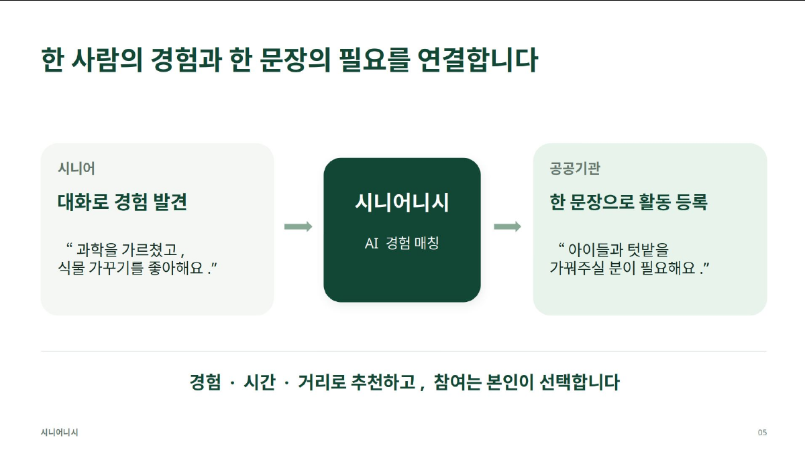
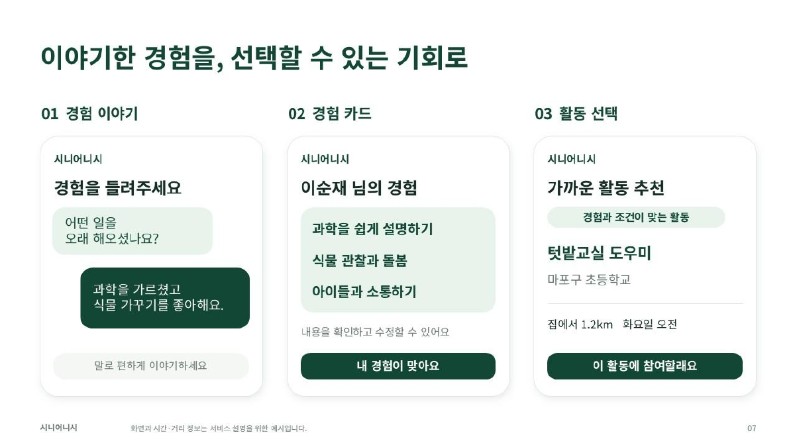
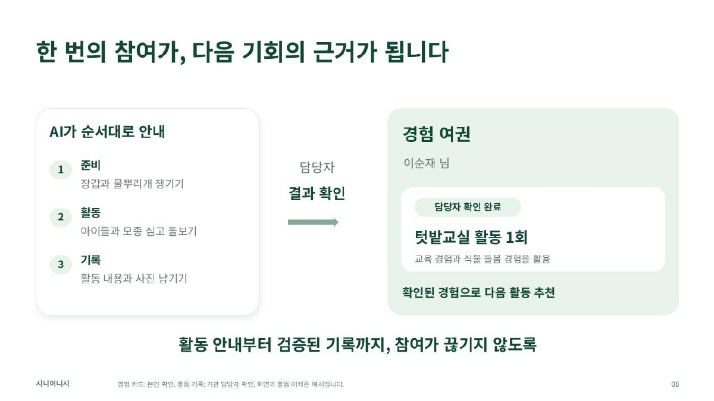

9월 18일 서울 AI 허브에서 열린 AI IMPACT: AI for Good 정책 해커톤에서 시니어니시(Senior Niche)를 만들어 발표했고, 5등을 했어요. 사회문제를 정의하고 작동하는 시제품과 정책 제안을 함께 준비하는 행사였어요. 저희는 은퇴와 경력단절 이후에도 시니어의 경험이 지역에서 필요한 일로 이어지는 방법을 고민했어요.

시니어니시는 시니어의 암묵지, 즉 오래 일하고 생활하며 익힌 판단과 요령을 AI가 이해하고 사회적 과제와 연결하는 프로젝트예요. 이름에는 지역의 작은 빈틈을 뜻하는 니치와 시니어가 서로 돕는다는 의미를 담았어요. 교직에서 퇴직한 어머니가 경험과 취미를 살려 좋아하는 일을 찾으셨으면 했던 마음도 출발점이었어요.

## 은퇴 이후 경험과 기회가 연결되지 않는 문제

이력서에는 직함과 근무 기간이 남지만, 사람에게 설명하는 요령이나 취미로 쌓은 기술까지 드러나기는 어려워요. 기관도 필요한 사람을 찾으려면 활동 내용을 정리하고 참여 조건을 맞춰야 해요. 참여가 끝난 뒤 기록이 다음 기회와 연결되지 않으면, 시니어는 매번 자신의 경험을 처음부터 설명해야 해요.

노션 기획에서 다룬 문제는 개인의 경험, 지역의 필요, 활동 이후의 경력이 따로 남는다는 점이었어요. 그래서 기존 시니어 사업의 참여자와 활동, 성과 기록을 연결하는 방향을 잡았어요. 목표는 경험을 활용할 일자리와 사회참여 기회를 넓히고, 지역에서도 필요한 인력을 찾기 쉽게 만드는 것이에요.

<figure class="fig"><figcaption>발표자료의 서비스 구조. 대화로 경험을 발견하고 기관의 활동 요청과 연결해요.</figcaption></figure>

## 경험과 참여 조건으로 활동 추천하기

발표에서는 은퇴한 과학 교사의 교육 경험과 식물 돌봄 취미를 초등학교 텃밭교실에 연결했어요. 서비스 설명을 위한 가상 인물과 활동이에요. 과학 교사라는 직함을 과학 설명, 식물 관찰, 아이들과의 소통처럼 활동에 필요한 경험으로 풀면 지역의 요청과 비교할 수 있어요.

발표에서 제시한 흐름은 대화에서 찾은 내용을 경험 카드로 정리하고 본인이 확인·수정하는 것으로 시작해요. 기관이 필요한 일을 한 문장으로 입력하면 수행할 수 있는 작은 과제로 나누고, 경험과 가능한 시간·이동 범위를 함께 고려해 추천하는 흐름이에요. 추천을 받은 시니어는 활동 내용과 조건을 살펴보고 참여 여부를 선택해요.

<figure class="fig"><figcaption>본인이 경험을 확인하고 활동을 고르는 발표 화면. 인물과 시간·거리는 설명용 예시예요.</figcaption></figure>

이 추천 로직을 검토하며 별도로 만든 평가 사례에는 같은 철물점 경력도 다르게 다뤘어요. 공구 사용법을 주민에게 설명했다는 경험과 재고를 정리했다는 경험은 연결할 활동이 달라요. 직업명만 보고 교육 역량을 부여하면 본인이 말하지 않은 경력을 만들어낼 수 있어요. "가르쳐 봤다"와 "가르쳐 본 적 없다"도 구별해야 해요.

시간 역시 설명 문구에만 넣을 조건이 아니에요. 오후만 가능한 사람에게 오전 활동을 추천한다면 경험이 잘 맞아도 참여할 수 없어요. 이런 사례를 합성 데이터, 즉 실제 개인정보 대신 만든 가상 입력으로 정리했어요. 이 자료는 추천이 지켜야 할 조건을 점검하기 위한 것이며, 모델의 추천 성능을 측정한 결과는 아니에요.

## 활동 완료가 다음 추천의 입력이 되는 경험 여권

활동 이후의 설계는 준비물과 할 일을 순서대로 안내하고 활동 기록을 남기는 흐름이에요. 텃밭교실 예시에서는 장갑과 물뿌리개 준비, 모종 돌봄, 활동 내용과 사진 기록으로 이어져요. 기관 담당자가 결과를 확인하면 그 활동과 활용한 경험이 경험 여권에 쌓이는 구조예요.

경험 카드의 자기 설명과 기관이 확인한 수행 기록은 구분해야 해요. 평가 사례에서도 참석 사실만 확인된 경우와 특정 과업 수행까지 확인된 경우를 나눴어요. 참석 기록을 근거로 전문 역량이나 지도 경험까지 인정하면 다음 추천의 근거도 부정확해져요. 확인된 범위만 새 경력에 더하는 것이 이 기록의 기준이에요.

<figure class="fig"><figcaption>활동 수행, 담당자 확인, 경험 여권으로 이어지는 흐름. 화면의 활동 이력은 발표용 예시예요.</figcaption></figure>

노션에서 강조한 <abbr title="활동 결과를 다음 추천의 입력으로 되돌려 경험과 기회가 이어지게 하는 순환 구조">폐루프</abbr>는 여기서 이어져요. 은퇴 전의 경험으로 첫 활동을 찾고, 확인된 활동에서 새로운 경험이 생기면 기존 경험 기록에 더해요. 다음 추천은 이 갱신된 기록을 사용하도록 설계했어요. 경험 여권을 보여주는 데서 끝내지 않고, 완료 후 추천의 근거가 달라지도록 설계한 것이에요.

발표 영상에서는 경험 정리, 맞춤 기회, 신청 준비와 담당자 승인, 기여 기록 화면을 보여줬어요. 신청 승인과 활동 완료 확인은 서로 다른 단계예요. 전자는 참여 절차의 진행을 뜻하고, 후자는 무엇을 수행했는지 다음 경력에 남길 근거가 돼요.

## 해커톤에서 제안한 것과 앞으로 확인할 것

시니어니시는 은퇴 전의 경험이 은퇴 후 활동으로 이어지고, 그 활동이 다시 경력이 되는 경로를 제안했어요. 실제 고용이나 소득이 늘었다고 판단하려면 현장에서 참여와 활동 지속 여부를 확인해야 해요. 현재 발표 화면과 설계, 가상 평가 사례만으로 그 효과를 입증할 수는 없어요. 경험 추출이 당사자의 말과 맞는지, 참여 조건을 지키는지, 확인된 결과가 다음 추천에 반영되는지가 검증의 출발점이에요.

함께 서비스와 발표를 완성한 팀원들께 감사드려요. 행사를 마련한 서울 AI 허브와 운영을 맡은 Team Human, 참가자 크레딧을 지원한 SpaceXAI에도 감사드립니다.

## 발표자료와 행사 안내

https://docs.google.com/presentation/d/1ROxNHNxc3e3RRujTa-E4HkiKDrLf_LTHutzqQjOCw5g/edit

https://www.youtube.com/watch?v=9CVq-GlKhIo

https://luma.com/sfdsjsxi
