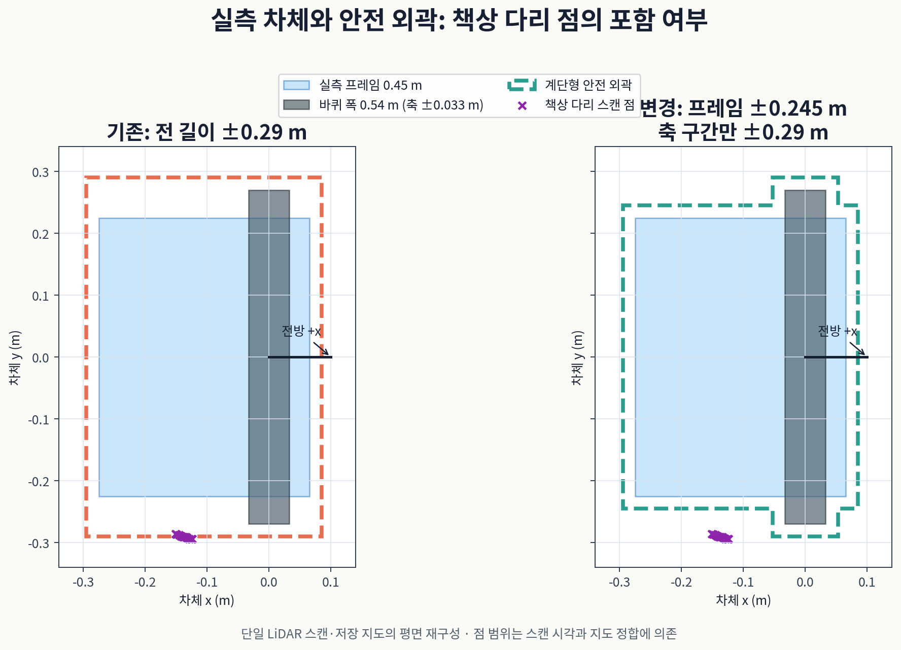
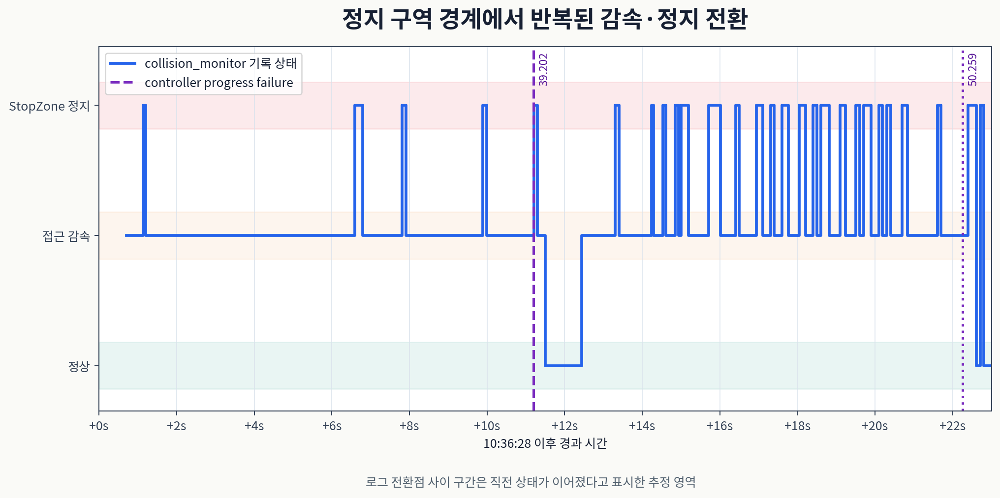

<span hidden data-jdamr-tooltip-scope></span>
<script src="../static/scripts/2026-10-02_jdamr_tooltips.js"></script>

이동 로봇 <abbr title="두 바퀴의 속도 차이로 방향을 바꾸는 실습용 이동 로봇">JD-AMR</abbr>이 책상 다리 옆에서 멈췄어요. 프레임과 다리 사이에 여유가 있었지만 전진, 후진, 회전이 모두 잠겼어요. 저장된 센서 좌표와 실측 차체를 대조하니 바퀴 폭을 차체 전체에 적용한 직사각형 정지 구역이 다리를 포함하고 있었어요.

<abbr title="지도에서 경로를 찾고 로봇의 이동과 복구 동작을 실행하는 ROS 2 소프트웨어">Nav2</abbr>에서 경로를 찾는 단계와 실제 속도를 멈추는 단계는 달라요. <abbr title="센서가 감지한 장애물을 속도별 구역과 대조해 이동 명령을 줄이거나 멈추는 노드">Collision Monitor</abbr>는 속도 명령의 끝단에서 장애물을 확인해요. 경로가 있어도 이 노드의 <abbr title="장애물이 들어오면 로봇 속도를 0으로 만드는 보호 구역">StopZone</abbr>에 물체가 들어오면 움직이지 않아요. 정지 뒤 같은 경로를 재시도하는 것만으로는 잘못 정의한 구역을 벗어날 수 없어요.

## 관문 1. 다리는 프레임 옆, 바퀴 축 뒤에 있었어요

<div class="gate crit"><div class="idx">1</div><div class="body"><div class="row"><span class="lab">증상</span><span class="val">10:05 장애물 시험에서 책상 다리 옆에 멈추고 모든 방향의 이동이 막혔어요.</span></div><div class="row"><span class="lab">근거</span><span class="val">프레임까지 약 6.5 cm 여유가 있었지만 다리가 정지 구역 안에 들어갔어요.</span></div><div class="row"><span class="lab">조치</span><span class="val">실측 프레임과 바퀴의 범위를 구분해 정지 구역을 다시 만들었어요. <span class="tag ok">원인 대조</span></span></div></div></div>

정지 시 로봇은 지도 좌표 (0.313, −0.701)에 있었고 방향은 −74°였어요. 기록된 좌표 변환을 이용해 <abbr title="빛을 쏴 물체까지 거리를 재고 주변 단면을 얻는 거리 센서">라이다</abbr>의 점을 차체 좌표로 옮겼어요. 다리로 판단한 점은 차체 기준 앞뒤 x가 −0.11–−0.15 m, 좌우 y가 −0.286–−0.298 m였어요. 지도에 저장된 다리 위치와도 10 cm 안에서 일치했어요.

이 좌표에서 다리는 바퀴 축보다 뒤쪽에 있어요. 실제 프레임 폭은 0.45 m이고, 바퀴의 바깥 폭은 0.54 m예요. 넓은 바퀴 부분은 축 앞뒤 0.033 m에만 걸쳐 있어요. 로봇 전체를 가장 넓은 폭으로 그리면, 프레임만 있는 뒤쪽에도 바퀴가 있는 것처럼 보호 구역이 넓어져요.

현장에서는 여유가 5 cm 이상이고 회전, 전진, 후진이 가능하다고 확인했어요. 센서 분석에서도 프레임과 다리의 간격은 그 관찰과 맞았어요. 다만 지도와 한 시점의 스캔을 맞춘 값에는 측정 시각과 좌표 변환의 오차가 들어가요. 아래 그림은 실측 제원과 기록 좌표의 평면 재구성이며, 통과 주행을 촬영한 증거는 아니에요.

<figure class="fig"><figcaption>축 주위의 바퀴 폭과 나머지 프레임 폭을 분리했어요. 기록의 대표 다리 위치는 (−0.13, −0.29) m예요. 센서 점의 범위는 읽는 시각에 따라 조금 달라지며, 회전 중 쓸리는 공간은 이 정지 평면과 별도로 판단해요.</figcaption></figure>

## 관문 2. 정지 여유를 줄이지 않고 형상을 바꿨어요

이전 구역은 바퀴 폭에 양옆 2 cm를 더한 ±0.29 m를 길이 전체에 적용했어요. 전진, 후진, 멈춤 상태에서 선택하는 구역 모두 같은 다리를 포함했어요. 회전용 구역도 반지름 0.43 m라 다리를 포함했어요. 실행기는 다른 방향의 속도를 내도 보호 구역에서 다시 정지하게 되는 상태였어요.

<abbr title="경로와 충돌을 판단할 때 지도 위에 놓는 로봇의 평면 외곽 다각형">footprint</abbr>와 정지 구역을 계단형으로 바꿨어요. 프레임 부분은 반폭 0.225 m에 여유 0.02 m를 더해 ±0.245 m로 두었어요. 축 앞뒤는 바퀴 범위에도 같은 여유를 더한 ±0.053 m 구간에서만 ±0.29 m까지 넓혔어요. 넓은 부분을 축 부근에 남겨 바퀴를 포함하고, 프레임 옆의 빈 영역은 덜 포함하게 했어요.

| 범위 | 실측 차체 | 여유를 더한 구역 |
| --- | --- | --- |
| 프레임 반폭 | 0.225 m | 0.245 m |
| 바퀴 바깥 반폭 | 0.270 m | 0.290 m |
| 넓은 부분의 축 앞뒤 | ±0.033 m | ±0.053 m |

형상을 바꾸면 파라미터 검증도 바뀌어야 해요. 기존 검증은 사각형이라는 가정으로 앞끝, 뒤끝, 폭을 읽었어요. 그 검증을 계단형 다각형도 받을 수 있게 바꾸면서, 실측 프레임과 바퀴의 꼭짓점이 외곽 안에 모두 들어가는지 확인하도록 했어요. 전진, 후진, 멈춤 구역이 그 외곽을 감싸는지도 별도로 검사해요. 단순히 설정이 파싱된다는 확인보다 실제 차체 포함 여부가 필요한 이유예요.

<abbr title="장애물과 주변 여유를 격자 비용으로 표현해 계획과 제어에 쓰는 지도">코스트맵</abbr>의 외곽도 함께 바뀌었어요. 이동할 때 외곽 충돌을 예측하는 기능이 같은 외곽을 쓰기 때문이에요. 회전 구역은 기존 값을 유지했어요. 다리 옆에서 정지한 모습만으로 회전 전체의 쓸림 범위를 줄일 수는 없어요.

실행 중인 Collision Monitor와 지역 코스트맵의 파라미터를 읽어 계단형 반영을 확인했어요. 인계에는 해당 다리 옆을 수정본으로 통과한 주행은 없어요. 설정 반영, 형상 포함 검사, 실제 통과는 확인 수준이 다르므로 결과를 구분해 남겼어요.

## 관문 3. 기다리다가 운영자를 호출하는 경로는 동작했어요

첫 장애물 시험에서는 컨트롤러가 진전하지 못한 뒤 <abbr title="이 프로젝트에서 경로 추종 중 일정 시간 동안 진행하지 못한 상태를 알리는 Nav2 오류 코드">105</abbr>가 나왔어요. 실행기는 20 s 기다리고 다시 시도하는 동작을 세 번 반복했어요. 다시 움직일 조건이 생기지 않자 포기 이벤트를 남기고 운영자 호출을 보냈어요. 로봇의 정지와 사람에게 알리는 단계가 같은 기록에 연결됐어요.

다음은 이벤트 기록에서 해당 필드만 발췌한 값이에요. 다른 필드와 전체 타임스탬프는 원본 실행 기록에 남아 있어요.

```json
{"event":"path_blocked_wait","wait":1,"wait_s":20.0}
{"event":"path_blocked_wait","wait":2,"wait_s":20.0}
{"event":"path_blocked_wait","wait":3,"wait_s":20.0}
{"event":"path_blocked_give_up","waits":3}
{"event":"operator_call","level":"CRITICAL","category":"path_blocked"}
```

<abbr title="자동 복구를 끝낸 뒤 사람이 상황을 확인하도록 요청하는 실행기 이벤트"><code>operator_call</code></abbr>은 화면 경고까지 이어졌어요. 10:08의 기록과 PC의 <abbr title="사람이 확인해야 하는 막힘 상태를 표시하는 화면 경고"><code>OPERATOR CALL</code></abbr>을 함께 확인했어요. <abbr title="진행을 중단하고 운영자 확인을 요청하는 심각도"><code>CRITICAL</code></abbr>은 그 호출의 등급이에요. 알림이 보였다는 사실은 검증됐지만, 사람이 호출을 확인하고 복구하는 전체 운영 절차까지 시험한 것은 아니에요.

막힘 처리에서 후진은 장애물 위치를 보고 결정해요. 앞끝에서 0.30 m 안에 물체가 있고 컨트롤러 정지에 해당할 때, 검증된 경로로 0.10 m 후진하는 동작을 추가했어요. 반대로 이번 다리처럼 축 뒤쪽 옆에 있는 물체로는 후진하지 않아요. 후진하면 넓은 바퀴 부분을 다리에 가까이 보내기 때문이에요. 후진 경로를 지도와 코스트맵으로 확인하는 조건도 남겼어요.

이 후진 탈출은 구현과 반영까지 마쳤고 실차 확인은 남아 있어요. 막혔다는 오류 코드만 보고 후진하면, 같은 오류를 내는 앞쪽 장애물과 옆쪽 장애물에 동일한 동작을 하게 돼요. 오류는 대처를 시작하는 조건이고, 실제 대처 방향은 장애물의 위치와 차체 형상을 더 읽어야 정할 수 있어요.

## 관문 4. 치운 뒤에도 대기 시간이 남았어요

두 번째 장애물 시험에서는 막았을 때 멈추고, 치웠을 때 다시 출발했어요. 그러나 물체를 치워도 20 s를 다 기다렸어요. 앞을 사람이 지나갔을 때에는 짧은 정지 다섯 번 뒤 진행했어요. 같은 정지라도 오래 막힌 상태와 잠깐 지나가는 물체를 구분할 재출발 조건이 필요했어요.

<figure class="fig"><figcaption>로그의 상태 변경 시각으로 그린 타임라인이에요. 점 사이 선은 다음 변경까지 상태를 유지한 것으로 표시한 재구성이며 연속 센서 측정은 아니에요. 정지와 접근 감속이 반복되면서 컨트롤러의 진행 실패도 기록됐어요.</figcaption></figure>

10:36:28–50의 기록에는 정지 구역 경계에서 감속과 정지가 빠르게 번갈아 나타났어요. 경계에 걸린 물체가 센서 점의 작은 변화로 구역 안팎을 오간 것으로 해석했어요. 상태 로그의 인접 전환 일부는 0.1–0.3 s 간격이었어요. 모든 구간의 전환 간격이 그 범위였다는 뜻은 아니에요.

Nav2 1.3.12의 Collision Monitor에는 이 경우 정지 상태를 별도 시간 동안 붙잡아 두는 처리가 없었어요. 설정의 <abbr title="정지 명령을 반복 발행한 뒤 발행을 멈추는 시간 한도이며, 장애물 상태를 유지하는 시간은 아닌 값"><code>stop_pub_timeout</code></abbr>을 그런 유지 시간으로 해석하면 동작을 잘못 이해하게 돼요. 이 경계 반복 자체는 후속 수정에서도 남았어요. 실행기가 다시 시도할 시점을 개선한 것과 보호 노드의 상태 전환을 안정화한 것은 다른 변경이에요.

105 대기에는 앞쪽 띠를 2 s마다 최신 스캔으로 읽는 조건을 추가했어요. 두 번 연속 비어 있으면 20 s를 채우지 않고 다시 시도해요. 한 번의 빈 스캔으로 곧바로 출발하지 않으려는 조건이에요. 앞이 비어 있어도 옆 물체가 정지 구역에 남을 수 있으므로, 이 조건은 모든 방향의 통과 가능성을 증명하지 않아요. 그런 경우 재시도 후 다시 멈추면 호출까지 가는 시간이 줄어들 수 있어요.

경로를 찾지 못해 멈춘 경우에는 2 s마다 다시 계획하고, 경로가 생기면 일찍 대기를 끝내요. 두 대처는 각각 앞쪽 센서와 경로 계획 결과를 읽어요. 후속 코드와 테스트에서는 조기 종료 조건을 확인했지만, 105 조기 출발의 실차 확인은 인계 범위에 없어요. 기존 20 s 대기 뒤 재출발한 기록을 새 조기 출발 기능의 성공으로 쓰지 않았어요.

## 관문 5. 재확인과 실행의 계획기가 달랐어요

10:39 도크 대기점으로 복귀하는 구간에서는 시험 장애물로 통로가 차체보다 좁아졌어요. 차체 외곽을 고려하는 <abbr title="차체 형상과 가능한 이동 동작을 함께 고려해 경로를 찾는 전역 계획기">Lattice</abbr>는 경로가 없다고 판단했어요. 반면 기다리는 동안 길이 열렸는지 확인하는 데 쓰던 <abbr title="격자 지도에서 장애물 비용을 따라 위치 경로를 찾는 전역 계획기">NavFn</abbr>은 경로가 있다고 답했어요. 실행은 실패하는데 재확인은 성공해서 대기를 일찍 끝내는 불일치가 생겼어요.

대기점의 행동 트리를 Lattice 우선, 실패하면 NavFn으로 같은 목표를 계획하는 구성으로 바꿨어요. 실행과 재확인의 판단을 맞추는 조치지만, 물리적으로 좁은 통로를 넓혀 주지는 않아요. NavFn 대체 경로에도 Collision Monitor의 정지 조건은 적용돼요. 차체 외곽을 엄격히 반영하는 계획과 과제 진행을 이어 가는 대체 계획의 대가는 별도로 기록해야 해요.

[[2026-10-02_회고_JDAMR_구간별NavFn과Lattice선택|이동 로봇 JD-AMR의 NavFn과 Lattice 구간별 선택]]

## 형상과 재출발을 함께 판정해요

정지 구역은 실측 차체를 포함하고, 움직이는 방향의 쓸림 범위도 고려해야 해요. 대기 뒤 재시도는 실제로 달라진 센서나 계획 결과를 근거로 시작해요. 이번 기록은 직사각형 교착의 원인, 대기와 운영자 호출, 기존 대기 뒤 재출발을 확인했어요. 계단형 구역의 다리 옆 통과, 후진 탈출, 105 조기 출발, 대체 경로 주행과 경계 반복의 해소는 실차 확인이 남아 있어요.

<!-- src-block -->
출처 — https://github.com/mmporong/jdamr_cube_ros/blob/ac46030/jdamr_cube_navigation/evaluation/20260929_PARKING_FAILURES.md

출처 — https://github.com/ros-navigation/navigation2/blob/6be3614013ec586051b86c97b919b293281490fe/nav2_collision_monitor/src/collision_monitor_node.cpp

출처 — https://docs.nav2.org/jazzy/tutorials/general_tutorials/using_collision_monitor/using_collision_monitor/
