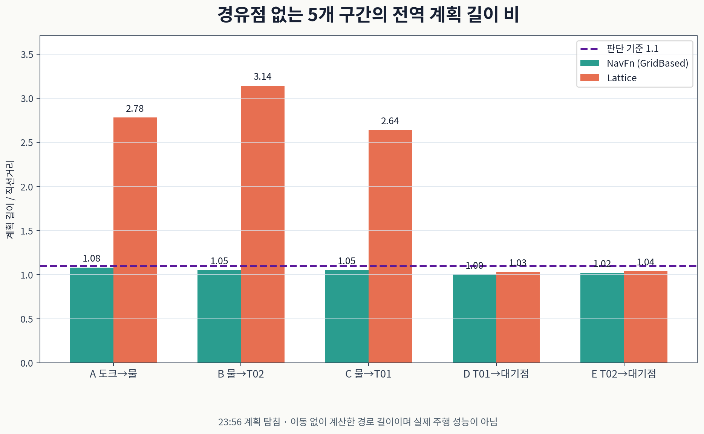

이동 로봇 <abbr title="두 바퀴의 속도 차이로 방향을 바꾸는 실습용 이동 로봇">JD-AMR</abbr>에 두 전역 계획기를 올렸어요. <abbr title="격자 지도에서 장애물 비용을 따라 위치 경로를 찾는 전역 계획기">NavFn</abbr>은 이동 경로를 짧게 찾았고, <abbr title="차체 형상과 가능한 이동 동작을 함께 고려해 경로를 찾는 전역 계획기">Lattice</abbr>는 도크 대기점 접근에서 쓸 후보였어요. 이동 구간과 마지막 대기점 구간의 비용이 달라서 하나로 통일하지 않았어요.

<abbr title="지도에서 경로를 찾고 로봇의 이동과 복구 동작을 실행하는 ROS 2 소프트웨어">Nav2</abbr>의 전역 계획기는 목표까지의 경로를 만들어요. 로봇을 움직이는 경로 추종기는 별도예요. 계획에 목표 방향이 들어갔다고 그 방향으로 실차가 도착했다고 판단할 수는 없어요. 이번 비교는 라즈베리파이의 실행 중인 계획 세션에서 시작점과 목표를 지정한 실험이며, 아래 막대의 값은 주행 거리가 아닌 계획 경로 길이예요.

## 경유점을 빼도 이동 구간 우회가 남았어요

<abbr title="격자 기반 경로 탐색에 차체의 방향과 이동 가능한 짧은 동작들을 넣은 계획기 계열">Smac State Lattice</abbr>는 로봇이 가능한 동작을 이어 경로를 탐색해요. 이번 설정은 차동구동용 동작 집합을 사용했고, 제자리 회전도 계획에 포함됐어요. 차체 외곽을 여러 방향으로 놓아 충돌을 검사하는 반면, NavFn의 경로 탐색은 2차원 위치 격자에서 이뤄져요. 비원형 차체의 실제 통과 가능성은 두 계획기에서 같은 기준으로 보장되지 않아요.

길이 비는 계획 경로 길이를 비교에 사용한 직선 기준 거리로 나눈 값이에요. 경유점을 포함한 실험에서는 구간별 경유점 연결의 기준 거리를 쓰고, 경유점을 뺀 실험에서는 시작점과 목표점의 거리를 써요. 값 1에 가까우면 그 조건의 기준 거리와 비슷하고, 값이 크면 많이 돌아간 경로예요. 10월 1일 19:45의 경유점 포함 비교에서 도크 출발 구간의 Lattice 길이 비는 2.05, 물 받는 곳에서 <abbr title="이 실험에서 1번 테이블 관측점에 붙인 목표 이름">table_01</abbr>로 가는 구간은 2.23이었어요.

중간 경유점의 방향이 우회를 만드는지 확인하려고 23:56에는 경유점을 빼고 다시 계획했어요. 시작점과 최종 목표만 줬지만 이동 구간의 우회는 더 크게 남았어요. 방향 제약을 원인 후보로 볼 근거는 있었지만, 경유점 방향 하나를 없애면 모든 우회가 풀린다는 해석은 이 비교에서 지지되지 않았어요. 길이 비가 서로 다른 분모를 쓰는 두 실험의 절대 경로 길이는 원본과 함께 읽어야 해요.

<figure class="fig"><figcaption>23:56 계획 탐침의 값이에요. 이동 구간 세 곳은 Lattice 길이 비가 2.64–3.14였고, 도크 대기점 두 구간은 1.03–1.04였어요. 점선 1.1은 이 프로젝트의 계획기 통일 판정 기준이에요.</figcaption></figure>

| 경유점 없는 구간 | NavFn 길이 비 | Lattice 길이 비 | Lattice 계획 시간(s) |
| --- | --- | --- | --- |
| 도크 → 물 받는 곳 관측점 | 1.08 | 2.78 | 0.109 |
| 물 받는 곳 → <abbr title="이 실험에서 2번 테이블 관측점에 붙인 목표 이름">table_02</abbr> 관측점 | 1.05 | 3.14 | 0.004 |
| 물 받는 곳 → table_01 관측점 | 1.05 | 2.64 | 0.008 |
| table_01 → 도크 대기점 | 1.00 | 1.03 | 0.200 |
| table_02 → 도크 대기점 | 1.02 | 1.04 | 0.175 |

두 비교에서 NavFn 계획 시간은 0.001–0.039 s, Lattice는 0.004–0.543 s였어요. 두 계획기를 올린 서버의 메모리는 77 MB였어요. 23:57 회전 패널티 탐침의 시간은 이 범위 집계에 포함하지 않았어요. 계획기 통일 조건인 길이 비 1.1 이하를 이동 구간에서 충족하지 못해, 통일 설정의 반복 주행으로 넘어가지 않았어요.

## 도착 방향을 넣으면 회전 담당도 달라져요

도크 대기점 두 구간은 경로 길이 면에서 후보로 남았어요. 그러나 경로의 마지막 동작을 읽어 보니 직진 뒤 목표점에서 63.4° 또는 90.0°의 제자리 회전으로 끝났어요. 회전 비용을 1.5, 3.0, 5.0으로 바꿔도 비교한 두 구간의 마지막 회전은 63.4°로 남았어요. 회전 비용을 올린다는 설정 의도만으로 목표 근처의 회전이 사라지지는 않았어요.

현재 대기점 판정은 위치만 보고, 실행기가 <abbr title="바퀴 움직임 등으로 누적한 로봇의 상대 이동 좌표">odom</abbr> 기준 <abbr title="현재 자리에서 목표 각도만큼 도는 Nav2 동작">Spin</abbr>으로 방향을 맞춰요. 판정에 방향을 넣으면 경로 끝 회전을 <abbr title="경로 앞쪽의 한 점을 골라 그쪽으로 향하게 조향하고 속도를 제한하는 경로 추종기">RPP</abbr>가 맡게 돼요. 이때 기준이 되는 <abbr title="지도와 거리 센서를 비교해 로봇의 위치와 방향을 추정하는 방법">AMCL</abbr> 방향이 9월 30일 도크 근처에서 약 15° 튄 기록이 있었어요. 그래서 방향 판정을 추가하는 변경은 보류했어요.

전날 18:51의 Lattice 주행에서 도크 대기점 방향이 잘 맞았던 실행도 있었어요. 그 한 번의 도착 방향을 모든 시작 자세에 대한 보장으로 쓰지는 않았어요. 이후 경로 탐침에는 마지막 제자리 회전이 남았고, 실차 비교에서는 별도 Spin이 다시 필요했어요. 당시 비교에서 대기점 Spin은 Lattice가 92–112°, NavFn이 115–136°였지만, 실행 간 배치와 추정 상태 차이가 있으므로 통제된 개선율로 계산하지 않았어요.

## 설치된 버전의 동작 집합을 확인했어요

사용 중인 배포판은 <abbr title="이 실험에서 사용한 ROS 2와 Nav2의 배포판 이름">Jazzy</abbr>이고 Nav2 버전은 1.3.12예요. 설치된 계획기 헤더에는 목표 방향을 유연하게 탐색하는 <abbr title="목표에 도착할 때 특정 방향만 허용할지 여러 방향을 탐색할지 정하는 설정"><code>goal_heading_mode</code></abbr>가 없었어요. 최신 문서에 설정이 보인다는 이유로 이번 설치본에서도 사용할 수 있다고 판단하지 않았어요. 해당 기능은 후속 배포판의 변경과 구분해야 해요.

<abbr title="위치와 방향을 함께 탐색하면서 곡률 제한이 있는 차량의 이동을 계획하는 방법">Hybrid-A*</abbr>도 검토했어요. 설치본의 <abbr title="최소 회전 반경을 지키며 전진하는 곡선을 연결하는 이동 모델">DUBIN</abbr>과 <abbr title="최소 회전 반경을 지키며 전진과 후진 곡선을 연결하는 이동 모델">REEDS_SHEPP</abbr>은 0 반경 제자리 회전을 동작으로 쓰지 않아요. 이번 차체의 제자리 회전을 계획에 남기려는 조건에는 맞지 않아 후보에서 뺐어요. 이는 Hybrid-A* 전반의 성능 순위가 아니라 이번 동작 요구와 설치된 모델의 비교예요.

회전 패널티 탐침에서는 원래 값 조회가 실패해 5.0이 잠시 남는 운영 오류도 있었어요. 설정 파일의 값 0.5로 복원하고 실제 값을 읽어 확인했으며, 그동안 주행은 없었어요. 탐침을 위해 설정을 바꿨다면 결과 데이터뿐 아니라 복원 확인도 실험 기록에 필요해요. 마지막 출력 파일에 5.0이 적혔다고 현재 실행값도 그 값이라고 읽으면 상태를 잘못 복원하게 돼요.

## 대체 경로에는 차체 충돌 판정의 대가가 있어요

10월 2일 시험 장애물로 좁아진 통로에서는 Lattice가 경로를 찾지 못했어요. 차체보다 좁은 배치였으므로 외곽을 반영한 실패 판단은 맞았어요. 그런데 막힘이 풀렸는지 확인하는 계획은 NavFn이라 경로가 있다고 답했어요. 실행과 재확인의 계획 기준이 다르면 같은 실패를 짧은 시간에 반복할 수 있어요.

대기점 <abbr title="계획과 이동, 실패 뒤 복구의 순서를 조건에 따라 실행하는 행동 트리">BT</abbr>를 Lattice 우선, NavFn 대체로 바꿨어요. 실제 계획과 재확인의 기준을 맞추는 선택이지만, NavFn 대체 경로는 차체가 좁은 틈을 통과한다는 증거가 아니에요. 바퀴가 넓고 프레임이 좁은 차체에서는 위치 경로와 전체 외곽의 통과 판정 차이가 커질 수 있어요. 속도 끝단의 <abbr title="센서가 감지한 장애물을 보호 구역과 대조해 이동 명령을 줄이거나 멈추는 노드">Collision Monitor</abbr>는 대체 경로에서도 유지돼요.

장애물을 옮긴 뒤 같은 지점에서 계획한 결과는 NavFn 1.76 m, Lattice 3.49 m였어요. 이것은 장애물이 좁게 놓였던 실패 순간과 다른 조건의 측정이에요. 원래 막힌 틈을 통과할 수 있었다는 사후 증거로 쓰지 않아요. 대체 경로를 따라 도크로 복귀한 실차 확인도 인계 범위에는 없어요.

이동 구간은 NavFn, 도크 대기점은 Lattice 우선과 NavFn 대체로 두었어요. 선택 기준은 서버 자원 하나가 아니라 구간별 경로 길이, 마지막 회전, 차체 포함 여부, 실패 뒤 재확인의 일치예요. 마지막 직선 도크 진입은 이 계획 비교와 별도인 후진 추종 구간이므로, 계획기 선택만 바꿔 끝 방향 오차를 해결했다고 쓰지 않아요.

[[2026-10-02_회고_JDAMR_도크밖정렬과_직선후진|이동 로봇 JD-AMR 도크 방향 오차와 직선 후진 진입]]

<!-- src-block -->
출처 — https://github.com/mmporong/jdamr_cube_ros/blob/ac46030/jdamr_cube_navigation/evaluation/20260929_PARKING_FAILURES.md

출처 — https://docs.nav2.org/jazzy/configuration_and_development/first_time_robot_setup_guide/navigation_plugins/setup_navigation_plugins/

출처 — https://docs.nav2.org/jazzy/configuration_and_development/configuration_guide/planners_plugins/smac/smac_hybrid/configuring_smac_hybrid/

출처 — https://docs.nav2.org/rolling/configuration_and_development/migration_guides/jazzy/Jazzy/
