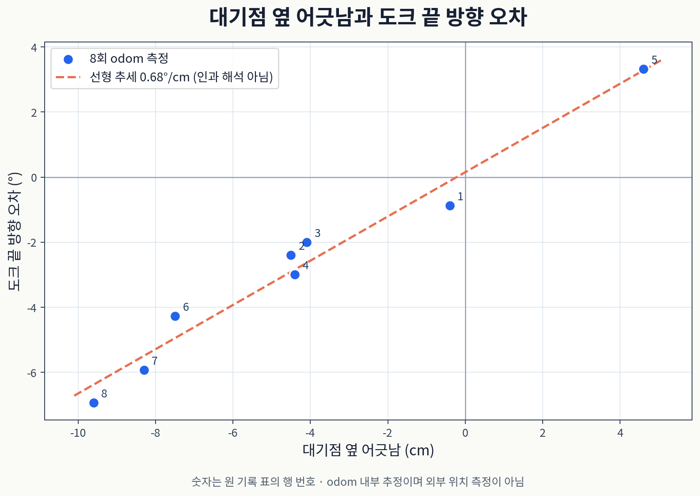

이동 로봇 <abbr title="두 바퀴의 속도 차이로 방향을 바꾸는 실습용 이동 로봇">JD-AMR</abbr>은 충전소 도크에 후진해 들어가요. 끝 위치는 맞았는데 차체 방향이 남아 도크 안에서 회전하는 문제가 있었어요. 곡선 후진의 옆 어긋남을 줄이는 과정과 마지막 방향 정렬을 분리하고, 실제 주행에서 남은 오차를 다시 살폈어요.

주행은 <abbr title="지도에서 경로를 찾고 로봇의 이동과 복구 동작을 실행하는 ROS 2 소프트웨어">Nav2</abbr>가 맡고, 후진 구간은 실행기가 만든 경로를 <abbr title="경로 앞쪽의 한 점을 골라 그쪽으로 향하게 조향하고 속도를 제한하는 경로 추종기">RPP</abbr>가 따라가요. 아래 방향과 위치 오차는 <abbr title="바퀴 움직임 등으로 누적한 로봇의 상대 이동 좌표">odom</abbr> 기준이에요. 줄자나 외부 카메라로 잰 실제 도크 오차와는 측정 기준이 달라요.

<figure class="fig"><figcaption>10월 1일 기존 곡선 후진 8회예요. 대기점 옆 어긋남의 부호와 도크 끝 방향 오차가 함께 바뀌었어요. 바퀴 기반 상대 좌표에서 읽은 값이며, 수정 후 주행과 섞지 않았어요.</figcaption></figure>

## 관문 1. 위치 판정 뒤에도 방향이 남았어요

1

증상도크 끝 위치는 수렴했지만, 방향을 맞추려고 도크 안에서 회전했어요.

근거대기점 회전 뒤 방향 오차는 0.3–2.3°였고, 곡선 후진 뒤에는 최대 6.93°가 남았어요.

조치옆 어긋남 보정과 방향 정렬을 도크 밖으로 옮겼어요. 구조 변경

대기점은 도크에 들어가기 전 잠시 도착하는 목표점이에요. 이 점의 위치 판정은 15 cm를 허용해서, 도착으로 판정해도 도크 축 옆으로 어긋날 수 있었어요. 그 뒤 제자리 회전으로 도크 방향을 맞추고 <abbr title="시작점과 끝점의 위치 및 방향을 연결하는 부드러운 3차 곡선">Hermite</abbr> 경로를 따라 후진했어요. 회전 직후 방향이 이미 정확한데 도크 끝에서 오차가 커졌다면, 회전의 실패와 후진 중 방향 변화를 나눠 봐야 해요.

저장된 주행 데이터에서 후진 시작과 종료 시점의 상대 좌표를 읽었어요. 같은 도크 목표를 기준으로 앞뒤 거리와 옆 어긋남을 분리하고, 차체 방향은 목표 방향과의 차이로 환산했어요. 목표 위치에 가까워졌다는 사실만으로 방향까지 맞았다고 판단하면 이 문제가 가려져요. 종료 조건에 들어간 거리와 방향을 각각 남겨야 어떤 조건이 태스크를 멈췄는지 알 수 있어요.

| 대기점 옆 어긋남(cm) | 도크 끝 방향 오차(°) |
| --- | --- |
| −0.4 | −0.87 |
| −4.5 | −2.39 |
| −4.1 | −2.00 |
| −4.4 | −2.99 |
| +4.6 | +3.32 |
| −7.5 | −4.27 |
| −8.3 | −5.93 |
| −9.6 | −6.93 |

도크 끝의 옆 위치는 모두 0.2 cm 안으로 들어왔고, 앞뒤로는 목표보다 1.7–1.9 cm 앞에서 멈췄어요. 옆 어긋남은 줄었지만 방향은 그 보정량과 함께 남았어요. 원 기록은 이 8회에서 옆 어긋남 1 cm당 약 0.7°의 관계를 읽었어요. 한 경로와 한 배치에서 얻은 관측이므로 다른 차체나 도크의 일반 보정 상수로 옮겨 쓰지는 않아요.

## 관문 2. 곡선은 도크 앞에서 끝내요

2

원인곡선 후진이 옆 어긋남을 도크 끝까지 보정하면서 방향 오차를 남겼어요.

조치도크 앞 0.25 m 축 위까지 곡선 후진하고, 방향을 맞춘 뒤 직선 후진해요.

결과08:43 주행에서 도크 끝 방향 −1.71°, 위치 오차 1.48 cm를 기록했어요. 주행 확인

도크 축 위에 <abbr title="충전소에 들어가기 전 옆 위치와 방향을 맞추는 도크 앞 지점">pre-dock</abbr>을 두었어요. 대기점의 옆 어긋남이 1 cm를 넘으면 이 지점까지만 곡선 후진해요. 곡선을 만들 수 없는 배치에서는 회전, 이동, 회전으로 정렬하는 기존 경로를 써요. 옆 위치가 맞은 뒤 방향을 맞추고, 마지막 구간은 도크 축을 따라 후진해요.

0.25 m는 이번 차체와 배치에서 고른 값이에요. 원 기록에서는 옆 어긋남이 10 cm여도 곡선 반경을 0.3 m보다 크게 남기는 거리로 검토했어요. 도크 밖에서 방향을 맞추면 차체의 회전 궤적도 도크 끝 위치보다 앞에 남아요. 경로를 나눈 이유는 곡선을 짧게 만드는 데만 있지 않고, 옆 위치 보정이 끝난 자리에서 방향을 다시 판정할 수 있게 하는 데 있어요.

대기점에서 도크 목표를 odom 좌표로 고정해요. 이후 정렬과 후진은 이 좌표를 공유하므로, 지도상 위치 추정이 바뀌더라도 구간마다 목표가 다른 좌표로 다시 놓이지 않아요. 다만 고정한 상대 좌표에도 바퀴 추정 오차는 남아요. 상대 좌표의 일관성을 확보한 것과 외부 실측으로 정확도를 증명한 것은 별개예요.

08:43의 <abbr title="이번 주행에서 방문한 2번 테이블의 목표 이름">table_02</abbr> 주행은 옆 어긋남 3.3 cm에서 시작했어요. 도크 앞 방향이 2.79°여서 당시 3° 기준에서는 회전하지 않았고, 직선 후진 끝에 −1.71°를 기록했어요. 사이클은 164.4초였어요. 정차 시간을 줄인 변경도 함께 들어간 실행이라, 전체 시간의 차이를 도크 경로 변경 하나의 효과로 계산할 수는 없어요.

## 관문 3. 도크 밖 3° 판정이 재진입을 만들었어요

08:47의 연속 주행에서는 도크에 들어갔다가 다시 빠져나왔어요. 옆 어긋남을 보정한 직후 방향이 15.67°라 도크 밖에서 회전했지만, 당시 회전은 3° 판정에 들어오면 끝났어요. 직선 후진 중 약 1°가 더해져 도크 끝에서 3.97°를 기록했고, 끝 방향 허용치 3°를 넘었어요. 실행기는 준비된 경로에 따라 앞으로 빠져나와 방향을 맞추고 재진입했어요.

이 동작은 위치에 못 들어가서 생긴 재시도가 아니었어요. 도크 밖 정렬과 도크 끝 판정이 같은 각도 한도를 쓰면서, 그 사이 후진에서 늘어나는 오차를 남겨 두지 못한 결과였어요. 도크 구간은 첫 실행의 15.0초에서 26.4초로 길어졌어요. 08:51 주행도 끝 방향 −2.92°로 같은 한도 바로 안쪽에 머물렀어요.

| 실행 | 도크 끝 방향 | 기록상 결과 |
| --- | --- | --- |
| table_02 08:43 | −1.71° | 한 번에 진입 |
| table_02 08:47 | 3.97° → −0.84° | 앞으로 빠져나온 뒤 재진입 |
| <abbr title="이번 주행에서 방문한 1번 테이블의 목표 이름">table_01</abbr> 08:51 | −2.92° | 한도 안에서 종료 |
| table_02 09:13 | 4.99° → 1.43° | 도크에서 작은 회전으로 보정 |

도크 밖 회전 판정을 1.5°로 줄였어요. 회전 속도 0.2 <abbr title="각도를 라디안으로 표현한 초당 회전 속도의 단위">rad/s</abbr>와 10 <abbr title="초당 몇 번 갱신하는지 나타내는 주기의 단위">Hz</abbr> 갱신 주기에서는 한 주기에 약 1.15° 움직여요. 판정을 무작정 작은 값으로 정하면 한 번의 갱신으로 한도를 지나칠 수 있어서, 실제 제어 주기와 회전 속도를 함께 보고 골랐어요. 실행기는 출발 전에 해당 판정기가 실제 컨트롤러에 등록됐는지도 확인해요.

도크 끝에서는 오차의 크기에 따라 동작을 나눴어요. 절댓값 3° 이하는 종료하고, 3° 초과 5° 이하는 그 자리에서 작은 회전으로 맞춰요. 5°를 넘을 때는 도크 밖으로 빠져나와 다시 정렬해요. 차체 뒤 모서리의 회전 반경 0.414 m를 기준으로 5°에서 약 3.6 cm가 쓸린다는 기하 검토가 이 구분의 근거예요. 모든 도크에서 작은 회전이 가능하다는 허가는 아니고, 이번 차체와 공간에 맞춘 판단이에요.

09:13 주행에서는 도크 끝 4.99°를 작은 회전으로 보정했어요. 회전은 0.6초였고, 보정 뒤 방향은 1.43°였어요. 이 실행은 작은 끝 오차 보정의 동작을 확인해 주지만, 모든 시작 자세에서 한 번에 도킹한다는 반복 검증은 아니에요.

## 관문 4. 직선 후진의 방향 흔들림은 남았어요

남은 원인 가설수정 후 직선 구간 시작의 옆 어긋남은 0.4 cm 이하였지만, 후진하는 동안 방향은 양쪽으로 변했어요. 이전 곡선 후진의 옆 어긋남만으로 이 현상을 설명할 수 없어요.

마지막 직선 후진에서 읽은 방향 변화는 +4.5°, −2.8°, −1.6°, +0.9°, −5.1°였어요. 시작점이 이미 축 위에 가까웠고 변화의 부호도 일정하지 않았어요. 따라서 앞선 산점도에서 찾은 관계를 이 직선 구간의 원인으로 그대로 이어 붙이지 않았어요. 곡선의 끝 방향 오차를 줄인 조치와 직선 추종 중 흔들림은 서로 다른 검증 항목이에요.

당시 후보는 경로 끝에서의 RPP 추종이었어요. 마지막 경로는 0.25 m이고 설정의 최소 <abbr title="현재 위치보다 앞에서 조향 목표점을 고르는 거리">lookahead</abbr>는 0.3 m예요. Nav2 1.3.12 소스는 지정 거리보다 먼 경로점이 없으면 마지막 경로점을 추종점으로 골라요. 따라서 두 길이의 관계는 확인할 조건이지만, 목표 밖의 점을 반드시 따라가서 흔들렸다고 단정할 근거는 없어요.

분리해서 볼 값은 후진 시작의 옆 위치, 방향, 마지막 경로점까지 거리, 그리고 그동안의 각속도 명령이에요. 끝 방향 하나만 보면 추종기가 남긴 변화와 도크 앞 회전의 잔여 오차가 합쳐져 보여요. 기존 실행기에는 <abbr title="목표점에 가까워지는 모양을 부드럽게 만드는 다른 경로 추종기">Graceful</abbr> 컨트롤러를 마지막 구간에 쓰는 선택지가 있어요. 이 후보와의 비교 주행은 인계 범위에서 완료하지 않았어요.

좌측 바퀴 나사가 느슨했던 일도 따로 대조했어요. <abbr title="차체의 가속도와 회전 속도를 측정하는 관성 센서">IMU</abbr>와 바퀴 회전의 비율은 나사를 조이기 전 0.963, 0.969, 0.992였고, 조인 뒤는 0.976이었어요. 직선 후진의 방향 변화도 한쪽으로 고정되지 않았어요. 이 기록에서는 나사 조임 전후의 뚜렷한 차이를 찾지 못했으며, 기구 영향이 언제나 없다는 결론으로 넓히지는 않아요.

## 도크 진입을 판정하는 기준

도크 진입은 대기점 도착, 옆 위치 보정, 도크 밖 방향 정렬, 직선 후진, 끝 방향 보정으로 나눠 기록해요. 각 단계의 입력 좌표와 종료 판정이 있으면 재진입이 어느 조건에서 시작됐는지 복원할 수 있어요. 이번에는 도크 안 큰 회전을 줄였고, 작은 끝 오차 보정도 한 실행에서 확인했어요. 직선 후진 중 방향 변화의 원인과 반복 주행의 분포는 아직 검증이 남아 있어요.

[[2026-10-02_회고_JDAMR_계단형정지구역과_막힘대처|이동 로봇 JD-AMR 계단형 정지 구역과 막힘 대처]]

<!-- src-block -->
출처 — https://github.com/mmporong/jdamr_cube_ros/blob/ac46030/jdamr_cube_navigation/evaluation/20260929_PARKING_FAILURES.md

출처 — https://docs.nav2.org/jazzy/configuration_and_development/configuration_guide/controller_plugins/configuring_regulated_pp/

출처 — https://github.com/ros-navigation/navigation2/blob/6be3614013ec586051b86c97b919b293281490fe/nav2_regulated_pure_pursuit_controller/src/regulated_pure_pursuit_controller.cpp
