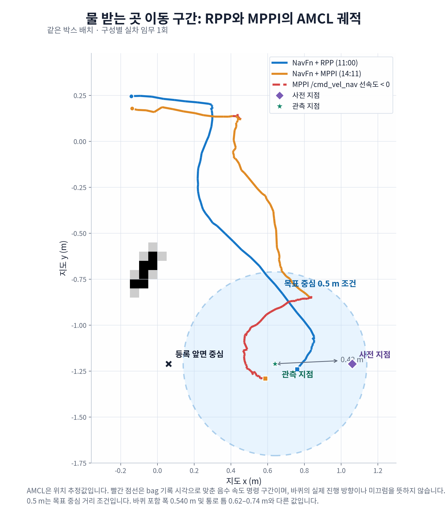
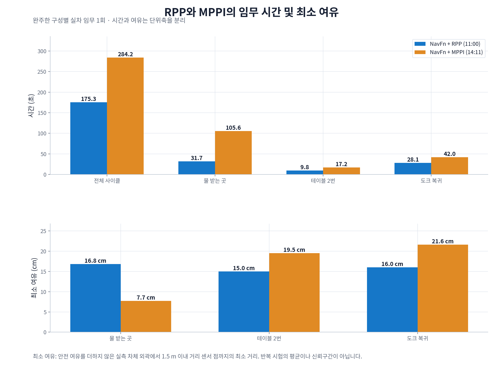

<span hidden data-jdamr-tooltip-scope></span>
<script src="../static/scripts/2026-10-02_jdamr_tooltips.js"></script>

이동 로봇 <abbr title="두 바퀴의 속도 차이로 방향을 바꾸는 실습용 이동 로봇">JD-AMR</abbr>의 서빙 사이클을 두 경로 추종기로 주행했어요. <abbr title="경로 앞쪽의 한 점을 향해 조향하고 장애물 근접도와 회전 정도에 따라 속도를 줄이는 경로 추종기">RPP</abbr>는 175.3초, <abbr title="이동 명령 후보를 앞으로 예측하고 경로·목표·장애물 비용을 평가해 다음 명령을 계산하는 경로 추종기">MPPI</abbr>는 284.2초에 완주했어요. 물 받는 곳 박스 앞에서는 MPPI가 사전 지점을 건너뛰고 후진으로 들어갔어요. 표본은 구성마다 1회이며, 이번 정밀 접근 조건에서 나타난 차이예요.

<abbr title="지도에서 경로를 찾고 로봇의 이동과 복구 동작을 실행하는 ROS 2 소프트웨어">Nav2</abbr>의 전역 계획기는 경로를 만들고, 경로 추종기는 그 경로를 바퀴 속도 명령으로 바꿔요. 경로 위에 지점을 넣는 것과 실차가 그 지점을 지나가는 것은 별도로 확인해야 해요. 두 완주 구성은 전역 계획기를 <abbr title="격자 지도에서 장애물 비용을 따라 위치 경로를 찾는 전역 계획기">NavFn</abbr>으로 맞췄어요. 마지막 박스 앞 주차는 두 구성 모두 같은 정밀 주차 컨트롤러가 맡았어요.

## 경로를 지키는 방식과 후보를 평가하는 방식

RPP는 경로 위 앞쪽 추종점을 고르고, 그 점을 향하는 곡률로 속도를 정해요. 곡률은 얼마나 급하게 방향을 바꾸는지 나타내는 값이에요. 장애물에 가까워지거나 급회전이 필요하면 속도를 줄여요. 이번 설정에서는 경로와 방향 차이가 클 때 제자리 회전으로 먼저 맞췄어요. 경로를 벗어나 장애물을 우회하는 길을 만들어 내는 방식은 아니에요.

MPPI는 이전 이동 명령에 변화를 주어 후보들을 만들고, 로봇이 그 명령대로 움직일 위치를 예측해요. 이번 설정은 후보 500개, 0.1초 간격 30단계였어요. 각 후보를 <abbr title="예측한 이동이 경로·목표·장애물·속도 조건에 얼마나 맞는지 비용으로 평가하는 함수">비평 함수</abbr>로 채점하고, 비용이 작은 후보에 더 큰 비중을 주어 다음 명령을 계산해요. 어느 비평 함수가 언제 켜지는지에 따라 같은 경로에서도 움직임이 달라질 수 있어요.

실차는 바퀴를 포함해 폭 0.540 m, 프레임 길이 0.340 m인 차동구동 로봇이고 최고 속도는 0.12 m/s였어요. 라즈베리파이 4에서 <abbr title="로봇 프로그램이 센서·위치·속도 정보를 주고받도록 연결하는 소프트웨어 기반">ROS 2</abbr> <abbr title="이번 로봇에서 사용한 ROS 2 배포판 이름">Jazzy</abbr>와 Nav2 1.3.12를 썼어요. 도크에서 출발해 물 받는 곳 박스, 테이블 2번 박스를 거쳐 도크로 돌아오는 사이클을 비교했어요. 각 구성의 시작 자세와 위치 추정 변화까지 통제한 반복 실험은 아니에요.

## 관문 1. 완주는 같았지만 접근 궤적은 달랐어요

<div class="gate"><div class="idx">1</div><div class="body"><div class="row"><span class="lab">증상</span><span class="val">MPPI가 박스 앞 사전 지점으로 곧게 들어가지 않고, 방향을 바꾸며 후진했어요.</span></div><div class="row"><span class="lab">근거</span><span class="val">물 받는 곳 이동은 RPP 31.7초, MPPI 105.6초였고 최소 여유는 각각 0.168 m, 0.077 m였어요.</span></div><div class="row"><span class="lab">판정</span><span class="val">완주 여부와 설계한 접근 경로의 유지 여부를 나누어 봤어요. <span class="tag mid">구성별 1회</span></span></div></div></div>

<figure class="fig"><figcaption>지도와 거리 센서를 비교해 위치를 찾는 <abbr title="지도와 거리 센서의 관측을 비교해 로봇의 위치와 방향을 추정하는 방법">AMCL</abbr>의 좌표로 그린 궤적이에요. 사전 지점과 관측 지점, 목표 거리 0.5 m 경계를 함께 표시했어요. 후진 명령 구간은 별도 선 모양으로 구분했으며 외부 위치 측정은 아니에요.</figcaption></figure>

| 측정 항목 | NavFn + RPP | NavFn + MPPI |
|---|---:|---:|
| 전체 사이클 | 175.3초 | 284.2초 |
| 물 받는 곳 이동 | 31.7초 | 105.6초 |
| 테이블 2번 이동 | 9.8초 | 17.2초 |
| 도크 복귀 이동 | 28.1초 | 42.0초 |
| 물 받는 곳 최소 여유 | 0.168 m | 0.077 m |
| 테이블 2번 최소 여유 | 0.150 m | 0.195 m |
| 도크 복귀 최소 여유 | 0.160 m | 0.216 m |
| 주차 앞면 간격, 물 / 테이블 | 5.54 / 5.53 cm | 5.56 / 5.45 cm |

MPPI의 목표 방향 비평은 이번 완주에서 목표 0.1 m 안부터 켜지도록 바꿨어요. RPP와 MPPI라는 이름만 다른 비교가 아니라, 해당 설정을 포함한 두 실행의 비교예요. 최소 여유는 안전 여유를 덧붙이지 않은 실측 차체 외곽과 1.5 m 안의 스캔 점 사이 거리 중 최솟값이에요. 사람과 함께 지나갈 수 있는 폭이나 충돌 확률을 뜻하지 않아요.

<figure class="fig"><figcaption>시간과 최소 여유의 단위를 나눠 표시했어요. MPPI는 테이블 이동과 도크 복귀에서 여유를 더 뒀지만, 물 받는 곳 접근에서는 더 오래 걸렸고 여유도 줄었어요.</figcaption></figure>

MPPI가 물 받는 곳으로 갈 때는 사전 지점으로 이어지는 경로 앞에서 멈칫했어요. 14:12:44부터 약 50초 동안 Nav2의 선속도 명령이 음수였고, 후진 명령을 내며 방향을 약 −17°에서 161°까지 바꿨어요. 비스듬히 도착한 뒤에는 거리 센서와 깊이 카메라가 잰 박스 면 방향이 5.4° 달라 관측을 한 번 거부했어요. 탐색 회전을 거쳐 주차는 끝냈지만, 접근 중 생긴 방향 차이가 다음 단계에도 영향을 준 사례였어요.

주차 간격과 방향은 박스 면 관측과 <abbr title="바퀴 움직임 등으로 누적한 로봇의 상대 이동 좌표">odom</abbr>으로 계산한 내부 추정이에요. 외부 실측 정확도로 읽으면 안 돼요. 주차 간격이 비슷한 것은 마지막 정밀 주차 컨트롤러를 공유한 조건과 함께 봐야 해요.

## 관문 2. 경유점보다 최종 목표의 직선거리가 먼저 작아졌어요

<div class="gate"><div class="idx">2</div><div class="body"><div class="row"><span class="lab">기하</span><span class="val">사전 지점 (1.06, −1.21)과 관측 지점 (0.64, −1.21)의 간격은 0.42 m였어요.</span></div><div class="row"><span class="lab">조건</span><span class="val">경로 정렬·경로 각도·전진 선호 비평은 최종 목표 0.5 m 안에서 꺼졌어요.</span></div><div class="row"><span class="lab">기준</span><span class="val">정밀 접근에서는 경유점 기하와 비평 함수의 거리 전환을 함께 확인해야 해요. <span class="tag ok">소스 대조</span></span></div></div></div>

박스 앞면의 등록 위치는 (0.06, −1.21)이었어요. 사전 지점에 도착한 뒤 서쪽을 향해 관측 지점으로 곧게 들어가도록 경로를 만들었어요. 그러나 MPPI가 이 전환을 판정하는 거리는 경로를 따라 남은 길이가 아니라, 현재 위치와 경로 마지막 목표 사이의 평면 직선거리였어요. 사전 지점 자체가 최종 목표에서 0.42 m이므로, 사전 지점까지 가는 중에도 0.5 m 조건에 들어갈 수 있었어요.

Nav2 1.3.12의 <abbr title="비평 함수를 목표 접근 단계로 넘길 때 사용하는 거리 기준값"><code>threshold_to_consider</code></abbr>와 실행 조건을 대조했어요. 경로 정렬·경로 각도·전진 선호 비평은 0.5 m 안에서, 경로 추종 비평은 1.0 m 안에서 꺼졌어요. 목표 위치 비평은 1.0 m 안에서 켜졌고, 목표 방향 비평은 실험에 따라 0.5 m 또는 0.1 m 안에서 켜졌어요. 이 전환으로 경유 경로와 전진을 유지하려는 비용의 비중이 달라졌어요.

목표 근처에도 충돌·속도 제약 비평은 계속 평가돼요. 따라서 후진 명령이 나온 이유를 "목표 비용만 남았다"고 설명하면 실제 코드와 맞지 않아요. 후진을 허용한 후보가 전진 선호의 별도 벌점 없이 경쟁할 수 있게 된 것과, 실제로 어느 후보가 가장 낮은 비용이었는지는 구분해야 해요. 이번 기록에는 비평 함수별 점수와 선택 후보가 없어 비용 순위까지 확정하지 않았어요.

## 관문 3. 저속 로봇의 3초 예측은 0.36 m였어요

MPPI의 예측 시간은 30 × 0.1초 = 3초였어요. 최고 속도 0.12 m/s를 곱하면 직진 예측 거리는 최대 0.36 m예요. 가속과 감속을 무시한 계산이라 실제 후보가 모두 그만큼 움직인다는 뜻은 아니에요. 작은 공간에서 방향을 맞추고 옆으로 이동하는 동작은 이 거리만으로 판단하기 어려웠어요.

서쪽을 향한 로봇이 옆으로 20 cm를 옮긴 뒤 다시 서쪽을 향하는 동작을 한 가지 방식으로 계산했어요. 0.3 <abbr title="1초당 회전 속도의 단위로, 값 1은 1초에 약 57.3도 회전을 뜻해요">rad/s</abbr>로 90° 회전하면 약 5.2초, 0.12 m/s로 0.20 m 전진하면 약 1.7초, 다시 90° 회전하면 약 5.2초예요. 합계 약 12초인 기동 전체가 3초 창에 담기지 않았어요. 이 계산은 머뭇거림에 기여할 수 있는 시간 척도이며, 정지가 최저 비용이었다는 증명은 아니에요.

| 시나리오(실험 표식) | 구성과 목표 방향 비평 조건 | 기록 시간 | 결과 |
|---|---|---:|---|
| 도크에서 관측까지 S1 | MPPI, 0.5 m부터 | 약 72초 | 105 실패(경로 막힘으로 포기), 도착 오차 0.154 m |
| 탈출점에서 사전 지점 S2 | MPPI, 0.5 m부터 | 약 57초 | 105 실패, 도착 오차 0.212 m |
| 옆 17 cm 이동 S3 | MPPI, 0.1 m부터 | 약 43초 | 성공, 0.020 m / −10.9° |
| 도크에서 관측까지 S3 | MPPI, 0.1 m부터 | 약 66초 | 성공, 사전 지점에 가장 가까웠을 때도 0.417 m |
| 도크에서 관측까지 S4 | RPP | 약 33초 | 성공, 후진 표본 0 |

S2는 서쪽을 향한 채 동쪽으로 후진하고, 사전 지점에서 21 cm 북쪽에 멈췄어요. 목표 방향 비평의 시작 거리를 줄인 S3의 옆 이동은 도착했지만, 약 18초 머뭇거린 뒤 후진을 섞은 3점 회전을 했어요. 방향 오차도 −10.9°였어요. 도착 성공이 빠르고 정렬된 접근까지 뜻하지는 않았어요.

실행 <abbr title="측정한 좌표와 명령을 항목별로 담은 텍스트 데이터 형식">JSON</abbr>을 다시 읽은 출력 일부예요. <abbr title="이동 요청부터 결과 뒤의 수집까지 포함한 기록 종료 시간"><code>duration</code></abbr>은 기록 종료까지의 시간이어서 결과 뒤 약 1.5초의 수집을 포함해요. 실행 중 화면에 출력한 시간은 JSON 저장 뒤 다시 재므로 소수점 값이 조금 달라, 위 표는 정수 초로 적었어요.

```text
S2: result {'accepted': True, 'status': 6, 'error_code': 105} duration 57.0
final pose (1.046,-0.998,-176.9) error 0.212 m, 3.1 deg
S3: result {'accepted': True, 'status': 4, 'error_code': 0} duration 42.4
final pose (0.620,-1.288,169.1) error 0.020 m, -10.9 deg
```

S1과 S2는 등록된 박스 중심의 남북 좌표 y −1.21을, S3와 S4는 그날 거리 센서로 다시 잰 y −1.283을 썼어요. 시작 자세도 같지 않았어요. 그래서 초기 실패와 후속 성공의 차이를 비평 조건 하나의 효과로 환산하지 않았어요. S3 전체에서는 목표 방향 비평을 늦춰도 사전 지점을 건너뛴 상태가 남았어요.

## 부하 수치도 측정한 날짜와 함께 읽었어요

10월 2일의 별도 실주행 부하 기록에서 MPPI의 제어 주기는 10 <abbr title="1초 동안 명령 계산이 반복되는 횟수를 나타내는 단위">Hz</abbr> 설정에 대해 5.8–9.9 Hz였어요. 같은 날 컨트롤러 서버 <abbr title="이동 명령 계산 등에 쓰는 컴퓨터 중앙 처리 장치">CPU</abbr> 사용량은 한 코어 기준 MPPI 20–41%, RPP 9.6–9.9%였어요. 10월 6일의 사이클 차이에서 연산 지연의 기여량을 분리해 잰 값은 아니에요.

MPPI는 제어 주기와 예측 간격을 맞춰 다음 명령을 계산해요. 주기가 밀리면 튜닝 값만 볼 때 예상한 갱신 간격과 달라져요. 2024년 메인테이너 답변은 20 Hz를 하한선, 30 Hz 이상을 권장값으로 제시했어요. 이 값은 사례 기반 튜닝 조언이며 Nav2 1.3.12의 강제 실행 조건은 아니에요. 저속 로봇에서도 같은 성능이 보장된다는 뜻으로 쓰지 않았어요.

## 판단을 고친 근거와 구간 선택 기준

처음에는 실시간 스캔을 이용해 장애물 사이로 비켜 가는 MPPI가 구조적으로 더 맞는 방향이라고 판단했어요. 그러나 이번 정밀 접근에서는 설계한 사전 지점을 건너뛰었고, 물 받는 곳 구간 시간이 약 3.3배로 늘었어요. 경유점을 유지해야 하는 구간에서는 장애물 회피 기능과 경로 추종 요구가 함께 맞는지 실차로 봐야 했어요. 이 비교 뒤 이동·대기점 구간의 기본 구성은 NavFn+RPP로 고정했어요.

후진 금지가 실패 원인이라는 판단도 고쳤어요. 11:06 주행은 목표를 지나친 뒤 후진할 수 없어 중단됐지만, 후진을 허용한 11:21 주행도 도크 근처에서 최대 50° 회전하고 관측 지점에서 0.157 m 어긋났어요. 후진 허용으로 증상이 달라졌고, 목표 앞 비용 전환과 짧은 예측창을 함께 살펴볼 필요가 남았어요. 차체 동작을 고려하는 전역 계획기 <abbr title="차체 형상과 가능한 이동 동작을 함께 고려해 경로를 찾는 전역 계획기">Lattice</abbr>와 MPPI의 조합도 사전 지점 통과에 실패해 중단됐어요.

박스 오른쪽에 선 현상에는 등록 위치와 실제 박스 위치 차이도 있었어요. 이동 단계는 고정된 관측 지점으로 가고, 카메라 검출은 도착 뒤 박스 면 정렬부터 써요. 박스가 등록값보다 약 7 cm 남쪽에 놓인 상태와 로봇의 도착 허용치 0.15 m가 겹쳤어요. 추종기 문제와 목적지 등록 문제를 같은 오차로 합치지 않았어요.

| 구간 조건 | 시험할 구성과 먼저 확인할 값 |
|---|---|
| 경유점과 도착 방향이 중요한 정밀 접근 | RPP와 제자리 회전, 마지막은 같은 정밀 주차 컨트롤러로 비교해요. |
| 정밀 접근에 MPPI를 쓰는 경우 | 경유점을 별도 목표로 나누고, 최종 목표 거리와 비평 함수의 전환 거리를 확인해요. |
| 저속 차동구동 | 예측 시간 × 최고 속도와 회전·이동에 걸리는 시간을 함께 계산해요. |
| 넓은 통로의 사람·움직이는 장애물 | MPPI를 후보로 두고 회피 궤적, 여유, 제어 주기를 새로 측정해요. |
| 라즈베리파이 4급 컴퓨터 | 컨트롤러 CPU와 실제 주기를 기록하고, 같은 조건에서 여유를 비교해요. |

MPPI의 이점을 열린 구간에서 여유를 몇 cm 더 두는 것으로만 평가한 판단도 좁았어요. Nav2 공식 가이드는 RPP를 정확한 경로 추종, MPPI를 동적 장애물 회피로 구분해요. 이번에는 사람이 서 있거나 지나가는 통로를 비교하지 않았어요. 물체 사이 틈 0.62–0.74 m에서 폭 0.54 m 로봇이 가운데 선다고 계산하면 한쪽 여유는 4–10 cm지만, 이는 사람과의 통과 실험 결과가 아니에요. 구간 선택 기준은 정밀 접근의 경로 유지와 넓은 통로의 회피 성능을 각각 검증하는 것이에요.

관련 기록: [[2026-10-02_회고_JDAMR_구간별NavFn과Lattice선택|이동 로봇 JD-AMR의 NavFn과 Lattice 구간별 선택]]

출처 — https://github.com/ros-navigation/navigation2/blob/6be3614013ec586051b86c97b919b293281490fe/nav2_mppi_controller/README.md

출처 — https://github.com/ros-navigation/navigation2/blob/6be3614013ec586051b86c97b919b293281490fe/nav2_mppi_controller/include/nav2_mppi_controller/tools/utils.hpp

출처 — https://github.com/ros-navigation/navigation2/tree/6be3614013ec586051b86c97b919b293281490fe/nav2_mppi_controller/src/critics

출처 — https://github.com/ros-navigation/navigation2/blob/6be3614013ec586051b86c97b919b293281490fe/nav2_regulated_pure_pursuit_controller/README.md

출처 — https://github.com/ros-navigation/docs.nav2.org/blob/a11e3b7eb61056b8d352722c5db62f43b760421d/docs/configuration_and_development/tuning_guide.md

출처 — https://github.com/ros-navigation/navigation2/issues/4049#issuecomment-1919594431
