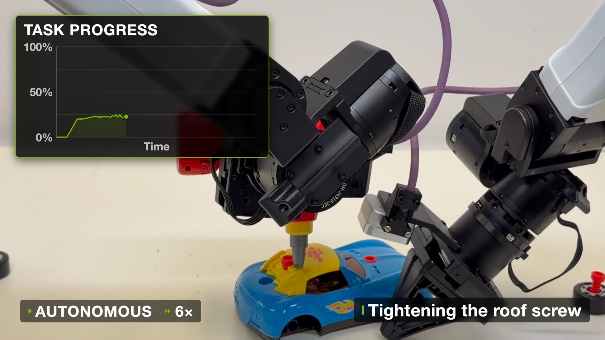
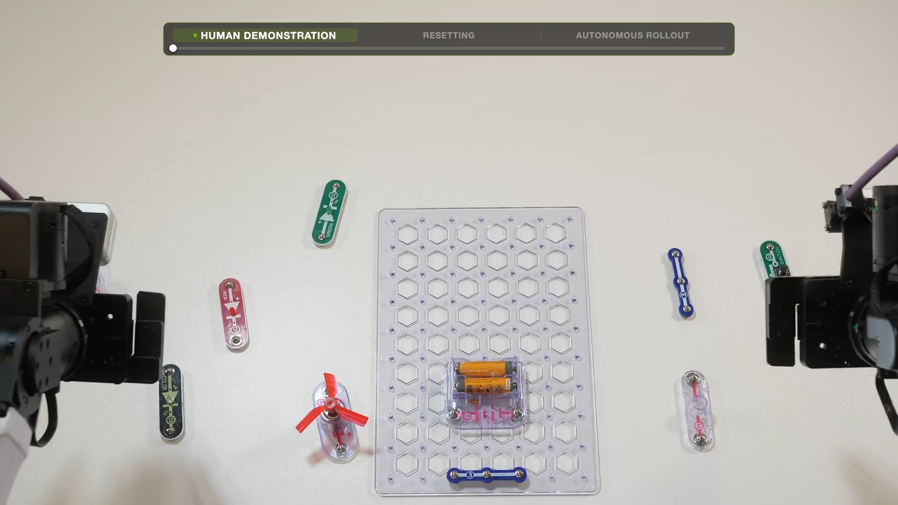
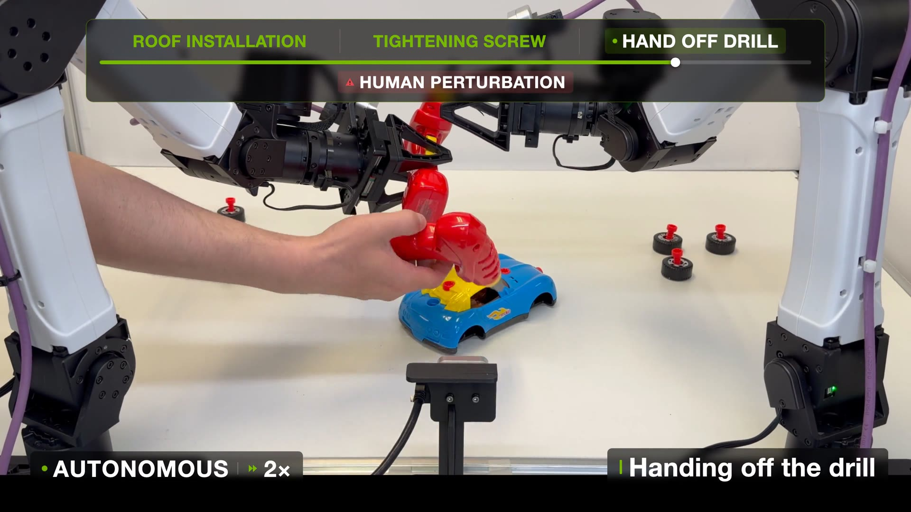

NVIDIA GEAR가 스탠퍼드, UT 오스틴과 함께 공개한 RoboTTT(Context Scaling for Robot Policies)를 정리했어요. 로봇 정책이 참조하는 시각-운동 컨텍스트를 8K 타임스텝, 시간으로 약 5분까지 늘리면서 추론 지연은 그대로 유지한 연구예요. [[2026-07-16_AI가_로봇을_잡는_높이|AI가 로봇을 잡는 높이]]에서 모델들이 최근 몇 스텝에만 의존하는 근시안적 적응에 갇혀 있었다는 발견을 정리했는데, RoboTTT는 정확히 그 문제, 즉 "정책에 쓸 만한 기억을 어떻게 넣을 것인가"를 정면으로 다뤄요.

## 문제: 로봇 정책에는 기억이 없다

지금의 로봇 파운데이션 모델 대부분은 현재 프레임 하나 또는 아주 짧은 히스토리만 보고 행동을 출력해요. 부품을 어디까지 끼웠는지, 방금 어떤 실수를 했는지를 기억하지 못하니 10단계짜리 조립처럼 긴 과제를 끝까지 수행할 수 없어요. 그렇다고 어텐션 컨텍스트를 그냥 늘리면 계산과 메모리가 시퀀스 길이를 따라 불어나서, 실시간으로 돌아야 하는 로봇 제어에서는 지연이 감당이 안 돼요. 긴 기억과 일정한 추론 비용을 동시에 잡아야 하는 문제예요.

## TTT 레이어: 추론 중에도 학습하는 빠른 가중치

RoboTTT는 GR00T N1.7 기반 VLA(Vision-Language-Action) 정책에 TTT(Test-Time Training) 레이어를 끼워 넣어요. TTT 레이어의 은닉 상태는 빠른 가중치(fast weights)라 불리는 작은 신경망 파라미터인데, 훈련 중은 물론 추론 중에도 매 토큰마다 경사하강으로 갱신돼요. 구체적으로는 TTT-KVB 방식으로, 각 토큰을 키와 값으로 투영한 뒤 키에서 값을 복원하는 손실 ℓ(W; x) = ‖f(k; W) − v‖²을 정의하고, 토큰이 들어올 때마다 W를 한 스텝 내리고(갱신) 그 갱신된 W로 출력을 계산해요(적용). 지나간 관측이 어텐션 캐시처럼 쌓이는 게 아니라 고정 크기 가중치 안에 압축되기 때문에, 컨텍스트가 아무리 길어져도 추론 비용이 늘지 않아요.

사전학습된 VLA의 능력을 해치지 않는 장치도 있어요. 삽입된 TTT 레이어의 출력은 학습되는 tanh 게이트 α를 거쳐 o = tanh(α)·o_TTT + o_attn으로 합쳐지는데, α를 0 근처에서 시작해 처음에는 원래 어텐션 경로만 살아 있다가 훈련이 진행되며 TTT 경로가 점진적으로 열려요.

훈련 쪽 설계도 세 가지가 핵심이에요. 초기 빠른 가중치 W_0은 2차 경사를 쓰는 메타러닝으로 학습하고, 임의로 긴 시퀀스는 TBPTT(절단 역전파)로 다뤄요. 시퀀스를 고정 길이 세그먼트로 잘라 그래디언트는 세그먼트 안에서만 흘리되 빠른 가중치는 세그먼트 경계를 넘어 전달해서, 메모리는 일정하게 유지하면서 긴 시퀀스를 훈련해요. 액션 생성에는 플로우 매칭을 쓰는데, 노이즈 수준을 시퀀스 전체가 아니라 액션 청크마다 독립적으로 샘플링하는 sequence action forcing이 시퀀스 안정성에 필요했다고 해요.

<em>양팔 로봇의 장난감 자동차 지붕 나사 조립 자율 실행 — 좌상단은 과제 진행률 그래프(출처: NVIDIA GEAR)</em>

## 결과: 컨텍스트가 새로운 스케일링 축

세 가지 실물 조립 과제(자동차 모델 Pup Go Car, 원격 제어 로봇 Gear Bot 각 5분, 스냅 서킷 회로 1~2분)에서 평가했어요. 평균 완료율은 RoboTTT 89%로, 기반 모델인 GR00T N1.7의 57%, 히스토리를 붙인 변형의 40%, 선형 어텐션 계열 기준선인 GDN의 57%를 크게 앞섰고, 단일 스텝 기준선 대비로는 87% 향상이에요. 5분짜리 10단계 조립을 처음부터 끝까지 완주했는데, 기준선들은 이 과제를 완료하지 못했어요.

더 흥미로운 건 사전훈련 컨텍스트 길이를 늘려가며 잰 스케일링 곡선이에요. 평균 완료율이 128 타임스텝에서 약 40%, 512에서 55%, 2K에서 70%, 8K에서 80%로 단조 증가했고 8K에서도 포화 신호가 없었어요. 8K는 1K 대비 62% 높은 성능이고, 같은 곡선을 그린 GDN과 다른 기준선들에서는 이런 추세 자체가 나타나지 않았어요. 데이터·파라미터에 이어 컨텍스트 길이가 로봇 파운데이션 모델의 새로운 스케일링 축이 될 수 있다는 게 이 논문의 중심 주장이에요.

## 긴 기억이 만든 세 가지 새 능력

컨텍스트가 길어지자 별도 메커니즘 없이 세 가지 능력이 열렸어요.

첫째, 원샷 비디오 모방이에요. 훈련 때 선택된 타임스텝의 액션 손실을 마스킹해 순수 컨텍스트로 쓰는 장치를 활용해서, 사람 시연 영상 시퀀스를 손실 마스킹으로 앞에 붙이고 로봇 궤적에만 액션 손실을 걸어요. 테스트 때는 사람 영상 한 편만 컨텍스트로 주면 처음 보는 회로 구성을 로봇이 그대로 조립해요.

<em>스냅 서킷 회로 조립의 평가 프로토콜 — 인간 시연 영상, 리셋, 자율 실행 순서로 원샷 비디오 모방을 검증(출처: NVIDIA GEAR)</em>

둘째, DAgger 증류를 통한 즉석 자기 개선이에요. 로봇이 저지른 서툰 행동이 컨텍스트가 되고 사람의 교정이 타깃이 되도록 훈련하면, 실패-수정의 대응 관계가 빠른 가중치에 증류돼요. 배포 후에는 사람 개입 없이도 자기 실수를 온라인으로 알아채고 고쳐요. 셋째, 물리적 섭동에 대한 강건성인데, 조립 중에 사람이 부품을 흐트러뜨리거나 손에 든 도구를 빼앗아도 과제를 이어가요.

<em>섭동 강건성 시험 — 자율 조립 중 사람이 드릴을 가로채는 개입(HUMAN PERTURBATION) 이후의 과제 지속(출처: NVIDIA GEAR)</em>

## 맥락: 경험을 어디에 저장할 것인가

같은 연구실의 [[2026-07-16_스스로_코드를_고치는_로봇|ASPIRE]]와 나란히 놓고 보면 재미있어요. ASPIRE는 경험을 코드와 스킬 라이브러리라는 명시적이고 읽을 수 있는 형태로 쌓고, RoboTTT는 같은 목적을 빠른 가중치라는 암묵적 파라미터에 담아요. 전자는 검사·감사가 가능하고 후자는 실시간 반응이 가능해서, 경험 축적의 두 저장소가 서로 보완 관계로 읽혀요. 앞 글에서 확인한 "긴 시간 축의 기억 부재"라는 병목에 대해, 정책 내부의 해법이 실제로 작동한다는 첫 증거이기도 해요.

한계도 분명해요. 평가가 조립 3개 과제와 단일 양팔 플랫폼에 한정돼 있고, 8K 너머의 상한이나 절대 계산 비용은 제시되지 않았어요. 논문은 [robottt.pdf](https://research.nvidia.com/labs/gear/robottt/robottt.pdf), 데모 영상은 [프로젝트 페이지](https://research.nvidia.com/labs/gear/robottt/)에서 볼 수 있어요.

본문 이미지 출처: [NVIDIA GEAR, RoboTTT](https://research.nvidia.com/labs/gear/robottt/) 데모 영상 스틸
