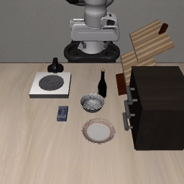
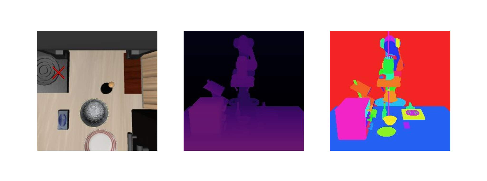

Anthropic이 공개한 [Claude Plays Robotics](https://www.anthropic.com/research/claude-plays-robotics) 연구를 정리했어요. 연구의 출발 질문은 "언어모델의 강점이 물리 세계로 전이되는가, 장면을 인지하고 로봇 상태를 이해한 뒤 실제로 물리적 변화를 만들 수 있는가"예요. 이 글에서는 모델 간 성능 비교는 빼고, AI가 로보틱스에 접근하는 구조와 실험 설계를 중심으로 정리할게요.

## 핵심 프레임: 어느 높이에서 로봇을 잡느냐

이 연구에서 가장 중요한 프레임은 AI가 로봇을 제어하는 방식을 추상화 수준(abstraction level)의 사다리로 본다는 점이에요. 같은 AI라도 어느 층에서 로봇과 만나느냐에 따라 결과가 수십 배 달라졌어요.

| 층 | 제어 방식 | AI가 하는 일 |
| --- | --- | --- |
| 1 | 직접 제어 (direct control) | 모터 토크·관절 명령을 매 순간 직접 출력 |
| 2 | 프로그래밍 제어 (programmatic control) | 파이썬으로 컨트롤러 코드를 작성해 실행 |
| 3 | 정책 지도 (policy supervision) | 학습된 보행·조작 정책 위에서 고수준 명령만 전달 |
| 4 | 강화학습 감독 (RL supervision) | 직접 움직이는 대신 RL 정책의 학습 과정을 설계·감독 |

실험 하드웨어는 고전 제어 과제(역진자, 호퍼)부터 Unitree Go2 사족로봇(12자유도), Unitree G1 휴머노이드(29자유도), 주방 조작 과제용 Franka Panda 매니퓰레이터(7자유도)까지 걸쳐 있고, 시뮬레이션과 실기체 테스트를 병행했어요.

## 저수준 직접 제어는 왜 실패하는가

1층의 직접 제어는 거의 실패했어요. 보행이나 기립 같은 과제는 중력·관성·접촉력을 밀리초 단위로 계속 보정해야 하는데, 언어모델의 응답 지연은 수 초에서 수십 초라서 물리 세계가 요구하는 제어 주기와 근본적으로 맞지 않아요. 사족로봇을 넘어진 자세에서 일으켜 세우는 것조차 어려웠고, 자유도가 높은 휴머노이드는 어떤 시도에서도 기립에 성공하지 못했어요.

다만 물체에 손을 뻗고, 접촉하고, 잡는 국소적인 물리 행동은 세대를 거치며 개선되고 있어요. LIBERO 벤치마크(주방 조작 과제 모음)에서 전체 과제 완료율은 최대 5.5% 수준으로 여전히 낮지만, 실패 전까지의 진행도(도달·접촉·파지 같은 부분 목표 달성률)는 꾸준히 늘고 있어서, 완전한 작업 성공 대신 로봇 학습용 데이터를 생성하는 용도로는 쓸모가 생기고 있다는 평가예요.

## 코드를 쓰게 하면 엔지니어의 능력이 살아난다

한 층 올라가 AI가 컨트롤러 코드를 작성하게 하면(2층) 이야기가 달라져요. 첫 시도의 성능은 모델 세대와 무관하게 비슷했는데, 시도를 반복할수록 격차가 벌어졌어요. 연구진이 확인한 개선의 대부분은 첫 시도를 잘하는 능력이 아니라 앞선 실행 결과를 확인하고 다음 전략을 조정하는 능력에서 나왔어요. AI는 실시간 반사신경으로 접근할 때가 아니라 엔지니어처럼 시행착오를 반복할 때 강하다는 뜻이에요.

이 가설을 확인하려고 연구진은 TwinFlipper라는 새 벤치마크도 만들었어요. 핀볼처럼 플리퍼 두 개를 조작해 공이 지정 높이 위에 머무는 누적 시간을 최대화하는 과제인데, 카오스 동역학이라 공을 그냥 세게 쳐올리는 직관적 해법으로는 안 되고 체계적인 제어 전략이 필요해요. 학습 데이터에 없던 과제라서 동역학 시스템에 대한 진짜 일반화 능력을 재는 장치이기도 해요.

4층의 강화학습 감독도 같은 맥락이에요. AI가 보상 함수와 학습 설정을 설계해 RL 정책을 훈련시키는 방식인데, 직접 코드를 쓰는 것보다 평균 성능은 낮았지만 일부 과제에서는 수 시간 안에 쓸 만한 정책을 만들어냈어요. AI가 로봇을 움직이는 주체가 아니라 로봇을 학습시키는 주체가 될 수 있다는 단서예요.

## 가장 실용적인 층은 정책 감독

3층의 정책 지도가 실용적으로 가장 유망했어요. 잘 학습된 보행 정책이나 VLA(Vision-Language-Action) 조작 정책 위에 AI를 올리면, AI는 조이스틱을 잡듯 고수준 명령만 내리면서 지금 정책이 잘 하고 있는지를 판단하는 감독자 역할을 해요.

여기서 핵심 역량은 두 가지예요. 정책이 잘할 때는 간섭하지 않고 맡기는 것(defer), 정책이 실패하거나 학습 범위 밖의 새 과제를 만나면 알아차리고 개입하는 것(override)이에요. 연구진은 이걸 추종율(deference rate)로 정량화했어요. VLA가 제안한 7차원 동작을 그대로 전달하면 추종, 수정하거나 교체하면 이탈로 집계하는 방식인데, 최신 모델일수록 익숙한 과제에서는 추종율이 높고 VLA가 못 푸는 새 과제에서는 추종율이 떨어졌어요. 무조건 따르는 게 아니라 정책이 실패하는 순간을 알아본다는 뜻이에요. 실제로 VLA 단독으로는 불가능한 새 과제에서, AI가 감독자로 붙으면 정책 단독보다 나은 결과가 나왔어요.

배포 관점에서도 이 구조가 현실적이에요. AI가 관절을 직접 구동할 필요는 없고, 유능한 컨트롤러 위에서 판단만 하면 되니까요.

## 공간지능을 해부한 11개 과제

고수준 이동 평가는 사족로봇에 학습된 보행 정책을 붙이고 속도 명령만 내리게 한 상태에서, 공간지능의 서로 다른 조각을 하나씩 검증하도록 설계된 11개 과제로 진행됐어요. 과제 이름만 봐도 무엇을 재려는지 드러나요.

| 과제 | 검증하는 능력 |
| --- | --- |
| find_x | 표시된 테이블을 찾아 약 7.6m(25피트)를 접근 |
| visual_search | 12×12m 경기장에서 가림막 뒤 목표물을 체계적으로 수색 |
| color_sequence | 색상 목표를 지정 순서로 방문, 작업 기억과 순차 지시 이행 |
| return_home | 웨이포인트를 따라간 뒤 기억만으로 출발점 복귀, 경로 적분(path integration) |
| procedural_maze | 지도 없이 전방 카메라만으로 절차 생성 미로 통과 |
| invisible_walls | 보이지 않는 벽에 막힌 직진 경로를 우회, 불완전한 지각 아래 재계획 |
| obstacle_course | 폭이 제각각인 틈을 통과, 로봇 자신의 물리적 치수 이해 |
| oneshot_course | 상향식 2D 지도만 보고 전체 명령 시퀀스를 한 번에 사전 등록 |
| drift_detection | 명령에 주입된 누적 드리프트를 감지하고 보정, 폐루프 자기 감시 |
| turn_correction | 회전 후 불완전함을 시각으로 감지해 수정 명령 |
| explore_report | 자유 탐색 후 기억만으로 공간 배치 질문에 답변, 공간 심성 모델 |

이 과제군에서 모델들이 공통으로 무너진 지점이 경로 적분과 자기 위치 추적이었어요. 지금 어디에 있고 어느 방향을 보는지를 누적해서 유지해야 하는 과제일수록 실패했어요.

## 병목은 시각도 추론도 아니었다

연구진은 무엇이 성능을 막는지 하나씩 검증했는데, 결과가 직관과 달랐어요.

시각 인지부터 보면, 깊이맵이나 세그멘테이션 오버레이는 올바른 정보를 담고 있는데도 신호가 분산돼 사실상 중립이었고, 전방 카메라에 그린 십자선도 거의 영향이 없었어요. 반면 현재 방향을 도 단위 텍스트로 알려주는 나침반은 모든 구성에서 가장 큰 향상을 냈고, 그리퍼 카메라 위에서 움직이며 특정 지점까지의 거리를 조회할 수 있는 커서 도구는 조작 과제에서 일부 과제군 성공률을 6%에서 32%까지 끌어올렸어요. 제3자 시점 카메라는 위치 추적이 필요한 과제(color_sequence, drift_detection)에서만 최신 모델에 유익했어요. 픽셀을 더 주는 것보다 위치와 방향을 명시적인 수치로 주는 쪽이 통한다는 거예요.

추론(reasoning) 예산을 늘리는 것도 거의 도움이 안 됐어요. 오히려 과도한 계획이 민첩성을 해치거나 과잉 설계로 이어지는 경우가 있었고, 현 세대의 저수준 로보틱스 결함은 더 오래 생각하기로 극복되지 않았어요.

## 경험에서 배우기는 아직 근시안적이에요

그럼 긴 에피소드 동안 쌓인 경험은 얼마나 쓰일까요. 연구진은 맥락 절단(context truncation) 실험으로 이걸 검증했어요. 대화 기록에서 처음 10턴과 최근 N턴만 남기고 중간을 전부 지워도, 대부분의 모델에서 성능이 거의 변하지 않았고 일부는 오히려 올랐어요. 에피소드 전체의 누적 이해를 정말 활용하고 있다면 성능이 떨어져야 하는데 그렇지 않았다는 것, 즉 모델의 적응은 최근 몇 스텝에 기반한 근시안적 적응이라는 증거예요.

연습의 효과도 같은 결을 보여줘요. oneshot_course에서 쉬운 경로는 연습 주행 한 번만으로 성능이 크게 올랐지만, 어려운 경로는 연습을 20회 줘도 실패했어요. 짧은 피드백 루프 안에서 전략을 고치는 능력은 빠르게 좋아지고 있는데, 긴 시간 축의 공간 기억과 장기 전략 구축은 아직 안 되는 상태예요.

## 실기체에서 드러난 민낯

시뮬레이션 결과를 실제 Unitree Go2로 옮긴 테스트에서는 실패 양상이 더 구체적으로 드러났어요.

find_x를 실기체로 재현했을 때 흔한 실패는 목표 1m 앞 도달 전에 멈추거나, 경로에서 벗어났으면서 자신이 정렬돼 있다고 확신하는 것이었어요. 사무실 복도를 한 바퀴 돌아 출발점으로 오는 과제는 하네스와 모델 구성을 바꿔가며 시도해도 전부 실패했는데, 복도 입구를 지나는 시점을 판단하지 못하거나, 아직 복도에 들어가지 않았는데 들어갔다고 믿고 다시 회전하는 식의 시각·기억 복합 실패가 원인이었어요. 한 모델은 유리문에 반사된 목표 테이블을 진짜로 인식하고 유리문을 향해 돌진하기 시작해서, 로봇이 손상되기 전에 사람이 중단시키기도 했어요.

## 접근 수준 자체가 설계 요소

연구가 그리는 그림을 한 문장으로 압축하면, AI는 로봇의 근육이 아니라 엔지니어 겸 감독자로 접근할 때 작동해요. 밀리초 단위 제어는 학습된 정책과 컨트롤러가 담당하고, AI는 그 위에서 컨트롤러를 코드로 작성·디버깅하고, RL 학습 과정을 설계하고, 배포된 정책이 실패하는 순간을 감지해 개입하고, 나침반이나 거리 조회 같은 명시적 공간 정보를 도구로 받아 고수준 판단을 내리는 구조예요. LeRobot 같은 모방학습 파이프라인으로 조작 정책을 만드는 흐름과 연결해 보면, 이 연구의 정책 감독 구조는 그렇게 만든 정책 위에 올라갈 다음 층으로 읽을 수 있어요.

안전 관점의 함의도 여기서 나와요. AI가 물리 세계에 미칠 수 있는 영향력은 모델 자체보다 어떤 접근 수준의 인터페이스를 열어주느냐에 따라 수십 배 달라지므로, 도구나 제어 방식의 작은 변화가 능력의 큰 변화로 이어질 수 있다는 전제로 평가와 배포를 설계해야 해요. 연구진은 후속 과제로, 특정 물체에만 영향을 줄 수 있고 나머지로부터는 차단되는 식으로 물리적 접근권을 명확한 한계와 함께 부여하는 메커니즘을 꼽았어요. 재현 코드는 [github.com/safety-research/embody](https://github.com/safety-research/embody)로 공개될 예정이라고 해요.

본문 이미지 출처: [Anthropic, Claude Plays Robotics](https://www.anthropic.com/research/claude-plays-robotics)
