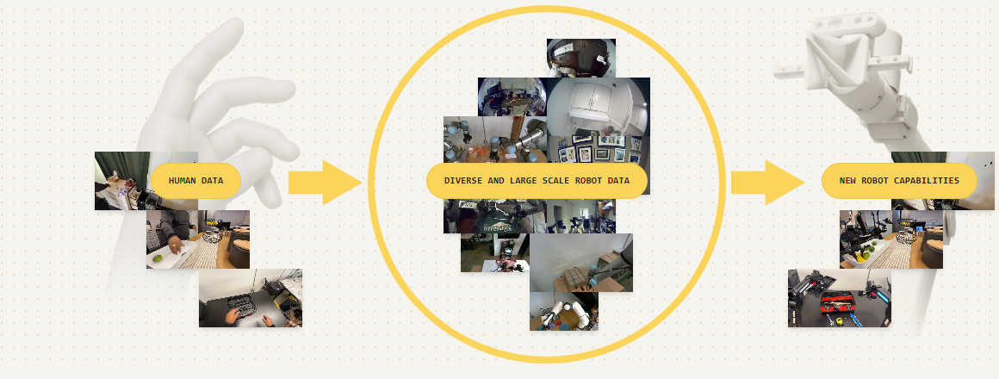
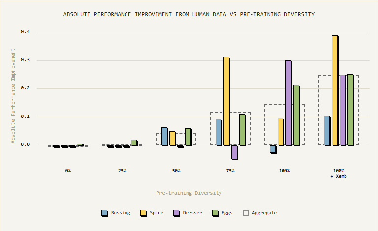
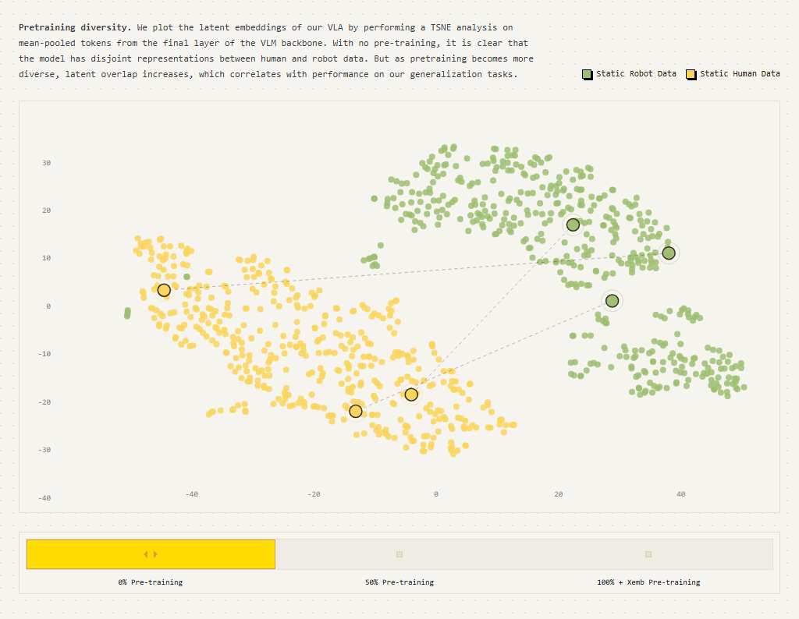

Physical Intelligence가 공개한 "Emergence of Human to Robot Transfer in Vision-Language-Action Models"를 정리했어요. 사람이 웨어러블 카메라로 찍은 1인칭 영상을 로봇 학습 데이터로 쓰는 것은 로보틱스의 오랜 숙제인데, 이 연구는 별도의 전이 장치를 전혀 만들지 않고도 로봇 사전학습 데이터의 규모와 다양성을 키우는 것만으로 그 전이가 저절로 나타난다는 것을 보였어요. LLM에서 관찰되던 창발(emergence)이 로봇 파운데이션 모델에서도 확인된 사례예요.

## 문제: 사람 영상과 로봇 사이의 도메인 갭

사람 손과 로봇 그리퍼는 생김새도, 시점도, 움직이는 방식도 달라요. 그래서 사람 영상을 로봇 학습에 쓰려던 기존 연구들은 손을 마스킹하거나, 생성 모델로 사람 영상을 로봇 장면처럼 변환하거나, 모션 리타게팅 같은 수작업 정렬 장치를 만들어 갭을 메웠어요. 이런 방법은 전이 가능성은 얻지만 특정 설정에 묶여 일반성을 잃는 경향이 있어요. 이 연구의 질문은 반대 방향이에요. 정렬 장치 없이, 순수하게 규모만으로 갭이 좁혀질 수 있을까요.

<em>인간 1인칭 데이터가 다양한 대규모 로봇 데이터를 거쳐 새 로봇 능력으로 이어지는 전이 구조(출처: Physical Intelligence)</em>

## 방법: 사람을 또 하나의 로봇으로 취급

레시피는 의외로 단순해요. 대규모 로봇 데이터로 사전학습한 π0.5 모델을, 사람의 1인칭 영상과 관련 로봇 데이터를 섞어 협동 미세조정(co-finetuning)해요. 이때 사람 영상을 특별하게 다루지 않고 그냥 또 하나의 로봇 구체화(embodiment)처럼 취급하는 게 핵심이에요. 사람의 행동은 3D 손 위치로 표현해서, 여러 로봇 팔의 액션 공간이 서로 다르듯 사람도 액션 공간이 다른 로봇 한 종으로 들어가는 거예요. 손 마스킹도, 영상 변환도, 전용 정렬 손실도 없어요.

데이터는 머리에 쓴 카메라로 수집한 1인칭 영상이에요. 색깔별 달걀 정렬, 침실 서랍장 정리, 식기 치우기(버싱), 향신료 정렬 같은 과제를 사람이 직접 수행하며 찍었고, 평가할 때는 사람 시연에만 존재하는 새로운 시나리오에서 로봇 성능을 쟀어요.

## 결과: 규모가 전이를 깨운다

사람 영상을 미세조정에 섞는 것만으로, 사람 데이터에만 있던 4개 일반화 시나리오에서 정책 성능이 평균 약 2배 올랐어요. 전이를 돕는 특별한 메커니즘이 없었는데도요.

핵심 실험은 사전학습 다양성을 0%에서 100%+Xemb(교차 구체화 데이터 포함)까지 조절하며 같은 미세조정을 반복한 스윕이에요. 사람 데이터가 주는 절대 성능 개선이 사전학습 0%에서는 사실상 0, 25%에서 약 0.05, 50%에서 0.15, 75%에서 0.25, 100%+Xemb에서 약 0.35로 단조 증가했어요. 사전학습이 빈약한 모델은 사람 영상을 줘도 쓰지 못하고, 규모와 다양성이 임계를 넘어야 흡수 능력이 생기는 거예요.

<em>사전학습 다양성(0%→100%+Xemb)에 따른 인간 데이터의 절대 성능 기여 — 버싱·향신료·서랍장·달걀 4개 과제와 종합(출처: Physical Intelligence)</em>

달걀 정렬 과제에서는 더 또렷한 패턴이 나와요. 로봇 데이터로만 미세조정한 모델은 사전학습을 60% 이상 늘려도 성능이 정체되는데, 사람+로봇 혼합 미세조정은 사전학습을 늘릴수록 계속 좋아져 최대 약 0.6까지 올라가요. 로봇 사전학습 데이터를 더 붓는 것이 로봇 성능을 직접 올리는 단계는 지나도, 사람 데이터를 흡수하는 능력은 계속 키운다는 뜻이에요.

## 왜 되는가: 표현이 겹쳐진다

내부를 들여다본 증거가 t-SNE 분석이에요. VLM 백본 최종층의 임베딩을 사람 데이터와 로봇 데이터로 나눠 찍어 보면, 사전학습이 없는 모델은 두 데이터의 표현이 완전히 분리된 클러스터로 나타나요. 사전학습이 다양해질수록 잠재 공간에서 겹침이 늘어나고, 이 겹침의 정도가 일반화 과제 성능과 상관을 보여요. 모델이 커지고 다양해지면서 "사람의 손이 하는 일"과 "그리퍼가 하는 일"을 같은 표현으로 읽게 되는 게 전이의 정체인 셈이에요.

<em>VLM 백본 최종층 임베딩의 t-SNE — 사전학습 0%에서는 인간 데이터(노랑)와 로봇 데이터(초록)의 표현이 분리된 상태(출처: Physical Intelligence)</em>

## 맥락: 로봇 없이 모으는 데이터

이 결과가 중요한 이유는 데이터 수집의 경제성 때문이에요. 로봇 원격조작 데이터는 로봇과 조작자가 있어야 모이지만, 1인칭 영상은 카메라 하나 쓰고 일상 작업을 하면 모여요. 규모가 전이를 깨운다는 발견은 이렇게 쉽게 모이는 데이터가 로봇 파운데이션 모델의 정식 연료가 될 수 있다는 뜻이고, 사전학습 확대의 당위도 강해져요.

사람 영상을 로봇 능력으로 바꾸는 다른 경로로는 [[2026-07-16_5분을_기억하는_로봇|RoboTTT]]가 있어요. RoboTTT는 사람 시연 영상 한 편을 컨텍스트로 넣어 그 자리에서 모방하는 in-context 방식이고, 이 연구는 학습 데이터로 흡수해 능력 자체를 바꾸는 방식이라, 같은 목표를 추론 시점과 학습 시점에서 각각 공략하는 셈이에요.

한계로는 임계 규모 아래에서는 효과가 거의 없다는 점, 도메인 갭이 완전히 사라진 게 아니라 표현 정렬이 좋아지는 단계라는 점, 검증이 특정 과제군에 한정된다는 점이 남아요. 논문은 [human_to_robot.pdf](https://www.pi.website/download/human_to_robot.pdf)에서 볼 수 있어요.

본문 이미지 출처: [Physical Intelligence, Emergence of Human to Robot Transfer](https://www.pi.website/research/human_to_robot)
