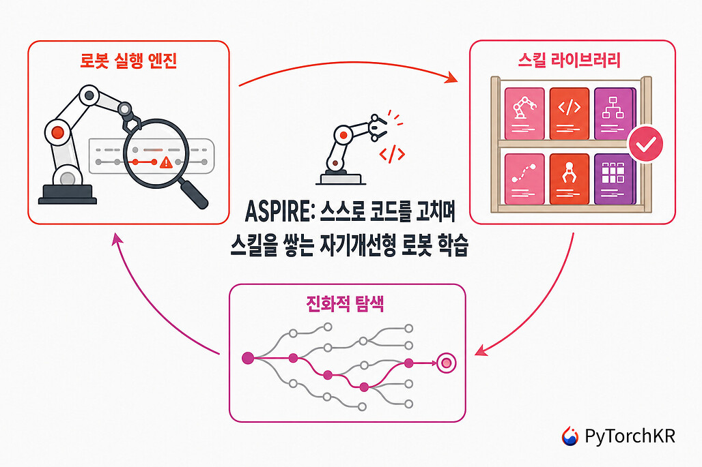
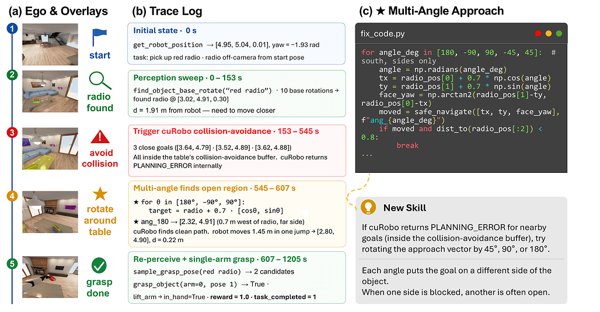
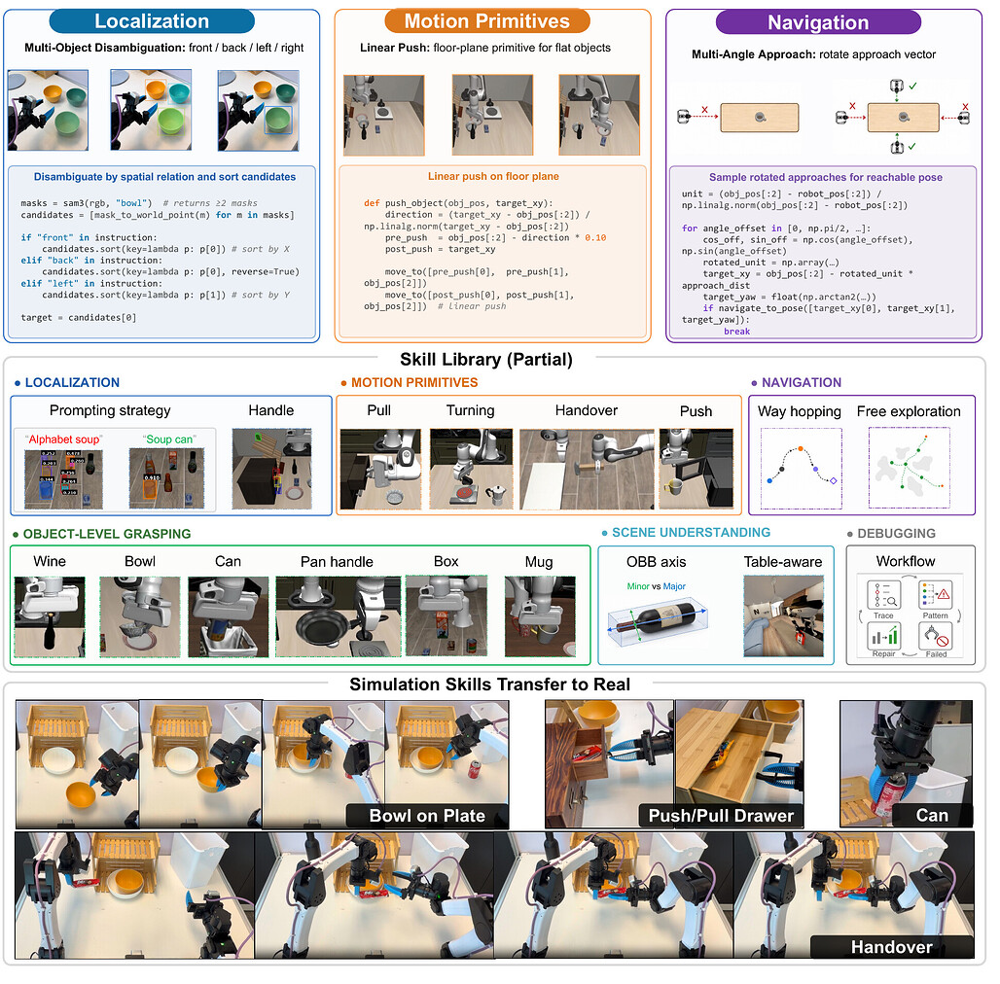
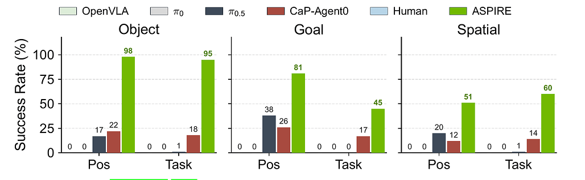

NVIDIA GEAR 연구실이 미시간대, UIUC, UC 버클리, CMU와 함께 공개한 ASPIRE(Agentic Skill Programming through Iterative Robot Exploration)를 정리했어요. 로봇이 자기 실행 기록을 분석해 프로그램을 스스로 디버깅하고, 검증된 수정을 재사용 가능한 스킬로 쌓아가는 연속 학습 시스템이에요. [[2026-07-16_AI가_로봇을_잡는_높이|AI가 로봇을 잡는 높이]]에서 정리한 "AI는 로봇의 근육이 아니라 엔지니어 겸 감독자로 접근할 때 작동한다"는 논지를, 실제로 작동하는 시스템으로 밀어붙인 사례라 이어서 읽기 좋아요. 원문은 [파이토치 한국 사용자 모임의 정리 글](https://discuss.pytorch.kr/t/aspire-feat-nvidia/11066)과 [프로젝트 페이지](https://research.nvidia.com/labs/gear/aspire/)예요.

## 어떤 문제를 푸는가

기존 접근 두 갈래의 약점에서 출발해요. VLA(Vision-Language-Action) 모델은 학습 분포를 벗어난 물체 배치나 표현 변형에 성능이 급락하는데, 정책이 신경망 가중치 안에 있어서 왜 실패했는지 검사할 수도, 고칠 수도 없어요. 반대로 LLM이 로봇 코드를 짜는 코드-정책(code-as-policies) 시스템은 검사와 수정이 가능하지만, 피드백이 과제 단위 성공/실패뿐이라 구체적인 실패 원인을 짚지 못하고, 무엇보다 한 과제에서 얻은 경험이 다음 과제로 이어지지 않았어요.

ASPIRE는 이 두 약점을 정면으로 겨냥해요. 실패의 원인을 구체적 신호로 진단할 수 있게 만들고, 그 진단에서 얻은 수정을 과제를 넘어 축적되는 자산으로 바꾸는 거예요.

## 시스템 구조: 코디네이터와 액터, 그리고 세 가지 축

전체 구조는 코디네이터-액터 병렬 구조예요. 중앙 코디네이터가 공유 스킬 라이브러리를 관리하며 과제별로 액터를 배정하고, 각 액터는 독립된 코딩 에이전트로서 현재 과제와 프로그램, 실패 흔적만 가진 가벼운 컨텍스트로 작성·실행·진단·수정을 돌아요. 그 아래에 세 가지 축이 있어요.

첫째 축은 로봇 실행 엔진이에요. 인식, 계획, 제어 같은 원시 동작(primitive)이 호출될 때마다 API 입출력과 반환 상태, RGB 키프레임, 파지 후보, 물체 자세, 모션 계획 결과까지 구조화된 다중모달 흔적(trace)을 JSON으로 남겨요. 과제 성공/실패만 보는 게 아니라, 그리퍼 폭으로 파지가 실제로 됐는지 확인하고, 세그멘테이션 마스크가 비어 있으면 인식 프롬프트 부실이나 가림을 의심하고, IK 해가 없으면 목표가 작업 공간 밖이라고 판단하는 식으로 실패를 구체적 신호로 좁힐 수 있게 돼요.

논문의 대표 사례가 이 구조의 가치를 잘 보여줘요. 라디오를 집는 과제에서 navigate_to_pose가 PLANNING_ERROR를 반복하자, 에이전트가 흔적을 뒤져 목표 지점이 탁자 경계 20cm 안쪽이라 충돌 회피가 발동해 계획이 실패한다는 원인을 찾아냈고, 여러 방향에서 순차적으로 접근을 시도하는 루틴을 만들어 해결한 뒤 그 해법을 스킬로 등록했어요.

둘째 축은 스킬 라이브러리예요. 미리 정의된 분류 체계 없이, 검증된 수정으로부터 귀납적으로 만들어지는 게 특징이에요. 각 스킬은 실패 시그니처, 적용 조건, 수정 전략, 필요하면 코드 스케치까지 담은 인컨텍스트 가이드 형태로 저장돼요. 실제로 쌓인 범주를 보면 같은 종류 물체가 여럿일 때 수식어로 축 정렬해 고르는 위치 추정 스킬, 장애물 경계 근처에서 계획이 실패하면 0°, ±45°, ±90° 다섯 방향을 순차 시도하는 내비게이션 스킬, 원통형 물체는 지름 방향으로 70%만 조여 천천히 드는 파지 스킬, 2cm 미만 얇은 물체는 집는 대신 바닥면을 따라 미는 모션 스킬 같은 것들이에요. 아무 수정이나 등록되는 건 아니고, 액터가 실패 양상·수정·전이 가능성을 구조화된 보고서로 제출하면 코디네이터가 감사하고 디버그 검증을 통과한 것만 라이브러리로 승격돼요.

셋째 축은 진화적 탐색이에요. 같은 전략을 계속 조금씩만 고치는 국소 수정 루프에 갇히지 않도록, 이전 최고 성능 프로그램과 실패 흔적을 조건으로 서로 다른 후보 프로그램 K개를 제안하고, 각각 실행해 새 진단 흔적을 얻은 뒤, 상위 3개 프로그램과 실패 이력을 조건으로 다음 라운드를 도는 구조예요. 여기서 과제 분석 문서(task_analysis.md)가 탐색의 원장 역할을 해요. 장면 정보 스냅샷, 검증 중인 가설, 제거된 방향과 아직 시도 안 한 방향을 기록해 두고, 후보들이 서로 다른 단계에서 다른 이유로 실패하도록 설계해 중복 탐색을 막아요. 새 기법이 확보되면 전에 막혔던 가지를 다시 열기도 해요.

구현 쪽 사실도 흥미로워요. 코딩 에이전트로 Claude Opus 4.6(1M 토큰 컨텍스트)을 쓰고, MuJoCo Playground 기반의 코드-정책 프레임워크 CaP-X 위에서 돌아가요. 시뮬레이터의 내부 상태(물리 엔진, 숨겨진 성공 판정)에는 접근을 금지해서, 실제 로봇으로 옮길 수 있는 조건을 강제했어요.

## 결과: 교란에 강해지고, 경험이 이월된다

세 벤치마크에서 평가했어요. 물체·목표·공간 교란을 주는 LIBERO-Pro, 접촉이 많은 단팔·양팔 조작의 Robosuite, 장기 가정 내 이동 조작의 BEHAVIOR-1K예요.

| 평가 | 결과 |
| --- | --- |
| LIBERO-Pro 물체 교란 | 기존 대비 +77%p |
| LIBERO-Pro 목표 교란 | +41.5%p |
| LIBERO-Pro 공간 교란 | +42.5%p |
| Robosuite 평균 | 68% → 81% |
| Robosuite 양팔 핸드오버 | 20% → 92% |
| BEHAVIOR-1K 라디오 집기 | 56% → 88% |
| LIBERO-Pro Long 제로샷 전이 (스킬 90개 라이브러리) | 23~38% 성공 |

구성요소 분해(ablation)가 어디서 성능이 오는지 보여줘요. 기본 시스템 14%에서 다중모달 흔적을 주는 로봇 실행 엔진을 붙이면 62%로 가장 크게 뛰고, 진화적 탐색을 더하면 72%까지 올라가요. 실패를 구체적으로 볼 수 있게 해주는 것 하나가 가장 큰 지렛대였다는 뜻인데, 이건 앞 글에서 나침반·커서 도구 같은 명시적 신호가 픽셀보다 효과적이었다는 결론과 정확히 같은 방향이에요.

실제 로봇 전이도 초기 증거가 나왔어요. YAM 양팔 로봇에서 시뮬레이션에서 쌓은 스킬 라이브러리를 들고 가면, 음료수 캔 집기는 성공률 13/20에서 19/20으로 오르면서 소모 토큰이 61.94M에서 6.58M으로 약 10분의 1이 됐고, 스킬 없이는 0/20이던 서랍 열기가 11/20으로 올라갔어요. 축적된 경험이 성능과 비용 양쪽을 동시에 개선한 거예요.

## 의의와 한계

의의는 패러다임의 이동이에요. 한 번 학습해 배포하고 끝나는 로봇이 아니라, 배포 후에도 실패를 진단하고 스킬을 쌓으며 계속 성장하는 로봇이라는 그림이고, 소프트웨어 엔지니어링 에이전트가 코드베이스에서 하던 디버깅·경험 축적을 물리 세계로 확장한 거예요. 일부 과제에서는 사람 전문가가 짠 프로그램을 넘어섰어요.

한계도 명확히 적혀 있어요. 실세계에서는 성공 판정, 장면 초기화, 리셋, 안전 모니터링에 여전히 사람이 필요하고, 강력한 LLM에 의존해서 더 약한 모델로도 되는지는 검증되지 않았어요. 미리 정의된 원시 동작 API 안에서만 움직여서 새로운 능력이 필요한 과제에서는 효율이 떨어지고, 라이브러리가 커질수록 낡거나 중복되거나 오해를 부르는 스킬이 늘어나 검색·가지치기·랭킹이 과제로 남아요. 과제당 수많은 LLM 호출과 롤아웃이 필요해 계산 비용도 커요.

논문은 [ASPIRE PDF](https://research.nvidia.com/labs/gear/aspire/assets/Aspire.pdf), 기반 프레임워크는 [CaP-X (arXiv:2603.22435)](https://arxiv.org/abs/2603.22435)에서 볼 수 있어요.

본문 이미지 출처: [NVIDIA GEAR, ASPIRE](https://research.nvidia.com/labs/gear/aspire/) ([파이토치 한국 사용자 모임 정리 글](https://discuss.pytorch.kr/t/aspire-feat-nvidia/11066) 경유)
