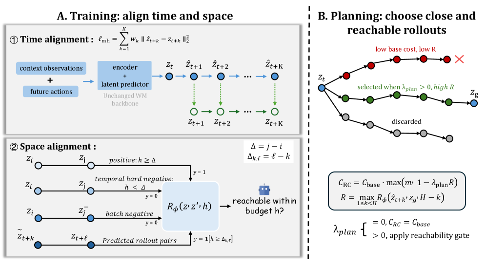

홋카이도대가 공개한 [RC-aux](https://arxiv.org/abs/2605.07278)를 정리했어요. 잠재 공간에서 목표와 가까워 보이는 상태가 정작 주어진 행동 예산 안에는 닿지 못하는 문제를, 세계모델 백본은 그대로 둔 채 보조 학습 목적 하나로 메운 연구예요. [[2026-07-20_층을_나눈_제어가_잃는_것|층을 나눈 제어가 잃는 것]]이 구조를 나눈 대가를 계산했다면, 이 논문은 최적화하는 양과 실제로 원하는 양이 어긋나 있는 쪽을 다뤄요.

## 잘 맞히는데 계획은 안 되는 이유

잠재 세계모델은 관측을 인코더로 임베딩하고, 예측기가 행동을 조건으로 다음 임베딩을 내놓아요. 목표 조건 제어에서는 목표 관측도 같은 인코더에 통과시킨 뒤 CEM 같은 무기울기 최적화기로 행동열을 골라요. 예측한 마지막 잠재와 목표 잠재 사이의 거리가 비용이 되고, 그 비용이 가장 낮은 행동열이 뽑혀요.

여기서 학습할 때의 지평과 쓸 때의 지평이 달라요. 학습은 대체로 한 스텝 앞을 맞히는 국소 감독으로 이뤄지는데, 배치되면 긴 지평의 목표 탐색에 쓰여요. 논문은 이 어긋남을 시공간 불일치라고 불러요. 시간 축에서는 한 스텝 감독이 여러 스텝 롤아웃의 품질을 보장하지 않고, 공간 축에서는 잠재 거리가 유한한 행동 예산 안의 도달 가능성을 반영하지 않아요.

공간 쪽 실패가 특히 성가셔요. 벽 너머의 상태는 화면상 목표와 비슷해 보여서 잠재 공간에서도 가까울 수 있어요. 그런데 실제로 가려면 우회해야 하고, 남은 스텝으로는 닿지 못해요. 플래너는 거리만 보고 그 지름길을 고르고 계획은 실패해요. 논문이 잠재 지름길이라고 부르는 실패 모드예요.

## 시간 축을 맞추는 다지평 예측

첫 번째 축은 예측을 여러 스텝으로 늘리는 거예요. 예측한 잠재를 다시 동역학에 되먹여 K단계 개루프 롤아웃을 쌓고, 각 단계의 예측을 그 시점 실제 관측의 인코딩과 맞춰요. 손실은 ℓ = Σ w(k) ‖ẑ(t+k) − z(t+k)‖² 형태로, w(k)는 지평별 가중치예요.

한 스텝 손실을 여러 번 쓰는 것과 다른 점은 되먹임에 있어요. 플래너가 실제로 점수를 매기는 대상은 예측 위에 예측을 쌓아 만든 잠재인데, 한 스텝 감독은 매번 실제 관측에서 다시 출발하니 그 누적을 한 번도 보지 않아요. 다지평 손실은 나중에 평가받을 바로 그 잠재 위에서 학습해요.

## 공간 축을 맞추는 도달 가능성

두 번째 축은 예산을 조건으로 받는 도달 가능성 판별기 R(z, z′, h)예요. 상태 z에서 z′로 h 스텝 안에 갈 수 있는지를 0과 1 사이 값으로 내놓아요. 라벨은 따로 주석을 달지 않고 궤적에서 뽑아요. 같은 궤적의 두 시점 i와 j의 간격을 Δ = j − i라 할 때, h ≥ Δ이면 양성으로 정해요.

<em>학습은 두 축으로 정렬돼요 — 시간 축은 K단계 개루프 롤아웃을 실제 관측과 맞추고, 공간 축은 네 종류의 쌍으로 예산 조건부 도달 가능성을 학습해요. 계획에서는 그 값이 비용에 곱해지는 게이트로 들어가요(출처: Li et al., RC-aux)</em>

쌍은 네 종류로 갈려요. h ≥ Δ면 양성이에요. h < Δ면 시간적 하드 네거티브가 되는데, 같은 궤적에 있으니 언젠가는 만나지만 지금 예산으로는 못 닿는 경우예요. 언젠가 이어진다는 것과 지금 닿는다는 것을 판별기가 구분하게 만드는 게 이 쌍의 역할이에요. 미니배치 안 다른 궤적에서 뽑은 표적은 교차 궤적 네거티브가 되고, 기울기를 끊은 예측 잠재를 인코딩된 미래 표적과 짝지은 예측 롤아웃 쌍도 같은 규칙으로 라벨을 받아요.

## 계획에 붙이는 법

학습한 판별기는 테스트 시점 비용에 곱셈 게이트로 들어가요. 후보 행동열의 기본 비용은 종전대로 종단 잠재와 목표 잠재의 거리이고, 궤적 수준 도달 가능성은 중간 예측들 중 가장 높은 값을 써요. 최종 비용은 기본 비용에 max(m, 1 − λ·R)를 곱한 값이에요. 목표에 닿을 수 있다고 판단된 궤적일수록 비용이 깎이는 구조예요.

여기서 λ가 0이면 곱해지는 항이 1이 되어 기존의 종단 거리 계획으로 정확히 되돌아와요. 기존 플래너를 특수한 경우로 포함한다는 뜻이라, 세계모델도 최적화기도 바꾸지 않고 계수 하나로 켜고 끌 수 있어요.

## 결과

픽셀 기반 목표 조건 제어 과제 다섯 개를 LeWorldModel 계열과 맞대어 비교했고, 다섯 중 넷에서 성공률이 올랐어요. 폭이 가장 큰 건 Wall로 50.4%에서 83.6%로 올랐고, TwoRoom은 88.8%에서 98.0%, Reacher는 82.8%에서 87.2%, Cube는 72.8%에서 76.0%였어요. Push-T만 91.2%에서 90.8%로 사실상 제자리였어요. LIBERO-Goal로 확장한 실험에서는 평균 성공률이 0.712에서 0.812로 올랐어요.

Wall과 TwoRoom의 폭이 큰 게 앞의 진단과 맞아떨어져요. 둘 다 장애물을 우회해야 하는 환경이라 화면상 가까움과 실제 도달 가능성이 가장 크게 갈려요. 반대로 Push-T처럼 막힌 구조가 덜한 과제에서는 고칠 왜곡 자체가 적어요.

## 남는 조건

도달 가능성 라벨이 환경 수준의 진짜 도달 가능성이 아니라 로그로 남은 궤적에서 유도한 대리 라벨이라는 점을 저자들이 먼저 밝혀요. 데이터에 나타나지 않은 경로는 못 닿는 것으로 취급될 수 있어요. 테스트 시점 게이트도 실현 가능성을 결정이론적으로 다루는 대신 비용에 계수를 곱하는 단순한 형태고, 불확실성을 반영한 도달 가능성이나 방향성을 가진 거리, 더 큰 규모의 조작 환경으로의 확장은 향후 과제로 남겨뒀어요.

그래도 짚는 지점은 분명해요. 표현을 잘 학습했다는 것과 그 표현 위에서 계획이 된다는 것은 다른 문제고, 후자를 원하면 후자를 직접 감독해야 한다는 거예요.
