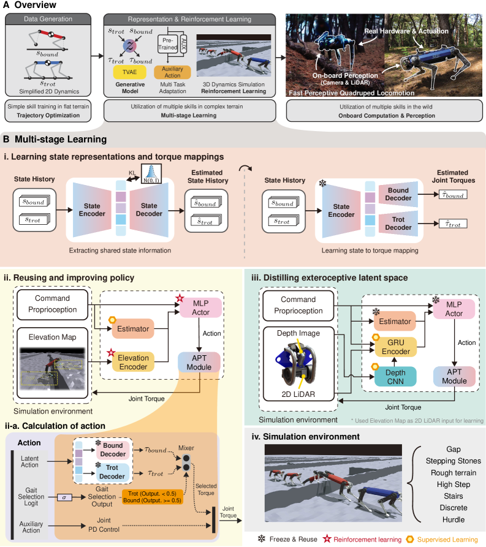

KAIST 연구팀이 Science Robotics에 발표한 [APT-RL](https://arxiv.org/abs/2607.13579)을 정리했어요. 사족로봇이 계단과 징검다리, 쓰러진 나뭇가지가 섞인 야외를 온보드 센서와 온보드 연산만으로 달리게 한 연구예요. 핵심은 걸음 자체를 강화학습으로 처음부터 찾지 않고, 궤적 최적화로 미리 만들어 사전학습해둔 다음 강화학습에는 지형 적응만 맡겼다는 데 있어요. [[2026-07-20_힘_센서_없이_힘을_아는_로봇|힘 센서 없이 힘을 아는 로봇]]이 액추에이터 쪽에서 sim-to-real 갭을 줄였다면, 이 연구는 스킬 쪽에서 같은 갭을 다뤄요.

## 처음부터 배우면 무엇이 문제인가

고속 다중 스킬 보행을 강화학습만으로 얻기는 어려워요. 탐색 공간이 넓어서 트롯과 바운드 같은 서로 다른 걸음이 하나의 정책 안에서 자리 잡기 힘들고, 걸음 사이를 오가는 전환은 보상으로 유도하기가 특히 까다로워요. 그렇다고 사람이 만든 참조 궤적을 그대로 따라 하게 하면, 참조에 없는 지형에서 쓸 수 있는 여지가 사라져요.

APT-RL은 이 둘을 분리해요. 걸음의 기본형은 최적화로 만들어 잠재공간에 넣어두고, 지형에 맞춰 그 기본형을 변형하는 몫만 강화학습에 남겨요.

## 8분에 만드는 18만 개의 걸음

첫 단계는 데이터 생성이에요. 강체 동역학을 2차원으로 단순화한 모델 위에서 궤적 최적화를 돌려 트롯과 바운드 궤적을 뽑아요. 평지 위 단순 스킬만 다루기 때문에 계산이 가벼워서, 18만 개 궤적, 시간으로 15.5시간 분량을 8분 만에 생성했어요. 각 궤적에는 상태뿐 아니라 그 상태를 만든 제어 입력이 함께 들어 있어요.

<em>데이터 생성, 표현학습, 강화학습, 지각 증류로 이어지는 다단계 구조와 트롯·바운드 디코더를 섞는 액션 계산(출처: Kang et al., APT-RL)</em>

두 번째 단계는 표현학습이에요. 트랜스포머 기반 VAE가 트롯과 바운드의 상태 이력을 공유 잠재공간으로 압축하고, 이어서 그 잠재 표현을 관절 토크로 되돌리는 걸음별 디코더를 학습해요. 이 시점에서 로봇은 잠재 벡터 하나로 걸음을 지시받을 수 있는 상태가 돼요.

## 강화학습은 잠재 액션과 보조 액션만 내요

세 번째 단계에서 정책은 관절 토크를 직접 내지 않아요. 대신 사전학습된 디코더에 넣을 잠재 액션과, 디코더 출력만으로는 부족한 부분을 메우는 보조 액션을 함께 내놓아요. 디코더는 얼려둔 채로 재사용해요. 걸음 선택은 정책이 내는 로짓 하나를 시그모이드에 통과시켜 결정하는데, 값이 0.5보다 작으면 트롯, 크면 바운드 디코더의 토크가 선택되고 믹서가 이를 합쳐 최종 관절 토크를 만들어요. 지형과 지시 속도에 따라 걸음이 바뀌는 동작이 별도 전환 컨트롤러 없이 이 로짓 하나에서 나와요.

네 번째 단계는 지각 증류예요. 학습 중에는 시뮬레이터가 주는 특권 정보인 높이맵을 교사가 쓰고, 학생 인코더는 깊이 카메라 영상과 2D LiDAR, 고유수용 감각만으로 그 교사 출력을 흉내 내도록 학습해요. 배치 시점에는 특권 정보가 사라지고 실제 센서만 남아요.

## 45kg 로봇으로 숲을 달려요

실기체는 KAIST가 자체 개발한 45kg급 사족로봇 HOUND예요. 센서는 Hokuyo UST-30LX 2D LiDAR와 Intel RealSense D435 깊이 카메라이고, 연산도 온보드에서 돌아가요. 시뮬레이션에서 학습한 정책을 추가 조정 없이 그대로 옮기는 제로샷 전이로 실험했어요.

세 단짜리 계단을 내려오며 도약하는 구간에서 순간 속도 6m/s, 60cm 높이 단차를 넘는 구간에서 4.25m/s가 나왔어요. 다층 계단과 잔디, 경사가 섞인 캠퍼스 1.1km 구간과 노출된 뿌리, 쓰러진 통나무가 있는 숲길 0.34km 구간을 완주했어요. 고속 보행에서 10g를 넘는 충격이 센서를 흔들기 때문에, 본체에 자체 제작한 기계식 진동 흡수기를 달아 지각 안정성을 확보했어요. 학습 알고리즘 못지않게 하드웨어 쪽 대응이 함께 들어간 부분이에요.

## 남는 경계

사전학습에 들어간 것은 평지 위 2차원 트롯과 바운드뿐이에요. 징검다리나 틈처럼 사전학습 분포 밖의 지형은 보조 액션이 메우는 구조라, 스킬 자체가 더 늘어나야 하는 상황에서는 데이터 생성 단계를 다시 손봐야 해요. 걸음도 두 가지로 한정돼 있어서, 점프나 기어가기처럼 성질이 다른 스킬을 같은 잠재공간에 넣었을 때도 전환이 매끄러울지는 이 실험 범위 밖이에요.

그래도 구조 자체는 재사용하기 좋아요. 물리 모델로 값싸게 만들 수 있는 것은 최적화로 만들고, 모델로 표현하기 어려운 지형 적응만 학습에 맡기는 분담이라, 데이터 생성 8분이라는 비용으로 강화학습이 풀어야 할 문제의 크기를 크게 줄였어요.
