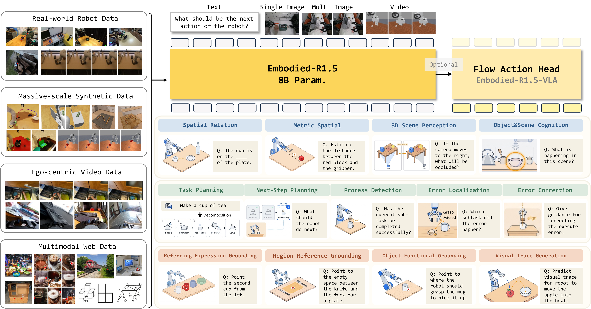

톈진대학과 텐센트 훈위안이 공개한 [Embodied-R1.5](https://arxiv.org/abs/2606.11324)를 정리했어요. 로봇을 움직이는 데 필요한 능력들이 서로 다른 모델에 흩어져 있던 구조를, 8B 파라미터 모델 하나로 합친 임바디드 파운데이션 모델이에요. [[2026-07-16_스스로_코드를_고치는_로봇|스스로 코드를 고치는 로봇, ASPIRE]]가 여러 에이전트의 분업으로 자기 교정을 구현했다면, 이 연구는 같은 일을 모델 하나 안으로 밀어 넣어요.

## 능력이 조각나 있던 문제

로봇에게 명령을 내리려면 여러 종류의 판단이 순서대로 필요해요. 장면을 이해하고, 과제를 하위 단계로 쪼개고, 지시 대상이 화면 어디에 있는지 좌표로 짚고, 실행이 어긋나면 어디서 틀렸는지 찾아 고쳐야 해요. 지금까지는 이 능력들이 공간 추론 모델, 계획 모델, 그라운딩 모델처럼 각각 다른 모델에 나뉘어 있었어요. 모델 사이를 오갈 때마다 문맥이 끊기고, 어느 단계에서 실패했는지 추적하기도 어려워요.

Embodied-R1.5의 접근은 인지, 계획, 교정, 포인팅을 하나의 아키텍처 안에서 함께 학습시키는 거예요. 여기서 포인팅은 이미지 위의 좌표를 직접 출력해 대상을 특정하는 능력을 말해요.

<em>실기체 데이터·합성 데이터·1인칭 영상·웹 데이터를 한 모델에 넣고, 공간 인지부터 계획·오류 교정·포인팅·시각 궤적 생성까지 같은 출력 형식으로 다뤄요(출처: Yuan et al., Embodied-R1.5)</em>

## 실패를 일부러 만들어 교정을 가르쳐요

능력을 합치려면 그만큼 넓은 데이터가 필요한데, 연구팀은 이를 세 개의 자동 생성 파이프라인으로 채워 150억 토큰 규모의 데이터 체계를 만들었어요.

첫 번째 파이프라인은 공간 추론 데이터를 만들어요. 장면의 의미를 이해하고 기하를 추정한 뒤 2D 인스턴스 분할을 붙이고, 역투영으로 3D로 들어 올린 다음 수평면을 정렬해서 3D 장면 주석을 자동으로 뽑아내요. 사람이 거리나 상대 위치를 일일이 라벨링하지 않아도 되는 구조예요.

두 번째는 교정 데이터예요. 성공한 시연만 모으면 교정을 배울 수 없으니, 계획 단계의 실패와 실행 단계의 실패를 의도적으로 합성해서 무엇이 어떻게 어긋났는지를 함께 담아요. 세 번째는 물체의 기능적 어포던스와 궤적 데이터로, 컵을 집을 때 어디를 잡아야 하는지 같은 정보를 다뤄요.

학습은 두 단계예요. Qwen3-VL-8B-Instruct를 백본으로 전체 파라미터 지도학습을 한 뒤, 검증 가능한 보상을 쓰는 강화 미세조정으로 다듬어요. 특히 포인팅처럼 정답을 기계적으로 확인할 수 있는 과제가 강화 단계에서 크게 좋아졌어요. 자연어 추론이든 점 좌표든 궤적 시퀀스든 출력은 전부 텍스트 형식으로 통일해서, 이질적인 과제들이 하나의 언어모델링 목적 아래 학습되게 했어요.

## 플래너와 그라운더와 코렉터를 번갈아 맡아요

PGC(Planner-Grounder-Corrector) 폐루프는 이렇게 합쳐진 능력을 실제 자율 실행으로 잇는 장치예요. 같은 모델이 먼저 플래너로서 과제를 하위 단계로 쪼개고, 그라운더로서 지금 단계의 대상 좌표를 짚고, 실행 후에는 코렉터로서 결과를 보고 다음 행동을 정해요. 역할이 바뀔 뿐 모델은 하나라, 계획할 때 본 장면 이해가 교정할 때도 그대로 남아 있어요. 논문은 밀크티 만들기, 쓰레기 쓸기, 컵 쌓기 같은 장기 과제를 사람 개입 없이 끝내는 사례를 보여요.

성능은 24개 임바디드 VLM 벤치마크 중 16개에서 최고 점수를 냈고, Gemini-Robotics-ER-1.5와 GPT-5.4를 앞섰어요. 여기에 액션 헤드를 붙여 VLA로 미세조정하면 대규모 액션 사전학습 없이도 LIBERO 97.3%로 π0.5의 96.9%를 넘고, SIMPLER 구글 로봇 시각 매칭에서 92.4%로 π0의 71.4%를, WidowX에서 74.0%로 GR00T N1.5의 62.0%를 앞섰어요. 임바디드 추론을 먼저 내재화해두면 행동 학습에 필요한 데이터가 줄어든다는 주장이에요.

## 읽을 때 감안할 것

논문은 한계를 따로 정리해두지 않았어요. 평가의 대부분이 벤치마크 점수와 실기체 데모로 이뤄져 있어서, 폐루프가 얼마나 자주 실패하고 어떤 실패는 스스로 못 고치는지에 대한 통계는 드러나지 않아요. 자기 교정을 내세우는 시스템일수록 성공 사례보다 교정에 실패한 사례의 분포가 중요한데, 그 부분은 후속 공개를 기다려야 해요.

그래도 모델 가중치와 데이터셋, 학습 코드, 평가 프레임워크를 모두 공개했다는 점은 확인 가능한 형태로 남아요. 8B라는 크기도 온보드 배치를 염두에 두면 의미가 있어요.
