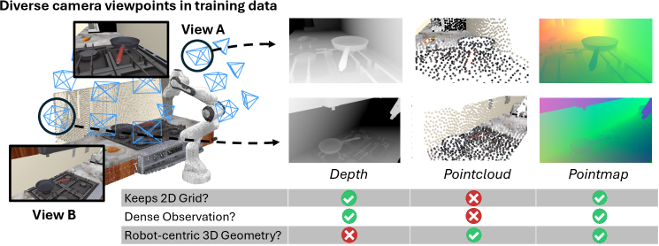

KAIST AI와 홀리데이 로보틱스가 공개한 [See like a Robot](https://arxiv.org/abs/2607.11498)을 정리했어요. VLA(Vision-Language-Action) 정책이 카메라 시점이 바뀌면 성능이 떨어지는 문제를, 관측을 로봇의 좌표계로 미리 옮겨 넣는 것으로 다뤄요. [[2026-07-16_사람_영상이_로봇_데이터가_되는_순간|사람 영상이 로봇 데이터가 되는 순간]]에서 정리한 π0.5가 이 논문에서 주 백본으로 쓰여요.

## 관측과 행동이 다른 좌표계에 있어요

VLA는 카메라가 찍은 이미지를 보고 행동을 내놓아요. 그런데 이미지는 카메라 프레임에 있고, 행동은 로봇 프레임에서 정의돼요. 이 둘을 잇는 변환은 정책이 알아서 배워야 하는 몫으로 남아 있어요.

카메라가 항상 같은 자리에 있으면 이 변환이 고정이라 큰 문제가 안 돼요. 하지만 DROID처럼 수집 환경마다 카메라 위치가 제각각인 대규모 데이터로 학습하면, 같은 과제인데도 시점마다 다른 변환이 필요해져요. 논문의 실험에서 학습 시점 다양성이 커질수록 RGB만 쓰는 정책은 성공률이 34.5%에서 24.9%로 9.6포인트 떨어졌어요. 데이터가 늘었는데 성능이 나빠지는 구간이에요.

## 좌표를 픽셀에 미리 적어둬요

<em>깊이 맵은 2D 격자를 지키지만 로봇 중심 기하가 없고, 포인트 클라우드는 기하는 있지만 격자와 밀집성을 잃어요. 포인트맵은 셋을 모두 만족해요(출처: Lee et al., See like a Robot)</em>

로봇 중심 포인트맵은 각 픽셀에 그 지점의 3D 좌표를 로봇 프레임 기준으로 저장한 이미지예요. RGB-D 관측을 먼저 카메라 프레임에서 3D로 들어 올린 다음, 행동이 정의된 로봇 프레임으로 변환하되 원본 이미지의 H × W 격자 배치를 그대로 유지해요.

이 형태가 중요한 이유는 기존 VLA에 손대지 않고 넣을 수 있기 때문이에요. 포인트맵은 RGB 인코더에서 초기화한 별도의 비전 타워로 인코딩하고, 나온 토큰을 대응하는 RGB 토큰에 원소별로 더해요. 포인트 클라우드 전용 인코더도, 복셀화 모듈도 필요 없고, 토큰을 이어 붙이는 게 아니라 더하기 때문에 시퀀스 길이도 늘지 않아요. 인코더 하나와 덧셈 한 번이 전부예요.

## 세 가지 설계 선택

논문은 왜 이 형태여야 하는지를 통제된 비교로 확인해요.

첫째, 카메라 정보를 그냥 주는 것보다 로봇 프레임으로 변환해서 주는 쪽이 나아요. 픽셀마다 카메라 광선을 6차원으로 인코딩한 플뤼커 좌표를 주거나, 거기에 깊이까지 더해 주면 포인트맵을 만드는 데 필요한 재료는 전부 전달돼요. 그런데도 성능이 낮았어요. 재료가 있어도 정책이 그 변환을 스스로 해내는 일은 별개라는 뜻이에요.

둘째, 같은 3D 정보라도 이미지 형태가 포인트 클라우드보다 나아요. 사전학습된 2D VLA가 기대하는 조밀한 격자를 유지하기 때문이에요.

셋째, 좌표 원점을 로봇 베이스가 아니라 현재 그리퍼 위치에 두는 편이 시점 변화에 훨씬 강했어요. 베이스 원점은 물체의 절대 위치를 기록하는데, 정작 행동이 의존하는 값은 그리퍼에서 목표까지의 상대 위치예요. 평가 시점을 무작위로 바꿨을 때 RGB는 27.9%에서 25.8%로, 베이스 원점 포인트맵은 34.7%에서 32.7%로 떨어진 반면, 그리퍼 원점 포인트맵은 36.9%에서 36.6%로 거의 그대로였어요.

## 결과

RoboCasa 시뮬레이션에서 π0.5 백본에 포인트맵을 더하니 성공률이 55.3%에서 62.9%로 7.6포인트 올랐고, SmolVLA에서도 같은 방향으로 개선됐어요. 학습 시점 다양성을 키우는 실험에서는 RGB가 9.6포인트 떨어지는 동안 포인트맵을 쓴 쪽은 37.6%에서 35.8%로 1.8포인트만 떨어져서, 격차가 10.9포인트까지 벌어졌어요.

실기체에서는 학습에서 본 시점일 때 5.0포인트 앞섰고, 학습에 없던 시점으로 카메라를 옮기자 격차가 11.7포인트로 커졌어요. 비교 대상에는 카메라 프레임에서 행동을 예측하는 방식과 전용 3D 모듈로 포인트 클라우드를 붙이는 GeoVLA, PointVLA, 포인트 클라우드만 쓰는 FP3까지 포함돼 있어요.

## 남는 조건

가장 분명한 제약은 보정이에요. 포인트맵을 만들려면 학습할 때도 테스트할 때도 카메라 내부·외부 파라미터가 알려져 있어야 해서, 보정이 없는 환경에는 그대로 쓸 수 없어요. 저자들은 포인트맵을 액션 전문가 대비 어느 지점에 주입하는 게 좋은지, 사전학습 레시피와 어떻게 상호작용하는지를 아직 분리해 보지 않았다고 밝혀요. 포인트 클라우드와의 비교도 샘플링 예산을 하나로 고정한 결과라 예산을 늘리면 격차가 줄 수 있고, 시점 변화 실험도 카메라 위치와 자세만 다뤘을 뿐 카메라 개수나 화각 변화는 다루지 않았어요.

결론 자체는 단순해요. 보정이 가능한 환경이라면, 로봇이 행동하는 좌표계로 관측을 표현해서 넘기라는 거예요. 정책에게 변환을 학습시키는 대신 미리 계산해 주는 쪽이 훨씬 값싸게 통했어요.
