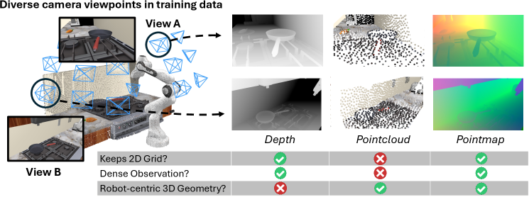
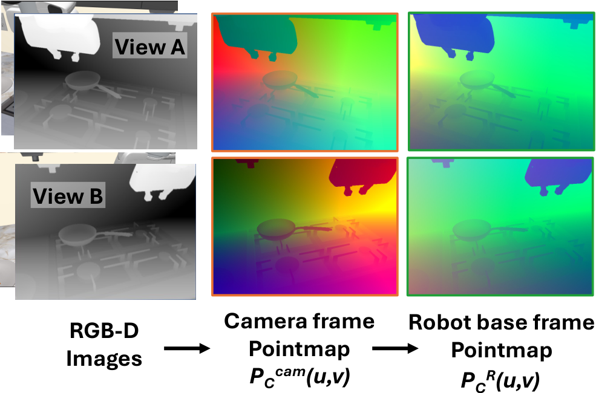
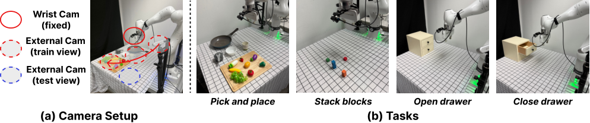

KAIST AI와 홀리데이 로보틱스가 공개한 [See like a Robot](https://arxiv.org/abs/2607.11498)을 정리했어요. VLA(Vision-Language-Action) 정책이 카메라 시점이 바뀌면 성능이 떨어지는 문제를, 관측을 로봇의 좌표계로 미리 옮겨 넣는 것으로 다뤄요. [[2026-07-16_사람_영상이_로봇_데이터가_되는_순간|사전학습 규모가 커지면 창발하는 사람 영상에서 로봇으로의 전이]]에서 정리한 π0.5가 이 논문에서 주 백본으로 쓰여요.

## 관측과 행동이 다른 좌표계에 있어요

VLA는 카메라가 찍은 이미지를 보고 행동을 내놓아요. 그런데 이미지는 카메라 프레임에 있고, 행동은 로봇 프레임에서 정의돼요. 이 둘을 잇는 변환은 정책이 알아서 배워야 하는 몫으로 남아 있어요.

카메라가 항상 같은 자리에 있으면 이 변환이 고정이라 큰 문제가 안 돼요. 하지만 DROID처럼 수집 환경마다 카메라 위치가 제각각인 대규모 데이터로 학습하면, 같은 과제인데도 시점마다 다른 변환이 필요해져요. 논문의 실험에서 학습 시점 다양성이 커질수록 RGB만 쓰는 정책은 성공률이 34.5%에서 24.9%로 9.6포인트 떨어졌어요. 데이터가 늘었는데 성능이 나빠지는 구간이에요.

이 다양성은 RoboCasa의 3인칭 카메라 두 대에 시연마다 평균 0의 가우시안 지터를 주는 방식으로 조절했어요. 지터 없음, 위치와 자세 표준편차가 (5cm, 3°)인 RoboCasa 기본값, 그 두 배인 (10cm, 6°) 세 단계입니다. 손목 카메라는 엔드이펙터에 붙어 있어 지터를 주지 않고 평가 카메라도 고정해서, 학습 시점 분포만 달라지게 만든 설정이에요.

## 좌표를 픽셀에 미리 적어둬요

<em>깊이 맵은 2D 격자를 지키지만 로봇 중심 기하가 없고, 포인트 클라우드는 기하는 있지만 격자와 밀집성을 잃어요. 포인트맵은 셋을 모두 만족해요(출처: Lee et al., See like a Robot · CC BY 4.0)</em>

로봇 중심 포인트맵은 각 픽셀에 그 지점의 3D 좌표를 로봇 프레임 기준으로 저장한 이미지예요. RGB-D 관측을 먼저 카메라 프레임에서 3D로 들어 올린 다음, 행동이 정의된 로봇 프레임으로 변환하되 원본 이미지의 H × W 격자 배치를 그대로 유지해요.

들어 올리는 계산은 두 단계예요. 먼저 픽셀 좌표에 카메라 내부 파라미터의 역행렬을 곱하고 그 픽셀의 깊이값을 스칼라로 곱해 카메라 프레임의 3D 점을 얻고, 다음으로 카메라에서 로봇 베이스로 가는 회전과 평행이동을 적용해요. 내부 파라미터가 정하는 건 픽셀마다의 광선 방향뿐이고, 그 광선 위 어디에 점이 놓이는지는 깊이값이 혼자 결정합니다. 이렇게 얻은 좌표는 카메라를 어디로 옮겨도 같은 물리적 지점에 같은 값을 줘요. 그 지점이 나타나는 픽셀 위치는 달라지지만, 픽셀에 적힌 값은 달라지지 않습니다.

<figure class="fig"><figcaption>같은 장면의 두 시점 — 카메라 프레임 포인트맵은 색이 서로 다르지만, 로봇 프레임으로 옮기면 같은 지점이 같은 색을 받는다</figcaption></figure>
<em>RGB-D 관측을 카메라 프레임 포인트맵으로 들어 올린 뒤 로봇 베이스 프레임으로 옮기는 두 단계(출처: Lee et al., See like a Robot · CC BY 4.0)</em>

이 형태가 중요한 이유는 기존 VLA에 손대지 않고 넣을 수 있기 때문이에요. 포인트맵은 RGB 인코더에서 초기화한 별도의 비전 타워로 인코딩하고, 나온 토큰을 대응하는 RGB 토큰에 원소별로 더해요. 포인트 클라우드 전용 인코더도, 복셀화 모듈도 필요 없고, 토큰을 이어 붙이는 게 아니라 더하기 때문에 시퀀스 길이도 늘지 않아요. 인코더 하나와 덧셈 한 번이 전부예요.

## 깊이는 어디서 오고, 얼마나 정확해야 할까요

포인트맵의 재료가 깊이라면, 그 깊이를 어디서 얻는지가 실제 적용의 전부가 됩니다. 시뮬레이션에서는 렌더러가 정확한 기하를 주니 문제가 없어요. 저자들이 부록에서 밝히는 실기체 조건은 다릅니다. 실기체 포인트맵은 RealSense의 스테레오 깊이와 일회성 핸드아이 캘리브레이션으로 만들었고, 그래서 시뮬레이션의 정확한 기하와 달리 센서 노이즈를 그대로 안고 간다고 적어 뒀어요.

구성은 이렇습니다. Franka Research 3에 손목 고정 카메라로 D405, 외부 카메라로 D435i 한 대를 쓰고, 데이터 수집 동안 손목 카메라는 그대로 둔 채 외부 카메라만 세 위치로 물리적으로 옮겼어요. 과제는 픽앤플레이스, 블록 쌓기, 서랍 열기, 서랍 닫기 넷이고 구성마다 과제별 15회씩 60회, 전체 180회 시연을 Meta Quest 3 컨트롤러로 원격조작해 모았습니다. 제어는 20Hz로 돌고, 정책은 20스텝 행동 청크 가운데 10스텝을 실행한 뒤 다시 계획해요.

<figure class="fig"><figcaption>손목 카메라는 고정하고 외부 카메라만 학습 세 위치(빨강)와 학습에 없던 시험 위치(파랑)로 옮겼다</figcaption></figure>
<em>실기체 구성과 네 과제 — 픽앤플레이스, 블록 쌓기, 서랍 열기·닫기(출처: Lee et al., See like a Robot · CC BY 4.0)</em>

노이즈를 안고도 결과가 나왔다는 점이 여기서 실용적으로 가장 중요한 대목이에요. 다만 왜 그런지는 논문이 직접 실험하지 않았으니, 아래는 제 판단입니다. 깊이는 광선 위의 위치를 정하는 곱셈 인자라, 깊이 오차는 감쇠 없이 좌표 오차로 그대로 넘어가요. 스테레오 방식은 텍스처가 없는 표면이나 반사가 심한 면에서 값이 비고, 거리가 멀어질수록 오차가 커집니다. 그런데도 뒤에서 볼 실기체 결과에서는 학습에 없던 카메라 위치일수록 RGB와의 격차가 오히려 벌어집니다. 이 표현이 요구하는 정밀도가 절대 좌표의 정확도보다는 시점 사이의 일관성 쪽이라는 뜻으로 읽혀요. 다음 절에서 볼 엔드이펙터 원점 선택도 같은 방향으로 작용할 텐데, 논문이 검증한 건 시점 변화에 대한 강건성이고 깊이 노이즈 크기를 변수로 둔 절제 실험은 없습니다. 보정 오차와 깊이 오차가 어디까지 허용되는지는 열린 질문으로 남아요.

재료를 어디서 얻는지가 정리됐으니, 그 재료를 어떤 형태로 정책에 넘길지가 다음 문제예요. 저자들은 백본과 학습 레시피를 고정한 통제 실험으로 이 형태를 하나씩 확인해 둡니다.

## 형태를 가르는 네 갈래

논문은 왜 이 형태여야 하는지를 백본과 학습 레시피를 고정한 통제된 비교로 확인해요. 대조군은 모두 RoboCasa 24개 과제, 과제당 시연 50회, 3만 스텝 학습으로 맞췄습니다.

첫째, 카메라 정보를 그냥 주는 것보다 로봇 프레임으로 변환해서 주는 쪽이 나아요. 픽셀마다 카메라 광선을 6차원으로 인코딩한 플뤼커 좌표를 주면 27.9%에서 28.7%로 조금 오르고, 거기에 픽셀별 깊이까지 더하면 31.6%가 됩니다. 이 조건은 포인트맵을 만드는 데 쓰는 깊이와 내부·외부 파라미터를 전부 가진 상태예요. 그런데 같은 재료로 로봇 프레임 좌표를 미리 계산해 넣은 포인트맵은 34.7%였어요. 두 조건의 차이가 사전 계산 여부뿐이니, 3.1포인트가 미리 계산해 주는 것의 순효과입니다. 재료가 있어도 정책이 그 변환을 스스로 해내는 일은 별개라는 뜻이에요.

둘째, 같은 3D 정보라도 이미지 형태가 포인트 클라우드보다 나아요. 사전학습된 2D VLA가 기대하는 조밀한 격자를 유지하기 때문이에요. 같은 로봇 프레임 점들을 MLP 인코더로 붙인 포인트 클라우드는 24.2%로 RGB만 쓴 27.9%보다도 낮았고, Point Transformer v3로 인코딩해도 32.8%에 그쳤습니다. 포인트 클라우드 인코더는 장면을 고정 개수로 부표본화하기 때문에 세부가 빠지고, 격자를 잃어 RGB 토큰과 공간적으로 대응되지도 않아요.

셋째, 좌표 원점을 로봇 베이스가 아니라 현재 그리퍼 위치에 두는 편이 시점 변화에 훨씬 강했어요. 베이스 원점은 물체의 절대 위치를 기록하는데, 정작 행동이 의존하는 값은 그리퍼에서 목표까지의 상대 위치예요. 평가 시점을 무작위로 바꿨을 때 RGB는 27.9%에서 25.8%로, 베이스 원점 포인트맵은 34.7%에서 32.7%로 떨어진 반면, 그리퍼 원점 포인트맵은 36.9%에서 36.6%로 거의 그대로였어요.

넷째는 둘째의 연장이에요. 같은 표에 붙이는 방식을 나눠 놓은 행이 있는데, 같은 포인트맵을 별도 시퀀스로 이어 붙이면 30.7%인 반면 대응하는 RGB 토큰에 원소별로 더하면 34.7%가 됩니다. 격자를 유지한 덕분에 픽셀 단위로 짝이 맞는 토큰끼리 겹칠 수 있고, 그 공간적 대응이 개선의 상당 부분을 만든다는 뜻이에요. 포인트 클라우드가 이 방식을 쓸 수 없는 이유도 같습니다.

## 결과

RoboCasa 시뮬레이션에서 π0.5 백본에 포인트맵을 더하니 24개 과제 평균 성공률이 55.3%에서 62.9%로 7.6포인트 올랐고, 다섯 과제 범주 전부에서 올랐어요. 문 여닫기가 79.5%에서 90.0%, 서랍이 83.0%에서 90.0%, 커피 만들기가 40.7%에서 58.0%입니다. SmolVLA에서도 평균은 37.2%에서 41.4%로 오르는데, 범주별로 보면 커피가 39.3%에서 38.0%로, 물체 돌리기가 46.6%에서 43.4%로 오히려 내려가요. 백본이 작을 때는 이득이 고르지 않다는 단서로 읽혀요.

기준선과의 비교는 백본을 π0.5로 통일해서 무엇을 주입하느냐만 다르게 했어요. 카메라 파라미터를 플뤼커 광선으로 조건화하는 KYC가 59.1%, 전용 3D 모듈로 포인트 클라우드를 붙이는 PointVLA가 57.3%, GeoVLA가 57.1%, 카메라 프레임에서 행동을 예측하는 OC-VLA가 56.3%로 모두 포인트맵의 62.9%보다 낮습니다. 유일하게 백본이 다른 FP3는 뷰당 4천 점 안팎의 희소한 포인트 클라우드만 쓰는데 42.8%로 가장 낮았어요. 학습 시점 다양성을 키우는 실험에서는 RGB가 9.6포인트 떨어지는 동안 포인트맵을 쓴 쪽은 37.6%에서 35.8%로 1.8포인트만 떨어져서, 격차가 10.9포인트까지 벌어졌어요.

실기체 결과가 더 분명합니다. 학습에서 본 카메라 위치에서는 RGB만 쓴 π0.5가 73.3%, 포인트맵을 더한 쪽이 78.3%로 5.0포인트 앞섰어요. 카메라를 학습에 없던 위치로 옮기자 RGB는 55.0%로 18.3포인트 무너지는데 포인트맵은 66.7%로 11.6포인트만 내려가, 격차가 11.7포인트로 커집니다. 처음부터 3D로 학습한 포인트 클라우드 확산 정책 DP3는 학습 시점에서 63.3%로 두 VLA에 밀리지만, 미지 시점에서는 48.3%로 낙폭이 작고 블록 쌓기 과제에서는 33.3%로 RGB의 26.7%를 앞질러요. 3D 입력 자체가 시점 변화에 강하다는 방향은 같고, 거기에 사전학습 백본의 시각 경로로 흘려 넣는 형태가 더해져야 두 이점이 겹친다는 그림이에요.

## 남는 조건

가장 분명한 제약은 보정이에요. 포인트맵을 만들려면 학습할 때도 테스트할 때도 카메라 내부·외부 파라미터가 알려져 있어야 해서, 보정이 없는 환경에는 그대로 쓸 수 없어요. 저자들은 포인트맵을 액션 전문가 대비 어느 지점에 주입하는 게 좋은지, 사전학습 레시피와 어떻게 상호작용하는지를 아직 분리해 보지 않았다고 밝혀요. 포인트 클라우드와의 비교도 샘플링 예산을 하나로 고정한 결과라 예산을 늘리면 격차가 줄 수 있고, 시점 변화 실험도 카메라 위치와 자세만 다뤘을 뿐 카메라 개수나 화각 변화는 다루지 않았어요.

결론 자체는 단순해요. 보정이 가능한 환경이라면, 로봇이 행동하는 좌표계로 관측을 표현해서 넘기라는 거예요. 정책에게 변환을 학습시키는 대신 미리 계산해 주는 쪽이 훨씬 값싸게 통했어요.

---

<!-- src-block -->
출처 — https://arxiv.org/abs/2607.11498
