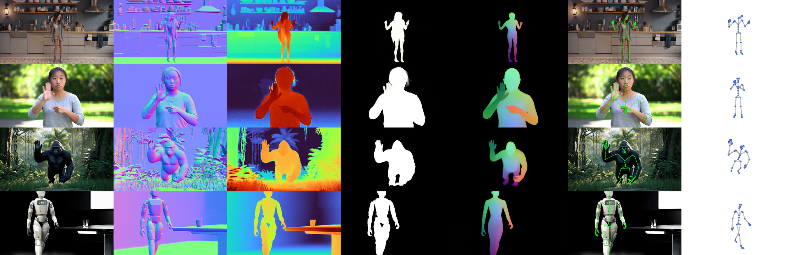

거의 같은 시기에 두 팀이 같은 주장을 내놨어요. 구글의 [Vision Banana](https://arxiv.org/abs/2604.20329)는 이미지 생성 사전학습이 범용 비전 학습자라고 말하고, 구글 딥마인드의 [GenCeption](https://arxiv.org/abs/2607.09024)은 비디오 생성 모델이 범용 비전 학습자라고 말해요. 논지가 겹치니 한 글에 묶어서 정리했어요. [[2026-07-16_사람_영상이_로봇_데이터가_되는_순간|사람 영상이 로봇 데이터가 되는 순간]]에서 정리한 창발과 같은 결의 이야기인데, 이번에는 정책이 아니라 지각 쪽에서 나와요.

## 비전은 과제마다 다른 모델을 써왔어요

언어 쪽은 오래전에 통합됐어요. 다음 토큰을 맞히는 사전학습 하나로 번역, 요약, 질의응답이 전부 같은 모델에서 나와요. 비전은 그렇지 않았어요. 깊이 추정, 표면 법선, 의미 분할, 카메라 포즈가 각자 다른 백본과 다른 출력 헤드를 쓰고, 새 과제가 생기면 헤드를 새로 붙여 다시 학습했어요.

두 논문이 공유하는 출발점은 생성 모델이 이미 그 통합을 해뒀을지도 모른다는 관찰이에요. 그럴듯한 이미지나 영상을 만들려면 장면의 기하와 재질, 조명, 물체가 움직이는 방식을 내부에 갖고 있어야 해요. 그렇다면 그 내부 표현을 꺼내 쓰는 것만으로 지각 과제가 풀려야 한다는 예측이 서요.

## Vision Banana: 출력을 전부 이미지로 통일해요

Vision Banana는 Nano Banana Pro를 여러 비전 과제가 섞인 데이터로 인스트럭션 튜닝한 모델이에요. 핵심 설계는 모든 과제의 출력을 RGB 이미지로 표현한다는 점이에요. 의미 분할은 클래스마다 지정된 색으로 픽셀을 칠한 이미지로 답하고, 깊이와 표면 법선도 값이 색으로 인코딩된 이미지로 나와요. 과제 지정은 입력 이미지에 붙인 자연어 프롬프트로 해요. 어떤 클래스를 어떤 RGB 값으로 칠하라는 지시까지 프롬프트에 들어가요.

이렇게 하면 새 과제를 붙일 때 헤드를 새로 설계할 필요가 없어져요. 출력 형식이 이미 이미지이고, 모델은 이미지를 만드는 일을 사전학습에서 이미 배웠으니까요. 결과는 제로샷 기준으로 Cityscapes 의미 분할 84.2 mIoU, RefCOCOg 참조 표현 분할 83.8 cIoU, ReasonSeg 79.3 gIoU예요. 3D 쪽은 메트릭 깊이가 6개 벤치마크 평균 δ₁ 0.882, 표면 법선이 3개 벤치마크 평균 각오차 15.549도였고, 원래의 이미지 생성·편집 능력도 그대로 남았어요. 3D 과제를 풀면서 카메라 내부 파라미터를 학습에도 추론에도 쓰지 않는다는 점이 특이해요.

## GenCeption: 비디오 확산 모델을 피드포워드 지각기로

GenCeption은 사전학습된 비디오 확산 모델을 백본으로 삼되, 확산 샘플링을 걷어내고 한 번의 순전파로 답을 내는 피드포워드 지각 모델로 바꿔요. 깊이, 표면 법선, 카메라 포즈, 참조 표현 분할, 3D 키포인트를 텍스트 지시로 골라 쓰는 구조예요. 정지 이미지가 아니라 영상으로 사전학습했기 때문에 시공간 사전지식이 표현 안에 들어 있어요.

<em>같은 모델이 한 입력에서 표면 법선, 깊이, 마스크, 3D 키포인트를 함께 내놓아요. 아래 두 행은 학습에 없던 동물과 휴머노이드 로봇이에요(출처: Wang et al., GenCeption)</em>

성능보다 눈에 띄는 건 데이터 효율이에요. D4RT나 VGGT-Omega 같은 전용 모델과 비슷한 성능을 학습 프레임 기준 7배에서 500배 적은 데이터로 냈어요. 사전학습이 이미 지각의 대부분을 해뒀고 후속 학습은 그 표현을 과제 형식에 맞춰 꺼내는 일에 가깝다는 해석이 붙어요. 여기에 합성 인간 영상만으로 학습한 모델이 실사 영상으로, 나아가 학습에 없던 동물과 로봇 카테고리로 일반화했어요.

## 로보틱스에서 이 결과가 갖는 무게

로봇 지각은 데이터를 모으기 어려운 쪽이에요. 실기체로 라벨링된 깊이나 포즈 데이터를 쌓는 비용이 크고, 시뮬레이션에서 만든 합성 데이터는 실기체 영상과의 도메인 갭 때문에 그대로 쓰기 어려웠어요. GenCeption의 결과는 그 순서를 뒤집어요. 생성 사전학습으로 지각의 바탕을 만들어두면, 위에 얹는 과제 학습은 합성 데이터로 소량만 해도 실사로 넘어가요. 학습 데이터에 로봇이 없었는데 로봇의 깊이와 키포인트를 뽑아낸 사례가 그 증거예요.

두 논문 모두 경계도 남겨요. GenCeption은 데이터와 모델 규모에 따른 스케일링 성질이 아직 예비적이라고 밝히고, Vision Banana는 카메라 내부 파라미터 없이 메트릭 깊이를 내는 구성이라 실제 스케일이 필요한 응용에서 어디까지 믿을 수 있는지가 남아요. 평가도 대부분 벤치마크 위에서 이뤄졌고, 제어 루프 안에서 지연과 실패 모드를 검증한 단계는 아니에요.

그래도 방향은 분명해요. 과제마다 백본을 새로 고르던 순서가, 생성으로 사전학습한 모델 하나에서 필요한 지각을 프롬프트로 꺼내 쓰는 순서로 바뀌고 있어요.
