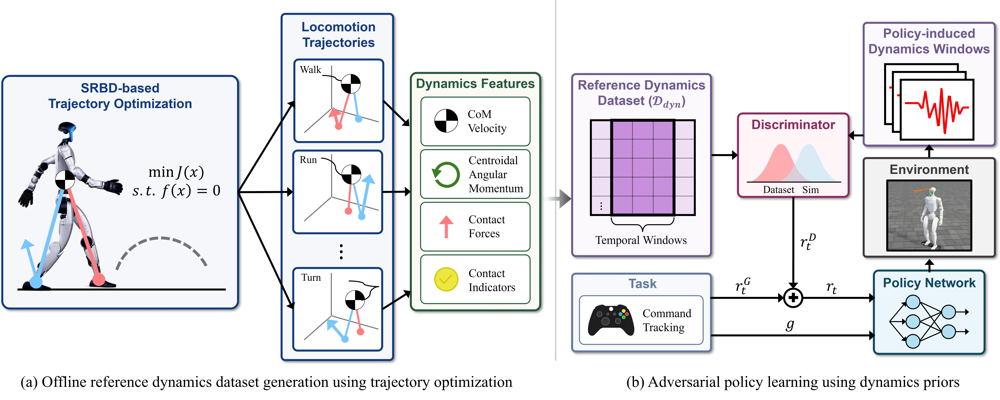

KAIST 연구팀이 공개한 [ADP(Adversarial Dynamics Priors)](https://arxiv.org/abs/2607.03454)를 정리했어요. 휴머노이드가 걷다가 외부에서 밀렸을 때 넘어지지 않고 회복하는 능력을 다루는데, 접근이 특이해요. 사람처럼 보이는 자세를 흉내 내게 하는 대신, 무게중심과 각운동량 같은 동역학 양의 분포를 흉내 내게 해요. [[2026-07-20_걸음을_먼저_배우고_지형은_나중에|걸음을 먼저 배우고 지형은 나중에]]와 마찬가지로 궤적 최적화로 만든 참조를 강화학습에 얹는 구조인데, 참조에서 무엇을 뽑아 쓰느냐가 달라요.

## 모션 사전분포가 규제하지 않던 것

기존의 모션 사전분포 계열, 대표적으로 AMP(Adversarial Motion Priors)는 참조 모션에서 운동학적 특징을 뽑아 판별자에게 넘겨요. 관절 각도와 속도, 말단 위치 같은 값들이에요. 정책이 이 분포에서 벗어나면 벌점을 받으니 움직임이 사람처럼 자연스러워져요.

문제는 자연스러움과 견고함이 같은 것이 아니라는 데 있어요. 무게중심이 어떻게 움직이는지, 몸 전체의 각운동량이 어떻게 변하는지, 발이 언제 어떤 힘으로 땅을 미는지는 운동학 특징에 직접 담기지 않아요. 밀렸을 때 버티는 능력은 바로 이 동역학 쪽 양이 결정하는데, 규제 대상에서 빠져 있던 거예요.

## 동역학 특징을 참조로 삼아요

<em>SRBD 궤적 최적화로 걷기·달리기·회전 참조를 만들어 동역학 특징을 추출하고(왼쪽), 판별자가 정책이 만든 시간 윈도우를 참조 분포와 비교해 보상을 주는 구조(오른쪽)(출처: Lee et al., ADP)</em>

ADP는 두 단계로 돌아가요. 먼저 오프라인에서 단일 강체 동역학(SRBD) 기반 궤적 최적화로 걷기, 달리기, 회전 궤적을 만들어요. 물리적으로 일관된 궤적이라 여기서 뽑는 값들이 실제로 성립 가능한 조합이에요. 추출하는 특징은 무게중심 속도, 중심 각운동량, 접촉력, 접촉 지시자 네 가지예요. 이것들이 참조 동역학 데이터셋이 돼요.

다음은 온라인 정책 학습이에요. 판별자가 정책이 만들어낸 동역학 시간 윈도우를 받아 참조 분포에서 나온 것인지 판정하고, 그 판정이 보상 r^D가 돼요. 최종 보상은 명령 추종 같은 과제 보상 r^G와 이 판별자 보상을 합친 값이에요. 여기서 중요한 점은 정책이 참조의 관절 자세나 말단 궤적을 직접 추종하지 않는다는 거예요. 특정 궤적을 따라가야 할 의무가 없으니, 밀려서 참조에 없는 상태로 튕겨 나가도 동역학적으로 참조가 지지하는 영역으로 돌아오기만 하면 돼요. 회복 동작의 모양은 정책이 알아서 찾아요.

왜 동역학 공간이어야 하는지에 대한 근거도 있어요. 표현 민감도 분석에서 이 특징 공간이 관절 수준 운동학 공간보다 외란이 만든 과도 현상을 더 이르게, 더 크게 드러냈어요. 판별자가 이상을 감지할 신호가 더 선명하다는 뜻이에요.

## 결과

가장 강한 베이스라인인 AMP와 비교했을 때, 80% 성공을 유지하는 충격량 한계인 J₈₀이 16.7% 올라갔어요. 네 방향 밀기 실험에서 성공률은 91.4%로 18퍼센트포인트 높았고, 방향 평균 회복 시간은 4.76초에서 2.48초로 47.9% 줄었어요. 속도 명령 추종 오차도 35.4% 낮았어요. 비교 대상에는 AMP 외에 사전분포 없이 학습한 정책과 동역학 특징을 보상으로 직접 준 변형도 포함돼 있어요.

실기체는 29자유도 휴머노이드 Unitree G1이고, 사람이 직접 미는 상황에서 ADP와 AMP를 나란히 비교한 영상이 보충 자료로 제공돼요.

## 읽을 때 감안할 것

논문이 스스로 밝히는 경계가 명확해요. 하드웨어 실험은 전이가 되는지 확인하는 정성적 시연이고, 통제된 정량 평가가 아니에요. 앞의 수치들은 전부 시뮬레이션 결과예요.

또 ADP는 관절 수준의 자연스러움을 강제하지 않기 때문에 동작이 사람처럼 보이는지는 따로 보장되지 않아요. 저자들도 동역학 사전분포와 운동학 사전분포를 함께 쓰는 방향을 후속 과제로 남겼어요. 비교의 공정성을 위해 AMP 베이스라인도 같은 궤적 최적화 참조를 쓰게 했는데, 고품질 모션 캡처를 참조로 쓴 AMP와 비교하면 격차가 어떻게 달라지는지는 아직 확인되지 않았어요.

무엇을 흉내 내게 할 것인가라는 질문이 이 연구의 핵심이에요. 참조 데이터에서 어떤 양을 뽑아 판별자에게 넘기느냐가 그대로 정책의 강점이 되는 구조라서, 목표가 견고함이면 뽑아야 할 양도 달라진다는 결론이에요.
