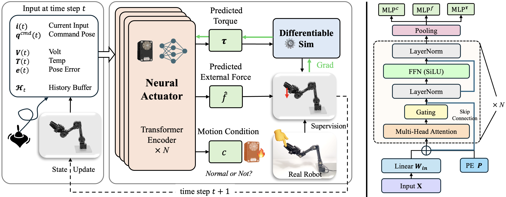
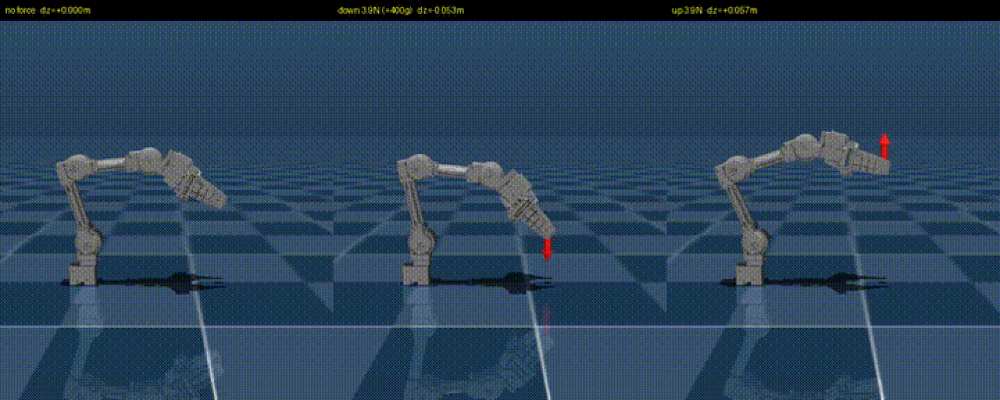

MIT 주도로 공개된 [NeuralActuator](https://arxiv.org/abs/2607.11734)를 정리했어요. 시뮬레이션에서 학습한 제어가 실기체에서 어긋나는 원인을 관절 안쪽, 즉 액추에이터 동역학에서 찾고 그 부분을 신경망으로 대체한 연구예요. RSS 2026에서 Outstanding Systems Paper Award를 받았어요. [[2026-07-16_AI가_로봇을_잡는_높이|AI가 로봇을 잡는 높이]]에서 정리한 제어 추상화 사다리로 보면, 이 논문은 사다리 맨 아래층인 토크 레벨을 학습으로 갈아끼우는 쪽이라 위층 정책 연구들과 반대 방향에서 같은 갭을 공략해요.

## 문제: 전류에 토크가 비례하지 않아요

산업용 로봇 제어는 보통 토크가 전류에 비례한다는 관계, τ = K_t·I를 전제로 깔아요. 모터 상수 K_t 하나만 알면 전류에서 토크를 읽고 토크에서 전류를 지시할 수 있으니, 시뮬레이터도 이 선형 관계로 관절을 모사해요.

저가 서보에서는 이 전제가 깨져요. 이런 플랫폼은 기계식 정류를 쓰는 코어리스 브러시 DC 모터에 감속 기어박스를 붙인 구조인데, 마찰과 히스테리시스, 백래시, 발열이 전부 기어박스 뒤에 섞여 들어가요. 논문이 OpenManipulator-X에서 관절별 토크 상수를 직접 피팅해보니 두 관절은 기울기가 음수로 나왔어요. 전류가 늘 때 토크가 줄어드는 물리적으로 말이 안 되는 값인데, 기어박스가 모터의 실제 거동을 가려서 생긴 결과예요. 선형 모델이 부정확한 정도가 아니라 부호부터 틀리는 셈이라, 여기서 출발한 시뮬레이션 궤적은 처음부터 실기체와 갈라져요.

## 데이터: 쌍둥이 팔로 힘의 정답을 만들어요

문제를 학습으로 풀려면 액추에이터가 실제로 무엇을 겪는지 기록한 데이터가 필요해요. 연구팀은 이를 위해 Neural Actuation Dataset(NAD)을 만들었어요. 사람이 리더 팔을 손으로 움직이면 동일한 서보를 쓴 팔로워 팔이 그 동작을 따라 하며 환경과 접촉하는 쌍둥이 팔 원격조작 구조예요.

여기서 관절 각도와 속도 같은 상태뿐 아니라 모터 전류, PWM, 버스 전압, 코일 온도까지 시간 동기화해서 기록해요. 외력은 6축 힘/토크 센서로 재서 정답 라벨로 붙여요. OpenManipulator-X 기준으로 접촉 없는 자유 운동 119,933프레임, 200~500g 페이로드와 방향별 밀기를 담은 힘 라벨 구간 162,631프레임, 관절을 고무줄로 일부러 묶어 제약을 건 모터 상태 구간 49,898프레임, 합쳐서 약 94.5분 분량이에요. 검증 장비는 5자유도 OpenManipulator-X(약 500달러), 6자유도 SO-101, 7자유도 Franka Emika Panda(3만 달러 이상)로 가격대를 60배 넘게 벌려 잡았어요.

## 모델: 하나의 인코더에서 네 갈래 출력

<em>입력에서 트랜스포머 인코더를 거쳐 토크·외력·모터 상태 세 출력으로 갈라지는 구조와, 미분가능 시뮬레이터에서 되돌아오는 그래디언트 경로(출처: Dou et al., NeuralActuator)</em>

입력은 지시 자세와 실제 관절 상태, 전류·전압·코일 온도 같은 액추에이터 텔레메트리, 그리고 지시와 실제의 차이인 추종 오차예요. 과거 8프레임에 현재 프레임을 더한 9토큰 시퀀스를 4층 트랜스포머 인코더에 넣어요. 은닉 차원 192에 어텐션 헤드 4개인 작은 모델이라 제어 주기 안에서 추론이 끝나요. 마지막에 시간축 평균 풀링으로 공유 표현을 만들고, 거기서 네 개의 MLP 헤드가 토크, 3차원 외력, 접촉 확률, 모터별 상태 점수를 각각 뽑아요.

토크에는 정답 라벨이 없어요. 저가 서보에는 관절 토크 센서가 없으니까요. 대신 예측한 토크를 미분가능 시뮬레이터에 넣어 자세 궤적을 굴리고, 실제로 기록된 자세와의 차이를 손실로 삼아 시뮬레이터를 거꾸로 통과해 학습해요. 토크는 직접 감독받는 대신 자세라는 관측 가능한 신호를 통해 간접적으로 학습되는 구조예요.

## 결과: 토크, 외력, 모터 상태

토크 예측은 600스텝 롤아웃에서 네 개 회전 관절의 각도 MAE가 2.4~3.2도, 그리퍼 슬라이드 좌표가 약 0.2mm였어요. 시뮬레이터를 통과하는 그래디언트도 안정적이어서, 파라미터 그래디언트의 코사인 유사도가 롤아웃 길이 전반에서 0.96 이상을 유지했어요.

<em>같은 지시에 대해 외력이 없을 때, 400g에 해당하는 3.9N이 아래로 걸릴 때, 위로 걸릴 때의 말단 높이 변화(출처: Dou et al., NeuralActuator)</em>

외력 추정은 힘 센서 없이 전류와 자세 신호만으로 3차원 힘을 예측해요. 여기서 핵심 장치는 힘 회귀와 접촉 판정을 분리한 2단 구조예요. 원시 힘 예측값에 0과 1 사이의 접촉 확률 게이트를 곱해서 최종 출력을 내는데, 게이지는 실제 힘 크기가 0.01N을 넘는지로 만든 이진 라벨에서 따로 학습해요. 페이로드 벤치마크에서 힘 MAE 0.12N, 방향별 접촉에서 0.36~0.39N, 움직이는 게이지 밀기에서 0.10N을 기록했어요. 더 중요한 건 접촉이 없을 때인데, 고전적 방법들이 33~59%의 오탐률을 낸 구간에서 NeuralActuator는 0.00~0.02N에 머물렀어요. 접촉이 없을 때 없다고 말하는 능력이 게이트에서 나와요.

모터 상태 점수는 관절이 기계적으로 제약됐는지를 모터별로 0과 1 사이 값으로 내요. 고무줄로 3번 관절을 묶은 200g 픽앤플레이스 실험에서 정확도 91.0%, 재현율 96.2%, AUC-ROC 0.95를 기록했고, 같은 신호로 학습한 SVM(0.62)과 랜덤 포레스트(0.72)를 크게 앞섰어요.

## 정책의 사전학습 모듈로

세 출력 중 외력 추정은 그 자체로 정책의 입력이 될 수 있어요. 연구팀은 원격조작으로 100~500g 페이로드를 다루는 시연을 모아 행동복제 정책을 학습시키되, 관절 위치 히스토리와 그리퍼 개도에 더해 얼어붙은 NeuralActuator가 뽑은 외력 추정치를 관측에 붙였어요. 학습에 없던 페이로드로 들어 올려 버티는 과제에서 위치 정보만 쓰는 정책보다 성능이 올라갔어요. 액추에이터 모델이 시뮬레이션 도구에 그치지 않고, 힘을 느끼는 감각 채널로 정책에 들어가는 경로예요.

## 한계

논문이 스스로 짚는 경계도 분명해요. 약 50g, 힘으로 0.5N 이하는 이 가격대 플랫폼의 노이즈 플로어에 걸려서 안정적인 검출이 안 돼요. 플랫폼 간 일반화도 아직인데, SO-101에서는 최대 관절 오차가 9.8도까지 벌어져서 플랫폼별 미세조정이나 온라인 적응이 필요해요. 힘 라벨은 알려진 무게에서 따온 준정적 값이라 움직이는 동안의 물체 관성이나 파지 마찰은 반영되지 않고, Franka 실험은 기록된 관절 자세를 쓴 오프라인 평가라 실제 배치와는 조건이 달라요. 모터 상태 점수도 제약 여부를 가릴 뿐 고장 진단은 아니에요.

그래도 방향은 선명해요. 정책 쪽 연구들이 컨텍스트를 늘리고 데이터를 섞어 위에서 sim-to-real 갭을 좁히는 동안, 이 논문은 그 갭의 상당 부분이 τ = K_t·I라는 한 줄짜리 가정에서 나온다는 걸 짚고 아래에서 올라와요. 500달러짜리 팔에서도 그 가정을 학습으로 대체하면 힘을 재는 센서 없이 힘을 읽을 수 있다는 게 이 연구의 결론이에요.
