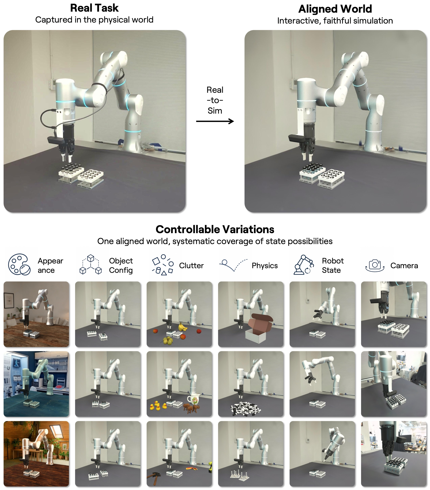
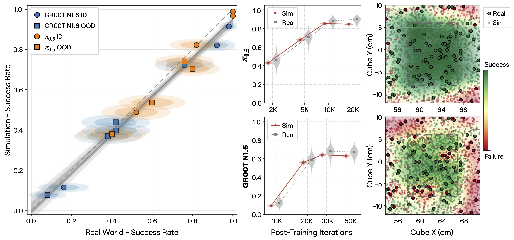

World Labs가 공개한 [Real-to-Sim-to-Real](https://www.worldlabs.ai/blog/real-to-sim-to-real)을 정리했어요. 실제 작업 현장을 시뮬레이션으로 옮기고, 거기서 정책을 학습시켜 다시 실기로 되돌리는 파이프라인이에요. 흥미로운 건 학습 쪽이 아니라 검증 쪽이에요. 이 글은 시뮬레이션이 실기 성능을 얼마나 잘 예측하는지를 정면으로 다뤄요.

<em>실제 작업(왼쪽 위)을 정합된 시뮬 월드(오른쪽 위)로 옮긴 뒤, 외형·물체 배치·잡동사니·물리·로봇 자세·카메라 여섯 축으로 변이를 생성하는 구조(출처: World Labs)</em>

[[2026-07-28_리더암은_실물_로봇은_시뮬|실물 리더암으로 Isaac Lab 속 로봇을 조종해 시연을 모으는 LeIsaac]]을 정리하면서 시뮬 수집의 남는 질문으로 적었던 게 있어요. 시뮬에서 모은 데이터로 학습한 정책이 실기에서 얼마나 버티는지는 그 저장소 바깥에 있다고요. 이 글이 정확히 그 바깥을 겨눠요.

## 시뮬을 훈련장이 아니라 계측기로 봐요

로봇 정책을 개발할 때 진짜 비싼 건 학습이 아니라 평가예요. 체크포인트를 하나 뽑을 때마다 실기에서 수십 번 돌려봐야 하고, 그 사이 물체는 밀리고 조명은 바뀌고 사람이 붙어 있어야 해요. 그래서 개발 주기는 GPU가 아니라 로봇 앞에 앉은 사람의 시간에 묶여요.

시뮬레이션이 그 자리를 대신하려면 조건이 하나 있어요. 시뮬 점수가 실기 점수를 예측해야 해요. 시뮬에서 잘하는 정책이 실기에서도 잘해야 하고, 시뮬에서 좋아지면 실기에서도 좋아져야 해요. 이 글은 정확히 그 예측력을 측정 대상으로 삼아요. 시뮬을 정책을 기르는 곳이 아니라 정책을 재는 계측기로 놓는 관점이에요.

## 한 장면을 수천 개로 불려요

먼저 실제 과제를 통째로 담아요. 로봇과 센서, 주변 환경, 물체, 그리고 시연까지요. 재구성의 목표는 보기 좋은 그림이 아니라 세 가지를 동시에 맞추는 거예요. 고품질 시각 외형과 정확한 기하, 그리고 현실적인 물리와 동역학이에요. 케이블이나 포장재처럼 모양이 변하는 물체, 무게나 마찰을 정확히 모르는 물체도 다뤄야 해요.

정합이 맞는지는 열린 루프로 확인해요. 시뮬과 실제에서 똑같은 행동 순서를 실행시켜 놓고 관측과 물체 반응, 결과를 직접 비교해요. 정책이 개입하면 두 세계가 서로 다른 상태로 갈라져 비교가 어려워지니, 같은 명령을 먹여 놓고 벌어지는 차이만 보는 거예요.

정합된 월드가 하나 생기면 거기서 수천 개의 변이를 만들어요. 위 도식의 여섯 축이 그거예요. 외형, 물체 배치, 잡동사니, 물리, 로봇 자세, 카메라 시점을 체계적으로 바꿔요. 실기에서 한 번 담은 장면 하나가 정책이 만날 상태 공간을 훑는 데이터셋이 돼요.

## 성적표가 겹쳐요

정책은 실기 학습 데이터를 하나도 쓰지 않고 시뮬레이션에서만 학습시켰어요. 그리고 체크포인트마다 시뮬 2,000회와 실기 100회로 채점했어요. 시뮬 2,000회는 분포 안쪽 1,000회와 바깥쪽 1,000회로, 실기 100회는 50회와 50회로 나눠요. 학습 분포 안에서만 잘하는 정책과 바깥에서도 버티는 정책을 갈라 보려는 설계예요.

<em>실기 대 시뮬 성공률 산점도(왼쪽), 학습 반복에 따른 시뮬·실기 곡선(가운데), 큐브 위치별 성공·실패 지도(오른쪽) — 가운데와 오른쪽은 위가 π0.5, 아래가 GR00T N1.6(출처: World Labs)</em>

세 패널이 각각 다른 층위의 일치를 보여줘요. 왼쪽 산점도는 GR00T N1.6과 π0.5 두 정책의 체크포인트들이 대각선 부근에 늘어서 있어요. 순위만 맞는 게 아니라 값 자체가 붙어 있다는 뜻이에요. 가운데는 학습 반복에 따른 성능 곡선인데, 두 정책 모두 시뮬과 실기가 나란히 오르다 비슷한 지점에서 완만해져요. 곡선 끝에서는 실기가 조금 더 오르고 시뮬이 살짝 내려가는 구간도 있어서 완전히 포개지지는 않지만, 어느 지점부터 더 학습해도 크게 안 좋아지는지를 시뮬만 보고도 가늠할 수 있다는 정도는 읽혀요.

오른쪽이 가장 인상적이에요. 큐브를 놓는 위치를 바꿔가며 성공과 실패를 지도로 그렸는데, 시뮬에서 그린 성공 영역과 실기 점들이 같은 자리에 겹쳐요. 저자들이 성공 기준으로 내건 것도 이거예요. 시뮬이 성공과 실패의 경계 근처에서 정책이 어떻게 행동하는지를 재현하는가요. 평균 성공률을 맞히는 것보다 어려운 요구예요.

## 한 시간 동안 사람 없이

실기 시연도 붙어 있어요. 전원 케이블을 냉장고 주위로 감는 작업, 케이블을 밀어 넣고 꽂는 작업, 시험관 옮기기, 마커와 연필을 한 자루씩 집어내기까지 다섯 과제를 개입 없이 한 시간씩 자율 운용했어요. RB-Y1과 YAM, Flexiv, xArm까지 기체도 제각각이에요. 한 시간이라는 길이는 짧아 보이지만, 실패가 누적되면 회복 없이 멈추는 조작 과제에서는 결코 짧지 않아요.

## 남는 것

이 접근의 한계는 재구성이 감당하는 범위에 묶여요. 여기서 다룬 과제들은 케이블처럼 변형되는 물체를 포함하긴 해도, 대체로 고정된 작업대 위의 조작이에요. 액체나 분말, 잘 부서지는 물체처럼 물리 자체를 시뮬로 옮기기 어려운 대상이 얼마나 되는지는 이 글이 답하지 않아요.

정합을 확인하는 절차 자체도 비용이에요. 시뮬이 실기를 예측한다는 걸 믿으려면 처음에는 두 세계를 나란히 돌려 대조해야 하는데, 그 검증에 드는 실기 시행이 결국 실기 평가예요. 새 과제, 새 현장마다 이 초기 비용을 다시 치러야 하는지, 아니면 한 번 검증된 파이프라인이 다른 과제로 옮겨가는지가 실무에서 갈릴 지점이에요. 게시물이 밝힌 수치도 평가 규모(2,000회와 100회)와 자율 운용 시간(한 시간)이지, 과제별 성공률 표는 아니에요.

그래도 방향은 뚜렷해요. 시뮬레이션의 값어치를 "실기 데이터를 대신한다"가 아니라 "실기 결과를 미리 읽는다"로 옮겨 놓았어요. 평가가 병목이라면, 평가를 옮기는 게 데이터를 늘리는 것만큼 중요한 일이에요.
