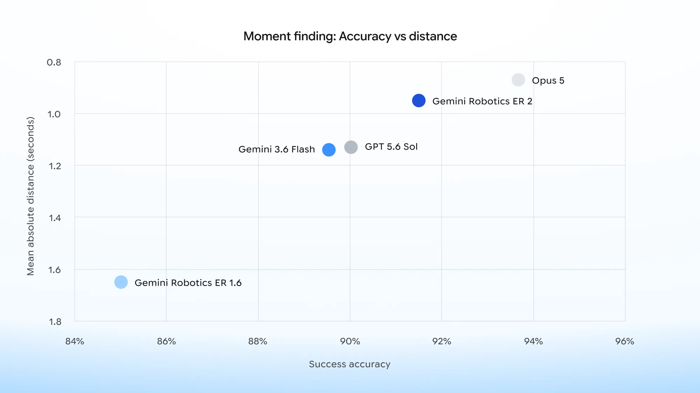
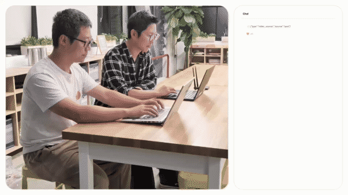
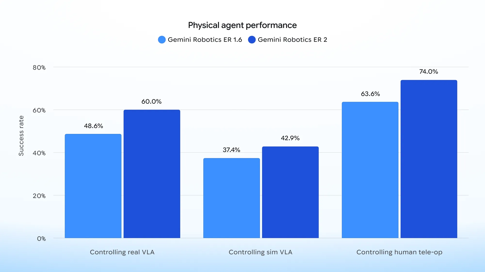

구글 딥마인드가 공개한 [Gemini Robotics-ER 2](https://blog.google/innovation-and-ai/models-and-research/google-deepmind/gemini-robotics-er-2/)를 정리했어요. ER은 임바디드 추론(embodied reasoning)의 약자이고, 이 모델은 로봇을 직접 움직이는 정책이 아니라 그 위에 앉는 고수준 두뇌예요. 영상으로 상황을 이해하고, 여러 단계의 작업을 계획하고, 다른 로봇과 손발을 맞춰요. [[2026-07-20_계획하고_짚고_고치는_한_모델|계획·포인팅·교정을 8B 한 모델에 합친 Embodied-R1.5]]이 계획과 교정을 모델 하나 안으로 밀어 넣은 연구였다면, 이쪽은 그 두뇌를 아래층 실행기들과 어떻게 붙일지를 다뤄요.

## 정확하기만 해서는 안 되는 이유

저자들이 문제를 세우는 방식이 눈에 띄어요. 로봇에게 필요한 건 정확한 공간 추론만이 아니라, 물리 세계가 흐르는 속도에 맞춰 판단의 시점을 맞추는 빠른 사고라고 적어요.

이유는 단순해요. 컵이 넘어지려는 순간을 3초 뒤에 정확히 알아채는 것은 아무 쓸모가 없어요. 물리 세계에서는 판단이 늦으면 그 판단이 맞았는지와 무관하게 결과가 이미 정해져 있어요. 그래서 이 모델은 정확도 경쟁이 아니라 정확도와 지연의 교환에 자리를 잡아요.

## 그 교환이 그래프에 그대로 보여요

작업이 넘어가는 정확한 프레임을 찾는 순간 찾기 과제에서, 이 모델은 91.3% 정확도에 평균 절대 거리 0.96초를 냈어요. 어느 시점이라고 지목한 프레임이 실제 전환 시점에서 평균 1초 안쪽으로 붙는다는 뜻이에요.

<em>순간 찾기 정확도(가로)와 평균 절대 거리(세로, 위쪽이 작은 값이라 좋음) — ER 1.6에서 크게 올라왔지만 Opus 5가 두 축 모두에서 더 나은 자리에 있어요(출처: Google DeepMind)</em>

정직하게 읽으면 이 그래프에서 ER 2가 1등은 아니에요. Opus 5가 정확도와 시간 오차 양쪽에서 더 좋은 자리에 있어요. 대신 저자들이 내세우는 건 속도예요. 서브초 지연으로 응답하고, 더 큰 모델들과 견줘 네 배 빠른 실행 속도를 낸다고 밝혀요.

이 구도는 며칠 전 정리한 [[2026-07-27_아는_건_굳이_배우지_않아요|닫힌 형태 연산은 계산으로 두고 0.58M만 학습한 시각 내비게이션]]와 같은 모양이에요. 그쪽도 성공률에서는 큰 모델에 밀리는 대신 충돌률과 학습 파라미터에서 이겼어요. 어느 축에서 이기기로 했는지를 보고 판단해야 하는 종류의 결과예요.

## 도구를 부리는 두뇌

이 모델이 실제로 하는 일은 직접 관절을 움직이는 게 아니라 도구를 호출하는 거예요. 로봇 API와 시각언어행동 정책을 호출 가능한 도구로 두고, 상황에 따라 무엇을 언제 부를지 정해요.

붙이는 절차도 그 형태를 따라가요. 개발자가 저수준 제어 인터페이스를 도구로 선언해두고 영상과 오디오와 텍스트를 모델에 그대로 흘려보내면, 모델이 그 도구들을 골라 부르는 구조예요. 시각언어행동 정책이든 내비게이션 API든 선언 대상이 될 수 있어서, 아래층 실행기를 무엇으로 쓰든 위층은 같은 방식으로 얹혀요.

연결 방식도 지연과 맞물려 있어요. Gemini Live API의 양방향 스트리밍으로 붙는데, 요청을 보내고 응답을 기다리는 왕복 대신 영상이 들어오는 동안 판단이 함께 흐르는 구조예요. 앞에서 말한 서브초 지연이 나오려면 모델만 빨라서는 안 되고 연결 자체가 스트리밍이어야 해요. 저자들은 이 구조가 노리는 것을 다단계 작업을 "멈추고 생각하는" 끊김 없이 이어가는 것이라고 적어요.

그 끊김 없음을 보이려고 만든 것이 보스턴 다이내믹스의 Spot을 쓴 데모예요. Spot의 내비게이션과 매니퓰레이터 API를 도구로 두고 모델이 그것들을 지휘해, 자연어로 말하면 물건을 가져오는 로봇을 만들었어요.

<figure class="fig"><figcaption>자연어 명령을 받고 팝콘을 가져오는 Spot — 사람의 말에서 이동과 집기까지가 한 흐름으로 이어져요 (앞 12초) (출처: Google DeepMind)</figcaption></figure>

이 데모에서 눈여겨볼 것은 로봇의 동작 자체가 아니라 역할 분담이에요. 걷고 균형을 잡고 팔을 뻗는 일은 Spot이 원래 갖고 있던 API가 하고, 모델은 어느 API를 어떤 순서로 부를지만 정해요. 하드웨어 제조사가 만들어둔 제어기를 그대로 두고 그 위에 판단층만 올리는 형태예요. 예제 코드는 GitHub에 공개돼 있어요.

<em>세 가지 지휘 대상별 작업 성공률 — 실제 VLA 48.6%에서 60.0%, 시뮬 VLA 37.4%에서 42.9%, 사람 텔레오퍼레이션 63.6%에서 74.0%로 올랐어요(출처: Google DeepMind)</em>

세 제어 방식 모두에서 이전 버전인 ER 1.6을 앞섰어요. 그런데 절대 수치를 보면 아직 갈 길이 남았다는 것도 같이 보여요. 가장 높은 값이 74.0%이고, 실제 시각언어행동 정책을 지휘할 때는 60.0%예요.

순서도 읽어볼 만해요. 사람의 텔레오퍼레이션을 지휘할 때가 가장 높고, 실제 정책이 그다음, 시뮬레이션 정책이 가장 낮아요. 두뇌의 판단이 성과로 이어지는 정도가 아래층 실행기의 능력에 묶여 있다는 뜻으로 읽혀요. 이 해석은 제 읽기이고 저자들이 그렇게 적은 건 아니에요.

## 언제 끝났는지를 아는 문제

저자들은 로보틱스에서 가장 어려운 문제 중 하나로 작업이 끝났는지를 아는 것을 꼽아요. 전구를 조이거나 쓰레기봉투를 묶는 일이 예로 나오는데, 둘 다 동작을 했는지가 아니라 요구한 수준까지 됐는지를 봐야 다음 단계로 넘어갈 수 있는 종류예요. 앞 절의 순간 찾기가 겨눈 것도 같은 문제예요. 컵에 커피를 언제까지 따를지가 그 예로 적혀 있어요.

영상에서 작업이 얼마나 진행됐는지를 다섯 구간으로 나눠 분류하는 과제에서는 57.4% 정확도를 냈어요. 0에서 20%, 20에서 40% 같은 식으로 나눈 구간이에요. 절반을 조금 넘는 값이라 아직 여유가 크지만, 흐르는 영상의 프레임마다 진행 상태를 매긴다는 점이 이전과 달라진 부분이에요. 이 값이 있으면 실패한 단계만 다시 하고 전체 작업을 처음부터 돌리지 않아도 된다는 게 저자들이 드는 쓸모예요.

실패를 알아채는 일은 원문에서 완료 판정이 아니라 공간 추론 쪽 개선으로 묶여 있는데, 입력이 바뀐 방향은 같아요. 성공과 실패 판정이 정지 화면 대신 원본 영상 피드에서 이뤄지도록 바뀌었고, 액체를 흘리거나 물체가 미끄러지거나 정렬이 어긋나는 것처럼 작업 도중에만 드러나는 실패를 겨눠요. 같은 묶음에 든 계기 판독은 원형 다이얼과 사이트 글라스에 머물던 범위를 디지털 디스플레이와 선형 눈금, 자, 액체 온도계까지 넓혀 열 종류로 시험했어요. 저자들은 성공 감지와 ERQA 질의응답, 계기 판독을 이 모델이 특히 앞선 항목으로 들어요.

## 안전과 여러 로봇

안전 쪽은 두 벤치마크를 들어요. 안전 지시 따르기와 사람 근접 상황인데, ER 1.6과 다른 프런티어 모델들을 앞섰다고 해요. 사람이 다가오면 휴머노이드 로봇을 멈추고, 그 구역이 비면 스스로 다시 시작해요. 사람이 일일이 재개 명령을 주지 않아도 되는 형태예요. 여기에 더해 파운데이션 모델이 안전한 오케스트레이터로 동작하는지를 재는 벤치마크를 새로 내놨어요. 제약을 지키는지, 환경을 계속 살피는지, 물리적으로 가능한 요구인지 판단하는지, 애매하면 사람에게 되묻는지를 봐요.

여러 로봇이 함께 일하는 것도 새로 들어왔어요. 근거는 단순해요. 모든 작업에 맞는 로봇은 없고, 바퀴형은 실내에서 유리하고 휴머노이드는 고르지 않은 지면에서 유리해요. 그래서 서로 다른 기체가 공유된 의미 이해로 통신하며 작업을 넘겨받게 했어요. 데모에는 Apptronik Apollo 2와 Franka F3 Duo가 나와요.

## 남는 것

블로그 게시물이라 논문 수준의 세부는 없어요. 벤치마크의 구성과 시행 횟수, 비교 모델의 조건 같은 것이 밝혀져 있지 않아서, 표에 적힌 숫자들을 서로 다른 논문의 수치처럼 다루기는 어려워요.

네 배 빠르다는 비교의 기준도 "더 큰 모델들"이라고만 되어 있어요. 어떤 모델과 어떤 조건에서 잰 값인지가 있어야 그 배수가 실제로 무엇을 뜻하는지 알 수 있어요. 순간 찾기 그래프에 함께 놓인 모델들이 그 대상인지도 명시되어 있지 않아요.

쓸 수 있는 경로는 열려 있어요. Gemini API와 Google AI Studio로 접근할 수 있고, 기업용 에이전트 플랫폼은 비공개 프리뷰예요. 안전 관련 기술 보고서도 별도로 공개했어요.

그래도 고수준 모델의 평가 축에 지연을 정면으로 올려놓았어요. 실험실에서는 정확도 한 칸이 승부를 가르지만, 현장에서 로봇을 움직이는 두뇌는 늦게 도착한 정답을 틀린 답과 같게 취급해야 하니까요.

---

<!-- src-block -->
출처 — https://blog.google/innovation-and-ai/models-and-research/google-deepmind/gemini-robotics-er-2/
